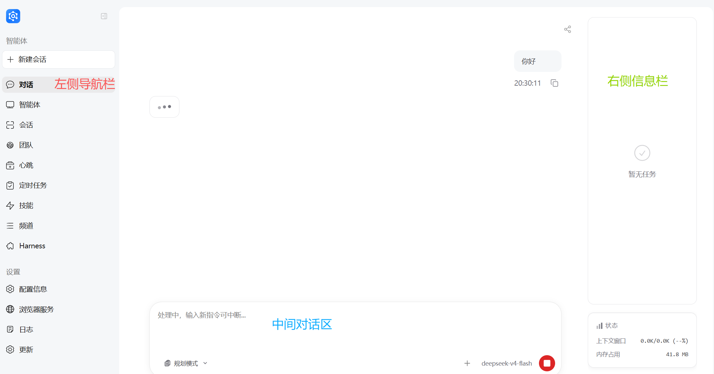
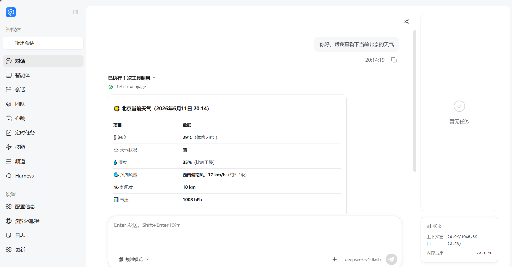

<!-- 此为README撰写的大纲及内容参考，请补充并更新相应缺失内容，注意信息真实
-->


<!-- 如果仓库中加入 Logo，可在这里放置：
<p align="center">
  
</p>
-->

<h1 align="center">JiuwenSwarm</h1>

<p align="center">
  <strong>填写一句 12-20 个字的产品 Slogan：说明 JiuwenSwarm 帮谁完成什么关键任务。</strong>
</p>

<!--
文档这里在docs路径下缺了一个整体的README，我初步做了下调整和中英文导航链接的添加，具体内容还请再看看
-->

<p align="center">
  <a href="README_CN.md">中文</a>
  ·
  <a href="README.md">English</a>
  ·
  <a href="docs/README.md">文档</a>
  ·
  <a href="填写官网链接">官网</a>
  ·
  <a href="填写GitHub链接">GitHub</a>
</p>

<!--
标签作为参考，建议填写来源协议、版本、依赖环境、标志性关键词（如coordination engineering）
-->

<p align="center">
  <a href="LICENSE">
    
  </a>
  <a href="填写 Release 链接">
    
  </a>
  
  
  
</p>

<!--
这里的概览图作为示例，建议截一个能把前端每一个功能文字看清楚的图片，调整下格式大小
-->

<p align="center">
  
</p>

---

## 简介

<!--
建议用 2-3 句话说清楚：
1. JiuwenSwarm 是什么类型的 Agent / Agent 平台 / 个人智能体系统。
2. 它最适合解决哪些任务，例如个人助理、多智能体协作、长期记忆、定时任务、Skill 扩展、多渠道接入等。
3. 它与同类项目相比最重要的差异，例如自托管、数据自主、Skill 自演进、中文生态、多端接入等。
-->

**JiuwenSwarm** 是一款「填写一句清晰定义」。它面向「填写目标用户 / 场景」，帮助用户「填写核心价值」。

### 为什么选择 JiuwenSwarm

<!--
这里放最能打动读者的 4-6 个卖点。下面的卖点表格作为参考，每条控制在一行，注意从用户的角度来写价值，如先写结果，再写机制。
-->

| 能力 | 价值 |
| --- | --- |
| 多智能体协作 | 填写：Coordination Engineering特殊点，如何拆解、协同、执行复杂任务 |
| Skill 自演进 | 填写：Skill自演进适合场景、提升使用体验的地方，如何实现激活Skill自演进 |
| AI基础设施亲和 | 填写：能帮助用户有什么体验上的提升 + 机制技术 |
| 工具权限与安全防护 | 填写：工具执行、文件访问、审批机制或安全策略 |

## 最新动态

<!--
只保留 最多2 条真正重要的动态。过期活动及时删除，完整更新历史放 CHANGELOG 或 Release。
-->

- **YYYY-MM-DD**：`vX.Y.Z` 发布，新增「填写最重要的新能力」。
- **YYYY-MM-DD**：发布「填写文档 / 示例 / 案例」。
- **YYYY-MM-DD**：JiuwenSwarm 「填写活动 / Meetup / 峰会名称」即将开启，查看「填写报名链接」。

## 安装与启动

### 桌面版

| 系统 | 下载链接 | 说明 |
| --- | --- | --- |
| Windows | [下载 Windows 版本](填写下载链接) | 适用于 Windows 10 / 11 |
| macOS | [下载 macOS 版本](填写下载链接) | 适用于 Intel / Apple Silicon |

### 命令行版

<!--
这里给最短安装路径。命令必须真实可运行；可以考虑下是否需要呈现TUI
-->
 ```bash
  # 安装jiuwenswarm
  pip install jiuwenswarm
  # 初始化，仅在首次启动时使用
  jiuwenswarm-init
  # 启动jiuwenswarm
  jiuwenswarm-start
```

启动后访问 http://localhost:5173 打开前端页面。

> 详细安装指导请见：[安装指南](docs/zh/安装指南.md)

## 快速上手

<!--
目标：用户从安装+启动完成到第一次完成真实任务。
建议每一步配一张真实截图或一段短命令，下方图片内容作为参考，如有更优质的图片建议替换。
-->

### 配置模型

<!-- 填写支持的平台，例如华为云 MaaS、OpenAI 兼容接口、本地模型等。 -->


### 执行对话

示例输入：

```text
你好，可以帮我查看下当前北京的天气。
```

<!-- 建议放首次对话、任务执行过程、最终结果截图。 -->



> 详细操作指南请见：[Quick Start](docs/zh/Quickstart.md)

## 文档导航

<!--
这里建议docs路径下需要有一个docs/README，并且README最开始也能实现中英文跳转的，我们现在docs README分别放在了zh 和 en路径下，嵌套太深了。
-->

如需了解查看JiuwenSwarm 的常用使用说明与功能文档，请见：[文档导航](docs/README.md)

## Roadmap

<!--
Roadmap 不宜太长。建议只列近期对用户有价值的方向。
状态建议统一：规划中 / 开发中 / 内测中 / 已发布。
-->

| 功能 | 状态 | 预计时间 | 价值 |
| --- | --- | --- | --- |
| 填写功能名称 | 规划中 | YYYY-QX | 填写该功能解决什么问题 |
| 填写功能名称 | 开发中 | YYYY-QX | 填写该功能解决什么问题 |
| 填写功能名称 | 内测中 | YYYY-QX | 填写该功能解决什么问题 |

## 常见问题

<!--
我们缺少一个FAQ Wiki，建议里面的常见问题按照类型和场景进行分类。
-->

如需查询使用JiuwenSwarm中常见问题的解决方案，请见：[FAQ](这里填写常见问题的wiki链接)。

## 参与贡献

<!--
我们缺少一个贡献指南 Wiki，建议里面书写jiuwenswarm各committer责任分工（如有），提交PR的Git基础操作，提交PR和Issue规范等。
-->

欢迎开发者参与 JiuwenSwarm 的建设。你可以通过以下方式贡献：

- 提交 Bug、功能建议或使用问题：[Issues](https://gitcode.com/openJiuwen/jiuwenswarm/issues)
- 提交代码、文档或示例：[Pull Requests](https://gitcode.com/openJiuwen/jiuwenswarm/pulls)
- 分享 Skill：[Skill Hub](填写SkillHub链接)

贡献前请阅读 [贡献指南](贡献指南规范的链接)，了解调试流程、代码风格和提交规范。

### 贡献者

<!-- 可以使用 contributors 图片服务，看具体页面展示情况，如过长。 -->

感谢所有为 JiuwenSwarm 做出贡献的开发者。

<a href="填写 contributors 链接">
  
</a>

## 加入社区

<!--
保留真实可维护的社区入口，如果是交流群等形式建议放二维码 。
-->

| 入口 | 用途 | 链接 |
| --- | --- | --- |
| 官网 | 产品介绍、动态与生态建设 | [访问官网](填写官网链接) |
| 交流群 | 使用答疑、项目动态、实践交流 | [加入交流群](填写交流群链接或二维码) |
| SIG | 技术路线、工程实践、生态共建 | [加入 SIG](填写SIG链接) |
| Skill Hub | 浏览、发布和复用 JiuwenSwarm Skill | [访问 Skill Hub](填写SkillHub链接) |

## License

本项目基于 [Apache License 2.0](LICENSE) 开源。