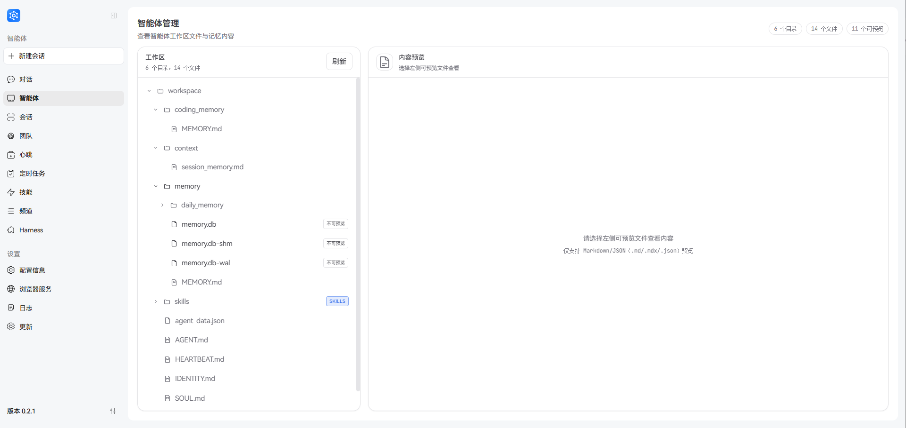

# Agent & workspace

`workspace` is JiuwenSwarm’s runtime directory for agent memory, skills, session data, and configurable heartbeat tasks. In **source mode** it lives at the project root `workspace`; in **wheel install mode**, the bundled `workspace` is copied to `~/.jiuwenclaw/workspace` on first run.



## Layout overview

```
workspace/
├── agent-data.json        # Agent list metadata (generated)
├── skills_state.json      # Skill install/market state (generated)
├── agent/                 # Agent workspace
│   ├── home/              # Editable home page (copied from package templates by language at init)
│   │   ├── HEARTBEAT.md   # Heartbeat tasks (from HEARTBEAT_ZH/EN.md)
│   │   ├── PRINCIPLE.md   # Principles (from PRINCIPLE_ZH/EN.md)
│   │   └── TONE.md        # Tone (from TONE_ZH/EN.md)
│   ├── memory/            # Memory system
│   │   ├── USER.md        # User profile (created by user/agent)
│   │   ├── MEMORY.md      # Long-term memory (created by user/agent)
│   │   ├── YYYY-MM-DD.md  # Daily memory (generated)
│   │   ├── messages.json  # Compressed message store (generated)
│   │   └── memory.db      # Vector DB (generated)
│   ├── skills/            # Skills
│   │   ├── _marketplace/  # Marketplace clone dir (empty by default)
│   │   └── <skill-name>/  # Built-in + marketplace skills
│   └── SOUL.md            # Agent persona (preset)
└── session/               # Sessions (generated)
    ├── sess_<id>/         # Normal sessions
    │   ├── todo.md        # Todo list (TodoToolkit)
    │   └── *.md, *.json   # Session outputs
    └── heartbeat_<id>/    # Heartbeat sessions
```

---

## Pre-configured content

Shipped with the package or source; you can use or edit as needed:

| Path | Description |
|------|-------------|
| `agent/home/HEARTBEAT.md` | Heartbeat template (`resources/agent/HEARTBEAT_ZH.md` or `HEARTBEAT_EN.md`, copied by language at init). If present and valid, the agent reads it on each heartbeat; otherwise only `HEARTBEAT_OK` is returned. Editable in the web UI. |
| `agent/SOUL.md` | Persona for system prompts. |
| `agent/skills/` | Built-in skills. Each has `SKILL.md`, `prompts/`, `references/`, etc. |
| `agent/skills/_marketplace/` | Marketplace clone cache; empty by default. |
| `agent/memory/` | Memory layout. `USER.md` and `MEMORY.md` may be created on first use. |

---

## Dynamically generated content

Created or updated at runtime:

| Path | Description |
|------|-------------|
| `agent-data.json` | Generated by `scripts/generate-agent-folders.js` for the web UI. |
| `skills_state.json` | Maintained by `SkillManager` for installed marketplace plugins. |
| `agent/memory/YYYY-MM-DD.md` | Daily memory files. |
| `agent/memory/messages.json` | Compressed messages for memory. |
| `agent/memory/memory.db` | ChromaDB for `memory_search`. |
| `agent/skills/<skill>/evolutions.json` | Skill evolution records. |
| `session/<session_id>/` | One folder per session (`app.py`). |
| `session/<session_id>/todo.md` | Todo list for that session. |
| `session/<session_id>/*` | Other session artifacts. |

---

## Related configuration

- **Skill root**: `skill_base_dir` in `config/config.yaml`, default `agent/skills`.
- **Memory workspace**: `workspace/agent` (`get_agent_workspace_dir()`).
- **Sessions**: `workspace/session`, one subfolder per `session_id`.
- **SkillNet usage in Claw**: see [Skills.md §5](Skills.md#5-how-skills-installed-via-skillnet-are-used-in-claw).
