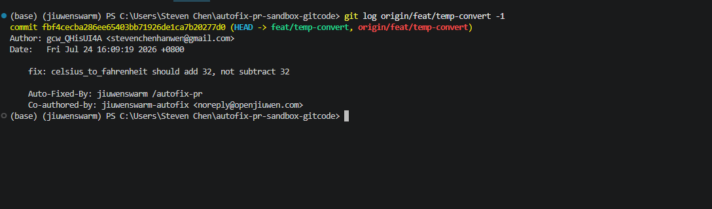

# Auto-fix PR

`/autofix-pr` hands the "PR checks failed → find the cause → fix → push" loop to the Agent, on both GitHub and GitCode.

---

## Background

### What it solves

When a PR's checks fail, the usual routine looks like this:

1. Open the PR page and see which check went red
2. Dig through the pipeline report or CI comments to find which test failed, and where
3. Go back to the local checkout and fix it
4. Commit, push, wait for the pipeline to re-run
5. Still red → back to step 1

Steps 1, 2 and 5 involve no creative work at all — they are pure "read status → locate → re-run" — yet every round needs a person waiting on it. `/autofix-pr` gives those steps to the Agent: it reads the check status itself, gets the concrete failure evidence, finds the root cause, makes a minimal fix, then commits and pushes back to the PR branch.

**How it differs from neighbouring features:**

| Command | Direction | Changes code? |
|------|------|------|
| `/review` | Read a PR → give review comments | ❌ read-only |
| Auto Harness `issue_fix` | issue → new PR | ✅ |
| **`/autofix-pr`** | **existing PR → drive it to green** | ✅ |

**Typical uses:**

- 🔴 **CI failing on something small** — a boundary condition, a missing import, a typo: failures with one obviously correct fix
- 💬 **Acting on review comments** — turning a reviewer's concrete request into code
- 🔁 **Red after a fix** — the first attempt didn't fully solve it and another round is needed

---

## 1. Prerequisites

| Requirement | Notes |
|------|------|
| **code mode** | The command edits files and runs git, so it must run in `code` mode. Other modes are rejected with a prompt to switch |
| **An open PR for the current branch** | With no argument the PR is inferred from the current branch; you can also pass a PR number or URL |
| **`gh` for GitHub** | Installed and authenticated via `gh auth login` (same as `/review` — no new dependency) |
| **No token needed for GitCode** | Reading pipeline status and comments on public repositories requires no authentication |

> ⚠️ After installing `gh`, **restart the TUI** — otherwise the running process still has the old PATH and will report that `gh` cannot be found.

---

## 2. Quick start

Switch to code mode, then run it:

```
/mode code
/autofix-pr
```

<!-- Screenshot: running /autofix-pr in the TUI -->


The Agent detects the forge, identifies the PR, reads the failing checks, locates the root cause, makes a minimal fix, then commits and pushes back to the PR branch. It reports the diagnosis only after the run completes — the "Root cause / Fix" lines at the end of the screenshot below are the failure evidence it read and the fix it applied.

<!-- Screenshot: fix committed and pushed, incl. the closing Root cause / Fix summary -->


---

## 3. Usage

```
/autofix-pr [PR number or URL]
```

| Form | Behaviour |
|------|------|
| `/autofix-pr` | Infers the open PR from the **current branch** (most common) |
| `/autofix-pr 123` | Targets a specific PR number |
| `/autofix-pr https://gitcode.com/{owner}/{repo}/pull/123` | Takes a full PR link |

---

## 4. What it does

| Phase | Action |
|------|------|
| **Phase 0** | Reads `git remote` to detect the forge (GitHub / GitCode) — you never specify it |
| **Phase 1** | Identifies the open PR for the current branch and runs safety checks (see [§6](#6-safety-constraints)) |
| **Phase 2** | Reads failing checks and review comments to get **concrete** failure evidence — which test, which error — not just "it's red" |
| **Phase 3** | Finds the root cause and makes a minimal fix |
| **Phase 4** | Runs the project's own checks locally to confirm the fix |
| **Phase 5** | Commits (with traceability trailers) and pushes back to the PR branch |

---

## 5. Forge differences

The command detects the forge automatically; this section documents its internal behaviour and is not something you need to know to use it.

### GitHub

- Reads red/green from `gh pr view --json statusCheckRollup`
- Pulls failure logs directly with `gh run view --log-failed`

### GitCode

GitCode has no `gh`, so REST endpoints are used instead, with a few non-obvious details:

- **Pipeline status** comes from the `web-api` `pipeline-check` endpoint (which needs the PR head's full 40-character sha)
- **That endpoint returns status only, no logs.** The failure details live in the CI bot's PR comment — a table of checks where each failure links to its report. The Agent follows those links to reach the failing tests and tracebacks
- **Personal repositories have no pipeline by default**, so the endpoint returns empty. **Empty is never read as "green"** — the Agent falls back to running the project's own checks locally

---

## 6. Safety constraints

Because this command changes code and pushes automatically, several rules are built in and cannot be bypassed:

| Rule | Notes |
|------|------|
| **Only the PR for the current branch** | Given someone else's fork PR number, the Agent reports read-only and hands back — it will **not** add a remote, fetch, or patch that fork into your repository |
| **Never fake green** | Making checks pass by deleting or weakening tests, editing CI config, or force-pushing is forbidden |
| **Fix the implementation** | Fixes belong in implementation code; tests and CI configuration are left alone |

> 💡 The first rule matters most: even with uncommitted work in your tree, handing it someone else's fork PR number will not contaminate your repository.

### Traceability

Automated commits carry two trailers so machine fixes stay distinguishable from human ones:

```
Auto-Fixed-By: jiuwenswarm /autofix-pr
Co-authored-by: jiuwenswarm-autofix <noreply@openjiuwen.com>
```

The commit **author remains you** (`--author` is never rewritten), so CLA signing and contribution stats are unaffected.

<!-- Screenshot: trailers in git log / co-author shown on the forge -->


> GitHub renders `jiuwenswarm-autofix` as a co-author; GitCode does not render the co-author avatar, but the trailers are in the commit message itself and remain visible in `git log` and the commit detail page.

---

## 7. FAQ

**Q: It says code mode is required.**
Run `/mode code` first, then retry.

**Q: It cannot find `gh`.**
Install `gh`, run `gh auth login`, then **restart the TUI** — the running process still holds the old PATH.

**Q: My repository is on GitCode. Do I need a token?**
Not for public repositories. Reading pipeline status and PR comments needs no authentication.

**Q: Could it delete tests just to turn CI green?**
No — that is one of the hard rules. If the problem cannot be solved by changing the implementation, it reports that honestly instead of faking green.

**Q: Does one run always fix it?**
Not necessarily. It fixes one round per run — if checks are still failing after the push, run it again.

---

## 8. Known limitations

- **One round per run.** Watching a PR until its checks pass would require a long-running task, which is not supported yet.
- **GitCode failure details depend on the CI bot's comment format**, which is an openJiuwen convention and may not apply to arbitrary GitCode repositories. Without that comment, the Agent falls back to running checks locally, as designed.

---

## Related

- [Slash Commands Reference](SlashCommands.md)
- [Tool Permissions & Security](ToolPermissionsSecurity.md)
- [Modes](Modes.md)
