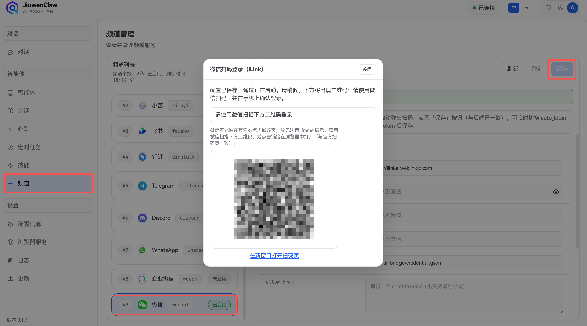

# Channels

## Concept Overview

### What is a Channel?

A **Channel** is JiuwenSwarm's message ingress layer. As a unified messaging hub, it connects various external chat platforms (such as Feishu, DingTalk, WeCom, Telegram, etc.) and provides the following core capabilities:

| Capability | Description |
|------------|-------------|
| **Message Ingestion** | Receives messages from different platforms, normalizes them, and forwards them to JiuwenSwarm for processing |
| **Multi-platform Sync** | A single JiuwenSwarm service can connect to multiple platforms simultaneously, with messages interoperable across them |
| **Identity Mapping** | Establishes unique identifiers for users on each platform and maintains independent conversation contexts |
| **Security Isolation** | Message flows across channels are isolated from each other; supports whitelists, permission controls, etc. |

### Introduction

JiuwenSwarm's **Channels** are the **gateways** through which you converse with different chat platforms. JiuwenSwarm has already achieved seamless integration with **HarmonyOS Xiaoyi**, **Feishu**, and more, with continuous expansion to additional platforms. You can talk to JiuwenSwarm directly through **Feishu**, the **Xiaoyi app on HarmonyOS devices**, and others.

### Digital Avatar

JiuwenSwarm supports **Group Digital Avatar** on **Feishu** and **WeCom** channels. When enabled, the bot acts as a designated user's "digital avatar" in group chats — it automatically identifies messages relevant to that user and replies on their behalf in first person. For personal action items such as to-dos and reminders, the avatar sends the reply as a private message to the user while posting a brief confirmation in the group. Irrelevant messages are filtered out automatically, saving Agent resources.

This feature is disabled by default. See the configuration instructions under each channel below.

### Configuration Methods

Configure channels in either of two ways:

- **Web UI** (recommended) — In JiuwenSwarm's frontend, click the **Agent** / **Channels** card, then fill in the channel management form.

- **Edit `config.yaml` manually** — Default location is `~/.jiuwenswarm/config.yaml` (created automatically on first `jiuwenswarm-start`). Set the desired channel to `enabled: true` and fill in the credentials; saving triggers an automatic reload without restarting.

---

## Channel Setup

### Xiaoyi

[Demo video](../assets/videos/xiaoyi_channel.mp4)

#### 1. Create a Xiaoyi Agent

Create a **JiuwenSwarm-mode** agent on the [Xiaoyi Open Platform](https://developer.huawei.com/consumer/cn/hag/abilityportal/#/) to connect to your JiuwenSwarm service.


Step 1: Create a JiuwenSwarm-mode agent.


Step 2: Create credentials and whitelist

Click to create new credentials and **save the AK and SK**.


The Xiaoyi Open Platform provides on-device debugging capabilities. By configuring whitelist groups and adding user accounts, you can test the agent on HarmonyOS terminals. After successful addition and publishing, the agent can be used in the Xiaoyi app on the terminal.


Select the new user group:


Step 3: Publish the agent

Fill in the opening dialogue and click the publish button:


Step 4: Enable push notifications (optional)

Click to enable the trigger, fill in the name and save, then enter the apiID in JiuwenSwarm:


Click variable editing and enable the push_id system variable:


> 💡 **Note**: `api_id` is the API identifier of the trigger, and `push_id` is the identifier for receiving push messages. When enabling push notifications, both must be used together — neither can be omitted.

#### 2. Bind the Channel

**Option A: Web UI**

Paste the **AK**, **SK**, and **agentId** from the Xiaoyi Open Platform into JiuwenSwarm's Xiaoyi channel, enable it, and save to start chatting. If push is enabled, you can also fill in the api_id (optional):


**Option B: Edit config file**

Edit `~/.jiuwenswarm/config/config.yaml`:

``````
channels:
  xiaoyi:
    # Huawei Xiaoyi A2A configuration
    mode: xiaoyi_channel
    ak: "<ak from platform>"
    sk: "<sk from platform>"
    agent_id: "<your agent id>"
    api_id: "<trigger apiId>"
    push_id: "<trigger push_id (required when push notifications are enabled, used together with api_id)>"
    uid: ""                           # User identifier (optional)
    api_key: ""                       # API key (optional)
    push_url: ""                      # Push URL (optional)
    file_upload_url: ""               # File upload URL (optional)
    phone_tools_enabled: false        # Enable phone tools (optional)
    send_file_allowed: true           # Allow sending files (optional)
    enable_streaming: true
    enabled: true
``````

If the service is already running it will auto-reload; otherwise run `jiuwenswarm-start`.

#### 3. Chat with the Agent

**Option 1:** Chat directly on the web with the agent application


**Option 2:** On a HarmonyOS terminal, open the Xiaoyi app, find the published agent, and chat directly


### Feishu (Lark)

#### 1. Create a Feishu Custom App

1. Visit [Feishu Open Platform](https://open.feishu.cn/) and sign in.

2. In the developer console, click **Create custom app**.

3. Fill in the app name, description, and upload an icon, then click **Create**.

   

#### 2. Add Bot Capability

1. In the app configuration page, select **Add capability** from the left sidebar.

2. Under **Bot**, click **Add**.

   

#### 3. Save App Credentials

1. Open the Feishu bot admin console.

2. Copy **App ID** and **App Secret** into JiuwenSwarm's Feishu channel, enable, and save.

   

   

#### 4. Configure Permissions

1. Select **Permission management** → **API permissions** from the left sidebar.

2. Search and enable the following key permissions (for sending and receiving messages):
   - `im:message:send`: Send messages as the app
   - `im:message.p2p_msg:readonly`: Get private messages sent to the bot
   - `im:message.group_at_msg:readonly`: Receive group chat @bot message events
   - `im:resource:upload`: Upload images and files (for sending images/files to users)
   - `contact:user.employee_id:readonly`: Get user ID information
   - You can also batch-import permissions; refer to the Feishu Open Platform documentation for the permission list


#### 5. Configure Event Subscription (Receive Messages)

1. Select **Events & callbacks** from the left sidebar.

2. **Add events**:
   - `im.message.receive_v1` (receive message event)
   - `im.message.message_read_v1` (message read)

3. **Add callback**:
   - `card.action.trigger` (card interaction callback)

4. (Optional) **Configure encryption policy**: If encryption is enabled, save the **Encrypt Key**.


#### 6. Publish the App

1. Select **Version management & release** from the left sidebar, click **Create version**.

2. Fill in the version number, update notes, and select the availability scope (typically **All members** or partial members).

3. Submit for review. If the enterprise has review exemption enabled, the version goes live immediately.

4. Sign in to the Feishu app with the account that submitted the app to see the published chat bot.


#### 7. Add Bot to a Group (Optional)

1. Open the Feishu client and enter the group where you want to add the bot.

2. Click **Group settings** → **Group bots** → **Add bot**, search for your app name and add it.


#### 8. Configure Feishu Channel

After starting the frontend service, open **Channels → Feishu**, enable it, and configure the **App ID** and **App Secret** saved in step 3.

#### 9. Enable Group Digital Avatar (Optional)

After completing the basic Feishu bot setup, you can enable the digital avatar feature so the bot automatically replies in group chats on behalf of a designated user.

> In Feishu, the digital avatar responds when someone **@mentions the bot**, **@mentions the represented user**, or **mentions the user's name** in the message text.

##### Prerequisites

- Feishu bot has been created, published, and added to the target group (see step 7)

##### Configuration Steps

1. In the JiuwenSwarm channel management page, open the Feishu channel settings and enable the **`group_digital_avatar`** toggle. Configure **`my_user_id`** and **`bot_name`**.

   

2. Set **`my_user_id`** (required): the Feishu `open_id` of the user this avatar represents. To obtain it:
   - Sign in to the Feishu API Explorer, open the [Send Message API](https://open.feishu.cn/document/server-docs/im-v1/message/create)
   - Set `receive_id_type` to **open_id**
   - Click **Quick copy open_id**, select the target user — the copied value is `my_user_id`

   

   

3. Set **`bot_name`**: the bot's display name in the group, used for @mention detection.

4. (Optional) Enable **`enable_memory`** to let the bot read and search local memory files in group chats.

5. **Configure tool / path permissions**: the digital avatar operates autonomously in group chats and cannot prompt the user for confirmation like in DMs. You must pre-configure which tools are allowed and which paths are accessible. After enabling the avatar, open the permission settings and set each tool's permission (`allow` / `deny`). Without explicit configuration, any operation that would require confirmation (`ask`) is automatically downgraded to `deny`.

   

You can also configure via `~/.jiuwenswarm/config/config.yaml`:

``````
channels:
  feishu:
    app_id: "your App ID"
    app_secret: "your App Secret"
    enabled: true
    # Group digital avatar configuration
    group_digital_avatar: true
    my_user_id: "ou_xxxx"       # Feishu open_id of the represented user
    bot_name: "bot name"        # Bot display name in the group
    enable_memory: false         # Enable group chat memory

# Digital avatar tool permissions (scoped by channel_id + user_id)
permissions:
  owner_scopes:
    # channel_id: use "feishu" for single bot, "feishu_enterprise:<app_id>" for multi-bot
    feishu:
      "ou_xxxx":                 # Must match my_user_id above
        defaults:
          "*": "allow"           # Global default: allow / deny
        tools:
          bash:
            "*": "deny"          # Deny bash by default
            patterns:
              "git status *": "allow"
              "git log *": "allow"
          write:
            "*": "deny"
  deny_guidance_message: "This tool is not authorized in digital avatar mode."
``````

6\. The Feishu bot needs the following additional permissions:

   - `im:message.group_msg:readonly` - Retrieve all messages in the group (sensitive permission)
   - `contact:contact.base:readonly` - Retrieve basic contact information
   - `contact:user.base:readonly` - Retrieve basic user information
   - `im:message.p2p_msg:readonly` - Retrieve private messages sent to the bot (for receiving DM events)

##### Fields

| Field | Description |
|:------|:------------|
| `group_digital_avatar` | Enable group digital avatar. When on, the bot acts as the designated user's avatar in group chats — it filters irrelevant messages, rewrites relevant ones, and routes personal action replies (to-dos, reminders) as private messages while posting a brief confirmation in the group |
| `my_user_id` | **Required** when avatar is on: the Feishu `open_id` (e.g. `ou_xxx`) of the represented user. Avatar does not work without this |
| `bot_name` | Bot display name in the group, used for @mention detection |
| `enable_memory` | Enable group chat memory. When on, the bot can read and search local memory files in group chats |
| `owner_scopes` | Tool permissions scoped by `channel_id` + `user_id`. Supports `allow` / `deny`; `ask` is automatically downgraded to `deny` in avatar mode. Web UI configuration is recommended |

#### 10. Multiple Feishu Bots (`feishu_enterprise`)

Use `channels.feishu_enterprise` when one JiuwenSwarm instance must serve **multiple Feishu apps** (multiple bots).

Each bot is a separate channel; `channel_id` looks like `feishu_enterprise:<app_id>`.

Currently, multi-bot only supports manual editing of `~/.jiuwenswarm/config/config.yaml`:

``````
channels:
  feishu_enterprise:
    bot_a:
      app_id: "cli_xxx"
      app_secret: "xxx"
      encrypt_key: ""
      verification_token: ""
      allow_from: []
      enable_streaming: true
      chat_id: ""
      enabled: true
    bot_b:
      app_id: "cli_yyy"
      app_secret: "yyy"
      encrypt_key: ""
      verification_token: ""
      allow_from: []
      enable_streaming: true
      chat_id: ""
      enabled: true
``````

##### Fields

| Field | Description |
|:------|:------------|
| `app_id` | Feishu App ID (required) |
| `app_secret` | Feishu App Secret (required) |
| `encrypt_key` | Event subscription encryption key (optional) |
| `verification_token` | Event subscription token (optional) |
| `allow_from` | Allowed user `open_id` list; empty list means no restriction |
| `enable_streaming` | Enable streaming output |
| `chat_id` | Fixed push target (optional) |
| `enabled` | Enable this bot |

##### vs Single `feishu`

- `feishu`: single channel, `channel_id` is always `feishu`
- `feishu_enterprise`: multiple channels, each bot uses an independent `channel_id` (`feishu_enterprise:<app_id>`)
- In multi-bot scenarios, recent session information is tracked per bot to prevent bots from overwriting each other


### DingTalk

#### 1. Prerequisites

- Your account must be an **enterprise admin** or have **developer permissions**.
- The enterprise must have **DingTalk Developer Console** enabled.

#### 2. Create an Internal App Bot

##### Step 1: Open the Developer Console

- Visit [https://open-dev.dingtalk.com](https://open-dev.dingtalk.com)
- After logging in, select **App development** → **Internal org apps** → **Create app**


##### Step 2: Fill in App Information

- App name: e.g. `JiuwenSwarm`
- App type: **Bot**


##### Step 3: Add Bot Capability

- After creation, open the app details page
- Click **Capabilities** → **Bot** → **Enable bot configuration**
- Fill in the bot name (e.g. `JiuwenSwarm`), bot intro (≤10 characters), etc.


##### Step 4: Configure Message Receiving Mode

Select **Stream mode** (WebSocket long connection) — no public IP required; suitable for cloud functions or local debugging.


#### 3. Configure Permissions

On the **Permission management** page, enable the following permissions as needed:
- Send DM/group messages: `qyapi_robot_sendmsg`
- Lookup user by mobile (for DMs): `topapi_v2_user_getbymobile`
- Send interactive cards: `Card.Instance.Write`
- Streaming card updates (essential for AI scenarios): `Card.Streaming.Write`

#### 4. Publish the App & Bot

##### Step 1: Save and Publish the Bot

- On the bot configuration page, click **Save**
- Return to the app homepage, click **Version management & release** → **Publish**
- Fill in the version number, update log, visibility scope, etc.


##### Step 2: Confirm Publishing

- Click **Confirm publish**
- Status changes to **Published** and the bot is ready to use

> 💡 After publishing, search the bot name in the DingTalk client to add it to group chats or DMs.


#### 5. Configure DingTalk Channel

Copy **Client ID** and **Client Secret** from **Credentials & basic info**.

In JiuwenSwarm, open **Channels → DingTalk**, enable it, and configure **client_id** and **client_secret**, then save:


### WeCom (WeChat Work)

#### 1. Create a Bot in WeCom

1. Open the WeCom client, go to **Workbench** → **Smart bot**, click **Create bot** → **Manual creation**

   

   

   

2. On the creation page, select **API mode**

   

3. On the API configuration page, select **Long connection** as the connection method

   

4. After configuration, the page will automatically generate and display **Bot ID** and **Secret** — save these securely (needed for linking with JiuwenSwarm later)

#### 2. Link JiuwenSwarm

1. In JiuwenSwarm, open **Channels** and select **WeCom**.

2. Enter the **botId** and **secret** saved in step 1, then click save.

   

   

#### 3. Chat with the WeCom Bot

> ⚠️ **Note**: If you cannot find the bot after configuration, navigate to: Workbench → Smart bot → Details → Use → Send message.


1. In WeCom, find the newly added bot, send a test message — receiving a reply means the connection is successful.

2. On mobile WeCom, send a test message — receiving a reply means the connection is successful.


#### 4. Enable Group Digital Avatar (Optional)

After completing the basic WeCom bot setup, you can enable the digital avatar feature.

> ⚠️ **Note**: In WeCom, group messages must **@mention the bot** for the bot to receive them. Messages that do not @mention the bot will not trigger the digital avatar.

##### Prerequisites

- WeCom bot has been created and linked to JiuwenSwarm
- Bot has been added to the target group: open WeCom, enter the group, tap add member → **Group bots** → **Smart bot**, and search for your app name

##### Configuration Steps

1. In the JiuwenSwarm channel management page, open the WeCom channel settings and enable the **`group_digital_avatar`** toggle. Configure **`my_user_id`** and **`bot_name`**. Before enabling the digital avatar, you need to have a private chat with the bot once; otherwise, an error `[AiBotSDK] [WARN] Reply ack error` will be reported.

   

2. Set **`my_user_id`** (required): the WeCom account of the user this avatar represents. To obtain it:
   - Open the [WeCom Admin Console](https://work.weixin.qq.com/wework_admin/login)
   - Go to **Contacts** → **Organization** → **Department** → **Member details**
   - The **Account** field shown on the page is the `my_user_id`

   

   

3. Set **`bot_name`** (optional): the bot's display name in the group, used for @mention detection.

4. (Optional) Enable **`enable_memory`** to let the bot read and search local memory files in group chats (memory is not written in group chats).

5. **Configure tool / path permissions**: the digital avatar operates autonomously in group chats and cannot prompt the user for confirmation like in DMs. You must pre-configure which tools are allowed and which paths are accessible. After enabling the avatar, open the permission settings and set each tool's permission (`allow` / `deny`). Without explicit configuration, any operation that would require confirmation (`ask`) is automatically downgraded to `deny`.

   

You can also configure via `~/.jiuwenswarm/config/config.yaml`:

``````
channels:
  wecom:
    bot_id: "your Bot ID"
    secret: "your Secret"
    send_file_allowed: true           # Allow sending files (optional)
    enabled: true
    # Group digital avatar configuration
    group_digital_avatar: true
    my_user_id: "account"        # WeCom account of the represented user
    bot_name: "bot name"         # Bot display name in the group (optional)
    enable_memory: false          # Enable group chat memory

# Digital avatar tool permissions (scoped by channel_id + user_id)
permissions:
  owner_scopes:
    wecom:
      "account":                  # Must match my_user_id above
        defaults:
          "*": "allow"           # Global default: allow / deny
        tools:
          bash:
            "*": "deny"
            patterns:
              "git status *": "allow"
              "git log *": "allow"
          write:
            "*": "deny"
  deny_guidance_message: "This tool is not authorized in digital avatar mode."
``````

##### Fields

| Field | Description |
|:------|:------------|
| `group_digital_avatar` | Enable group digital avatar. When on, the bot acts as the designated user's avatar in group chats — it filters irrelevant messages, rewrites relevant ones, and routes personal action replies (to-dos, reminders) as private messages while posting a brief confirmation in the group |
| `my_user_id` | **Required** when avatar is on: the WeCom account of the represented user. Avatar does not work without this |
| `bot_name` | Optional: bot display name in the group, used for @mention detection |
| `enable_memory` | Enable group chat memory. When on, the bot can read and search local memory files in group chats; memory is not written in group chats |
| `owner_scopes` | Tool permissions scoped by `channel_id` + `user_id`. Supports `allow` / `deny`; `ask` is automatically downgraded to `deny` in avatar mode. Web UI configuration is recommended |


### Telegram

#### 1. Create a Telegram Bot

Use [@BotFather](https://t.me/BotFather) to create a bot and get a **Bot Token**.

Step 1: Search for `@BotFather` in Telegram and open the conversation.


Step 2: Send `/newbot` and follow the prompts.

BotFather will ask you to enter:
- **Bot display name** (e.g. `JiuwenSwarm Bot`)
- **Bot username** (must end with `bot`, e.g. `jiuwenswarm_bot`)


Step 3: **Save the Bot Token**

After creation, BotFather returns a token in the format `123456789:ABCDefGhIJKlmN...`. Save it securely — you'll need it for configuration.

> ⚠️ **Note**: The Bot Token is equivalent to the bot's password — do not leak it. If the token is exposed, use `/revoke` in BotFather to regenerate it.

#### 2. Bind the Channel

**Option A: Web UI (recommended)**

In JiuwenSwarm's frontend, click the **Agent** / **Channels** card, fill in the Bot Token in the Telegram channel module, enable it, and save.


**Option B: Edit `config.yaml`**

Edit `~/.jiuwenswarm/config/config.yaml`:

``````
channels:
  telegram:
    # Bot Token from @BotFather
    bot_token: "<your Bot Token>"
    # User whitelist (Telegram user_id); empty allows all users
    allow_from: []
    # Message parse mode: Markdown, HTML, None
    parse_mode: Markdown
    # Group chat mode: mention, reply, all, off
    group_chat_mode: mention
    enabled: true
``````

If the service is already running it will auto-reload; otherwise run `jiuwenswarm-start`.

#### 3. Configuration

| Field | Description | Default |
|:------|:------------|:--------|
| `bot_token` | Bot Token from @BotFather (**required**) | empty |
| `allow_from` | Allowed Telegram `user_id` whitelist; empty = all users | `[]` |
| `parse_mode` | Message parse mode: `Markdown`, `HTML`, or `None` (plain text) | `Markdown` |
| `group_chat_mode` | Group chat response mode (see details below) | `mention` |
| `enabled` | Enable Telegram channel | `false` |

##### Group Chat Modes

When the bot is added to a Telegram group, `group_chat_mode` controls how the bot responds to group messages:

| Mode | Description |
|:-----|:------------|
| `mention` | **Only respond to @mentions**: only processes messages when the bot is @mentioned (recommended) |
| `reply` | **Only respond to replies**: only processes messages that reply to the bot |
| `all` | **Respond to all messages**: all text messages in the group are processed |
| `off` | **Disable group chat**: no messages are responded to in the group |

#### 4. Start Chatting

**Option 1:** Search for your bot's username in Telegram and send a message to start chatting.


**Option 2:** Add the bot to a group and interact based on the `group_chat_mode` setting.


#### 5. Get `user_id` (Whitelist)

To configure the `allow_from` whitelist, you need to obtain the user's Telegram `user_id`:

1. Search for `@userinfobot` in Telegram and send any message to get your `user_id`.

2. Add the obtained `user_id` to the `allow_from` list:

``````
channels:
  telegram:
    bot_token: "<your Bot Token>"
    allow_from:
      - "123456789"    # User A's user_id
      - "987654321"    # User B's user_id
    enabled: true
``````

> 💡 **Tip**: When `allow_from` is an empty list, all users can use the bot. After setting a whitelist, only users in the list can chat with the bot.


### Discord

Discord channel integration is supported in the current version. Configure and enable the Discord Bot in **Channel Management**, or manually edit `config.yaml`.

### For step-by-step instructions (Developer Portal bot creation, intents, install link, channel management), see [Discord.md](Discord.md).

Configuration fields:
- `bot_token`
- `application_id`
- `guild_id`
- `channel_id`
- `block_dm`
- `allow_from`
- `enabled`

Configure in `~/.jiuwenswarm/config/config.yaml` as follows:

``````
channels:
  discord:
    bot_token: "Discord Bot Token"
    application_id: "Application ID"
    guild_id: "Target server Guild ID"
    channel_id: "Target channel Channel ID"
    block_dm: false
    allow_from: []
    enabled: true
``````

#### Quick Start Guide

1. Create a Bot in the Discord Developer Portal and get the `bot_token`
2. On the Bot tab, enable **Message Content Intent**
3. Invite the bot to the target server and grant read/write channel permissions
4. Fill in the configuration in JiuwenSwarm and enable `enabled: true`

#### Fields

| Field | Description | Default |
|:------|:------------|:--------|
| `bot_token` | Discord Bot Token (required) | empty |
| `application_id` | Application ID (optional, recommended) | empty |
| `guild_id` | Listen only to the specified server (optional; empty = no restriction) | empty |
| `channel_id` | Listen/reply only to the specified channel (optional; empty = reply based on message context) | empty |
| `block_dm` | When `true`, DMs are not processed | `false` |
| `allow_from` | Allowed Discord user ID list; empty list means all users are allowed | `[]` |
| `enabled` | Enable Discord channel | `false` |


### Personal WeChat

#### 1. Prerequisites

- You are an **Android** or **iOS** user
- You are a **HarmonyOS** user and don't mind using **Zhuoyitong**
- Due to current Personal WeChat limitations, scheduled tasks cannot be sent after a long period of inactivity in Personal WeChat. It is recommended to use other channels for scheduled tasks.

> 💡 **Tip**: After a user sends a message to ClawBot, the app can send up to **10** independent messages to that user (including the reply message). If the user sends another message to ClawBot, the quota resets to 10.

#### 2. Android or iOS Setup

##### Step 1: Upgrade WeChat Version

In WeChat, go to **Me** → **Settings** → **About WeChat** → **Version Update**:
- iOS: upgrade to the latest version
- Android: upgrade to the latest version


##### Step 2: Scan QR Code to Connect

- Open the latest version of JiuwenSwarm frontend, click **Channels** → **WeChat**, enable the WeChat configuration and save. A **QR code** will appear on the page.



- Open WeChat on your phone, tap the **+** in the top right → **Scan**, scan the QR code generated in the previous step, and follow the prompts to complete the connection.

#### 3. HarmonyOS Setup

Since the HarmonyOS WeChat version does not yet support the **ClawBot** feature, **native HarmonyOS WeChat cannot currently be connected**. However, users can connect through **Zhuoyitong** by following these steps:

##### Step 1: Install WeChat Dual Account

- Download **WeChat Dual Account** through **Zhuoyitong** and log in to WeChat again.


##### Step 2: Upgrade & Connect

- Follow the same upgrade and connection steps as in **Android / iOS Setup**.
