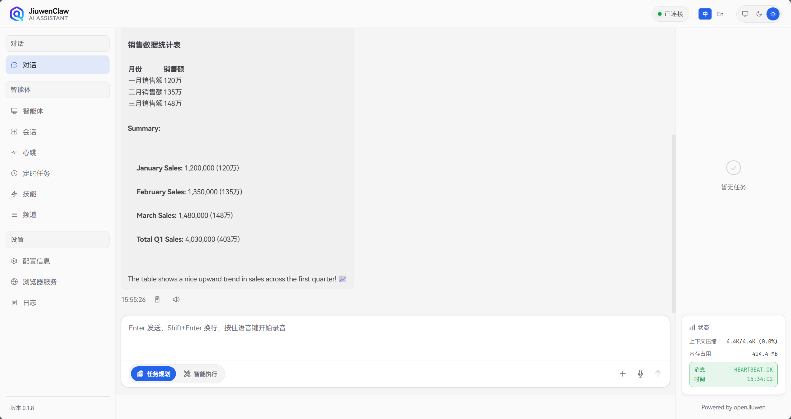
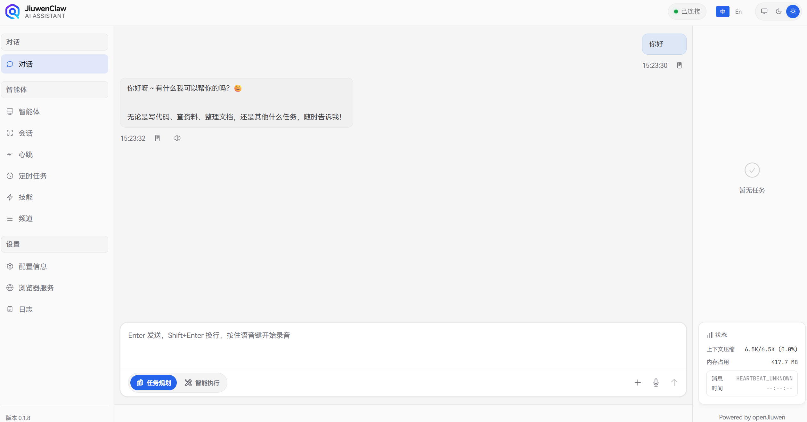

# Configuration Information

JiuwenAvatar configuration serves as the foundational setup for your interactions with the agent. Proper configuration allows you to connect to various model services, enable multimodal capabilities, integrate third-party services, and adjust system behavior parameters.

This document details each configuration option in the JiuwenAvatar frontend panel to help you get started quickly and fully leverage the system's capabilities.

---

## 1. Configuration entry

Open **Configuration** from the left navigation bar to view and edit settings for models, third-party services, free search, and more. Click **Save** after changes; whether you need to wait for services to become ready depends on your deployment.


The configuration panel contains the following main sections:

- **Model Configuration**: Default chat model, video/audio/vision models (see [2. Model Configuration](#2-model-configuration))
- **Embedding Configuration**: Vector embedding service (see [3. Embedding Configuration](#3-embedding-configuration))
- **Third-Party Services**: Jina, Bocha, Serper, Perplexity, GitHub, etc. (see [4. Third-Party Service Configuration](#4-third-party-service-configuration))
- **Self-Evolution Configuration**: Automatic skill improvement (see [5. Self-Evolution Configuration](#5-self-evolution-configuration))
- **Context Compression**: Dialogue history management (see [6. Context Compression](#6-context-compression))
- **Tool Security Guardrails**: Tool invocation permission checks (see [7. Tool Security Guardrails](#7-tool-security-guardrails))

> 💡 **Tip**: Model configuration (`api_base`, `api_key`, `model`, `model_provider`) is required; all other configurations are optional.

---

## 2. Model Configuration

> Before using JiuwenAvatar, you must obtain an API key from your chosen model provider. Visit the provider's official website and follow instructions to apply for an API key.

### 2.1 Supported Model Types

JiuwenAvatar supports multiple model types to meet diverse scenario requirements:

| Model Type       | Purpose                                                                 | Capability Requirements                                                                 | Required |
| ---------------- | ----------------------------------------------------------------------- | ---------------------------------------------------------------------------------------- | -------- |
| **Default Model** | Core dialogue model; handles text chat, task planning, tool calling, etc | Must support **Function Calling** and multi-turn dialogue                                 | ✅ Yes    |
| **Video Model**   | Video understanding and analysis; supports video Q&A, scene detection    | Must support **video understanding** and process video input                             | ⭕ No     |
| **Audio Model**   | Speech recognition and processing; supports ASR, audio content analysis   | Must support **speech recognition / audio understanding**                                 | ⭕ No     |
| **Vision Model**  | Image understanding and analysis; supports image Q&A, OCR, captioning    | Must support **image understanding** and process image input                              | ⭕ No     |
| **Image Generation Model** | Generate images from text descriptions; supports AI painting, image creation | Must support **image generation** and create images from text | ⭕ No     |

> 💡 **Tip**: The default model is essential for system operation and must be configured correctly. Video, audio, vision, and image generation models are optional; configure them only when multimodal capabilities are needed.

### 2.2 Configuration Fields

Each model type supports the following parameters:

| Field              | Description                  | Remarks                                                                                      |
| ------------------ | ---------------------------- | -------------------------------------------------------------------------------------------- |
| `api_base`         | Base URL for model API        | Use the provider's API endpoint; **do not include `/chat/completions`**; appended automatically |
| `api_key`          | Model API key                | Obtained from the model provider; keep confidential                                           |
| `model`            | Model identifier             | Use exact model ID such as `gpt-4o`, `claude-3-opus`, `deepseek-chat`                                         |
| `model_provider`   | Model provider type          | Supports `OpenAI`, `Azure`, `SiliconFlow`, etc., for API format adaptation                    |

> 💡 **Test Function**: The configuration panel provides a **Test button**. After filling in the model configuration, you can click "Test" to verify the API connection. The system will send a simple test request and display "Test Successful" if successful, or show error information otherwise.


#### Configuration Examples

**OpenAI-compatible API**

```
api_base: https://api.openai.com/v1
api_key: sk-your-openai-api-key
model: gpt-4o
model_provider: OpenAI
```

> 💡 **Tip**: Most model providers offer OpenAI-compatible APIs. You can adjust `api_base` and `model` parameters based on your actual provider.

### 2.3 Multi-Model Management and Aliases

The **Model List** section in the configuration panel supports maintaining multiple models simultaneously for quick switching between different models.

Each model entry contains the following fields:

| Field | Required | Description |
|------|---------|------|
| `model_name` | Yes | Model name at the API layer (e.g., `gpt-4o`, `deepseek-chat`) |
| `alias` | No | Display name / switch identifier; defaults to `model_name` if empty |
| `api_base` | Yes | API endpoint for this model |
| `api_key` | Yes | API key for this model |
| `model_provider` | Yes | Provider (e.g., `OpenAI`, `DeepSeek`) |
| `temperature` | No | Sampling temperature, default `0.95` |

**`alias` Rules**:
- If empty, it automatically defaults to `model_name` when saved;
- Must be globally unique across all configured models: cannot duplicate another model's `alias` or `model_name`;
- When switching models (Web dropdown / CLI `\model <name>`), you can use either `alias` or `model_name` as the identifier.

The first item in the list is the default model; you can drag to reorder or click "Set as Default" to change the default.

### 2.4 Multimodal Model Usage Examples

Once video, audio, or vision models are configured, JiuwenAvatar enables corresponding multimodal features automatically.

#### Video Model

Using **GLM-4.6V-Flash11** video understanding API as an example:

```
api_base: https://open.bigmodel.cn/api/paas/v4
api_key: your-zhipu-api-key
model: GLM-4.6V-Flash11
model_provider: ZhiPu
```

When you send a video file to JiuwenAvatar, the system will invoke the video model for analysis:

```
User: Analyze this video and list the main scenes.
[Attachment: meeting_recording.mp4]

JiuwenAvatar: Based on video analysis, the main scenes are:
1. Opening remarks (0:00–2:30)
2. Project progress report (2:30–8:15)
3. Issue discussion (8:15–12:00)
4. Summary and next steps (12:00–15:00)
```


#### Audio Model

Using **GLM-ASR-2512** audio model as an example:

```
api_base: https://open.bigmodel.cn/api/paas/v4
api_key: your-zhipu-api-key
model: glm-asr-2512
model_provider: ZhiPu
```

When you send an audio file, the system will invoke the audio model for speech recognition or analysis:

```
User: Transcribe this audio recording.
[Attachment: voice_message.m4a]

JiuwenAvatar: Transcription:
"Project review meeting at 3 PM tomorrow in Conference Room B. Please prepare materials in advance..."
```


#### Vision Model

Using **GLM-4.6V-Flash11** vision model as an example:

```
api_base: https://open.bigmodel.cn/api/paas/v4
api_key: your-zhipu-api-key
model: GLM-4.6V-Flash11
model_provider: ZhiPu
```

```
User: Extract data from the table in this image.
[Attachment: data_chart.png]

JiuwenAvatar: Extracted sales data:
- January: 1.2M
- February: 1.35M
- March: 1.48M
Showing an upward trend...
```



#### Image Generation Model

Using **GLM-4.6V-Flash11** image generation model as an example:

```
api_base: https://open.bigmodel.cn/api/paas/v4
api_key: your-zhipu-api-key
model: GLM-4.6V-Flash11
model_provider: ZhiPu
```

When you request image generation, the system will invoke the image generation model:

```
User: Generate an image of a beach at sunset.

JiuwenAvatar: [Generated image]
Generated an image of a beach at sunset, golden sunlight sparkling on the shimmering sea...
```

---

## 3. Embedding Configuration

Embedding models convert text into vector representations and form the core of JiuwenAvatar's memory system for semantic retrieval.

### 3.1 Purpose

- **Semantic search**: Vectorize memory content for similarity-based retrieval rather than simple keyword matching
- **Memory recall**: Improve accuracy when querying historical information
- **Hybrid retrieval**: Combine with BM25 full-text search for optimal recall

> 💡 **Tip**: Embedding configuration is optional. If not set, the system uses a mock provider for basic retrieval. Configuring an embedding model improves semantic search precision. See the [Memory](Memory.md) documentation for details.

### 3.2 Configuration Fields

| Field              | Description                     | Remarks                                   |
| ------------------ | ------------------------------- | ----------------------------------------- |
| `embed_api_base`   | Base URL for embedding API      | Embedding service API endpoint            |
| `embed_api_key`    | Embedding service API key       | Obtained from the service provider        |
| `embed_model`      | Embedding model name            | Chinese-optimized embedding recommended   |

#### Configuration Example

**SiliconFlow**

```
embed_api_base: https://api.siliconflow.cn/v1
embed_api_key: sk-your-siliconflow-api-key
embed_model: BAAI/bge-large-zh-v1.5
```

---

## 4. Third-Party Service Configuration

This section mirrors **§1.4** and **§1.5** for readers who jump here first. All items below appear on the **Configuration** page (all optional).

| Field | Description | Reference |
| --- | --- | --- |
| `jina_api_key` | Jina; fetch and some search flows | [Jina](https://jina.ai/) |
| `bocha_api_key` | Bocha Web Search | [Bocha Open Platform](https://open.bochaai.com/) |
| `serper_api_key` | Serper | [Serper](https://serper.dev/) |
| `perplexity_api_key` | Perplexity | [Perplexity](https://www.perplexity.ai/) |
| `github_token` | GitHub; SkillNet, etc. | [GitHub tokens](https://github.com/settings/tokens) |
| `teamskills_hub_token` | TeamSkillsHub user token | [TeamSkillsHub](https://teamskills.openjiuwen.com) |

> ⚠️ **Note**: All optional. If unset, related features may be unavailable or fall back; exact behavior depends on your product version.

---

## 5. Self-Evolution Configuration

Self-evolution controls the automatic improvement of JiuwenAvatar's Skills.


### Toggles

The frontend shows two options under **Self-Evolution Configuration**:

- **Auto-detect evolution signals**: disabled by default. When enabled, the system scans failures, corrections, and other evolution signals after chat and tool execution. This maps to `evolution.auto_scan`; env `EVOLUTION_AUTO_SCAN` takes precedence.
- **Auto-suggest new skill creation**: disabled by default. When enabled, the system can propose creating a new Skill when no suitable Skill exists. This maps to `evolution.skill_create`; env `SKILL_CREATE` takes precedence.

> 📖 For details on the self-evolution mechanism, see [Skill self-evolution](SkillSelfEvolution.md).

---

## 6. Context Compression

Context compression manages dialogue history retention strategies.


### Toggle

- **Field**: `context_engine.enabled`
- **Default**: `true` (enabled)
- **Purpose**: Automatically compress and offload dialogue history when exceeding context window limits to maintain fluent interaction.

When enabled, the system will:

1. Monitor message count and token usage
2. Archive low-priority content when thresholds are reached
3. Preserve lightweight indexes to free space for ongoing tasks

> 📖 For details, see [Context Compression & Offloading](ContextCompression.md).

---

## 7. Tool Security Guardrails

Security guardrails enforce permission checks during tool invocation.


### Toggle

- **Field**: `permissions.enabled`
- **Default**: `false` (disabled)
- **Purpose**: When enabled, the system performs permission checks before sensitive tool operations and follows policies to allow, prompt for confirmation, or deny actions.

When enabled, the system will:

1. Check permission rules for each tool call
2. Resolve action: `allow`, `ask`, or `deny`
3. Prompt user confirmation for `ask`-classified operations

### Example Permission Rules

```yaml
permissions:
  enabled: true
  defaults:
    "*": "allow"           # Allow all actions by default
  tools:
    mcp_exec_command:
      "*": "ask"           # Require confirmation for command execution
      patterns:
        - pattern: "rm -rf"
          action: "deny"   # Reject dangerous commands
```

---

## 8. Advanced Configuration

Beyond the **Configuration** page, the product may use a **main configuration** for timeouts, temperature, heartbeat interval, context thresholds, and toggles that work together with **context compression**, **permissions**, **memory restrictions**, and similar UI switches. **This document does not state where those files live on disk**; for offline edits or bulk rollout, contact your administrator.

### 8.1 Common logical keys (conceptual paths)

These are **conceptual** paths in the main configuration for cross-reference with ops or release notes; they are **not** a one-to-one list of every UI field.

| Item (conceptual path) | Description | Typical default |
| --- | --- | --- |
| `preferred_language` | UI language | `zh` |
| `models.*.model_client_config.timeout` | Model request timeout (seconds) | `1800` |
| `models.*.model_client_config.verify_ssl` | Verify SSL | `false` |
| `models.*.model_config_obj.temperature` | Temperature | `0.95` |
| `heartbeat.every` | Heartbeat interval (seconds) | `3600` |
| `context_engine.max_messages` | Message count threshold | `100` |
| `context_engine.max_tokens` | Token threshold | `100000` |

<a id="dotenv-configuration"></a>

### 8.2 Runtime parameters outside the Configuration page

Fine-grained options for browser automation, network proxies, or some search paths may be supplied by the **runtime or deployment template** and **may not** appear on the **Configuration** page. Typical users only need required UI fields and business keys; leave the rest to admins or ops.

### 8.3 Precedence (conceptual)

Generally, from highest to lowest: **values you save in the web Configuration UI** → **environment-injected variables** → **built-in product defaults**. Exact behavior depends on your version and deployment.

> 💡 **Tip**: If changes do not seem to apply immediately, wait briefly or ask an admin whether services have reloaded.

---

## 9. FAQ

### Q: Configurations not taking effect after saving?

A: The backend restarts automatically after saving. Please wait a few moments and retry. If issues persist, verify configuration format correctness.

### Q: How to view the currently active model?

A: Model information is displayed on the configuration panel. You may also check system logs for the actual model being called.

### Q: Are multimodal models required?

A: No. Video, audio, and vision models are optional and only required for their respective multimodal functions.

### Q: Which embedding model is recommended?

A: `BAAI/bge-large-zh-v1.5` is recommended for high-quality Chinese embeddings. Other models may be selected based on language requirements.

### Q: How to test if the configured model is working?

A: After configuration, you can test the model with these methods:

1. **Send a simple message**: Send a simple message like "Hello" via the web frontend and check if you receive a normal response
2. **Check logs**: Review backend logs to confirm successful model calls without errors
3. **Test multimodal**: If multimodal models are configured, send images/audio/video to test



### Q: How to troubleshoot configuration errors?

A: When configuration issues occur, follow these steps:

1. **Check API Key**: Verify the API Key is correct, not expired, and has sufficient quota
2. **Check API Base**: Verify the API address is correct, note that `/chat/completions` suffix should not be included
3. **Check Model Name**: Verify the model name is correct, different providers may have different naming conventions
4. **View Logs**: Backend logs will show specific error messages like authentication failure, model not found, etc.

Common errors and solutions:

| Error Message | Possible Cause | Solution |
| ------------ | -------------- | -------- |
| `401 Unauthorized` | Invalid or expired API Key | Check and update API Key |
| `404 Not Found` | Incorrect API address or model name | Check api_base and model configuration |
| `429 Too Many Requests` | Rate limit exceeded | Wait and retry, or upgrade plan |
| `Connection Error` | Network issue or API address unreachable | Check network connection and API address |

---
