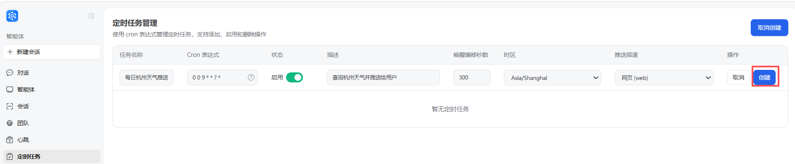
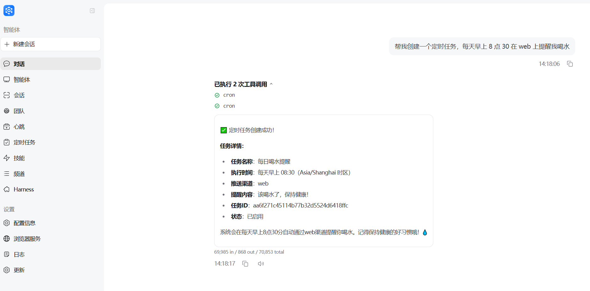

## Scheduled tasks (Cron)

How to create and manage a simple scheduled job in JiuwenSwarm and push results to a channel (e.g. web, Feishu).

---

### 1. What can cron jobs do?

- **Run a one-line instruction on a schedule**, e.g. “send me the weather in Hangzhou every morning at 9.”
- **Let the agent execute work** on a timer, such as running searches and generating results.
- **Multi-channel delivery** — scheduled tasks are currently supported on web, Feishu, WeCom, DingTalk, and WeChat. Non-web channels must be enabled in channel management; see [Channels](Channels.md).

---

### 2. Create a job in the web UI

1. Open **Cron / Scheduled tasks**.
2. Click **New job** and fill in:

   - **Task name**: e.g. `Daily Hangzhou weather update`
   - **Cron expression** (supports seven-field cron expressions):
     - Every day at 09:00: `0 0 9 * * ? *`
     - Minute 15 every hour: `0 15 * * * ? *`
   - **Status (enabled)**: on means enabled
   - **Description (task content)**: a natural-language description of what the agent should do at the scheduled time, e.g.
     `Check the weather in Hangzhou and send it to the user`
   - **Wake offset in seconds** (how long before the scheduled delivery time the task starts): `300` (default)
   - **Timezone**: usually `Asia/Shanghai`
   - **Delivery channel**: select from the dropdown:
     - `Web (web)`: deliver to the web panel

3. Save. Jobs are stored in `~/.jiuwenswarm/agent/home/cron_jobs.json` and picked up by the scheduler.

---

### 3. Common cron expressions

- **Daily 09:00**: `0 0 9 * * ? *`
- **Daily 18:30**: `0 30 18 * * ? *`
- **Monday 09:00**: `0 30 9 ? * MON *`
- **Every hour on the hour**: `0 0 * * * ? *`

Format (7 fields, space-separated):
`second minute hour day month weekday year`
---

### 4. Create via chat (optional)

If the agent has `cron_create_job`, you can say things like:

> “Create a scheduled task to remind me to drink water on the web every morning at 8:30.”

The agent fills `cron_expr`, `description`, `targets`, etc., equivalent to using the form.

---

### 5. Push to the TUI channel

When `targets` is `tui` (also the default for `/cron add`):

- The scheduler **intentionally omits** `session_id`, so results are not filtered out after a TUI restart or session switch.
- The Gateway **broadcasts** these session-less notifications to **every connected TUI window**, so each open terminal receives the cron result.
- To scope reminders differently, use `targets=web`, or manage jobs via `/cron` in TUI and view them in the Web panel.

Session-scoped chat streams are routed to a single TUI window by `session_id`; cron push to TUI is the exception and reaches all windows.
