# Skills

---

## Concepts

### What is a skill?

**Definition:**

A Skill is a module that extends JiuwenSwarm with specific capabilities. You can think of it as an **installable, manageable, reusable capability package**.

Like apps on a phone extend device capabilities, skills extend the agent’s capability boundaries.
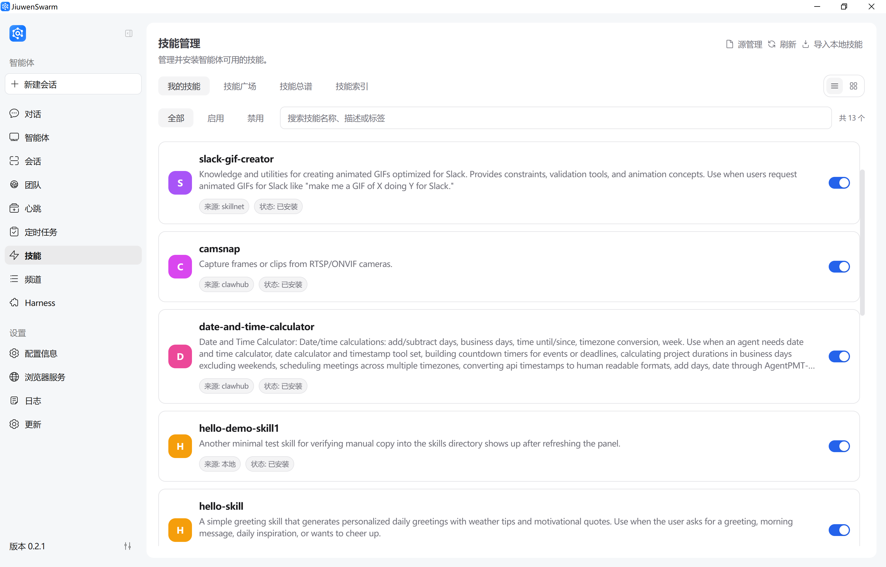

### Skill directory and `SKILL.md` (typical layout)

Each skill is usually a folder that contains at least **`SKILL.md`** (definition: purpose, steps, constraints); optionally `references/` (reference docs), `scripts/` (helpers), and more. This section stays conceptual—see [How to customize skills](#how-to-customize-skills) for folder layout and **YAML frontmatter** details.

**Why skills are needed:**

| Scenario | Without skills | With skills |
|------|-----------|----------|
| Create a GitCode PR | You manually call multiple APIs, manage branches, and write commit messages | One sentence like “open a PR” can trigger a full automated flow |
| Build a PPT | You manually guide content, structure, and export step-by-step | After loading a PPT skill, generate a full deck directly |
| Handle PR review comments | You manually read comments, edit code, and reply one by one | The skill can fetch comments, patch changes, and reply on the platform |


**How skills relate to agent and chat:**

```text
┌───────────────────────────────────────────────────────┐
│                     Agent                              │
│                                                       │
│   Base capabilities: chat, file ops, web search, code │
│                                                       │
│   ┌───────────────────────────────────────────────┐   │
│   │               Skills layer                     │   │
│   │                                               │   │
│   │   ┌───────────┐ ┌───────────┐ ┌─────────────┐ │   │
│   │   │ gitcode-pr│ │pptx-craft ││gitcode-pr-fix│ │   │
│   │   │  Git ops  │ │ PPT build │ │PR review fix│ │   │
│   │   └───────────┘ └───────────┘ └─────────────┘ │   │
│   │                                               │   │
│   │   Installable / removable / extendable         │   │
│   └───────────────────────────────────────────────┘   │
│                                                       │
└───────────────────────────────────────────────────────┘

User request → agent identifies need → load matched skill → execute workflow → return result
```

**Skill sources:**

JiuwenSwarm supports multiple sources:

| Source | Description | Characteristics |
|------|------|------|
| **Built-in skills** | Core skills shipped with the product; you still install them from the Skills UI | Matches the product release |
| **SkillNet** | A general AI skill management and connection platform | Anonymous usage allowed; configuring a GitHub token improves API quota and stability |
| **ClawHub** | Skill “app store” in the OpenClaw ecosystem | Search and install in the web UI; https://clawhub.ai/skills |
| **Marketplace** | Third-party marketplace sources | Add the source URL first; community-contributed |
| **Local import** | User-authored skill files | Fully customizable; ideal for development/debug |

> **Security notice:** Skills may involve file modification, command execution, or external service calls. Always check source and description first; prefer trusted sources.

---

## Operation Guide

### Skill installation

Whether skills come from built-in packages, SkillNet, ClawHub, third-party marketplace sources, or a local folder, **installation and activation are done in the web UI under Skills**. The sections below list prerequisites and paths by source.

#### Built-in skills

Built-in skills are skill resources packaged with JiuwenSwarm.

1. **Install**

   Left sidebar → **Skills** → **Install**.  
   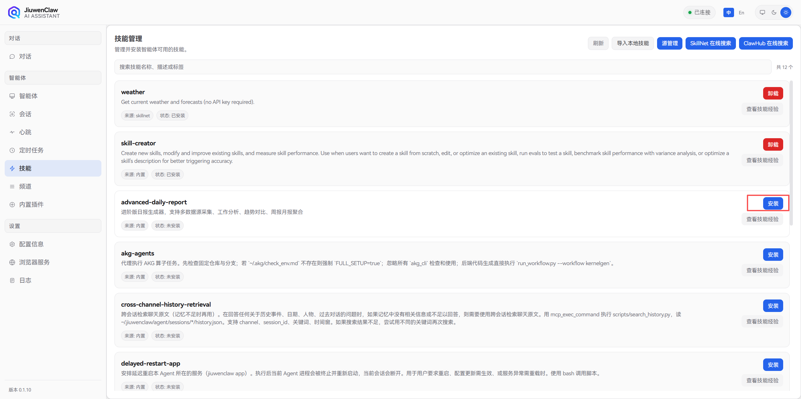

#### Install from SkillNet

SkillNet is based on GitHub-hosted skill repositories.

**Prerequisites:**
- GitHub token is recommended to improve API quota and stability.
- Token path: GitHub → Settings → Developer settings → Personal access tokens → Generate new token.

**Steps:**

1. **(Optional) Configure GitHub token**

   Open left sidebar → **Skills** → **SkillNet online search**, then enter your GitHub token on the page (optional; improves GitHub API quota and stability).
   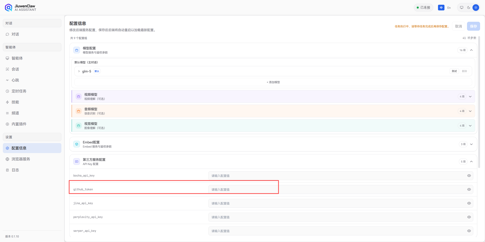

   Or in `config.yaml`:

   ```yaml
   skill_toolkit:
     github_token: ${GITHUB_TOKEN}
   ```

2. **Install**

   Install from the web UI:  
   Left sidebar → **Skills** → **SkillNet online search** → enter a keyword → **Install**.
   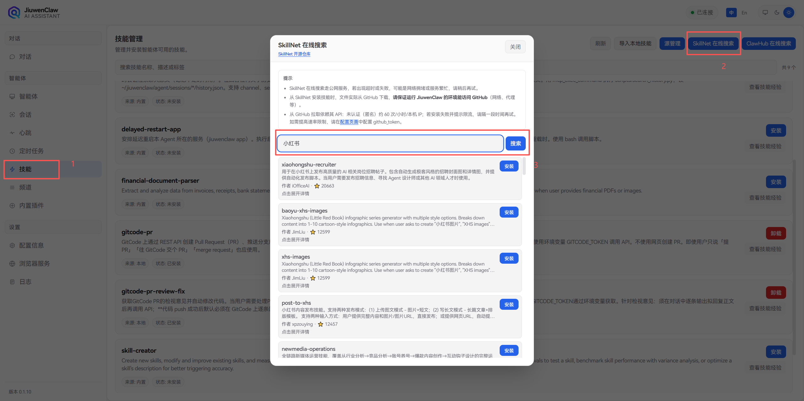

3. **Confirm success**

   After installation, confirm the new skill appears in the skill list under left sidebar → **Skills**.

#### Install from ClawHub

ClawHub URL: https://clawhub.ai/skills

**Prerequisites:**
- First-time use requires ClawHub token configuration.
- Create the token from your account settings on ClawHub.

**Steps:**

1. **Get ClawHub token**

   Visit https://clawhub.ai/skills, sign in, open **Settings** in the top-right corner, and create a token.

2. **Configure token in the web UI and complete installation**

   Left sidebar → **Skills** → **ClawHub online search**.  
   On first visit, complete token configuration on this page:
   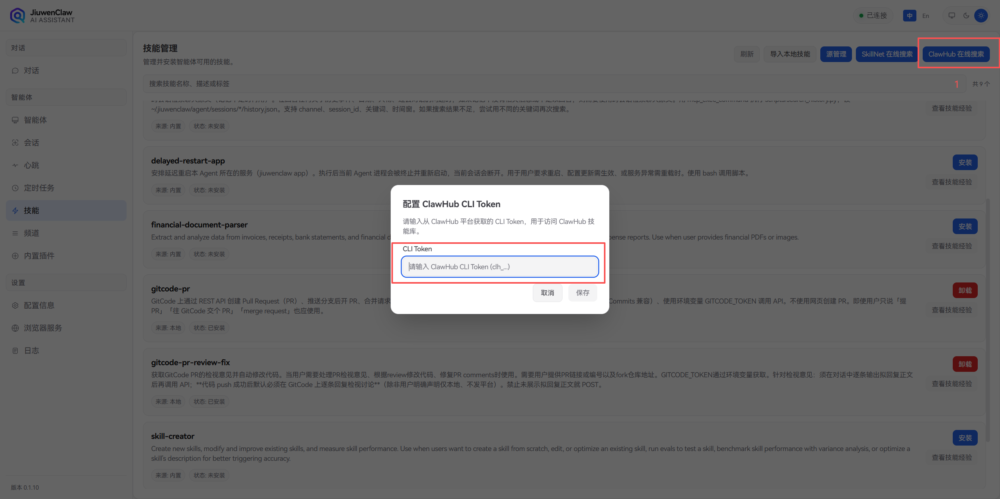

   Search for the target skill, then click **Install**:  
   Same page: **ClawHub online search** → search → **Install**.
   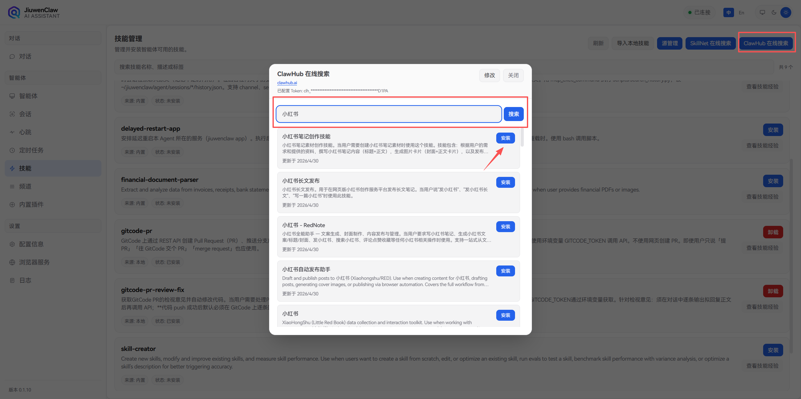

#### Install from Marketplace / third-party sources

Marketplace is not a single official store; it is a collection of community sources.

**Key concepts:**
- **Source**: a skill repository URL (e.g., GitHub repo or private server).
- Users obtain the source URL first, then add it in the Skills panel.

**Steps:**

1. **Get source URL**

   From community, docs, or shared links, e.g.:

   ```text
   https://github.com/xxx/skill-marketplace
   ```

2. **Add marketplace source**

   Left sidebar → **Skills** → **Source management** → **Add source**, enter the source URL (e.g. `https://github.com/xxx/skill-marketplace`), then save.  
   For step-by-step instructions, see **Add source** under [Skill source management](#skill-source-management) below.
   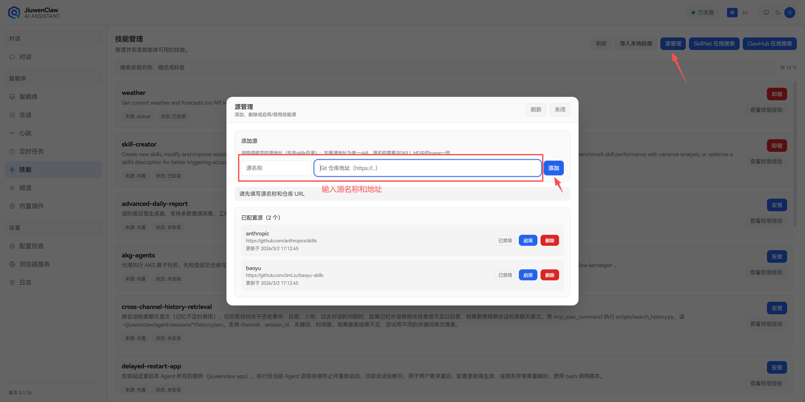

3. **Install from source**

   On the same **Skills** page, search for the target skill and click **Install** in the results; when done, confirm the skill appears in the skill list.

#### Import local skills

Best for:
- self-developed skills under debugging
- skill bundles shared by others
- customizations of existing skills

**Steps:**

1. **Prepare skill files**

   Make sure folder includes `SKILL.md`:

   ```text
   my-skill/
   ├── SKILL.md          # required
   ├── references/       # optional
   └── scripts/          # optional
   ```

2. **Local import (web UI)**

   Left sidebar → **Skills** → **Local import** → select the local skill folder.
   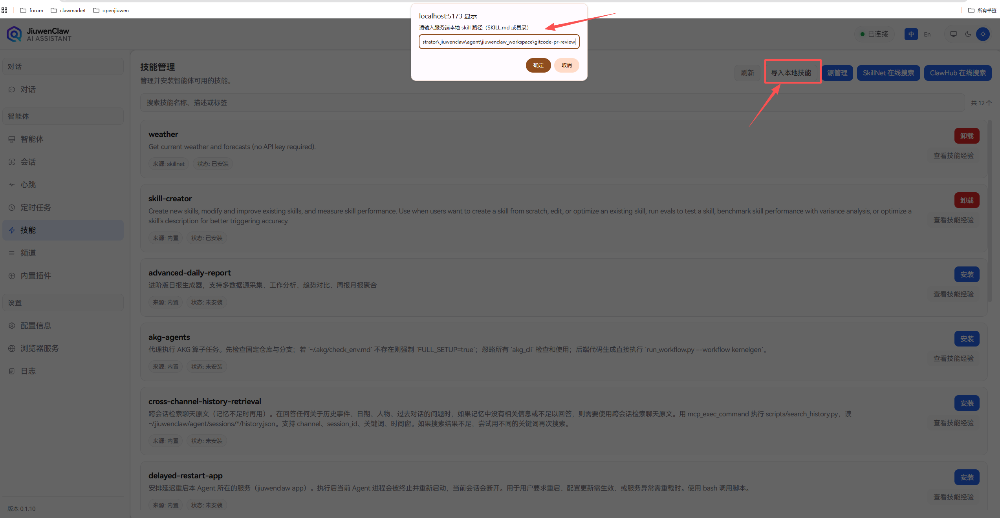

3. **Manual copy (optional)**

   Copy skill folder into:

   ```text
   C:\Users\<username>\.jiuwenswarm\service_default\agent_default\jiuwenswarm_workspace\skills\
   ```

4. **Verify**

   After installation, confirm the new skill appears in the skill list under left sidebar → **Skills**.

---

### Skill management page

The Skills management page is the main place to manage and browse all skills. Open it from **Skills** in the left sidebar.

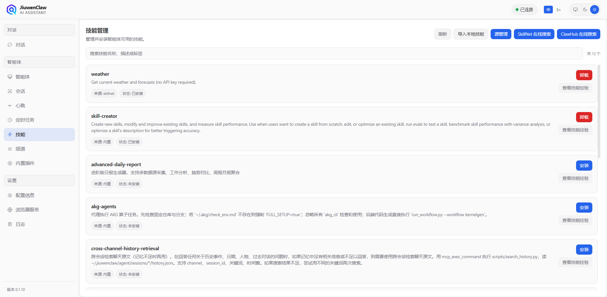

#### What the page shows

In the skill list, each entry shows:

| Field | Description |
|--------|-------------|
| **Skill name** | Unique id, e.g. `gitcode-pr`, `weather` |
| **Open source** | Whether the skill is open source, for transparency of origin |
| **Purpose** | Short description of what the skill does |
| **Status** | Current state, e.g. installed / not installed / enabled / disabled |

#### View skill experience

In the list, use **View skill experience** to browse evolution entries for that skill, one record at a time.

**Each entry typically includes:**
- **Source**: where the entry came from (e.g. detected signal, chat, or execution context)
- **Time**: when the record was created or written
- **Context**: session/task background that triggered the entry
- **Experience content**: the concrete change text, corresponding to fields such as `change.content`

> **How to see data:** Turn on self-evolution-related settings in **Configuration** first (for example **evolution auto-scan**, mapped to `evolution_auto_scan` / env `EVOLUTION_AUTO_SCAN`; see [Configuration](Configuration.md) and [Skill self-evolution](SkillSelfEvolution.md)). After that, **use the skill once in chat** (or trigger one evolution-worthy signal). Then open **View skill experience** to see entries as above.

> **Why it helps:** Skill experience reflects self-evolution and improvements from real use, so you can judge ongoing usefulness and maintainers get actionable input.

---

### Skill source management

Source management includes add, enable, disable, and delete.

#### When source management is needed

| Scenario | Need source management? |
|------|----------------|
| Built-in skills only | No |
| SkillNet/ClawHub install | No (preconfigured source path) |
| Third-party community skills | Yes, add source first |
| Enterprise internal skills | Yes, add internal source |
| Source migration/retirement | Yes, remove old source and add new |

> **Tip:** Most users only need SkillNet and ClawHub. Source management is mainly for third-party/internal registries.

#### Source operations

**Add source:**

1. Open **Skills** from left sidebar.  
2. Open **Source Management** (source list).  
3. Click **Add source**.  
4. Enter source URL (e.g. `https://github.com/anthropics/skills`) and optional name.  
5. Click **Confirm/Save**.  

After success, source appears in list. If source is enabled, its skills become searchable.

**Enable source:**

1. In **Skills → Source Management**, locate target source (e.g. `xxx-source`).  
2. Click **Enable** (or switch toggle ON).  
3. Refresh list or run one search for validation.  

After enabling, source skills appear in search results and can be installed directly.

**Disable source:**

1. In **Skills → Source Management**, locate target source.  
2. Click **Disable** (or switch toggle OFF).  

After disabling, source skills are hidden from search, but already installed skills remain usable.

**Delete source:**

1. In **Skills → Source Management**, locate target source.  
2. Click **Delete** and confirm in popup.  

Deleting source removes source config (and related cache) only; it does not uninstall already installed skills.

**Frontend screenshot**


---

### Post-install management

After installing skills, you can inspect, verify, and uninstall.

#### View installed skills

**Method 1: Web UI**

Left sidebar → **Skills** to open the Skills management page and browse installed skills (same layout as the “skill list and search” screenshot above; no duplicate figure here).

**Method 2: Chat**

```text
List my installed skills.
```

The agent lists installed skill names, sources, versions, and related info.

**Method 3: File path**

```text
C:\Users\<username>\.jiuwenswarm\service_default\agent_default\jiuwenswarm_workspace\skills\
```

Each subfolder is one skill.

#### View skill details

There are two common ways: **in chat** or **open the detail page from the Skills UI**.

**Method 1: In chat**

Ask the agent to show a skill’s details, for example:

```text
Show details for gitcode-pr skill.
```

The agent summarizes key fields in the conversation (similar to the screenshot below).
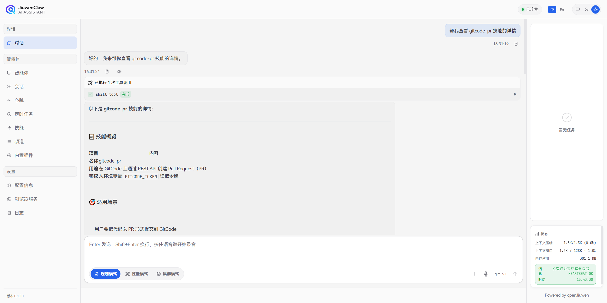

**Method 2: From the web UI**

Path: left sidebar → **Skills** → **click the target skill** in the list to open its detail page.
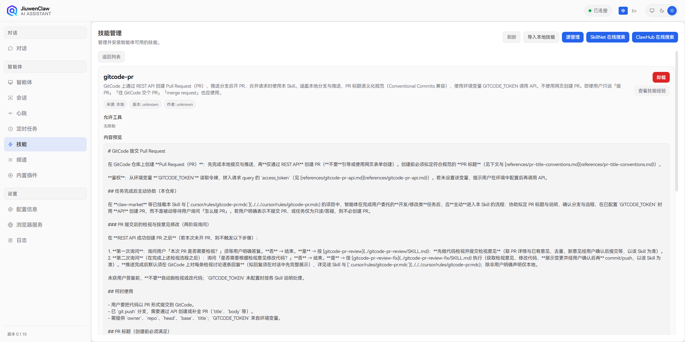

Details include:
- source (SkillNet / ClawHub / Marketplace / local)
- description
- allowed tools
- version
- `SKILL.md` content

#### Uninstall skill

You can uninstall from the Skills management page (screenshot below):

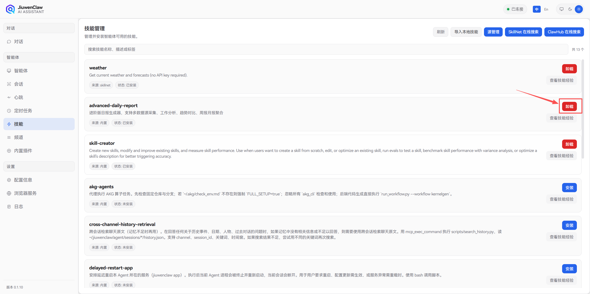

After uninstall:
- Skill files are removed from the `skills` directory
- Chat no longer auto-loads the skill
- Past execution results are unaffected

#### Verify whether a skill is active

**Checks:**
1. Confirm skill appears in installed list.
2. Try prompt likely to trigger it.
3. Check `logs` for load records.

**Common states:**

| State | Meaning | Suggestion |
|------|------|----------|
| Installed and active | Works normally | No action |
| Installed but not loaded | Runtime may need restart | Restart and retry |
| Install failed | Token/network/source issue | Check error and config |
| Outdated version | Features may be limited | Update to latest |

---

## Usage Guide

### How to use skills in chat

Installed skills can be triggered automatically or manually.

#### Auto trigger

Agent detects intent and loads matching skill.

**Example:**

```text
User: Help me open a PR on GitCode.
Agent: [Auto-loads gitcode-pr]
       Sure, I will create the PR...
```

#### Explicit trigger

User names the skill directly.

**Example:**

```text
User: Use pptx-craft to create a product introduction PPT.
Agent: [Loads pptx-craft]
       Sure, I will create the PPT...
```

### How to write prompts that trigger skills more reliably

**Recommended prompts:**

| Recommended prompt | Why |
|-------------|------|
| "Open a GitCode PR for me" | Platform + action clearly stated |
| "Use pptx-craft for a tech sharing PPT" | Skill name + task type |
| "Do deep research on AI industry trends" | Matches deep-research patterns |
| "Handle review comments on PR #123" | PR review task maps to review-fix skill |

**Not recommended:**

| Prompt | Issue |
|---------------|------|
| "Fix that thing for me" | Too vague |
| "Make a doc" | Type not specified |
| "Submit code" | Platform not specified |

### Key fields in skill details

Before using a skill, check:

| Field | Why it matters |
|--------|------------|
| **Source** | Trust evaluation |
| **Description** | Usage fit |
| **Allowed tools** | What operations it can perform |
| **Version** | Whether it is up to date |

**Example query:**

```text
Show gitcode-pr details and SKILL.md content.
```

---

## Practical examples

### Example 1: Weather query (SkillNet)

**Scenario:**  
The user wants a quick weather summary and short-term forecast for a city.

**Skill acquisition (reproducible, from SkillNet):**
1. Open **Skills** in the left sidebar.  
2. Open **SkillNet Online Search** and search for `weather`.  
3. Click install, then confirm `weather` appears in your skill list.  
4. If search rate is limited, configure a GitHub Token on the same page and retry.  

**Prerequisites (for stable reproduction):**
- `weather` skill is installed (using the SkillNet steps above)
- Network can reach public weather services (such as wttr.in / Open-Meteo)

**User input (example):**

```text
Please use the weather skill to check today's weather
and the next three days for Beijing.
```

**Execution flow (expected):**
1. The agent detects and loads `weather`
2. It requests real-time and forecast weather data
3. It summarizes readable output (temperature, condition, wind/precipitation)

**Expected output (example):**

```text
Beijing weather:
- Today: Cloudy, 16~28°C
- Tomorrow: Sunny, 18~30°C
- Day after tomorrow: Light rain, 19~26°C
(includes feels-like temperature and precipitation probability)
```

**Why this case is stably reproducible:**
- Fixed skill source (SkillNet)
- Simple and explicit input template (city + time range)
- No extra business account or complex local setup required

---

### Example 2: PDF processing (SkillNet)

**Scenario:**  
You need to process PDF files quickly (for example merge files, split pages, or extract text) and get directly usable outputs.

**Skill acquisition (reproducible, from SkillNet):**
1. Open **Skills** in the left sidebar.  
2. Search `pdf` in **SkillNet Online Search**.  
3. Click install and confirm it appears in the installed list.  
4. If search is limited, configure GitHub Token first, then install.  

**Prerequisites (for stable reproduction):**
- `pdf` skill is installed (using SkillNet steps above)
- Prepare 2 accessible PDF files (for example `a.pdf` and `b.pdf`)

**User input (example):**

```text
Please use the pdf skill to merge `a.pdf` and `b.pdf` into `merged.pdf`,
and also provide a text summary for the first two pages.
```

**Execution flow (expected):**
1. The agent detects and loads `pdf`
2. It locates input PDF files and performs merge
3. It extracts/summarizes text from specified pages
4. It returns output file path and summary

**Expected output (example):**

```text
Done:
1) Merged file generated: `merged.pdf`
2) Extracted text summary from pages 1-2:
- Page 1: ...
- Page 2: ...
```

---

## Advanced and Troubleshooting

### Common issues and precautions

#### Common issues

**Issue 1: Installation fails**

| Possible cause | Resolution |
|----------|----------|
| Missing/invalid token | Check token env config |
| Network issue | Check connection and retry |
| Invalid source URL | Verify source accessibility |
| Skill not found | Verify skill name |

**Issue 2: Skill not visible after install**

| Possible cause | Resolution |
|----------|----------|
| Service not restarted | Restart JiuwenSwarm |
| Wrong install path | Verify skill file path |
| Missing SKILL.md | Ensure skill folder has SKILL.md |

**Issue 3: Skill visible but not triggered**

| Possible cause | Resolution |
|----------|----------|
| Prompt mismatch | Use clearer prompts |
| Skill not enabled | Check status |
| Tool permission limits | Check permission config |

**Issue 4: Output does not match expectation**

| Possible cause | Resolution |
|----------|----------|
| Skill version outdated | Update skill |
| Input incomplete | Provide required parameters |
| Skill config mismatch | Read `SKILL.md` usage details |

**Issue 5: Token / permission / source trust**

| Issue type | Resolution |
|----------|----------|
| Invalid GitHub token | Regenerate token with proper permissions |
| Expired ClawHub token | Refresh token from platform |
| Untrusted source | Inspect source and details before use |

#### Precautions

1. **Prefer trusted sources**
   - SkillNet and built-in catalogs are relatively centralized—still read descriptions before installing
   - For ClawHub/Marketplace, verify author and source trust

2. **Read documentation first**
   - Check `SKILL.md` before running a skill
   - Confirm scenario fit

3. **Token handling for external services**
   - GitCode-related skills require `GITCODE_TOKEN`
   - Other skills may require platform-specific tokens

4. **Check operation scope for file/command skills**
   - Review allowed tools
   - Confirm no sensitive files are unintentionally affected

---

### How to customize skills

As an advanced topic, you can create or modify skills.

#### Build a new skill

**Basic folder layout:**

```text
my-custom-skill/
├── SKILL.md              # Skill definition (required)
├── references/           # Reference docs (optional)
│   └── api-reference.md
└── scripts/              # Helper scripts (optional)
    └── helper.py
```

**Core `SKILL.md` content:**

You can let JiuwenSwarm help you generate it. **`YAML frontmatter` between the first `---` and second `---` declares metadata**; Markdown after the second `---` is the **skill body**—the instructions the Agent follows. Example:

```markdown
---
name: my-custom-skill
version: 1.0.0
author: your-name
description: Demo skill that shows how to write a custom Agent skill
tags: [demo, tools]
allowed_tools: [webSearch, readFile]
---

# My custom skill

When this skill is selected, follow the instructions below.

## When to use
- …

## Steps
1. …
2. …
```

**Frontmatter field reference**

| Field | Required? | Description |
|-------|-------------|-------------|
| `name` | Strongly recommended | Unique skill id; prefer `kebab-case`; if omitted, some setups infer from folder name |
| `description` | Strongly recommended | One-line purpose; pipeline validation usually requires it; avoid `<` and `>` |
| `version` / `author` | Optional | Version and author |
| `tags` | Optional | YAML list or comma-separated string |
| `allowed_tools` | Optional | Related tool names (comma-separated string also allowed); **actual invocation depends on agent tool config and permissions** |

**Screenshots:** Loading a custom skill folder into the product matches the **Local import** screenshot under [Import local skills](#import-local-skills); generic install UI matches [Built-in skills](#built-in-skills).

#### Modify an existing skill

1. **Modify an existing skill through JiuwenSwarm**

   Talk to JiuwenSwarm directly, for example: "Help me optimize the xxx skill and add xxx capability."

### Example: Optimize the weather skill by adding UV index display

### Before optimization
The output only includes basic items such as temperature, wind speed, precipitation probability, and clothing advice.
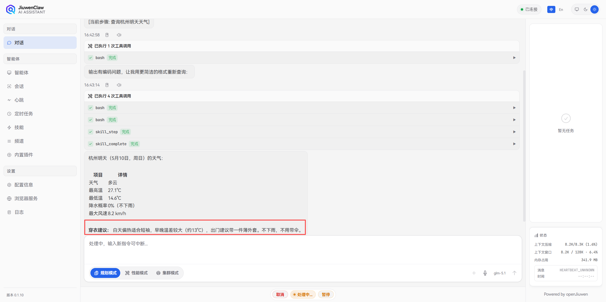

### Through chat with JiuwenSwarm: "Optimize the weather skill and add UV intensity display", the skill is updated
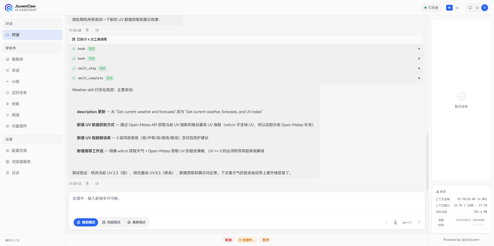

### After optimization
When you call it again, the output includes not only temperature and wind speed, but also UV intensity.
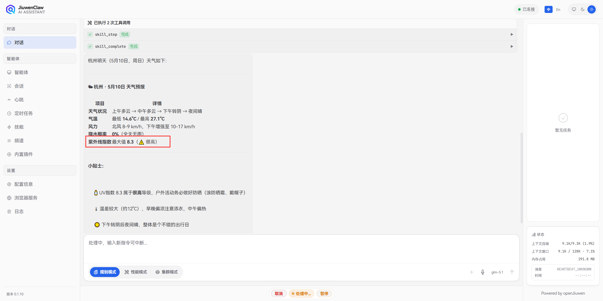


---

*Document version: v1.0*  
*Audience: JiuwenSwarm users*  
*Last updated: 2026-05-11*  
*Simplified Chinese: [技能](../zh/技能.md)*
