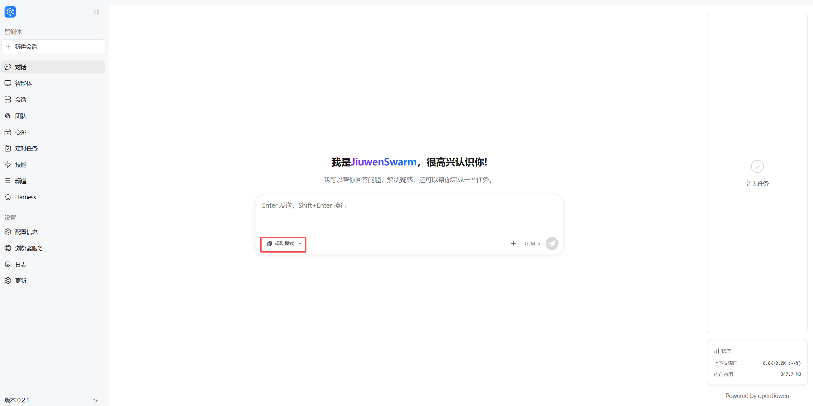

# Task planning

For long, shifting tasks, users need to **interrupt**, **insert new work**, and **merge outcomes** (e.g. finish December invoices, then add January and email a combined summary) without losing thread. JiuwenSwarm’s **task planning** mode uses structured todo tools so the agent can break work down and adapt when requirements change.

[Demo video](../assets/videos/todo.mp4)

## Core idea: dynamic breakdown and live updates

Complex requests are split into subtasks and tracked with built-in todo tools. After each subtask, state updates so progress stays visible. **openJiuwen** interrupt/resume and scheduling help insert urgent items or new goals without breaking the overall flow.

## Todo toolkit (`TodoToolkit`)

Tasks are stored as Markdown in `workspace/session/{session_id}/todo.md`, isolated per session with safe concurrent access.

### Tools

| Tool | Description |
| :--- | :--- |
| `todo_create` | Create the initial list. **Fails** if a list already exists — use `todo_insert` instead. |
| `todo_insert` | Insert at an index; shifts later tasks. Creates the list if missing. |
| `todo_complete` | Mark done; optional `result` text. |
| `todo_remove` | Remove a task; renumbers remaining items. |
| `todo_list` | List all tasks and states. |

### States

| State | Meaning |
| :--- | :--- |
| `waiting` | Not started |
| `running` | In progress |
| `completed` | Done |
| `cancelled` | Cancelled |

### Typical flow

1. User asks for something complex → `todo_create` breaks it into steps.
2. User adds work mid-flight → `todo_insert`.
3. Subtask done → `todo_complete` with result.
4. Drop a task → `todo_remove`.
5. Check status anytime → `todo_list`.

This reduces **lost goals** and **broken execution** on long jobs.

You can toggle task planning in the chat UI; when enabled it defaults to planning mode, otherwise classic ReAct.

