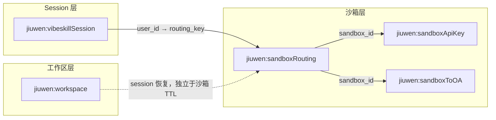

# DCS 项速查表

本文汇总 JiuwenClaw 在华为 DCS（Redis Cluster 兼容）上使用的全部业务 Key、读写方、TTL 规则，以及 **Gateway 侧** 对各 Key 的操作关系。实现入口：`jiuwenclaw/dcs`（连接与 `EXPIRE`）、各 `*_dcs_store.py`（Key 与序列化）、`SandboxRouterAgentClient` / `VibeSkillSessionStore`（编排）。

## 连接配置

所有 DCS Store 共用同一套环境变量（`jiuwenclaw/dcs/config.py`）：

| 环境变量 | 默认 | 说明 |
|----------|------|------|
| `SANDBOX_DCS_HOST` | 无 | **必填**（Sandbox 路由 / Session 持久化 / Workspace 快照）；未设则 VibeSkill Session 退化为纯内存 |
| `SANDBOX_DCS_PORT` | `2881` | DCS 端口 |
| `SANDBOX_DCS_PASSWORD` | 无 | 可选密码 |

> 文档或运维口语中的 `VIBESKILL_DCS_HOST` 与 `SANDBOX_DCS_HOST` 指同一集群；代码中仅读取 `SANDBOX_DCS_*`。

## 总览

| Key | 值 | 主要写入方 | Gateway 读 | Gateway 写 | 默认 TTL | 沙箱续期时刷新 TTL |
|-----|----|-----------|-----------|-----------|----------|-------------------|
| `jiuwen:vibeskillSession:{session_id}` | Session JSON | Gateway（`VibeSkillSessionStore`） | ✓ | ✓ 创建/更新/删除 | `SESSION_DCS_TTL_SECONDS`（`0`） | ✗ |
| `jiuwen:sandboxApiKey:{sandbox_id}` | API Key SHA256  hex | Gateway（`SandboxRouter` 注册） | ✓（`get_sandbox`，预留） | ✓ 创建 / 删除 / 续 TTL | `SANDBOX_DURATION_SECONDS`（3600） | ✓ |
| `jiuwen:sandboxToOA:{sandbox_id}` | `{ip}:{port}` | **沙箱平台 / 沙箱内 OpenAbility**（本仓库外） | ✓ 建链轮询 | ✓ 删除 / 续 TTL | 同上 | ✓ |
| `jiuwen:sandboxRouting:{routing_key}` | routing JSON | Gateway（`SandboxRouter`，需 `SANDBOX_ADOPT_EXISTING`） | ✓ adopt | ✓ NX 创建 / 删除 / 续 TTL + 更新 `updated_at` | 同上 | ✓（`adopt` 开启时） |
| `jiuwen:workspace:{session_id}` | workspace JSON | Gateway（`SandboxRouter` 销毁前备份） | ✓ 恢复 | ✓ 备份写入 | `SESSION_DCS_TTL_SECONDS`（`0`） | ✗（生命周期独立于沙箱） |
| `jiuwen:sandboxLog:{sandbox_id}` | sandbox log JSON | Gateway（`SandboxRouter` 销毁前备份） | ✓ | ✓ 备份写入 | `SESSION_DCS_TTL_SECONDS`（`0`） | ✗ |

`routing_key` 规则：`vibeskill:user:{user_id}`（优先）或 `vibeskill:session:{session_id}`。

## TTL 环境变量

| 环境变量 | 影响的 Key | 默认 / 回退 |
|----------|-----------|-------------|
| `SESSION_DCS_TTL_SECONDS` | `vibeskillSession`、`workspace` | `0`（不过期） |
| `SANDBOX_DCS_TTL_SECONDS` | `sandboxApiKey`、`sandboxToOA`、`sandboxRouting` | 未设时见下行；`0` = 不过期 |

## Gateway 读写明细

### `jiuwen:vibeskillSession:{session_id}`

| 字段 | 说明 |
|------|------|
| 值 | JSON：`session_id`、`state`、`mode`、`metadata`、`created_at`、`updated_at` |
| Store | `VibeSkillSessionDcsStore`（`channel/vibeskill_session_dcs_store.py`） |
| Gateway 组件 | `VibeSkillChannel` → `VibeSkillSessionStore` |

| 操作 | 触发场景 |
|------|----------|
| **读** | `get_session` / `resolve_session` 内存 miss → `load_session` 回填 |
| **写** | `get_or_create`、`set_state`、`set_metadata` → `save_session`（先 DCS 后内存，fail-fast） |
| **删** | `delete_session` |

与沙箱路由、工作区快照**正交**；跨 Gateway 共享 session 元数据（含 `metadata.user_id`），用于计算 `routing_key`。

---

### `jiuwen:sandboxApiKey:{sandbox_id}`

| 字段 | 说明 |
|------|------|
| 值 | Claw API Key 的 SHA256（明文不落库） |
| Store | `SandboxDcsStore`（`sandbox/sandbox_dcs_store.py`） |
| Gateway 组件 | `SandboxRouterAgentClient` |

| 操作 | 触发场景 |
|------|----------|
| **写** | `create_sandbox` 成功后 `_register_sandbox_record` → `save_sandbox` |
| **读** | `get_sandbox`（当前 Router 主路径未调用；供扩展/运维） |
| **删** | `_terminate_runtime` 且远端 `delete_sandbox` **成功**后 → `delete_sandbox` |
| **续 TTL** | 远端 `refresh_duration` **成功**后 → `refresh_sandbox_ttl`（`EXPIRE`） |

沙箱内 Agent 通过 `init_data.json` 获取明文 API Key；DCS 哈希供沙箱平台侧校验（若启用）。

---

### `jiuwen:sandboxToOA:{sandbox_id}`

| 字段 | 说明 |
|------|------|
| 值 | OpenAbility 地址，形如 `192.168.1.10:9001` |
| Store | `SandboxDcsStore`（同上） |
| Gateway 组件 | `SandboxRouterAgentClient` |

| 操作 | 触发场景 |
|------|----------|
| **写** | **非 Gateway**；沙箱启动后由沙箱平台 / 沙箱内 OpenAbility 写入 |
| **读** | `_connect_open_ability_client` 在 reconnect 窗口内轮询（默认 600s）；adopt 时校验 OA 是否仍可达 |
| **删** | 同 `sandboxApiKey`（terminate 且远端删除成功） |
| **续 TTL** | 同 `sandboxApiKey`（`refresh_sandbox_ttl`） |

adopt 时若 routing 存在但本 Key 缺失，Gateway 视为 stale mapping 并删除 routing。

---

### `jiuwen:sandboxRouting:{routing_key}`

| 字段 | 说明 |
|------|------|
| 值 | JSON：`sandbox_id`、`gateway_id`、`updated_at` |
| Store | `SandboxRoutingDcsStore`（`sandbox/sandbox_routing_dcs_store.py`） |
| Gateway 组件 | `SandboxRouterAgentClient` |
| 前置条件 | `SANDBOX_ENABLE=true` 且 `SANDBOX_ADOPT_EXISTING=true`（默认 `true`） |

| 操作 | 触发场景 |
|------|----------|
| **写（NX）** | 本机 `create_sandbox` 成功后 `set_routing_nx` 抢占 mapping |
| **写（覆盖）** | 远端续期成功后 `refresh_routing_ttl` → `save_routing`（刷新 TTL + `updated_at` + `gateway_id`） |
| **读** | 本地 runtime miss → `_try_adopt_runtime_from_dcs` → `get_routing` |
| **删** | ① OA 不可达（stale）；② terminate 且远端删除成功；③ create 失败清理 |

`updated_at` 用于 adopt 时估算远端沙箱剩余存活：`expires_at = updated_at + SANDBOX_DURATION_SECONDS`。

---

### `jiuwen:workspace:{session_id}`

| 字段 | 说明 |
|------|------|
| 值 | JSON：`url`、`name`、`uploaded_at`、`routing_key`、`sandbox_id` |
| Store | `WorkspaceDcsStore`（`sandbox/workspace_dcs_store.py`） |
| Gateway 组件 | `SandboxRouterAgentClient` |

| 操作 | 触发场景 |
|------|----------|
| **写** | `_terminate_runtime` 前 `_backup_workspaces_before_terminate` → `put_workspace`（OBS URL） |
| **读** | 业务请求前 `_ensure_workspace_restored` → `get_workspace` → 内部 `batch_download` |
| **删** | Store 提供 `delete_workspace`；**当前 Router 未调用**（靠 TTL 自然过期） |
| **续 TTL** | **不随沙箱续期**；工作区快照生命周期与 session 绑定，独立于 sandbox runtime |

---

### `jiuwen:sandboxLog:{sandbox_id}`

| 字段 | 说明 |
|------|------|
| 值 | JSON：`url`、`name`、`uploaded_at`、`sandbox_id` |
| Store | `SandboxLogDcsStore`（`sandbox/sandbox_log_dcs_store.py`） |
| Gateway 组件 | `SandboxRouterAgentClient` |

| 操作 | 触发场景 |
|------|----------|
| **写** | `_backup_workspaces` 收到 `batch_upload` 的 `log_result`（`status=success`）→ 删旧 OBS 日志 → `put_sandbox_log` |
| **读** | 覆盖写入前 `get_sandbox_log` 取旧 URL |
| **删** | Store 提供 `delete_sandbox_log`；**当前 Router 未调用** |
| **续 TTL** | **不随沙箱续期**；TTL 固定为 `SESSION_DCS_TTL_SECONDS`（默认 `0`） |

## Gateway 组件 → Store 映射

```text
VibeSkillChannel
  └─ VibeSkillSessionStore
       └─ VibeSkillSessionDcsStore     → jiuwen:vibeskillSession:*

SandboxRouterAgentClient  (SANDBOX_ENABLE=true)
  ├─ SandboxDcsStore                    → jiuwen:sandboxApiKey:* , jiuwen:sandboxToOA:*
  ├─ SandboxRoutingDcsStore             → jiuwen:sandboxRouting:*
  ├─ WorkspaceDcsStore                  → jiuwen:workspace:*
  └─ SandboxLogDcsStore                 → jiuwen:sandboxLog:*
```

## 沙箱续期与 DCS TTL

Gateway 在本地估算 `expires_at`，当剩余时间 **<** `SANDBOX_IDLE_TIMEOUT_SECONDS` 时调用远端 `refresh_duration`。续期**成功**后：

1. 更新本地 `runtime.expires_at`
2. `refresh_sandbox_ttl`：`sandboxApiKey` + `sandboxToOA` 的 `EXPIRE`
3. 若 `SANDBOX_ADOPT_EXISTING=true`：`refresh_routing_ttl` 重写 routing 并续 TTL

触发点：**DCS adopt 完成后**、**空闲巡检**（约每 30s；与 idle 回收同循环，但不要求 `task_count == 0`）。续期 / DCS TTL 刷新失败均只记日志，不阻断业务。

实现：`SandboxRouterAgentClient._maybe_refresh_sandbox_duration`、`_refresh_sandbox_dcs_ttl`（`gateway/sandbox_router.py`）。

## 典型生命周期（Gateway 视角）



**创建沙箱**：写 `sandboxApiKey` →（外部写 `sandboxToOA`）→ Gateway 轮询 OA → `SET NX` 写 routing。

**跨 Gateway adopt**：读 session 得 `user_id` → 读 routing → 读 `sandboxToOA` → 重连 OA（不 `create_sandbox`）。

**销毁沙箱**：备份写 `workspace` → 删远端沙箱 → 删 `sandboxApiKey` + `sandboxToOA` + routing。

**长会话续期**：远端 `refresh_duration` → 续 `sandboxApiKey` / `sandboxToOA` / routing TTL（**不含** `workspace`）。

## 关联文档

- [Sandbox 实现进展](./Sandbox实现进展.md) — 路由、续期、failover 细节
- [VibeSkill Channel 架构与接口](../zh/VibeSkillChannel架构与接口.md) — Session DCS、工作区备份恢复
- [SandboxClient 接口](./SandboxClient接口.md) — `create_sandbox` / `refresh_duration` / `delete_sandbox`
