# 需求设计：ClawGateway支持Agent Runtime Sandbox生命周期管理

> **文档状态说明**
>
> 本文档描述的是**目标架构**设计，而非当前已实现的代码状态。当前代码与文档设计存在以下主要差距：
> - Router 和 SandboxClient 模块尚未实现
> - MessageHandler 当前仍使用单一 AgentClient 实例（单例模式）
> - AgentClient池管理和上限控制机制尚未实现
> - 当前北向入口为 VibeSkillChannel，其他 Channel 类型已移除
>
> 本文档作为未来实施的规划参考，需在开发过程中逐步落地。

## 一、需求概述

| 项目       | 说明                                              |
| -------- | ----------------------------------------------- |
| **需求名称** | ClawGateway支持Agent Runtime Sandbox生命周期管理        |
| **背景**   | 保证Agent运行环境的隔离，每次Agent请求有独立的Runtime Sandbox运行环境 |

### 1.1 核心功能

| 功能点               | 说明                                                                 |
| ----------------- | ------------------------------------------------------------------ |
| Sandbox Manager模块 | 新增模块，按用户隔离Runtime Sandbox，每个Sandbox对应独立的WebSocketAgentServerClient |
| Router模块          | 新增模块，负责Session映射、请求路由、AgentClient池管理                               |
| Sandbox实例上限控制     | 支持配置Sandbox实例数量上限，默认最多4个，防止资源耗尽                                    |

### 1.2 用户隔离规则

| 规则               | 说明                                         |
| ---------------- | ------------------------------------------ |
| 同用户同Sandbox      | 同一个用户的任务，在同一个Runtime Sandbox中执行            |
| 不同用户不同Sandbox    | 不同用户的任务，在不同Runtime Sandbox中执行              |
| Sandbox-Client绑定 | 每个Sandbox对应一个独立的WebSocketAgentServerClient |

***

## 二、现状分析

### 2.1 当前架构

#### 2.1.1 当前组件关系图

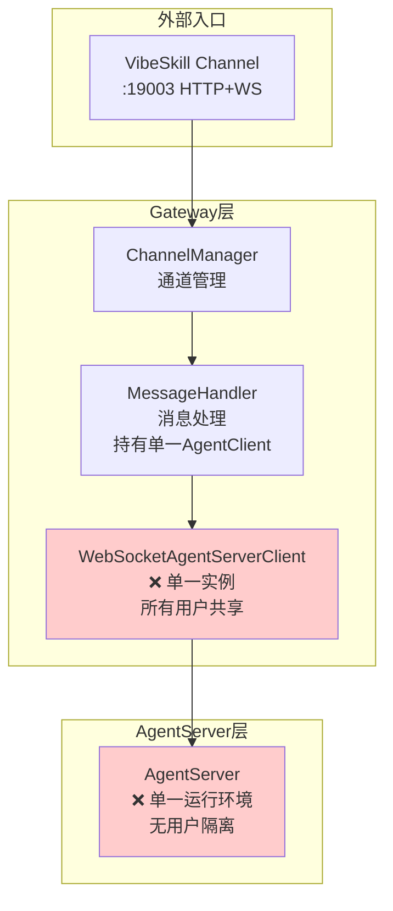

#### 2.1.2 当前架构问题图

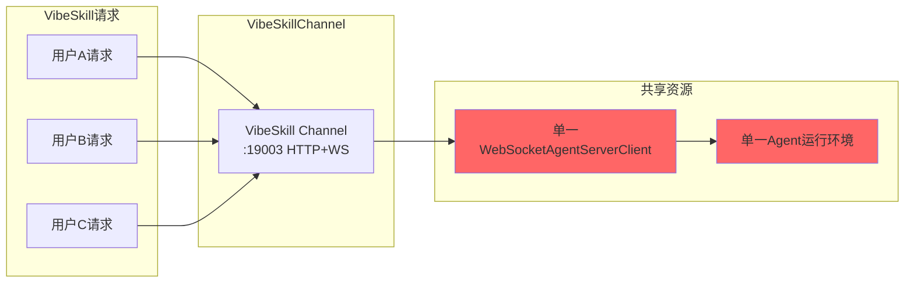

#### 2.1.3 问题说明

| 组件                         | 状况                                | 问题                      |
| -------------------------- | --------------------------------- | ----------------------- |
| WebSocketAgentServerClient | Gateway启动时创建**单一实例**连接AgentServer | 所有用户请求共享同一Agent运行环境，无隔离 |
| MessageHandler             | 持有单一AgentClient引用                 | 无法区分不同用户的执行环境           |

### 2.2 当前消息流转路径

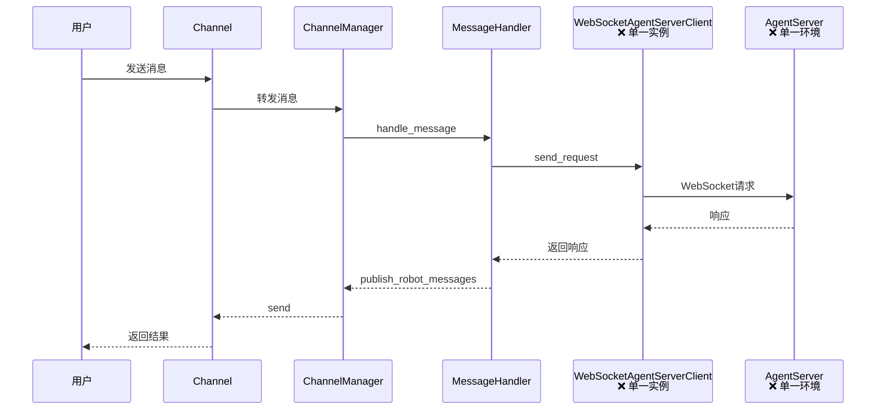

**关键问题标注**：

- WebSocketAgentServerClient：单一实例，所有用户共享
- AgentServer：单一运行环境，无用户隔离

***

## 三、设计方案

### 3.0 目标架构（三层架构）

#### 3.0.1 目标组件关系图

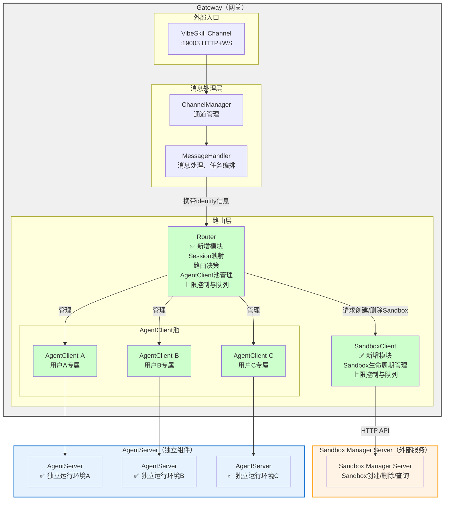

#### 3.0.2 三层架构职责划分

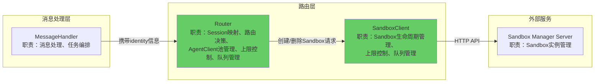

#### 3.0.3 目标架构：用户隔离效果图

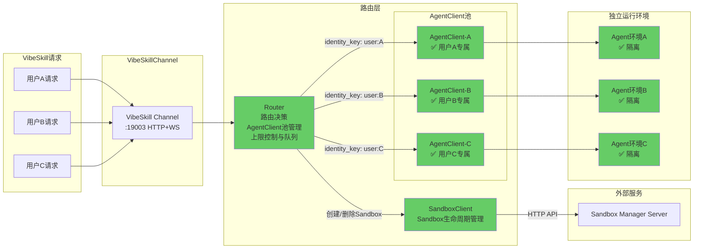

#### 3.0.4 核心交互流程

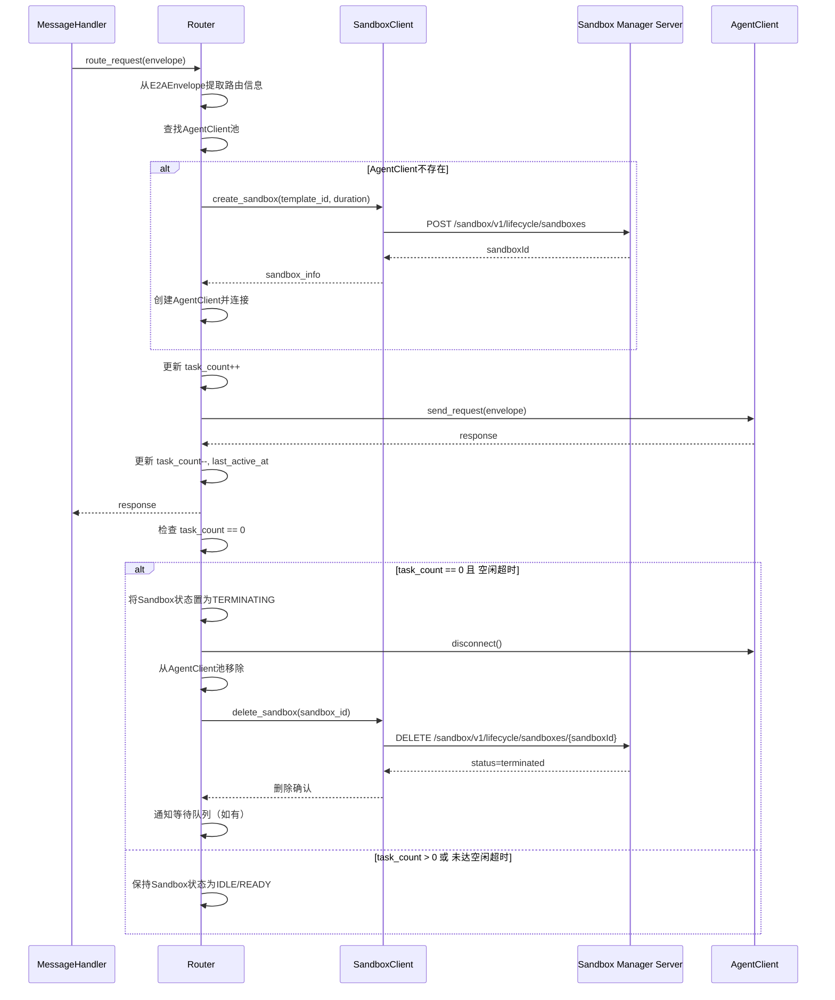

**核心流程说明**：

| 阶段 | 步骤 | 说明 |
|------|------|------|
| **请求路由** | 1-3 | 提取路由信息、查找AgentClient池 |
| **Sandbox创建** | 4-8 | 若AgentClient不存在，创建新Sandbox并连接 |
| **任务执行** | 9-12 | 更新任务计数、发送请求、返回响应 |
| **销毁检查** | 13-22 | 检查Sandbox是否可销毁（task_count==0 且空闲超时） |
| **销毁执行** | 14-21 | 断开连接、移除池、调用删除API、通知队列 |
| **保持活跃** | 22 | 若仍有任务或未达空闲超时，保持Sandbox |

**销毁触发条件**：

| 条件 | 说明 |
|------|------|
| `task_count == 0` | 当前Sandbox无正在执行的任务 |
| `空闲超时` | 超过配置的空闲时间阈值（如 `idle_timeout_seconds`） |
| **两者同时满足** | 才会触发Sandbox销毁 |

**空闲超时配置**：

```yaml
gateway:
  routing:
    idle_timeout_seconds: 600  # 空闲10分钟后销毁
    idle_check_interval_seconds: 30  # 每30秒检查一次
```

#### 3.0.5 目标架构核心改进

| 改进点           | 状况                                | 目标                                                             |
| ------------- | --------------------------------- | -------------------------------------------------------------- |
| 架构层次          | 两层（MessageHandler直接持有AgentClient） | 两层（MessageHandler → Router → AgentClient池 + SandboxClient）     |
| Sandbox管理     | 无Sandbox概念                        | SandboxClient通过HTTP API与Sandbox Manager Server通信，管理Sandbox生命周期 |
| AgentClient实例 | 单一实例，所有用户共享                       | Router管理AgentClient池，每用户独立实例                                   |
| 运行环境          | 单一AgentServer环境                   | 每用户独立运行环境（由Sandbox Manager Server管理）                           |
| Session管理     | SessionMap独立模块                    | 整合到Router，与路由决策协同                                              |
| **资源限制（核心）**  | **无限制，可能导致资源耗尽**                  | **Router控制Sandbox实例上限，默认最多4个，达到上限时排队等待，避免抢占影响用户体验**            |

***

### 3.1 Sandbox隔离粒度定义

> **与现有 SessionMapScope 对齐说明**
>
> 现有 `SessionMapScope` 定义了两种隔离策略：
> - `PER_CHAT_BOT`: 按 (provider, chat_id, bot_id) 隔离，同一聊天内所有用户共享上下文
> - `PER_CHAT_BOT_USER`: 按 (provider, chat_id, bot_id, user_id) 隔离，每用户独立上下文
>
> 下表重新定义隔离粒度，与现有实现语义对齐：

| 隔离级别 | 对应 SessionMapScope | 说明 | 适用场景 |
|------|---------------------|------|----------|
| **PER_CHAT_BOT** | PER_CHAT_BOT | 按 (provider, chat_id, bot_id) 隔离，同一聊天内用户共享 Sandbox | 适合多用户协作场景 |
| **PER_CHAT_BOT_USER** | PER_CHAT_BOT_USER | 按 (provider, chat_id, bot_id, user_id) 隔离，每用户独立 Sandbox | 推荐，平衡隔离性与资源效率，用户隐私保护 |
| **PER_SESSION** | 无对应（新增） | 按 session_id 隔离，最细粒度 | 需要每次会话完全隔离的场景 |

> **注意**：原文档中的 `PER_USER` 和 `PER_USER_CHANNEL` 级别与当前实现语义不一致，已被上述对齐后的定义替代。

### 3.2 Sandbox数据模型

| 字段               | 类型                         | 说明                  |
| ---------------- | -------------------------- | ------------------- |
| sandbox\_id      | string                     | Sandbox唯一标识（自动生成）   |
| identity\_key    | string                     | 路由键（根据隔离粒度生成）       |
| agent\_client    | WebSocketAgentServerClient | 对应的AgentServer客户端实例 |
| created\_at      | float                      | 创建时间戳               |
| last\_active\_at | float                      | 最后活跃时间戳             |
| status           | enum                       | Sandbox状态           |
| task\_count      | int                        | 当前正在执行的任务数          |
| metadata         | dict                       | 扩展元数据               |

### 3.3 Sandbox状态定义

| 状态           | 说明          | 转换条件                           |
| ------------ | ----------- | ------------------------------ |
| INITIALIZING | 初始化中，正在建立连接 | → READY：连接成功                   |
| READY        | 就绪，可接受任务    | → BUSY：任务开始；→ TERMINATING：主动终止 |
| BUSY         | 正在执行任务      | → READY：任务完成                   |
| IDLE         | 空闲，无任务执行    | → READY：新任务；→ TERMINATING：空闲超时 |
| TERMINATING  | 正在终止        | → TERMINATED：断开完成              |
| TERMINATED   | 已终止         | 终态                             |

### 3.4 Sandbox生命周期状态机

```
┌─────────────┐
│ INITIALIZING│
└──────┬──────┘
       │ 连接成功
       ▼
┌─────────────┐     任务开始      ┌─────────────┐
│    READY    │─────────────────►│    BUSY     │
└──────┬──────┘                  └──────┬──────┘
       │                                │ 任务完成
       │                                ▼
       │                         ┌─────────────┐
       │                         │    IDLE     │◄─── 空闲计时开始
       │                         └──────┬──────┘
       │                                │ 空闲超时
       │ 主动终止                       ▼
       └────────────────────────►┌─────────────┐
                                 │ TERMINATING │
                                 └──────┬──────┘
                                        │ 断开完成
                                        ▼
                                 ┌─────────────┐
                                 │  TERMINATED │
                                 └─────────────┘
```

**状态转换说明**：

| 转换 | 触发条件 | 说明 |
|------|----------|------|
| INITIALIZING → READY | WebSocket连接成功 | Sandbox创建完成 |
| READY → BUSY | 接收到新任务 | 开始执行用户请求 |
| BUSY → IDLE | 任务完成 | 进入空闲状态，开始空闲计时 |
| IDLE → READY | 接收到新任务 | 重新激活执行任务 |
| IDLE → TERMINATING | 空闲超时 | 长时间无任务，准备释放资源 |
| READY → TERMINATING | 主动终止指令 | 用户或系统主动请求终止 |
| TERMINATING → TERMINATED | 断开完成 | Sandbox完全终止 |

***

## 四、模块设计

### 4.1 Router模块设计

#### 4.1.1 Router核心职责

| 职责             | 说明                                                            |
| -------------- | ------------------------------------------------------------- |
| Session映射      | 管理identity → session\_id映射（整合现有SessionMap）                    |
| 路由决策           | 根据identity\_key决定请求发送到哪个AgentClient                           |
| AgentClient池管理 | 管理AgentClient实例的创建、获取、释放、清理                                   |
| **资源限制（核心）**   | **控制最大Sandbox数量（默认4个），达到上限时请求进入等待队列**                         |
| 上限检查           | 创建Sandbox前检查当前数量是否达到配置上限                                      |
| 队列管理           | 管理等待队列，Sandbox释放时通知队列中的请求                                     |
| **并发控制**       | **使用异步锁（asyncio.Lock）保证同一identity\_key只创建一个Sandbox，避免并发重复创建** |
| 请求转发           | 将请求envelope转发到对应的AgentClient                                  |
| 响应返回           | 将AgentClient响应返回给MessageHandler                               |
| Sandbox生命周期协调  | 协调SandboxClient创建/删除Sandbox实例                                 |

#### 4.1.2 Router核心API

| 方法             | 入参                    | 出参            | 说明                  |
| -------------- | --------------------- | ------------- | ------------------- |
| route\_request | envelope: E2AEnvelope | AgentResponse | **唯一对外API**，路由并发送请求 |

#### 4.1.3 route\_request核心处理流程

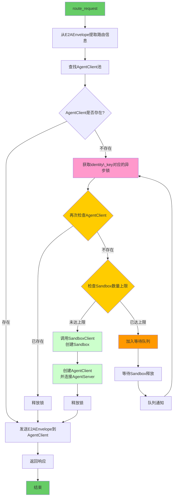

#### 4.1.4 并发控制机制

为避免并发请求导致同一identity\_key重复创建Sandbox，采用\*\*双检锁（Double-Checked Locking）\*\*模式：

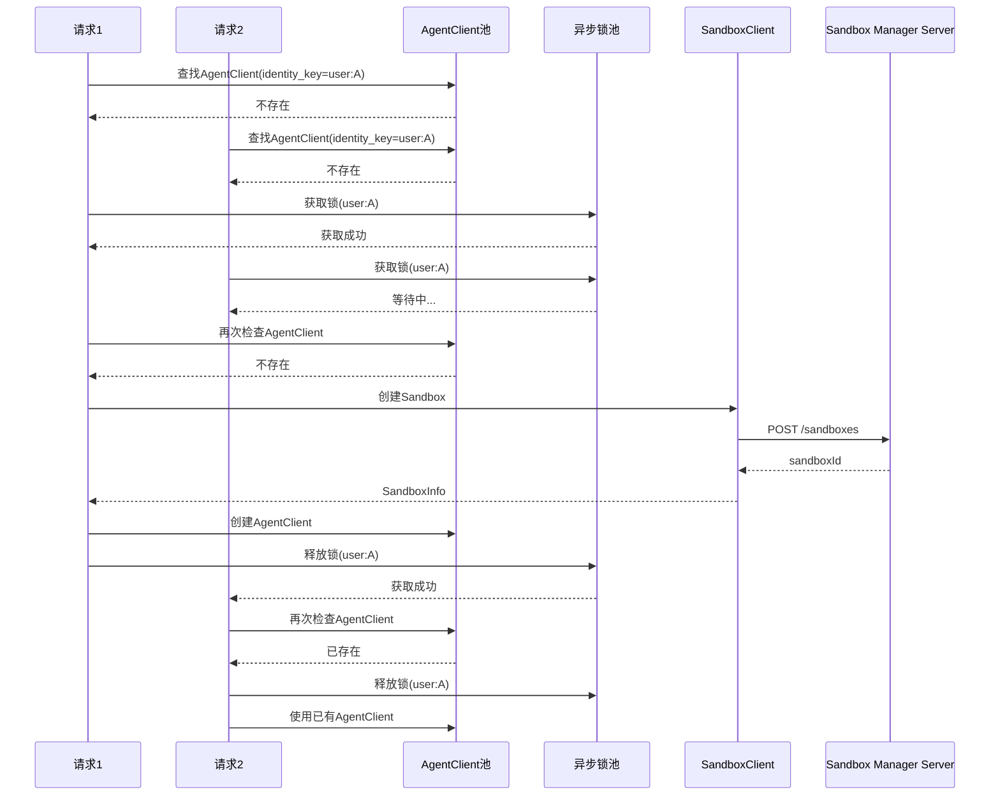

**锁管理策略**：

| 策略   | 说明                                           |
| ---- | -------------------------------------------- |
| 锁粒度  | 每个identity\_key对应一个独立的asyncio.Lock           |
| 锁池管理 | 使用Dict存储identity\_key → Lock映射，锁使用完成后保留供后续复用 |
| 锁获取  | 使用`async with lock:`语法，保证异常时自动释放             |
| 双检锁  | 获取锁后再次检查AgentClient池，避免重复创建                  |

***

### 4.2 SandboxClient模块设计

#### 4.2.1 SandboxClient核心职责

| 职责        | 说明                                              |
| --------- | ----------------------------------------------- |
| Sandbox创建 | 通过HTTP API向Sandbox Manager Server申请创建Sandbox实例  |
| Sandbox删除 | 通过HTTP API向Sandbox Manager Server申请删除/终止Sandbox |

#### 4.2.2 SandboxClient核心API

| 方法              | 入参                               | 出参          | 说明                |
| --------------- | -------------------------------- | ----------- | ----------------- |
| create\_sandbox | template\_id, duration, metadata | SandboxInfo | 核心API，创建Sandbox实例 |
| delete\_sandbox | sandbox\_id                      | 无           | 删除/终止指定Sandbox    |

***

### 4.3 模块目录结构

```
jiuwenclaw/gateway/
├── routing/                        # 路由层模块
│   ├── __init__.py
│   ├── router.py                   # ✅ 新增：Router核心类（含AgentClient池管理）
│   ├── session_map.py              # 现有：可整合到Router或保留
│   ├── route_binding.py            # 现有：路由绑定配置
│   ├── agent_client.py             # 现有：AgentServerClient接口
│   ├── sandbox_client.py           # ✅ 新增：SandboxClient（Sandbox生命周期管理）
│   └── identity_utils.py           # ✅ 新增：路由键生成等工具
│
├── message_handler/
│   └── message_handler.py          # 修改：对接Router
│
└── app_gateway.py                  # 修改：初始化Router和SandboxClient
```

***

### 4.4 模块职责边界对照表

| 职责             | Router | SandboxClient | MessageHandler |
| -------------- | ------ | ------------- | -------------- |
| 消息处理           | ❌      | ❌             | ✅              |
| 任务编排           | ❌      | ❌             | ✅              |
| Session映射      | ✅      | ❌             | ❌              |
| 路由决策           | ✅      | ❌             | ❌              |
| AgentClient池管理 | ✅      | ❌             | ❌              |
| **上限控制与队列管理**  | **✅**  | **❌**         | **❌**          |
| **并发控制**       | **✅**  | **❌**         | **❌**          |
| Sandbox生命周期协调  | ✅      | ❌             | ❌              |
| Sandbox创建/删除   | ❌      | ✅             | ❌              |
| 与外部SMS通信       | ❌      | ✅             | ❌              |

***

## 五、集成设计

### 5.1 与MessageHandler集成

| 集成点  | 说明                                                         |
| ---- | ---------------------------------------------------------- |
| 初始化  | MessageHandler新增可选的router参数                                |
| 消息转发 | \_forward\_loop中调用router.route\_request()，由Router处理路由和请求发送 |
| 任务追踪 | 任务开始/完成时通过Router通知更新task\_count                            |
| 兼容模式 | router为None时使用原有单一AgentClient                              |

### 5.2 与Router集成

| 集成点       | 说明                                |
| --------- | --------------------------------- |
| 初始化       | Router持有SandboxClient实例           |
| Session管理 | Router内部整合或引用SessionMap           |
| 请求路由      | Router通过AgentClient池获取AgentClient |
| Sandbox协调 | Router协调SandboxClient创建/删除Sandbox |

### 5.3 与SandboxClient集成

| 集成点       | 说明                                          |
| --------- | ------------------------------------------- |
| 初始化       | SandboxClient在Gateway启动时创建                  |
| Sandbox创建 | SandboxClient通过HTTP API向SMS申请创建Sandbox实例    |
| Sandbox删除 | SandboxClient通过HTTP API向SMS申请删除/终止Sandbox实例 |
| 配置注入      | SandboxClient接收配置（SMS URL、模板ID、超时时间等）       |

### 5.4 与外部Sandbox Manager Server集成

SandboxClient通过HTTP接口调用外部Sandbox Manager Server来创建和管理Sandbox实例。

#### 5.4.1 创建Sandbox接口

| 项目         | 说明                                            |
| ---------- | --------------------------------------------- |
| **用途**     | ClawGateway向外部Sandbox管理组件申请创建Sandbox          |
| **URL**    | `https://{域名}/sandbox/v1/lifecycle/sandboxes` |
| **Method** | POST                                          |
| **请求头**    | `x-sandbox-template-id: {模板标识}`               |

**请求体**：

```json
{
  "templateId": "template-001",
  "duration": { "durationInSeconds": 3600 },
  "metadata": { "teamId": "team-123", "userId": "user-456" }
}
```

| 字段                         | 类型     | 必填 | 说明                         |
| -------------------------- | ------ | -- | -------------------------- |
| templateId                 | string | 是  | Sandbox模板标识，决定Sandbox的初始配置 |
| duration.durationInSeconds | int    | 是  | Sandbox存活时长（秒），超时自动释放      |
| metadata.teamId            | string | 否  | 团队标识，用于分组管理                |
| metadata.userId            | string | 否  | 用户标识，用于用户关联                |

**响应体**：

```json
{ "sandboxId": "sb-abc123def456", "templateId": "template-001" }
```

| 字段         | 类型     | 说明                    |
| ---------- | ------ | --------------------- |
| sandboxId  | string | Sandbox唯一标识，后续操作使用此ID |
| templateId | string | 创建时使用的模板标识            |

#### 5.4.2 删除Sandbox接口

| 项目         | 说明                                                        |
| ---------- | --------------------------------------------------------- |
| **用途**     | ClawGateway向外部Sandbox管理组件申请删除/终止Sandbox                   |
| **URL**    | `https://{域名}/sandbox/v1/lifecycle/sandboxes/{sandboxId}` |
| **Method** | DELETE                                                    |

**请求参数**：

| 参数        | 位置    | 类型     | 必填 | 说明              |
| --------- | ----- | ------ | -- | --------------- |
| sandboxId | URL路径 | string | 是  | 要删除的Sandbox唯一标识 |

**响应体**：

```json
{ "sandboxId": "sb-abc123def456", "status": "terminated" }
```

| 字段        | 类型     | 说明                     |
| --------- | ------ | ---------------------- |
| sandboxId | string | 已终止的Sandbox唯一标识        |
| status    | string | 终止后的状态，固定为"terminated" |

#### 5.4.3 其他生命周期接口

| 接口        | URL                                                  | Method | 说明                    |
| --------- | ---------------------------------------------------- | ------ | --------------------- |
| 查询Sandbox | `/sandbox/v1/lifecycle/sandboxes/{sandboxId}`        | GET    | 查询Sandbox状态和详情        |
| 延长存活      | `/sandbox/v1/lifecycle/sandboxes/{sandboxId}/extend` | POST   | 延长Sandbox存活时间         |
| 列表查询      | `/sandbox/v1/lifecycle/sandboxes`                    | GET    | 查询指定teamId下的Sandbox列表 |

#### 5.4.4 配置项

| 配置项                                 | 类型     | 说明                  |
| ----------------------------------- | ------ | ------------------- |
| sandbox\_manager\_base\_url         | string | 外部Sandbox管理组件的基础URL |
| sandbox\_default\_template\_id      | string | 默认使用的Sandbox模板标识    |
| sandbox\_default\_duration\_seconds | int    | 默认Sandbox存活时长（秒）    |
| sandbox\_api\_timeout\_seconds      | float  | API调用超时时间           |
| sandbox\_api\_retry\_count          | int    | API调用失败重试次数         |

### 5.5 与app\_gateway集成

| 集成点  | 说明                                                       |
| ---- | -------------------------------------------------------- |
| 启动流程 | Gateway启动时按顺序初始化：SandboxClient → Router → MessageHandler |
| 配置读取 | 从config.yaml读取sandbox和routing配置                          |
| 依赖注入 | SandboxClient注入到Router，Router注入到MessageHandler           |
| 关闭流程 | Gateway关闭时按顺序停止：MessageHandler → Router → SandboxClient  |

### 5.6 新架构消息流转路径

```
Channel → ChannelManager → MessageHandler → Router → AgentClient(多实例)
                                     ↓
                               SandboxClient → Sandbox Manager Server
                                     ↓
                               AgentServer(多实例或单实例多连接)
```

### 5.7 初始化顺序与依赖关系

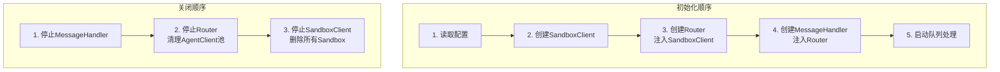

***

## 六、配置设计

### 6.1 Router配置项

| 配置项                     | 类型     | 默认值         | 说明                                                 |
| ----------------------- | ------ | ----------- | -------------------------------------------------- |
| routing\_enabled        | bool   | false       | 是否启用Router路由（Sandbox隔离）                            |
| routing\_scope          | string | "per\_user" | 路由粒度：per\_user / per\_user\_channel / per\_session |
| fallback\_to\_default   | bool   | true        | 无identity\_key时是否fallback到默认AgentClient            |
| max\_sandboxes          | int    | **4**       | 最大Sandbox数量（核心配置）                                  |
| queue\_enabled          | bool   | true        | 是否启用排队等待                                           |
| queue\_max\_size        | int    | 100         | 队列最大容量                                             |
| queue\_timeout\_seconds | float  | 60.0        | 队列等待超时时间（秒）                                        |
| queue\_priority         | string | "fifo"      | 队列优先级策略：fifo / priority                            |

### 6.2 SandboxClient配置项

| 配置项                                 | 类型     | 默认值  | 说明                          |
| ----------------------------------- | ------ | ---- | --------------------------- |
| sandbox\_manager\_base\_url         | string | -    | Sandbox Manager Server基础URL |
| sandbox\_default\_template\_id      | string | -    | 默认Sandbox模板标识               |
| sandbox\_default\_duration\_seconds | int    | 3600 | 默认Sandbox存活时长（秒）            |
| sandbox\_api\_timeout\_seconds      | float  | 30.0 | API调用超时时间（秒）                |
| sandbox\_api\_retry\_count          | int    | 3    | API调用失败重试次数                 |
| sandbox\_api\_retry\_delay          | float  | 1.0  | 重试间隔（秒）                     |

### 6.3 资源限制策略

当Sandbox实例达到上限时，采用以下策略：

| 策略        | 说明                              |
| --------- | ------------------------------- |
| 策略A：拒绝新请求 | 返回错误响应，提示用户资源受限，等待现有Sandbox释放   |
| 策略B：抢占最空闲 | 终止最长时间未活跃的Sandbox，为新用户创建Sandbox |
| 策略C：排队等待  | 新请求进入等待队列，直到有Sandbox可用（推荐）      |

**采用策略C（排队等待）**，流程如下：

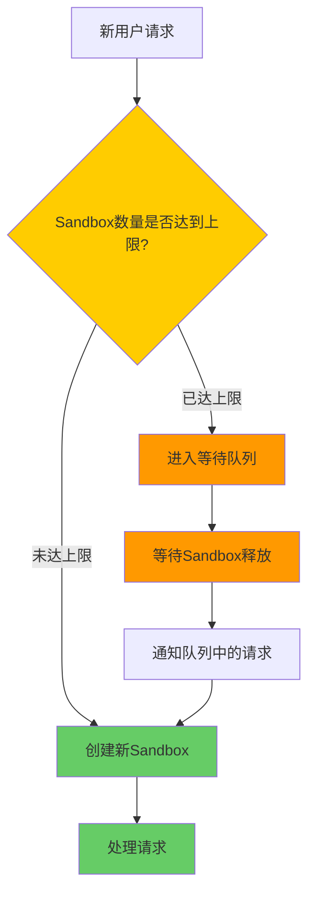

### 6.4 排队等待策略详细设计

#### 排队机制

队列相关配置已整合到Router配置项（见6.1节）。

#### 队列状态管理

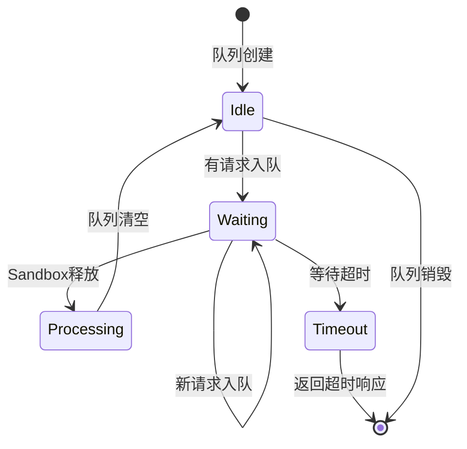

#### 释放触发流程

当Sandbox因任务完成或存活时间到期被释放时：

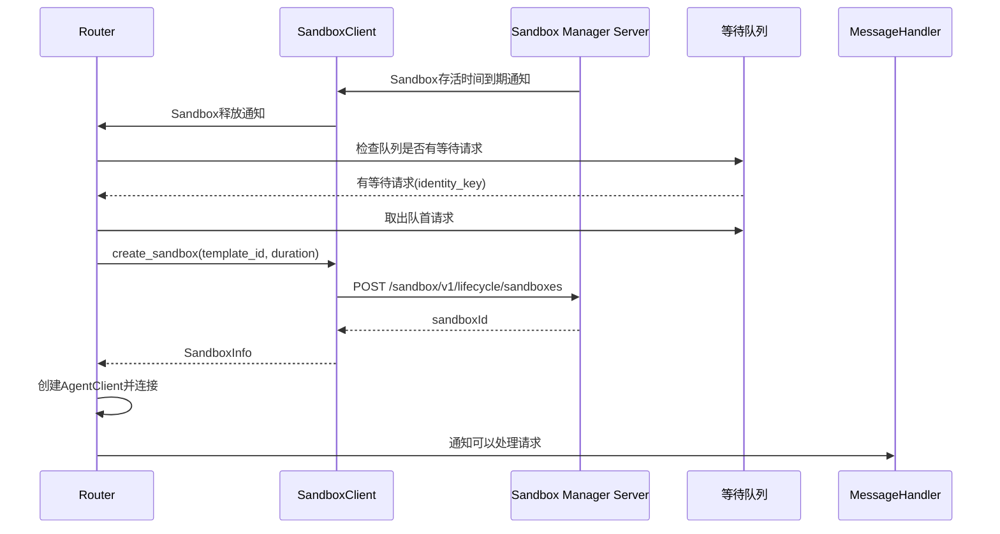

### 6.5 配置示例

```yaml
gateway:
  routing:
    enabled: true
    scope: "per_user"
    fallback_to_default: true
    max_sandboxes: 4              # 最大Sandbox实例数（核心配置）
    queue_enabled: true
    queue_max_size: 100
    queue_timeout_seconds: 60
    queue_priority: "fifo"
  
  sandbox_client:
    sandbox_manager_base_url: "https://sandbox-manager.example.com"
    sandbox_default_template_id: "template-001"
    sandbox_default_duration_seconds: 3600
    sandbox_api_timeout_seconds: 30
    sandbox_api_retry_count: 3
    sandbox_api_retry_delay: 1
```

***

## 七、边界条件与异常处理

### 7.1 边界条件

| 场景                  | 处理策略                                    |
| ------------------- | --------------------------------------- |
| 无路由信息               | 使用default Sandbox或channel\_id作为fallback |
| Sandbox数量达到上限（默认4个） | 采用排队等待策略：请求进入等待队列，直到有Sandbox释放          |
| AgentServer连接失败     | 重试机制，超时后返回错误响应                          |
| 路由键变化               | 自动创建新Sandbox，若达上限则进入队列等待                |
| 队列等待超时              | 返回超时错误响应，提示用户稍后重试                       |

### 7.2 上限控制详细处理

当Sandbox实例达到配置上限（默认4个）时的处理流程：

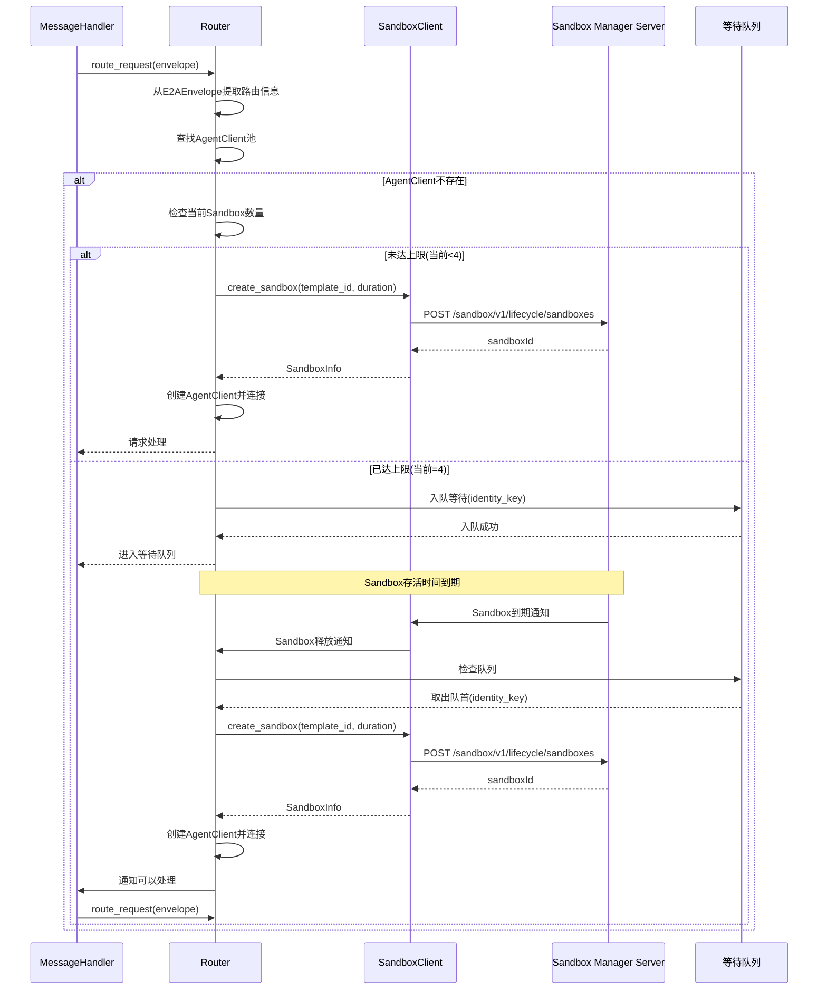

### 7.3 异常处理

| 异常场景                       | 处理方式                             |
| -------------------------- | -------------------------------- |
| Sandbox创建超时                | 返回错误响应，记录日志                      |
| Sandbox Manager Server连接失败 | 重试机制，超时后返回错误响应                   |
| AgentClient连接断开            | 自动重建连接或创建新Sandbox                |
| 并发创建竞态                     | 使用锁保证同一identity\_key只创建一个Sandbox |
| 队列等待超时                     | 返回超时错误响应，提示用户稍后重试                |
| 队列容量达到上限                   | 拒绝新请求，返回队列已满错误响应                 |
| Sandbox释放后队列通知失败           | 记录日志，队列请求自动超时处理                  |

***

## 八、测试设计要点

### 8.1 Router测试

| 测试类型 | 测试要点                                                         |
| ---- | ------------------------------------------------------------ |
| 单元测试 | identity\_key生成、Session映射、路由决策逻辑、AgentClient池管理、上限控制、队列入队/出队 |
| 集成测试 | Router与SandboxClient交互、并发请求路由、队列通知机制                         |
| 性能测试 | 并发任务执行、资源占用上限                                                |
| 异常测试 | 无identity\_key场景、Sandbox不可用时的fallback、队列超时处理                 |

### 8.2 SandboxClient测试

| 测试类型 | 测试要点                      |
| ---- | ------------------------- |
| 单元测试 | Sandbox创建/删除、HTTP API调用   |
| 集成测试 | 与Sandbox Manager Server通信 |
| 异常测试 | API调用失败恢复、超时处理            |

### 8.3 队列机制测试

| 测试场景 | 测试要点                       |
| ---- | -------------------------- |
| 正常排队 | 达到上限后请求正确入队，Sandbox释放后正确出队 |
| 队列超时 | 等待超时后返回正确错误响应              |
| 队列容量 | 队列达到max\_size后拒绝新请求        |
| 并发入队 | 多个请求同时入队的顺序保证（FIFO）        |
| 释放触发 | Sandbox存活到期释放时正确触发队列处理     |

### 8.4 整体集成测试

| 测试场景  | 测试要点                             |
| ----- | -------------------------------- |
| 多用户并发 | 不同用户请求正确路由到各自Sandbox             |
| 用户切换  | 同一用户不同session的路由行为               |
| 资源限制  | Sandbox数量达到上限时排队等待机制             |
| 故障恢复  | Sandbox Manager Server连接失败后的自动恢复 |
| 队列体验  | 用户等待时的状态通知和超时处理                  |

***

## 九、实施计划

### 9.1 分阶段实施

| 阶段 | 任务                       | 产出                                        | 依赖         |
| -- | ------------------------ | ----------------------------------------- | ---------- |
| P1 | 创建routing模块基础结构          | identity\_utils.py                        | 无          |
| P2 | 实现SandboxClient核心类       | sandbox\_client.py                        | P1         |
| P3 | 实现Router核心类              | router.py（含AgentClient池管理）                | P1, P2     |
| P4 | 集成SessionMap到Router      | router.py修改                               | P3         |
| P5 | 修改MessageHandler对接Router | message\_handler.py修改                     | P3         |
| P6 | 修改Gateway入口初始化流程         | app\_gateway.py修改                         | P2, P3, P5 |
| P7 | 配置支持和热重载                 | 配置项、配置读取                                  | P6         |
| P8 | 单元测试和集成测试                | test\_router.py, test\_sandbox\_client.py | P2, P3     |

### 9.2 实施依赖关系

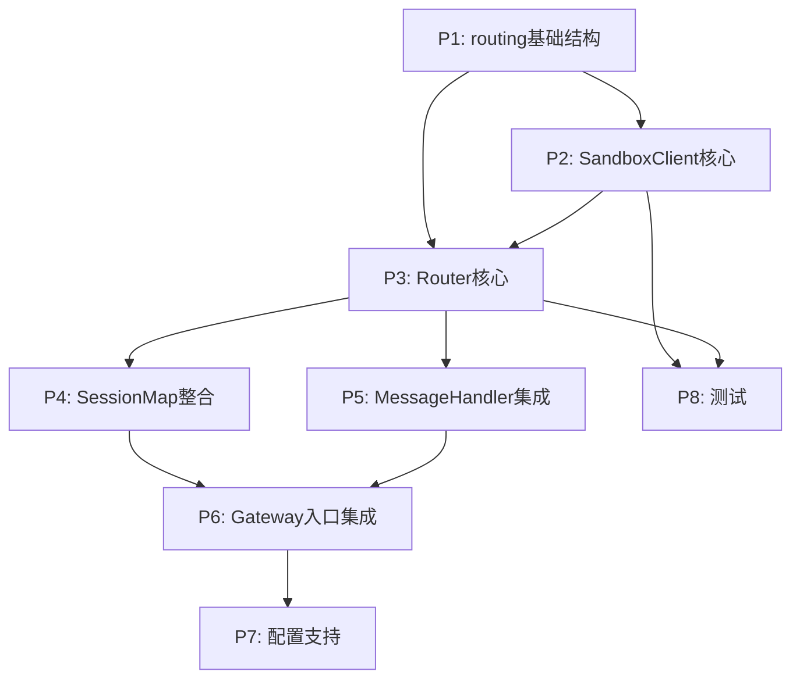

***

## 十、相关文档

- [E2A协议](./E2A-protocol.md) - 消息信封格式
- [频道](./频道.md) - Channel接入说明
- [命令行指令](./命令行指令.md) - 会话管理指令

