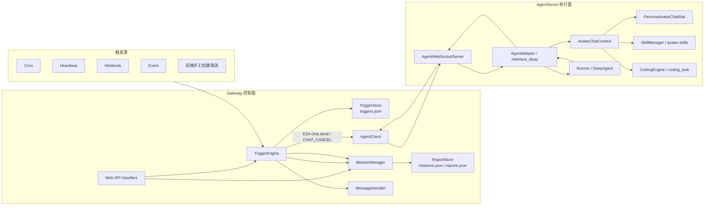
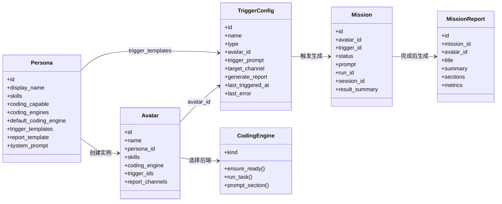
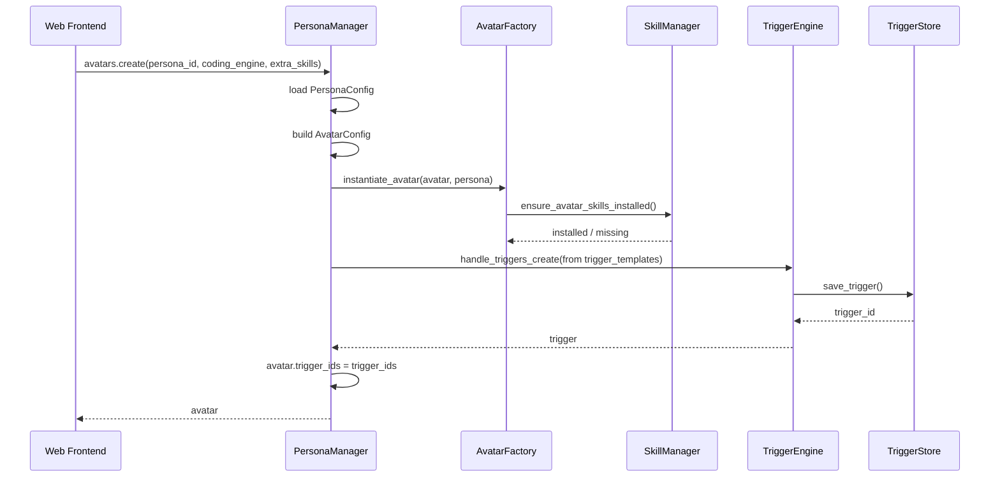
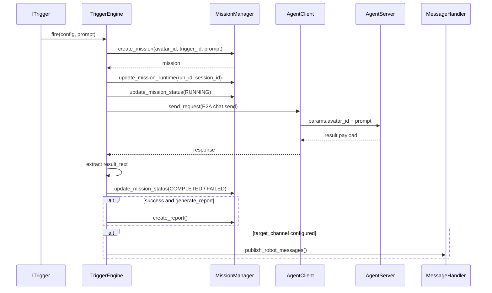
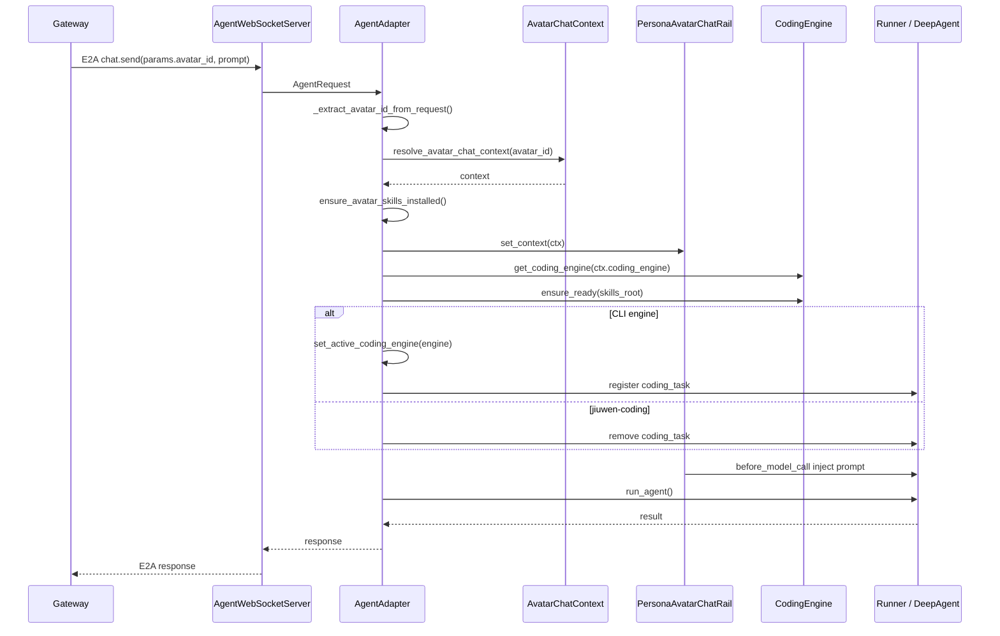
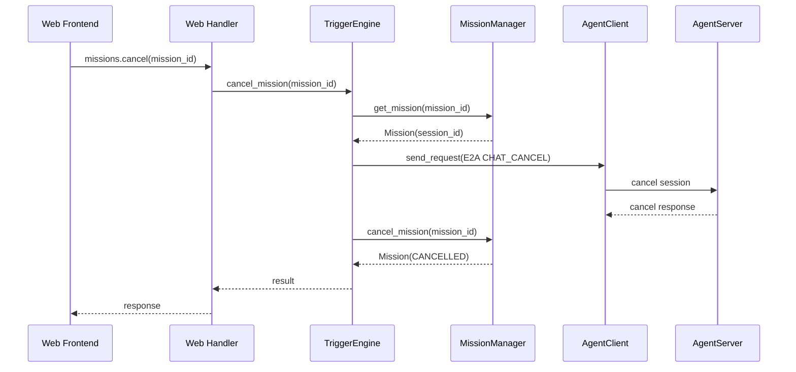
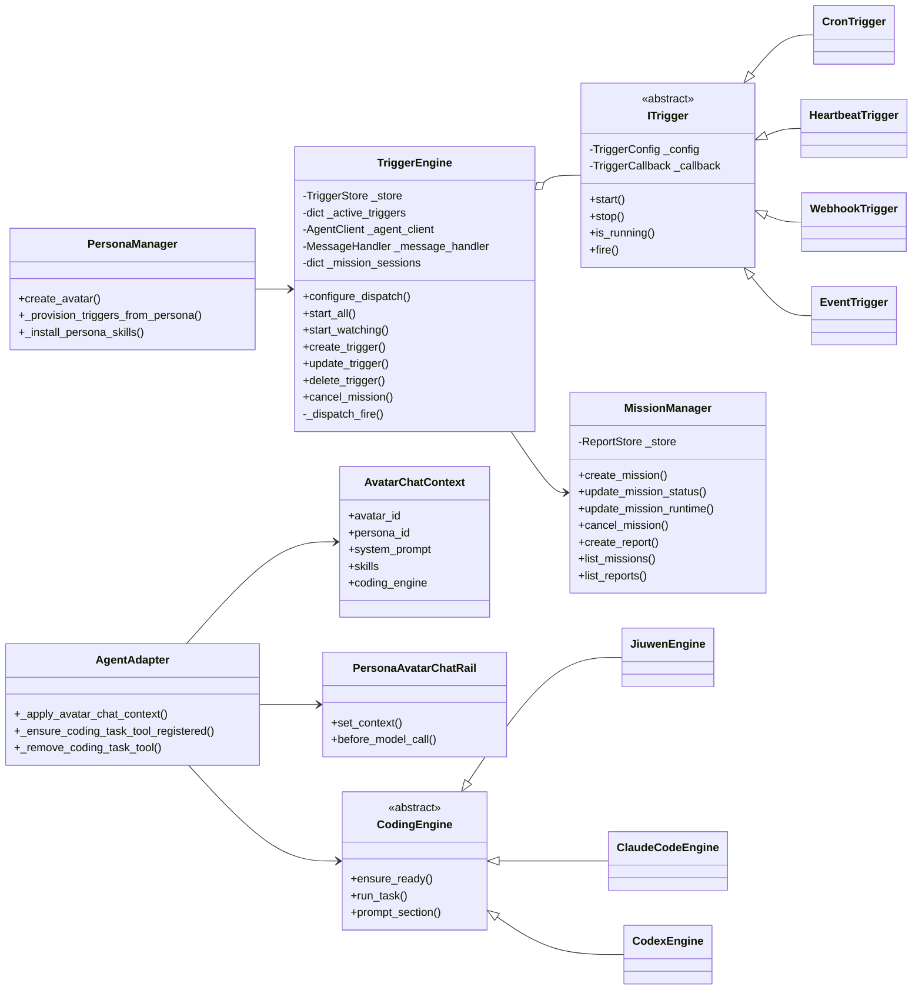

# JiuwenAvatar 自动任务闭环详细设计

## 1. 文档目标

本文用于说明 JiuwenAvatar 相对 JiuwenSwarm 新增模块的端到端设计，重点讲清楚三件事：

1. 为什么要新增这些模块。
2. 新模块之间如何协作。
3. 数据从创建、触发、执行、报告到前端展示如何流转。

本文覆盖的新增/增强模块：

```text
Gateway 控制面
├── TriggerEngine      # 统一触发器引擎
├── MissionReport      # 任务与报告中心
├── TriggerStore       # 触发器持久化
├── ReportStore        # Mission / Report 持久化
└── Web API Handlers   # triggers / missions / reports 前端接口

AgentServer 执行面
├── Persona / Avatar Runtime
├── AvatarChatContext
├── PersonaAvatarChatRail
├── CodingEngine
├── coding_task
└── AgentAdapter Avatar 上下文注入
```

本文不重复描述 JiuwenSwarm 已有的 Gateway、MessageHandler、AgentServer、AgentManager、Session、A2UI、SkillManager 等基础能力，只在它们与新增模块发生交互时说明。

## 2. 0 层设计：业务目标

### 2.1 原问题

JiuwenSwarm 原有架构已经支持：

```text
Web / TUI / IM 多端接入
Gateway 消息路由
AgentServer 执行 Agent
Cron / Heartbeat 定时或周期任务
Skill / Memory / Team / A2UI 等能力
```

但它更偏“对话型 Agent 平台”：

```text
用户发起请求
→ Gateway 转发
→ AgentServer 执行
→ 返回结果
```

对于“数字分身自动工作”场景，还缺少四个关键能力：

- 不知道“哪个分身”应该被自动唤醒。
- 不知道“这次自动执行”如何被记录和追踪。
- 不知道长任务如何取消、失败如何沉淀。
- 执行结果没有结构化报告和已读/统计能力。

### 2.2 新目标

JiuwenAvatar 的目标是从“Agent 对话平台”升级为“数字分身任务执行平台”。

核心闭环是：

```text
Persona → Avatar → Trigger → Mission → Agent Execution → Report
```

含义如下：

- `Persona` 定义角色模板，例如 Committer、Developer、Tester。
- `Avatar` 是用户创建的数字分身实例。
- `Trigger` 定义什么时候唤醒哪个 Avatar。
- `Mission` 记录一次自动任务执行。
- `Agent Execution` 是 AgentServer 按 Avatar 身份执行任务。
- `Report` 是任务结果的结构化沉淀。

因此，新增设计不是单点加功能，而是构建一个端到端自动任务闭环。

## 3. 1 层设计：系统分工

自动任务闭环横跨两个核心进程。

```text
Gateway 进程：控制面
负责触发、派发、Mission 生命周期、Report、前端 API、结果推送。

AgentServer 进程：执行面
负责解析 avatar_id、注入 Persona/Skill/CodingEngine 上下文、调用 Agent 执行任务。
```

总体架构：



关键边界：

- Gateway 不理解 Agent 内部执行细节，只负责控制任务生命周期。
- AgentServer 不持久化 Mission / Report，只负责以正确 Avatar 上下文执行。
- `avatar_id` 是控制面和执行面之间的核心关联字段。
- `session_id` 是 Mission 取消时关联 AgentServer 会话的关键字段。

## 4. 2 层设计：领域模型与数据

### 4.1 核心对象关系



### 4.2 Persona 数据

代码位置：

```text
jiuwenavatar/server/runtime/persona/models.py
jiuwenavatar/resources/personas/*.yaml
```

核心字段：

```text
id                       Persona 唯一标识
display_name             展示名
description              描述
coding_capable           是否支持编码引擎
coding_engines           可选编码引擎列表
default_coding_engine    默认编码引擎
skills                   默认技能列表
trigger_templates        默认触发器模板
system_prompt            身份提示词
report_template          报告模板
tags                     前端筛选标签
builtin                  是否内置
```

设计定位：

```text
Persona 是模板，只描述一个角色应该具备什么能力。
```

### 4.3 Avatar 数据

代码位置：

```text
jiuwenavatar/server/runtime/persona/models.py
```

核心字段：

```text
id                 Avatar ID
name               分身名称
persona_id         来源 Persona
persona_version    创建时模板版本
status             idle / running / error
skills             Avatar 额外或覆盖技能
coding_engine      当前选择的编码引擎
system_prompt      用户覆盖的系统提示
trigger_ids        自动 provision 的 Trigger ID
report_channels    报告推送渠道
```

设计定位：

```text
Avatar 是 Persona 的用户实例，是自动任务的执行主体。
```

### 4.4 TriggerConfig 数据

代码位置：

```text
jiuwenavatar/gateway/trigger/models.py
```

触发器类型：

```text
cron
heartbeat
webhook
event
```

核心字段：

```text
id                    trigger-xxxx
name                  触发器名称
type                  cron / heartbeat / webhook / event
avatar_id             绑定的 Avatar
enabled               是否启用
status                active / paused / error

cron_expr             Cron 表达式
timezone              时区
interval_seconds      心跳间隔
active_hours          生效时间段
webhook_path          Webhook URL 路径
webhook_secret        Webhook 签名密钥
event_source          事件来源
event_type            事件类型

trigger_prompt        触发后发送给 Avatar 的 prompt
target_channel        结果推送目标渠道
generate_report       是否生成报告

created_at
updated_at
last_triggered_at
last_error
extra
```

持久化路径：

```text
~/.jiuwenavatar/triggers/triggers.json
```

设计定位：

```text
TriggerConfig 是“自动唤醒 Avatar”的配置实体。
```

### 4.5 Mission 数据

代码位置：

```text
jiuwenavatar/gateway/report/models.py
```

状态：

```text
pending
running
completed
failed
cancelled
```

字段：

```text
id                    mission-xxxx
avatar_id             执行分身
trigger_id            来源 Trigger，可为空
status                生命周期状态
started_at            开始时间
completed_at          结束时间
prompt                本次任务输入
result_summary        结果摘要或错误摘要
run_id                TriggerEngine 派发 ID
session_id            AgentServer 会话 ID
cancel_requested_at   取消请求时间
```

持久化路径：

```text
~/.jiuwenavatar/reports/missions.json
```

设计定位：

```text
Mission 是一次自动任务执行的账本。
```

### 4.6 MissionReport 数据

代码位置：

```text
jiuwenavatar/gateway/report/models.py
```

字段：

```text
id                 report-xxxx
mission_id         关联 Mission
avatar_id          执行分身
avatar_persona     Persona 类型
created_at         创建时间
title              报告标题
summary            报告摘要
sections           报告章节
metrics            结构化指标
notified_channels  已通知渠道
```

持久化路径：

```text
~/.jiuwenavatar/reports/reports.json
```

设计定位：

```text
MissionReport 是 Mission 的结构化输出。
```

### 4.7 辅助数据

已读状态：

```text
~/.jiuwenavatar/reports/read_state.json
```

结构：

```json
{
  "missions": {},
  "reports": {}
}
```

累计使用统计：

```text
~/.jiuwenavatar/reports/usage_stats.json
```

统计字段：

```text
active_days
total_duration_seconds
used_today
today_tasks
completed_tasks
total_tasks
first_task_date
last_task_date
```

## 5. 3 层设计：端到端链路

### 5.1 Avatar 创建链路



链路说明：

1. 前端选择 Persona 创建 Avatar。
2. `PersonaManager` 合并 Persona 默认技能和用户额外技能。
3. 解析并保存 `coding_engine`。
4. 安装 Avatar 绑定的内置 Skill。
5. 根据 Persona 的 `trigger_templates` 自动创建 Trigger。
6. 保存 `trigger_ids` 到 Avatar。

相关代码：

```text
server/runtime/persona/manager.py
server/runtime/persona/avatar_factory.py
server/runtime/persona/chat_context.py
gateway/trigger/engine.py
```

### 5.2 Trigger 执行链路



核心方法：

```text
ITrigger.fire()
TriggerEngine._dispatch_fire()
MissionManager.create_mission()
AgentClient.send_request()
MissionManager.create_report()
MessageHandler.publish_robot_messages()
```

### 5.3 AgentServer 执行链路



核心方法：

```text
interface_deep._extract_avatar_id_from_request()
interface_deep._apply_avatar_chat_context()
resolve_avatar_chat_context()
ensure_avatar_skills_installed()
PersonaAvatarChatRail.before_model_call()
get_coding_engine()
set_active_coding_engine()
_ensure_coding_task_tool_registered()
```

### 5.4 Mission 取消链路



关键设计：

- 取消入口在 Gateway。
- 取消执行需要 `mission.session_id`。
- Gateway 向 AgentServer 发送 `CHAT_CANCEL`。
- `MissionManager.cancel_mission()` 将状态置为 `CANCELLED`。
- 如果 AgentServer 稍后返回结果，`MissionManager.update_mission_status()` 不会覆盖已取消状态。

## 6. 4 层设计：模块职责

### 6.1 Gateway 控制面

#### TriggerEngine

代码：

```text
jiuwenavatar/gateway/trigger/engine.py
```

职责：

- Trigger CRUD。
- 启动和停止 Trigger runtime。
- 监听 `triggers.json` 变化并热更新。
- 统一派发 Trigger 命中事件。
- 创建和更新 Mission。
- 创建 Report。
- 回推执行结果。
- 支持 Mission 取消。

关键成员：

```text
_store                  TriggerStore
_active_triggers        当前运行中的 ITrigger 实例
_on_fire_callback       触发回调
_agent_client           Gateway 到 AgentServer 的客户端
_message_handler        结果回推入口
_scheduling_enabled     是否允许当前进程调度
_active_sig             trigger_id -> updated_at
_watch_task             triggers.json 监听任务
_mission_sessions       mission_id -> session_id
_mission_runs           mission_id -> run_id
```

#### ITrigger 与具体触发器

代码：

```text
gateway/trigger/base.py
gateway/trigger/cron_trigger.py
gateway/trigger/heartbeat_trigger.py
gateway/trigger/webhook_trigger.py
gateway/trigger/event_trigger.py
```

统一抽象：

```python
TriggerCallback = Callable[[TriggerConfig, str], Coroutine[Any, Any, None]]

class ITrigger:
    async def start(self) -> None
    async def stop(self) -> None
    def is_running(self) -> bool
    async def fire(self, prompt: str | None = None) -> None
```

设计原则：

```text
具体触发器只负责“什么时候触发”和“如何构造本次 prompt”
TriggerEngine 负责“触发后如何执行”
```

四类触发器：

```text
CronTrigger       croniter 计算下一次执行时间
HeartbeatTrigger  interval_seconds + active_hours
WebhookTrigger    HTTP body + HMAC 签名校验 + payload 拼接
EventTrigger      event_source + event_type 匹配
```

#### TriggerStore

代码：

```text
gateway/trigger/store.py
```

职责：

- 读写 `~/.jiuwenavatar/triggers/triggers.json`。
- 序列化和反序列化 `TriggerConfig`。
- 支持按 `avatar_id` 查询 Trigger。

#### MissionManager

代码：

```text
gateway/report/manager.py
```

职责：

- 创建 Mission。
- 更新 Mission 状态。
- 更新 Mission 运行时信息。
- 取消 Mission。
- 创建 Report。
- 查询 Mission / Report。
- 删除 Mission / Report。
- 记录使用统计。

关键状态保护：

```text
Mission 已经是 CANCELLED 后，不允许再被 COMPLETED / FAILED 覆盖。
```

#### ReportStore

代码：

```text
gateway/report/store.py
```

职责：

- 读写 `missions.json`。
- 读写 `reports.json`。
- 支持按 Avatar 删除相关 Mission / Report。

#### ReadState 与 UsageStats

代码：

```text
gateway/report/read_state.py
gateway/report/usage_stats.py
gateway/report/stats.py
```

职责：

- 记录任务和报告已读状态。
- 统计未读 Mission。
- 统计 active Mission。
- 维护累计使用账本。
- 提供前端报告页、浮标角标、使用统计数据。

### 6.2 AgentServer 执行面

#### PersonaManager

代码：

```text
server/runtime/persona/manager.py
```

职责：

- 加载 Persona。
- 管理 Avatar。
- 创建 Avatar 时解析编码引擎。
- 创建 Avatar 时安装默认 Skill。
- 创建 Avatar 时根据 `trigger_templates` 自动创建 Trigger。

#### AvatarFactory

代码：

```text
server/runtime/persona/avatar_factory.py
```

职责：

- 将 Persona + Avatar 转换为运行时配置。
- 安装 Persona 关联 Skill。
- 返回运行时所需的系统提示、技能、编码引擎、报告模板、触发器模板等数据。

#### AvatarChatContext

代码：

```text
server/runtime/persona/chat_context.py
```

职责：

- 根据 `avatar_id` 解析当前请求的分身上下文。
- 计算有效技能列表。
- 计算有效系统提示。
- 解析编码引擎。
- 安装缺失的内置 Skill。

返回结构：

```text
avatar_id
avatar_name
persona_id
persona_display_name
system_prompt
skills
coding_engine
skills_root
```

#### PersonaAvatarChatRail

代码：

```text
server/runtime/persona/persona_avatar_chat_rail.py
```

职责：

- 在模型调用前注入 Avatar 身份提示。
- 限制可用 Skill。
- 注入编码后端约束。
- 防止分身任务退化为通用网页助手或通用子代理任务。

注入内容包括：

```text
当前 Avatar 名称
Persona 模板名称
Skill 白名单
禁止使用的通用工具
CodingEngine 的执行约束
Avatar 系统提示
```

#### CodingEngine

代码：

```text
server/runtime/coding/engines.py
```

统一契约：

```python
class CodingEngine:
    kind: str
    display_name: str
    is_cli: bool
    def is_available() -> bool
    def ensure_ready(skills_root, auto_install=True) -> EngineStatus
    async def run_task(message, cwd=None) -> str
    def prompt_section(skills_root, language) -> str
```

当前实现：

```text
JiuwenEngine       jiuwen-coding，原生 DeepAgent
ClaudeCodeEngine   claude-code CLI
CodexEngine        codex CLI
```

设计要点：

- 原生引擎不注册 `coding_task`。
- CLI 引擎注册 `coding_task`。
- CLI 工作区按 `avatar_id` 隔离。
- 引擎状态通过 `EngineStatus` 返回，用于日志和前端诊断。

#### coding_task

代码：

```text
server/runtime/coding/tool.py
```

职责：

- 为 Claude Code / Codex 提供统一工具入口。
- 通过 `ContextVar` 读取当前请求激活的 CodingEngine。
- 将任务路由到 `engine.run_task()`。

核心逻辑：

```text
没有外部 CLI 引擎
→ 返回提示，要求 Leader 直接用 Skill + bash

存在外部 CLI 引擎
→ engine.run_task(message, cwd)
```

#### AgentAdapter / interface_deep

代码：

```text
server/runtime/agent_adapter/interface.py
server/runtime/agent_adapter/interface_deep.py
```

职责：

- 从 `AgentRequest.params` 提取 `avatar_id`。
- 执行 `_apply_avatar_chat_context()`。
- 设置 PersonaAvatarChatRail 上下文。
- 安装 Avatar Skill。
- 设置 SkillRail 白名单。
- 准备 CodingEngine。
- 动态注册或移除 `coding_task`。
- 执行 Runner。

关键方法：

```text
_extract_avatar_id_from_request()
_apply_avatar_chat_context()
_ensure_coding_task_tool_registered()
_remove_coding_task_tool()
```

## 7. 5 层设计：关键类图



## 8. 关键代码流程说明

### 8.1 ITrigger.fire 与统一 callback

代码：

```text
gateway/trigger/base.py
```

`ITrigger.fire()` 是所有触发器进入执行闭环的统一入口。

```python
async def fire(self, prompt: str | None = None) -> None:
    effective_prompt = prompt or self._config.trigger_prompt
    await self._callback(self._config, effective_prompt)
```

设计意义：

```text
Cron / Heartbeat / Webhook / Event 只负责触发条件
_dispatch_fire 统一负责执行任务
```

如果未来新增 `GitCodeTrigger` 或 `FileWatchTrigger`，只要继承 `ITrigger` 并在条件满足时调用 `fire()`，就能复用 Mission、E2A、Report、推送和取消链路。

### 8.2 TriggerEngine._dispatch_fire

代码：

```text
gateway/trigger/engine.py
```

主流程：

```text
更新 Trigger last_triggered_at
→ 生成 run_id / session_id
→ MissionManager.create_mission()
→ Mission RUNNING
→ 构造 E2A chat.send
→ AgentClient.send_request()
→ 提取 result_text
→ 保存 Trigger last_error
→ Mission COMPLETED / FAILED
→ create_report()
→ publish_robot_messages()
```

E2A 参数：

```python
params={
    "avatar_id": config.avatar_id,
    "content": prompt,
    "query": prompt,
    "mode": "agent",
}
```

这是控制面和执行面衔接的关键数据。

### 8.3 MissionManager 状态保护

代码：

```text
gateway/report/manager.py
```

状态更新规则：

```text
如果 Mission 已经是 CANCELLED，
则后续 RUNNING / COMPLETED / FAILED 不覆盖取消状态。
```

设计意义：

```text
避免用户取消后，AgentServer 稍后返回结果又把 Mission 改成 completed。
```

### 8.4 AgentAdapter._apply_avatar_chat_context

代码：

```text
server/runtime/agent_adapter/interface_deep.py
```

主流程：

```text
resolve_avatar_chat_context(runtime_config.avatar_id)
→ PersonaAvatarChatRail.set_context(ctx)
→ ensure_avatar_skills_installed(ctx.skills)
→ set_workspace_avatar(ctx.avatar_id)
→ get_coding_engine(ctx.coding_engine)
→ engine.ensure_ready()
→ set_active_coding_engine(engine)
→ 注册或移除 coding_task
→ SkillRail.enabled_skills = ctx.skills
→ Runner.run_agent()
```

设计意义：

```text
同一个 AgentServer 可以处理普通对话，也可以处理指定 Avatar 的自动任务。
是否启用分身语义完全由 avatar_id 决定。
```

### 8.5 PersonaAvatarChatRail 注入

代码：

```text
server/runtime/persona/persona_avatar_chat_rail.py
```

注入内容：

```text
你当前正在以哪个数字分身对话
这个分身基于哪个 Persona
仅允许使用哪些 Skill
禁止使用 search_skill / install_skill / browser_agent 等绕行方式
如果是外部 CLI 编码后端，必须通过 coding_task 委派
Persona / Avatar 的系统职责
```

设计意义：

```text
把“分身身份”从业务配置转化为模型执行时可感知的约束。
```

### 8.6 CodingEngine 与 coding_task

代码：

```text
server/runtime/coding/engines.py
server/runtime/coding/tool.py
```

运行策略：

```text
jiuwen-coding
→ Leader 直接用 Skill + bash
→ 不注册 coding_task

claude-code / codex
→ 注册 coding_task
→ Leader 把重型编码/审查任务委派给 CLI
```

设计意义：

```text
上层只知道 Avatar 选择了某个 coding_engine；
具体如何准备工作区、执行 CLI、截断输出、注入提示，由 CodingEngine 封装。
```

## 9. Web API 与前端数据入口

代码：

```text
gateway/channel_manager/web/app_web_handlers.py
```

Trigger API：

```text
triggers.list
triggers.get
triggers.create
triggers.update
triggers.delete
```

Mission API：

```text
missions.list
missions.get
missions.cancel
missions.delete
missions.stats
```

Report API：

```text
reports.list
reports.get
```

Read State API：

```text
report_read_state.get
report_read_state.set
report.unread_counts
```

说明：

- Trigger API 操作 `TriggerEngine`。
- Mission / Report 查询操作 `MissionManager`。
- `missions.cancel` 操作 `TriggerEngine.cancel_mission()`，因为取消需要向 AgentServer 发送 `CHAT_CANCEL`。
- unread / active 统计来自 `read_state.py`。
- usage stats 来自 `usage_stats.py`。

## 10. 与 JiuwenSwarm 的差异

### 10.1 原有能力

JiuwenSwarm 已有：

```text
Gateway
MessageHandler
AgentClient
Cron
Heartbeat
Web / TUI / IM Channel
AgentServer
AgentManager / AgentAdapter
Session / Skill / A2UI
DeepAgent / CodeAgent
```

### 10.2 新增或显著增强

JiuwenAvatar 新增/增强：

```text
TriggerEngine
WebhookTrigger
EventTrigger
Trigger 与 Avatar 绑定
Persona trigger_templates 自动 provisioning
Mission 生命周期
MissionReport 报告模型
ReadState / UnreadCounts
UsageStats 累计统计
Mission cancel 与 AgentServer CHAT_CANCEL 打通
Persona / Avatar 运行时上下文
Avatar 绑定 Skill 自动安装与白名单约束
PersonaAvatarChatRail 身份提示注入
CodingEngine 统一抽象
coding_task 外部编码引擎委派
按 Avatar 隔离 CLI 编码工作区
```

### 10.3 核心变化

```text
原来：
Gateway 定时或接收消息
→ AgentServer 通用执行
→ 返回结果

现在：
Gateway 触发可追踪 Mission
→ AgentServer 以指定 Avatar 身份执行
→ Gateway 生成 Report
→ 前端可查询、取消、统计、标记已读
```

## 11. 设计收益

### 11.1 业务闭环完整

从“触发一次 Agent”升级为：

```text
触发
→ 执行
→ 记录
→ 报告
→ 展示
→ 统计
→ 取消
```

### 11.2 控制面和执行面解耦

Gateway 只负责任务控制，AgentServer 只负责按分身身份执行。

这样避免：

- Gateway 侵入 Agent 执行逻辑。
- AgentServer 持久化任务账本。
- Mission / Report 数据散落在不同进程。

### 11.3 Trigger 类型可扩展

通过 `ITrigger.fire()` + `TriggerCallback`，新增触发器类型时不需要重写 Mission / Report / E2A 派发逻辑。

### 11.4 Avatar 执行语义稳定

AgentServer 通过 `avatar_id` 收敛执行上下文：

```text
Persona 系统提示
Skill 白名单
CodingEngine
coding_task
CLI 工作区
```

这能避免自动任务退化成通用对话。

### 11.5 编码后端可插拔

`CodingEngine` 抽象使编码类分身可以在不同执行后端之间切换：

```text
jiuwen-coding
claude-code
codex
```

后续接入新的编码 Agent 时，只需要新增一个 `CodingEngine` 实现。

## 12. 风险与优化方向

### 12.1 当前风险

- Trigger / Mission / Report 当前使用 JSON 文件存储，并发写入能力有限。
- Webhook 可无 secret，生产环境存在安全风险。
- Report 当前主要保存 summary 和 prompt，尚未充分使用 Persona report_template。
- Gateway 单进程负责调度，分布式场景需要调度锁或 leader election。
- Claude Code / Codex CLI 依赖本机环境、凭据和安装状态。
- 同一 Agent 实例在不同 Avatar / CodingEngine 间切换时，需要确保工具注册和 Skill 白名单正确清理。

### 12.2 后续优化

- 将 Trigger / Mission / Report 存储升级为 SQLite 或服务端数据库。
- Webhook 增加 GitCode、飞书等平台级 payload 解析。
- Report 生成引入 Persona report_template。
- 增加 Mission 重试、超时标记、失败归因。
- 增加 Trigger 执行审计日志。
- 分布式部署增加调度锁或主备选举。
- CodingEngine 增加前端可视化健康检查和凭据诊断。
- 为 `PersonaAvatarChatRail`、`coding_task` 注册/移除、Mission cancel 增加自动化测试。

## 13. PPT 拆页建议

建议拆为 12 页：

1. 背景：从对话平台到数字分身任务平台。
2. 0 层业务闭环：Persona → Avatar → Trigger → Mission → Report。
3. 系统分工：Gateway 控制面与 AgentServer 执行面。
4. 领域模型：Persona / Avatar / Trigger / Mission / Report / CodingEngine。
5. 创建链路：Persona 创建 Avatar 并自动 provision Trigger。
6. 触发链路：ITrigger.fire → TriggerEngine._dispatch_fire。
7. 执行链路：AgentServer 根据 avatar_id 注入分身上下文。
8. 报告链路：Mission 生命周期与 MissionReport。
9. 取消链路：Mission cancel 与 AgentServer CHAT_CANCEL。
10. AgentServer 新增设计：PersonaAvatarChatRail / Skill 白名单 / CodingEngine。
11. 与 JiuwenSwarm 差异：新增模块与架构变化。
12. 风险与演进：存储、Webhook 安全、分布式调度、编码引擎诊断。
