# Claw Manager 用户操作手册

> 适用对象：平台运维、租户管理员  
> 操作原则：
> - 生产变更建议先在低流量实例或非高峰验证。  
> - 修改 / 删除策略会立即影响 Gateway 配置生效，操作前确认 priority 与 match 范围。  

---

## 1. 产品简介

Claw Manager 是 JiuwenClaw 的**企业级管理面**，用于：

- 纳管与监控 JiuwenClaw **实例**（Gateway / AgentServer 组网状态）
- 维护可复用的**全局配置模板**（模型、Embedding、Skill 白名单、扩展钩子、服务资源配置等）
- 为每个实例配置**策略**（默认模板映射 / 全局兜底 / 服务层 / Agent 层），经 WebSocket 下发到 Gateway 生效
- 对实例做**运行时配置**（Channel、日志脱敏、日志级别、权限等）

配置变更由 Manager 写入管理库，并通过 Manager WebSocket 以 `config.push` 同步到 Gateway；Gateway 落库后，AgentServer 按请求解析生效配置。未命中企业策略时，组件回退使用本地 `config.yaml` / 环境变量。

**界面结构**：控制台左侧导航分为两组：

| 分组 | 菜单 | 说明 |
|------|------|------|
| **平台** | 总览 | 管理面与实例健康概览 |
| **平台** | 实例管理 | 实例列表、实例详情、实例策略、实例配置 |
| **全局配置** | 模型模板 | LLM 模型模板 |
| **全局配置** | Embedding 模板 | 向量模型模板 |
| **全局配置** | 扩展配置模板 | 钩子 / 自定义扩展 |
| **全局配置** | Skill 白名单模板 | Agent可调用的Skill白名单 |
| **全局配置** | 服务配置模板 | AgentServer容器与会话参数 |


---

## 2. 推荐操作流程

日常从零配置一套可用环境，建议按下列顺序操作。

① 确认总览健康（第3章 总览）

② 确认实例已纳管且Gateway心跳在线（第4章 实例管理）

③ 在「全局配置」中录入各类模板（第5章 全局配置模板）

④ 进入实例「实例策略」配置四级策略（第6章 实例策略）

⑤（按需）在「实例配置」管理 Gateway 的 Channel / 日志 / 权限（第7章 实例配置）

⑥ 用真实请求验证模型、Skill、路由等是否按预期生效（第8章 联调验证）


---

## 3. 总览

位置：**平台 → 总览**

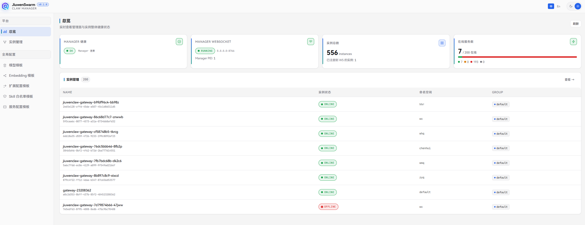

页面展示：

| 指标 | 含义 |
|------|------|
| Manager 健康 | Manager REST 是否正常 |
| Manager WebSocket | WS 服务是否监听、监听端口、PID 等 |
| 实例总数 | 已登记实例数量 |
| 在线服务数 / 状态分布 | 按**实例**状态汇总；主数字为绿色（正常）实例数，下方色条与圆点按四类着色：<br>🟢 **绿色**：正常（`online` ）<br>🟡 **黄色**：启动中（`pending`）<br>🔴 **红色**：已下线（`offline`）<br>⚪ **灰色**：其他未识别状态 |


---

## 4. 实例管理

位置：**平台 → 实例管理**

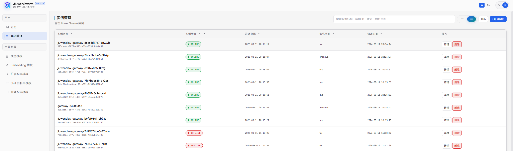

本步骤目标是：实例已在 Manager 登记，且 Gateway 心跳在线，为后续策略下发与 Gateway 配置管理做好准备。

### 4.1 列表与视图

- 支持**简略视图**（拓扑卡片）与**详细视图**（表格）
- 可按实例名称、ID、状态、命名空间等**搜索**
- 可按状态过滤、按列排序、分页浏览
- **简略视图（卡片）** 展示：实例名称、实例 ID、实例状态、命名空间、最近心跳、最近更新
- **详细视图（表格）** 列：实例名称（含 ID）、实例状态、最近心跳、命名空间、修改时间、操作（详情 / 删除）

实例信息依赖**心跳上报**，刚拉起实例时若没有显示，请等待Gateway连上Manager WS并完成心跳。

### 4.2 新建实例

暂不支持新建实例，需要自行拉起gateway后，由gateway注册到manager。

### 4.3 本地一键拉起（开发模式）

当环境开启 `MANAGER_ALLOW_LOCAL_PROVISION=true` 时，列表页会出现**本地一键拉起**，用于本地拉起一套 Gateway + AgentServer，便于联调。生产环境通常不开放此能力。

### 4.4 删除实例

在卡片或表格中点击**删除**并确认。这里的删除只会在Manager的数据库中删除该实例登记信息，并不会下线对应gateway，请确认业务上已下线对应 Gateway，避免误删。

### 4.5 进入实例详情

点击**详情**进入实例页，顶部有三个主Tab：

| Tab | 用途 | 对应步骤 |
|-----|------|----------|
| 实例详情 | 展示实例的详细信息（待完善）| - |
| 实例策略 | 四级配置生效策略 | 步骤 ④ |
| 实例配置 | Gateway 的 Channel / 日志 / 权限等配置 | 步骤 ⑤ |


---

## 5. 全局配置模板

位置：**全局配置** 下各模板菜单

模板是可复用配置单元，由实例策略（步骤 ④）通过 `template_id` 引用。各列表页均支持搜索、分页、新建、编辑、删除。**禁用（enabled=false）** 的模板被引用后通常等价于未生效。

### 5.1 模型模板

位置：**全局配置 → 模型模板**

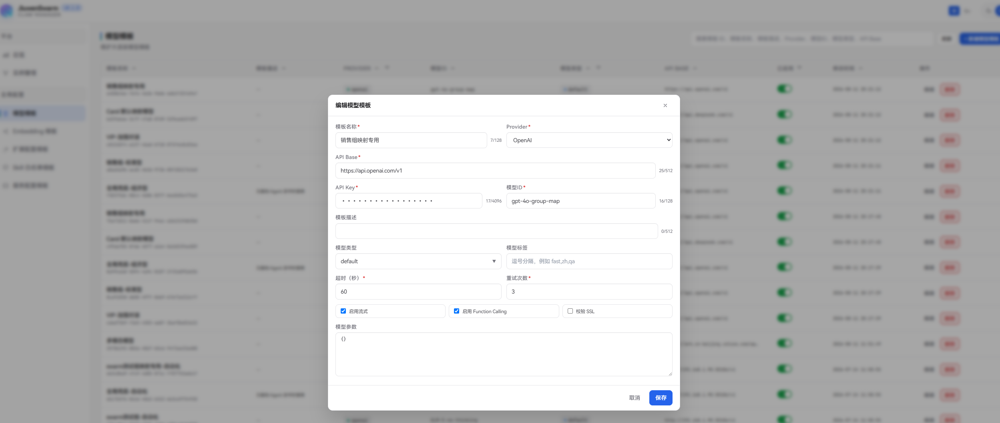

用于配置大语言模型的调用信息，策略中通过 `default_model` / `video_model` / `audio_model` / `vision_model` 槽位引用。

| 字段 | 必填 | 说明 |
|------|------|------|
| 模板名称 | 是 | 自定义名称 |
| Provider | 是 | 提供商，可选 `OpenAI` / `OpenRouter` / `DashScope` / `SiliconFlow` / `InferenceAffinity` |
| API Base | 是 | 模型服务接口地址，如 `https://api.openai.com/v1` |
| API Key | 是 | 调用密钥 |
| 模型 ID | 是 | 上游模型标识，如 `gpt-4o`、`deepseek-chat` |
| 模板描述 | 否 | 用途说明 |
| 模型类型 | 否 | `default` / `video` / `audio` / `vision`，可多选 |
| 模型标签 | 否 | 逗号分隔的自定义标签，如 `fast,zh,qa` |
| 超时（秒） | 是 | 单次请求超时，默认 60 |
| 重试次数 | 是 | 失败后重试，默认 3 |
| 启用流式 | 否 | 是否流式输出，默认开启 |
| 启用 Function Calling | 否 | 是否支持工具调用，默认开启 |
| 校验 SSL | 否 | 是否校验 HTTPS 证书，内网自签可关闭，默认关闭 |
| 参数 JSON | 否 | 模型参数，如 `{"temperature": 0.7}` |

### 5.2 Embedding 模板

位置：**全局配置 → Embedding 模板**

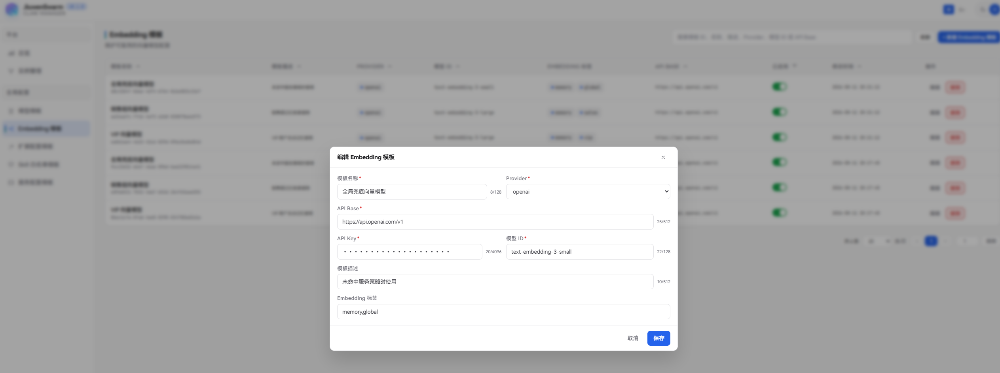

用于配置向量模型，供 Agent 记忆向量化、语义检索等场景使用。策略中通过 `embedding_model` 槽位引用。

| 字段 | 必填 | 说明 |
|------|------|------|
| 模板名称 | 是 | 自定义名称 |
| Provider | 是 | 当前固定为 `openai`（兼容 OpenAI Embeddings API 的服务均可使用） |
| API Base | 是 | Embedding 接口地址（运行时请求 `{api_base}/embeddings`） |
| API Key | 是 | 调用密钥 |
| 模型 ID | 是 | 上游模型标识，如 `text-embedding-3-large`、`embedding-3` |
| 模板描述 | 否 | 用途说明 |
| Embedding 标签 | 否 | 逗号分隔，如 `memory,task_memory` |

### 5.3 扩展配置模板

位置：**全局配置 → 扩展配置模板**

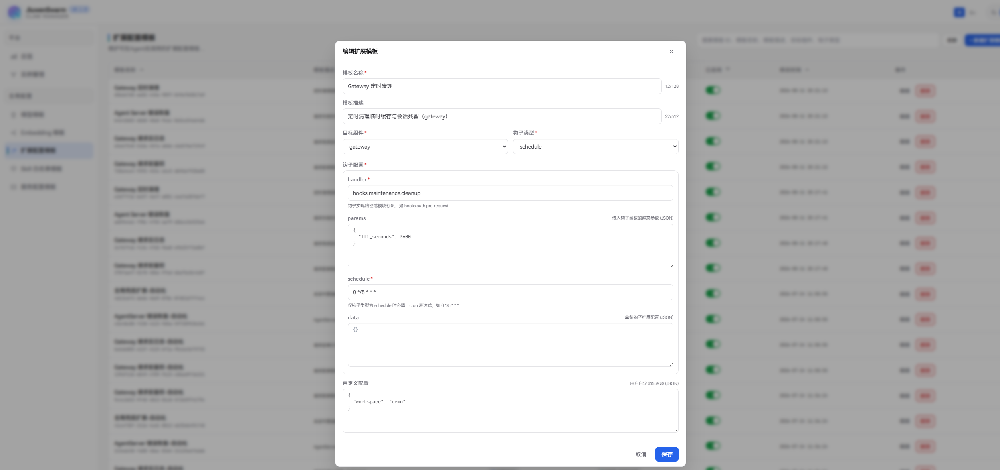

用于向 Gateway 或 AgentServer 下发钩子函数与自定义配置。策略中通过 `extension_config` 槽位引用。

| 字段 | 必填 | 说明 |
|------|------|------|
| 模板名称 | 是 | 自定义名称，如「Gateway 请求前鉴权钩子」 |
| 模板描述 | 否 | 用途说明 |
| 目标组件 | 是 | 下发到 `gateway` 还是 `agent_server` |
| 钩子类型 | 是 | `pre_request` / `post_request` / `error` / `schedule` |

钩子类型说明：
- **pre_request**：请求处理前执行，可用于参数验证、权限检查
- **post_request**：请求处理后执行，可用于日志记录、结果转换
- **error**：请求失败时执行，可用于错误恢复、告警通知
- **schedule**：按 cron 定时执行，可用于数据清理、状态同步

**钩子配置（hook_config）**

| 字段 | 必填 | 说明 |
|------|------|------|
| handler | 是 | 钩子实现路径，如 `hooks.auth.pre_request` |
| params | 否 | 传入钩子的静态参数（JSON），如 `{"log_level": "info"}` |
| schedule | 仅 schedule 类型必填 | cron 表达式，如 `0 */5 * * *` |
| data | 否 | 单条钩子扩展配置（JSON） |

**自定义配置**

| 字段 | 必填 | 说明 |
|------|------|------|
| 自定义配置 | 否 | 用户自定义配置项（JSON），如 `{"auth_header": "Authorization"}` |

### 5.4 Skill 白名单模板

位置：**全局配置 → Skill 白名单模板**

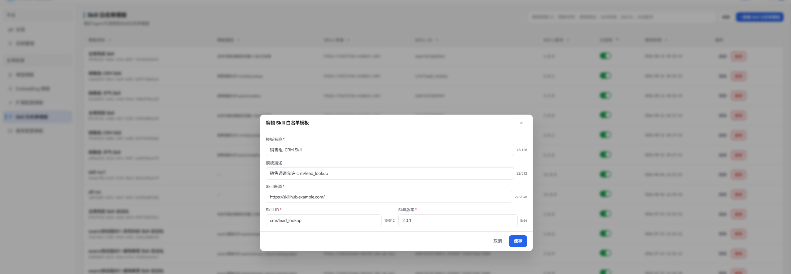

限制 Agent 可调用的 Skill，一条模板对应一个 Skill。策略中通过 `skill_whitelist` 槽位引用（可引用多条组成白名单列表）。

| 字段 | 必填 | 说明 |
|------|------|------|
| 模板名称 | 是 | 自定义名称，如「销售组 Skill 白名单」 |
| 模板描述 | 否 | 用途说明 |
| Skill 来源 | 是 | 制品源根 URL，如 `https://skillhub.example.com/` |
| Skill ID | 是 | Skill 唯一路径标识，如 `search/weather` |
| Skill 版本 | 是 | 语义化版本，如 `1.2.0` |

可按 Skill ID、来源筛选。

### 5.5 服务配置模板

位置：**全局配置 → 服务配置模板**

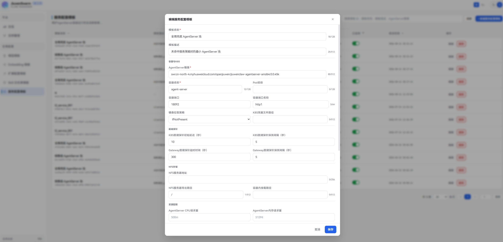

定义 AgentServer 的运行时编排参数，包括 K8s 部署、就绪探测、NFS 挂载、资源配额、服务池伸缩等。策略中通过 `service_config` 槽位引用。Gateway Runtime 启动 AgentServer 时读取模板字段，未覆盖的项回退到 Gateway 环境变量。

**基本信息**

| 字段 | 必填 | 说明 |
|------|------|------|
| 模板名称 | 是 | 自定义名称 |
| 模板描述 | 否 | 用途说明 |

**容器与 K8S**

| 字段 | 必填 | 说明 |
|------|------|------|
| AgentServer 镜像 | 是 | 容器镜像地址，如 `jiuwenclaw/agent-server:latest` |
| 容器名称 | 是 | 默认 `agentserver` |
| Pod 名称 | 否 | Pod 名称前缀，未配置时同容器名 |
| 容器端口 | 是 | 监听端口，默认 `8080` |
| 端口名称 | 否 | Service / Probe 端口名，默认 `http` |
| 镜像拉取策略 | 否 | `IfNotPresent` / `Always` / `Never`，默认 `IfNotPresent` |
| K8S 凭据文件路径 | 否 | kubeconfig 路径，空表示 in-cluster |

**就绪探针**

| 字段 | 必填 | 说明 |
|------|------|------|
| K8S 就绪探针初始延迟（秒） | 否 | 容器启动后首次探测等待，默认 10 |
| K8S 就绪探针探测间隔（秒） | 否 | 探测频率，默认 5 |
| Gateway 就绪超时（秒） | 否 | 创建实例后最多等多久，超时则拉起失败，默认 300 |
| Gateway 就绪探测间隔（秒） | 否 | 等待就绪时每次检查间隔，默认 5 |

**NFS 存储**

| 字段 | 必填 | 说明 |
|------|------|------|
| NFS 服务器地址 | 否 | 如 `192.168.1.100` |
| NFS 导出路径 | 否 | 服务端目录，默认 `/` |
| 容器内挂载路径 | 否 | 如 `/mnt/nfs` |

**资源配额**

| 字段 | 必填 | 说明 |
|------|------|------|
| AgentServer CPU 请求量 | 否 | 如 `500m` |
| AgentServer 内存请求量 | 否 | 如 `512Mi` |
| AgentServer CPU 上限 | 否 | 如 `2` |
| AgentServer 内存上限 | 否 | 如 `2Gi` |
| JiuwenBox CPU 请求量 | 否 | 如 `250m` |
| JiuwenBox 内存请求量 | 否 | 如 `256Mi` |
| JiuwenBox CPU 上限 | 否 | 如 `1` |
| JiuwenBox 内存上限 | 否 | 如 `1Gi` |

**动态池与超时**

| 字段 | 必填 | 说明 |
|------|------|------|
| 最小空闲服务数 | 否 | 池内最少保持的空闲实例，默认 1 |
| 最大服务数 | 否 | 池内实例上限，默认 20 |
| 单实例并发上限 | 否 | 默认 30 |
| 空闲实例回收 TTL（秒） | 否 | 默认 180 |
| 自动扩缩容间隔（秒） | 否 | 默认 5 |
| 单次消息超时（秒） | 否 | 默认 60 |
| 会话并发数 | 否 | 单 Session 并发上限，默认 3 |
| 会话 TTL（秒） | 否 | Session 空闲超时，默认 60 |

> 注意：最小空闲服务数不能大于最大服务数；CPU / 内存须符合 K8s 数量格式（如 `500m`、`512Mi`）。

---

## 6. 实例策略

位置：实例详情 → **实例策略**

策略决定「**一次请求使用哪套模板**」。变更保存后会通过 WebSocket 同步到 Gateway，**立即影响配置生效**，请谨慎操作。

### 6.1 整体匹配流程

一次用户请求携带 `user_id`、`group_id`、`bot_id`，Gateway 按以下顺序匹配策略：

```
请求进入
  → ① 在服务策略中，按优先级逐条匹配 match_expr，第一条命中即停
      → ② 在命中的服务策略下，按优先级逐条匹配 Agent 策略
          → ③ 用全局兜底补全未覆盖的槽位
              → ④ 合并后的 template_ref 查模板表，得到最终配置
```

**如果第 ① 步没有命中任何服务策略**，则跳过第 ② 步，直接使用全局兜底的 `template_ref`。

**优先级规则（所有策略通用）：**
- 先按 **priority 从大到小**
- priority 相同则按 **修改时间从新到旧**
- **只取第一条命中的策略**

**模板引用合并规则（template_ref）：**

各层策略都可配置模板引用，按槽位键合并，**Agent 层覆盖服务层的同名槽位，全局兜底仅补全仍缺失的槽位**：

| 情况 | 该槽位最终引用来源 |
|------|-------------------|
| Agent 策略命中且含该槽位 | Agent 策略（整组覆盖服务级） |
| 仅服务策略含该槽位 | 服务策略 |
| 服务 / Agent 均未配该槽位 | 全局兜底 |
| 未命中任何服务策略 | 全局兜底整表 |

可用的槽位与第 5 章模板的对应关系：

| 槽位 | 对应全局模板 |
|------|-------------|
| 默认模型 (`default_model`) | 5.1 模型模板 |
| 视频模型 (`video_model`) | 5.1 模型模板 |
| 音频模型 (`audio_model`) | 5.1 模型模板 |
| 视觉模型 (`vision_model`) | 5.1 模型模板 |
| Embedding 模型 (`embedding_model`) | 5.2 Embedding 模板 |
| 扩展配置 (`extension_config`) | 5.3 扩展配置模板 |
| Skill 白名单 (`skill_whitelist`) | 5.4 Skill 白名单模板 |
| 服务配置 (`service_config`) | 5.5 服务配置模板 |

引用方式支持**直接选模板**，或**用户 / 群组 / 机器人映射**（结合「默认模板映射」表解析，详见 6.5）。

举例：策略里把「默认模型」配成**群组映射** `g_demo_sales`，并指定兜底模板 M1。运行时先查默认模板映射表中「作用域类型 = 群组、作用域 ID = `g_demo_sales`、模板类型 = `default_model`」的记录；若找到则用该映射的模板，找不到则用 M1。

### 6.2 匹配表达式（match_expr）

服务策略和 Agent 策略均可通过匹配表达式限定生效范围。

支持字段：`user_id`、`group_id`、`bot_id`

支持运算符：`==`、`!=`、`and`、`or`，可用括号分组

界面提供两种模式：
- **全部匹配**：留空，表示任意请求均命中
- **条件匹配**：可视化添加条件 / 子条件组，自动生成表达式并预览

示例：`group_id == "g_demo_sales" and bot_id == "bot_main"`

### 6.3 全局兜底策略

位置：实例策略 → **全局兜底** Tab

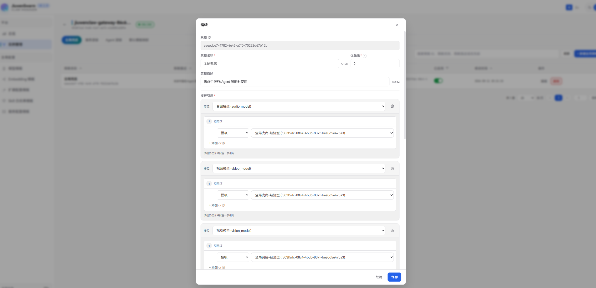

当没有更细粒度的服务 / Agent 策略命中时，使用全局兜底的模板引用作为默认配置；当有服务 / Agent 策略命中时，仅**补全**它们未覆盖的槽位。

| 字段 | 必填 | 说明 |
|------|------|------|
| 策略名称 | 是 | 自定义名称 |
| 策略描述 | 否 | 用途说明 |
| 优先级 | 是 | 数值越大越优先，同优先级修改时间越新越优先 |
| 模板引用 | 是 | 按槽位配置模板，详见 6.1 |

### 6.4 服务层级策略与 Agent 层级策略

**服务层级策略**

位置：实例策略 → **服务层级** Tab

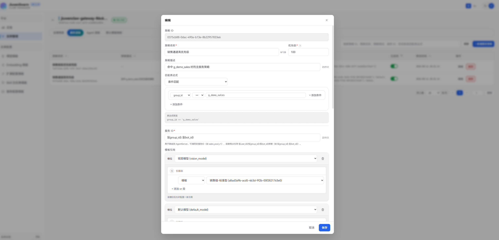

决定请求路由到哪个 AgentServer 服务池，以及服务级的模板配置。

| 字段 | 必填 | 说明 |
|------|------|------|
| 策略名称 | 是 | 自定义名称 |
| 策略描述 | 否 | 用途说明 |
| 服务 ID | 是 | AgentServer标识，用于路由请求到AgentServer。可填固定值（如 `sales_pool_v1`），或用占位符拼接（如 `${group_id}::${bot_id}`）。**未命中任何服务策略时**，默认按 `${group_id}${bot_id}` 拼接 |
| 匹配表达式 | 否 | 留空表示全匹配，详见 6.2 |
| 优先级 | 是 | 数值越大越优先，同优先级修改时间越新越优先 |
| 模板引用 | 否 | 服务级模板配置 |

> **删除约束**：若该服务策略下仍有关联的 Agent 策略，须先删除 Agent 策略，再删服务策略。

**Agent 层级策略**

位置：实例策略 → **Agent 层级** Tab

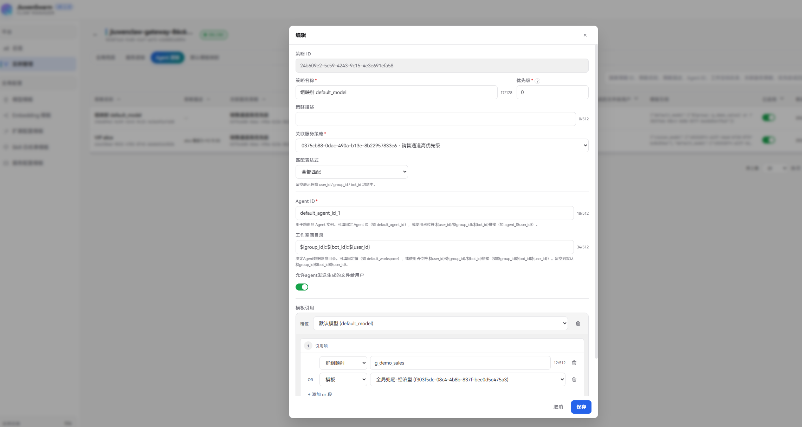

挂在某条服务策略下，决定 Agent 实例的路由、工作空间和 Agent 级模板配置。

| 字段 | 必填 | 说明 |
|------|------|------|
| 策略名称 | 是 | 自定义名称 |
| 策略描述 | 否 | 用途说明 |
| 关联服务策略 | 是 | 选择挂到哪条服务策略下 |
| Agent ID | 是 | Agent实例标识，用于路由请求到Agent实例。可填固定值（如 `default_agent`），或用占位符拼接（如 `agent_${user_id}`）。**未命中任何Agent策略时**，默认按 `${group_id}${bot_id}${user_id}` 拼接 |
| 工作空间目录 | 否 | 决定 Agent 数据落盘目录。可填固定值（如 `default_workspace`），或用占位符拼接（如 `${group_id}${bot_id}${user_id}`）。**未命中任何Agent策略时**，默认按 `${group_id}${bot_id}${user_id}` 拼接 |
| 匹配表达式 | 否 | 留空表示全匹配，详见 6.2 |
| 优先级 | 是 | 数值越大越优先，同优先级修改时间越新越优先 |
| 允许发送生成文件 | 否 | 是否允许 Agent 把生成的文件发给用户，默认打开 |
| 模板引用 | 否 | Agent 级模板配置，同名槽位会覆盖服务级 |

> 占位符仅允许 `${user_id}`、`${group_id}`、`${bot_id}` 三种，适用于服务 ID、Agent ID、工作空间目录。

### 6.5 默认模板映射

位置：实例策略 → **默认模板映射** Tab

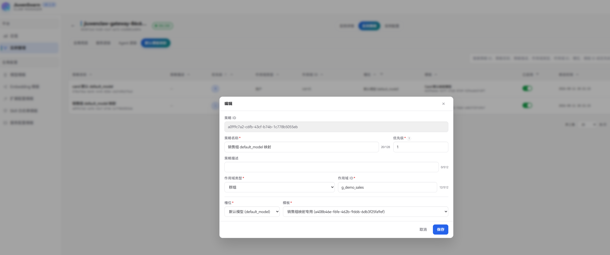

将特定用户 / 群组 / 机器人映射到具体模板。当策略的模板引用中使用「用户映射 / 群组映射 / 机器人映射」模式时，会查询本表解析出最终的模板 ID。

| 字段 | 必填 | 说明 |
|------|------|------|
| 策略名称 | 是 | 自定义名称 |
| 策略描述 | 否 | 用途说明 |
| 作用域类型 | 是 | `用户` / `群组` / `机器人` |
| 作用域 ID | 是 | 对应的用户 ID、群组 ID 或机器人 ID |
| 模板类型 | 是 | 槽位键，如 `default_model`、`skill_whitelist`、`extension_config`、`service_config` 等 |
| 模板 | 是 | 目标模板 |
| 优先级 | 是 | 数值越大越优先，同优先级修改时间越新越优先|

> 建议同一 `(作用域类型, 作用域 ID, 模板类型)` 组合下只保留一条启用的映射，避免解析歧义。

---

## 7. 实例配置（按需）

位置：实例详情 → **实例配置**

本步骤为可选运维增强，不影响策略中模型 / Skill / 路由等核心生效逻辑。相对实例策略，本页更偏 **Gateway 运行时配置**，保存后经 Manager 写入并下发 Gateway。删除 Manager 下发的配置后，Gateway 回退到本地 `config.yaml`。

### 7.1 Channel

位置：实例配置 → **Channel** Tab

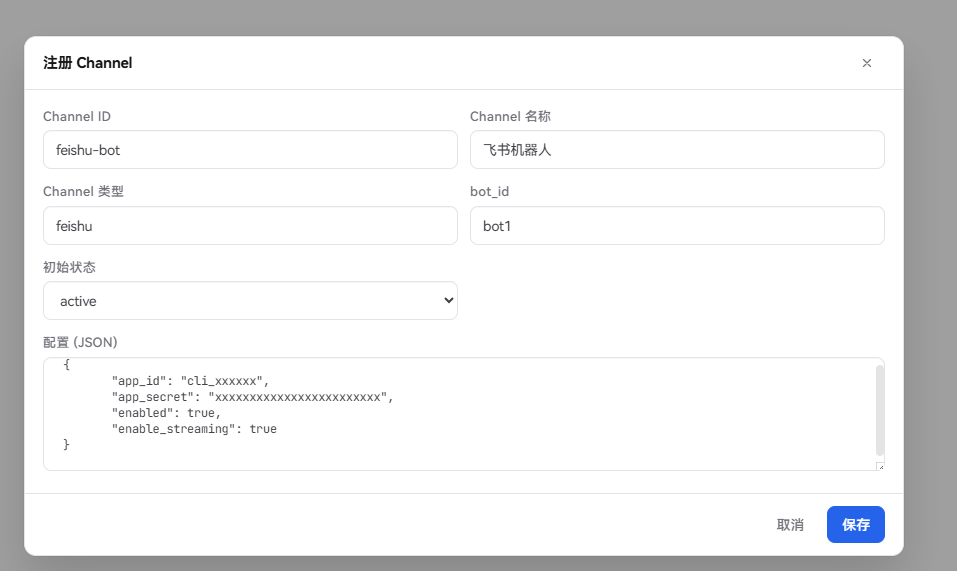

用于向 Gateway 注册消息通道。列表支持按类型 / 状态筛选，并可对已有 Channel **激活 / 停用 / 删除**（删除会同步通知 Gateway）。

> 生效前提：Gateway 需在 `.env.custom` 中配置 `DEPLOYMENT_MODE=active-standby`（主备模式），Manager 下发的 Channel 配置才会生效。

注册字段：

| 字段 | 必填 | 说明 |
|------|------|------|
| Channel ID | 是 | 通道唯一标识 |
| Channel 名称 | 是 | 展示名称 |
| Channel 类型 | 否 | 通道类型（如 feishu、wecom 等） |
| bot_id | 否 | 关联的机器人 ID |
| 初始状态 | 否 | `active`（启用）或 `inactive`（停用） |
| 配置 (JSON) | 否 | 通道连接与业务参数 |

**配置 (JSON) 示例（飞书 `feishu`）**

```json
{
  "app_id": "cli_xxxxxxxx",
  "app_secret": "xxxxxxxxxxxxxxxx",
  "enabled": true,
  "enable_streaming": true
}
```

JSON 内容会下发到 Gateway。以飞书通道为例，常用字段如下：

| 字段 | 必填 | 说明 |
|------|------|------|
| `app_id` | 是 | 飞书开放平台应用的 App ID，用于鉴权与建立 WebSocket 长连接 |
| `app_secret` | 是 | 飞书开放平台应用的 App Secret，与 `app_id` 配对使用 |
| `enabled` | 否 | 是否启用该飞书 Bot；`false` 时 Gateway 不会启动此通道（默认 `false`） |
| `enable_streaming` | 否 | 是否开启流式/过程消息下发；`true` 时 Agent 回复逐段推送到飞书，`false` 时等完整回复后一次性发送（默认 `true`） |

### 7.2 日志脱敏

位置：实例配置 → **日志脱敏** Tab

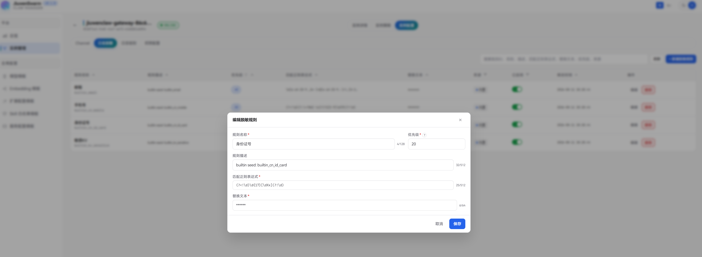

配置日志中敏感信息的替换规则。规则按**优先级从大到小**依次应用。

实例首次接入时会自动下发 **4 条内置脱敏规则**（来源为「内置」），内置规则可修改，也可自行新建自定义规则：

| 规则名称 | 说明 |
|----------|------|
| 邮箱 | 匹配邮箱地址 |
| 手机号 | 匹配中国大陆手机号 |
| 身份证号 | 匹配 18 位身份证号 |
| 敏感KV | 匹配含 password / token / api_key 等关键词的键值对 |

新建自定义规则字段说明如下：

| 字段 | 必填 | 说明 |
|------|------|------|
| 规则名称 | 是 | 自定义名称|
| 优先级 | 是 | 数值越大越先执行 |
| 规则描述 | 否 | 用途说明 |
| 匹配正则表达式 | 是 | 用于匹配敏感内容的正则，例如 `(?i)(api[_-]?key)\s*[:=]\s*\S+` |
| 替换文本 | 是 | 命中匹配正则表达式后写入日志的替换内容 |

列表中还可查看**来源**（内置 / 自定义），并对规则做启用 / 停用。

### 7.3 日志级别

位置：实例配置 → **日志级别** Tab

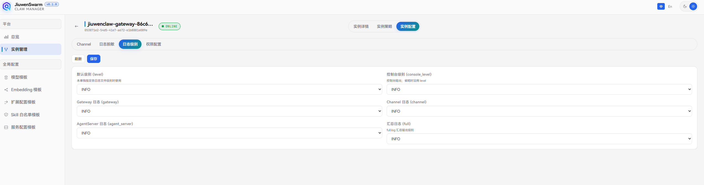

对应 `config.yaml` 的 `logging` 段。保存后由 Manager 下发 Gateway 并即时生效；点击**删除下发配置**后，Gateway 回退使用本地 `config.yaml`。

可选级别：`DEBUG` / `INFO` / `WARNING` / `ERROR` / `CRITICAL` / `NOTSET`。

| 字段 | 说明 |
|------|------|
| 默认级别 (`level`) | 未单独指定各日志文件级别时使用 |
| 控制台级别 (`console_level`) | 控制台输出级别；未设时沿用默认级别 |
| Gateway 日志 (`gateway`) | Gateway 组件日志级别 |
| Channel 日志 (`channel`) | Channel 组件日志级别 |
| AgentServer 日志 (`agent_server`) | AgentServer 组件日志级别 |
| 汇总日志 (`full`) | `full.log` 汇总输出级别 |

### 7.4 权限配置

位置：实例配置 → **权限配置** Tab

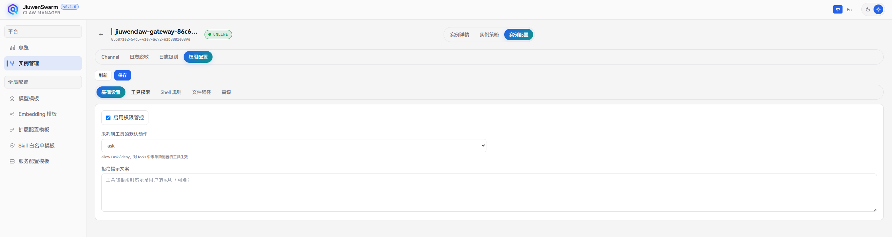

集中管理 Gateway 权限管控。保存后由 Manager 下发；点击**删除下发配置**后，Gateway 回退到本地 `config.yaml`。

页面按分区配置：

**基础设置**

| 字段 | 说明 |
|------|------|
| 启用权限管控 | 总开关，关闭后不执行权限拦截 |
| 未列明工具的默认动作 | 对「工具权限」中未单独配置的工具生效：`allow` / `ask` / `deny` |
| 拒绝提示文案 | 工具被拒绝时展示给用户的说明（可选） |

**工具权限**

按工具名配置整工具级动作，优先级高于 Shell 规则。

| 字段 | 说明 |
|------|------|
| 工具名称 | 工具标识（如 `bash`、`read_file`） |
| 动作 | `allow` / `ask` / `deny` |

**Shell 规则**

仅匹配 Shell 命令文本。

| 字段 | 说明 |
|------|------|
| 规则 ID | 规则唯一标识 |
| 匹配模式 | 命令文本匹配模式 |
| 动作 | `allow` / `deny` |
| 描述 | 规则说明（可选） |

**文件路径**

| 字段 | 说明 |
|------|------|
| Workspace 内默认放行读写 | 是否默认允许读写 Workspace 内文件 |
| Global 白名单 (JSON) | 全局路径白名单 |
| 可信执行目录 (JSON 数组) | 允许执行的目录列表 |
| Tool Bindings (JSON) | 工具与路径绑定规则 |

**高级**

| 字段 | 说明 |
|------|------|
| 启用命令意图抽取 | 是否开启命令意图识别 |
| 超时（秒） | 命令意图抽取超时时间 |

---

## 8. 联调验证

完成步骤 ①～④（及按需的步骤 ⑤）后，用真实业务请求验证配置是否按预期生效。

### 8.1 验证清单

| 验证项 | 操作 | 预期 |
|--------|------|------|
| Gateway 连通 | 总览 / 实例详情查看心跳 | Gateway 在线，最近心跳更新 |
| 模型路由 | 用目标 user/group/bot 发对话 | 命中对应模型（可对比 API 日志或回复特征） |
| Embedding | 触发记忆写入 / 检索 | 使用步骤 ③ 配置的 Embedding 端点 |
| Skill 白名单 | 调用允许 / 禁止的 Skill | 白名单内可用，名单外被拒绝 |
| 服务池 | 观察 AgentServer 扩缩 | 符合服务配置模板的池参数 |
| 实例配置（若已配） | 调整日志级别后观察日志 | Gateway 热更新生效 |

### 8.2 常见端到端场景

**为销售群配置专用模型与服务池**

1. 步骤 ③：在**模型模板**新建「销售对话模型」；在**服务配置模板**新建「销售池资源配置」。  
2. 步骤 ④：打开目标实例 → **实例策略 → 服务层级**，新建策略：  
   - `match_expr`：`group_id == "g_sales" and bot_id == "bot_main"`  
   - `service_id`：如 `${group_id}::${bot_id}` 或固定池名  
   - `template_ref` 中引用上述模型与服务配置  
   - 设置较高 **priority**  
3. 步骤 ④：在 **Agent 层级**挂该服务策略，配置 `agent_id` / `workspace_dir`。  
4. 步骤 ⑥：用该群/机器人发一条消息，确认路由与模型符合预期。

**全实例统一 Skill 白名单**

1. 步骤 ③：新建 Skill 白名单模板，填入允许使用的 Skill 列表。  
2. 步骤 ④：在**全局兜底**策略的 `template_ref` 中配置 `skill_whitelist` 槽位，引用该模板。  
3. 步骤 ⑥：分别调用白名单内 / 外的 Skill，确认名单内可用、名单外被拒绝。

**临时调高 Gateway 日志级别排查问题**

1. 步骤 ⑤：进入实例 → **实例配置 → 日志级别**，将Gateway级别或默认级别调到 `DEBUG` / `INFO`。  
2. 步骤 ⑥：复现问题并查看 Gateway 日志。  
3. 排查结束后**删除下发配置**，Gateway 回退到 `config.yaml`。


