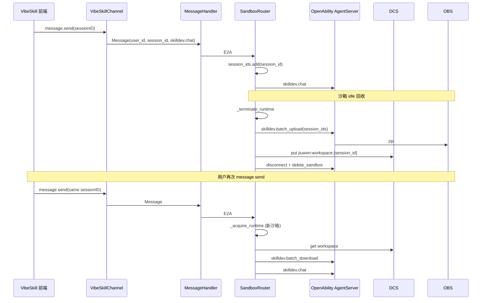
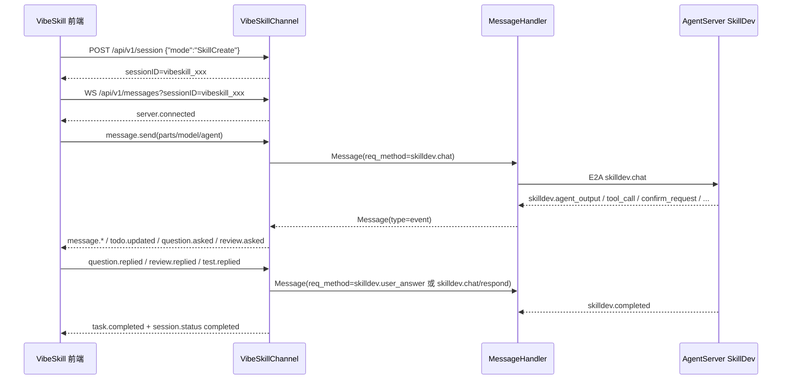
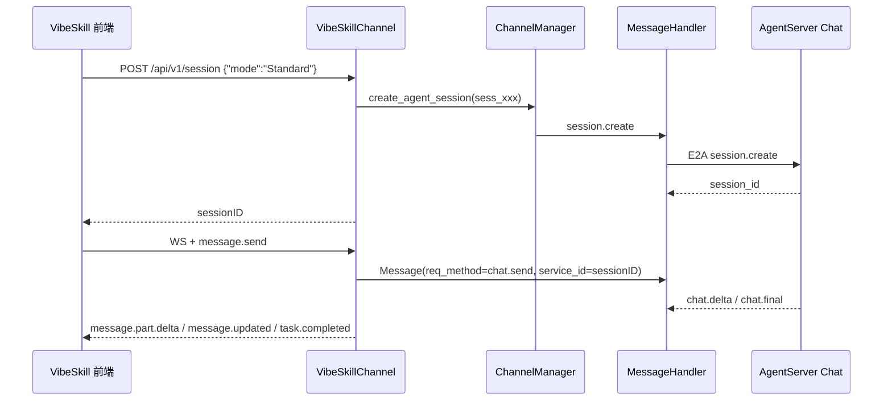
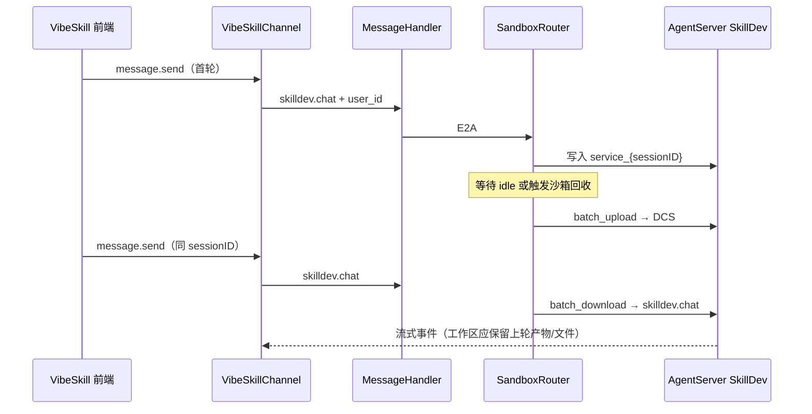

# VibeSkill Channel 架构与接口说明

> 本文基于 `jiuwenclaw/channel/vibeskill_channel.py`、`vibeskill_session.py`、`vibeskill_file_utils.py`、`gateway/channel_manager.py`、`gateway/message_handler.py` 与 `gateway/sandbox_router.py` 梳理，用于测试串讲 VibeSkill Channel 的架构、协议入口、消息转换和关键验证点。

## 1. 定位

VibeSkill Channel 是 JiuwenClaw 为 VibeSkill 前端提供的专用接入层，频道标识为 `vibeskill`。它继承 `BaseChannel`，但没有复用 `GatewayServer` 的通用 WebSocket 路由，而是自己启动独立的 HTTP Server 与 WebSocket Server。

默认端口：

| 服务 | 默认地址 | 用途 |
|------|----------|------|
| HTTP | `http://{local_ip}:19002/api/v1` | 会话、文件、版本、导出、注册 Skill 等 REST 接口 |
| WebSocket | `ws://{local_ip}:19003/api/v1/messages` | 前端实时对话、SkillDev 流式事件、确认问题回填 |

核心职责：

- 接收 VibeSkill 前端的 REST 与 WebSocket 请求。
- 将前端协议转换成 JiuwenClaw 内部统一 `Message`。
- 通过 `ChannelManager` / `MessageHandler` 转发到 AgentServer。
- 将 AgentServer 的 `chat.*` 与 `skilldev.*` 事件转换回 VibeSkill 前端事件。
- 维护 VibeSkill session 状态、内外 session ID 映射、WebSocket 连接绑定与待确认请求。

## 2. 总体架构

```mermaid
flowchart LR
    FE["VibeSkill 前端"]
    HTTP["VibeSkillChannel HTTP Server<br/>19002 /api/v1"]
    WS["VibeSkillChannel WebSocket Server<br/>19003 /api/v1/messages"]
    STORE["VibeSkillSessionStore<br/>状态与内外 ID 映射"]
    CM["ChannelManager"]
    MH["MessageHandler"]
    SR["SandboxRouterAgentClient<br/>可选，SANDBOX_ENABLE"]
    AS["AgentServer / OpenAbility<br/>chat / skilldev"]

    FE -->|REST| HTTP
    FE <-->|WebSocket| WS
    HTTP --> STORE
    WS --> STORE
    HTTP -->|send_request / create_agent_session / register_skill| CM
    WS -->|deliver_to_message_handler(Message)| CM
    CM --> MH
    MH <-->|E2A| SR
    SR <-->|按 user_id 路由沙箱 OA| AS
    MH -->|robot_messages| CM
    CM -->|Channel.send| WS
```

> 未开启沙箱路由时，`MessageHandler` 直连 `WebSocketAgentServerClient`；开启后由 `SandboxRouterAgentClient` 代替默认 Agent 客户端（见 `app_gateway.py`）。

启动链路：

1. `app_gateway.py` 创建 `VibeSkillChannel(VibeSkillConfig(channel_id="vibeskill"))`。
2. `ChannelManager.register_channel(vibeskill_channel)` 注册频道，出站响应会通过 `channel.send(msg)` 回到该频道。
3. `vibeskill_channel.start()` 启动独立 HTTP 与 WebSocket 服务。
4. WebSocket 入站消息通过 `self.bus.deliver_to_message_handler(msg)` 送入 `MessageHandler`。
5. AgentServer 响应经 `MessageHandler.consume_robot_messages()` 被 `ChannelManager` 派发回 `VibeSkillChannel.send()`。

## 3. 核心对象

### 3.1 `VibeSkillConfig`

| 字段 | 默认值 | 说明 |
|------|--------|------|
| `enabled` | `True` | 是否启用频道 |
| `channel_id` | `vibeskill` | 注册到 `ChannelManager` 的频道 ID |
| `default_session_id` | `vibeskill_session` | 默认会话 ID，当前主流程主要使用动态 session |
| `http_port` | `19002` | 独立 HTTP 服务端口 |
| `ws_port` | `19003` | 独立 WebSocket 服务端口 |

### 3.2 `VibeSkillSessionStore`

Session Store 由每个 `VibeSkillChannel` 实例独立持有，不是全局单例。

统一使用单一 `session_id`（前端 `sessionID`、Channel 内存表、MessageHandler、`task_id` / `service_id` 均为此 ID，不再区分 external / internal）。

正常建会话流程：

1. `POST /api/v1/session` 调用 `get_or_create(session_id=None)`，Channel 生成 `vibeskill_<hex>` 作为 `session_id` 并返回给前端。
2. 前端用该 `sessionID` 建 WebSocket、发 `message.send`；Channel 用同一 `session_id` 查表并路由到 SkillDev / Standard。

会话状态：

| 状态 | 含义 | 典型触发 |
|------|------|----------|
| `idle` | 空闲 | 新建、单轮结束等待用户（`skilldev.agent_completed`）、取消、错误恢复、Standard chat final/cancel |
| `busy` | 正在处理 | 收到 `message.send` / `review.replied` 等 |
| `completed` | SkillDev 任务完成 | 收到 `skilldev.completed`（产物就绪） |
| `retry` | 可重试状态 | 设计上预留 |

会话模式：

| 模式 | 说明 | 入站 `message.send` 转换 |
|------|------|--------------------------|
| `SkillCreate` | 默认模式，用于 Skill 创建/解析/评审/打包 | `ReqMethod.SKILLDEV_CHAT` |
| `Standard` | 标准 JiuwenClaw 对话模式 | `ReqMethod.CHAT_SEND` |

### 3.3 DCS 持久化（可选）

`VibeSkillSessionStore` 支持可选注入 `VibeSkillSessionDcsStore` 作为远端后端，把 session 元数据持久化到华为 DCS（Redis Cluster 兼容）。开启后，多个 Gateway 实例共享同一份 session 数据，gateway1 创建的 session 可被 gateway2 查到。

启用方式：设置环境变量 `SANDBOX_DCS_HOST`（与 Sandbox 路由共用，未设置则退化为纯内存）。全部 DCS Key 与 Gateway 读写关系见 [DCS 项速查表](../sandbox/DCS项速查表.md)。

| 环境变量 | 默认值 | 说明 |
|----------|--------|------|
| `SANDBOX_DCS_HOST` | 无 | DCS 主机；**未设置则禁用 VibeSkill DCS 持久化** |
| `SANDBOX_DCS_PORT` | `2881` | DCS 端口 |
| `SANDBOX_DCS_PASSWORD` | 无 | DCS 密码（可选） |
| `SANDBOX_DCS_TTL_SECONDS` | 未设 | 显式覆盖 `sandboxApiKey` / `sandboxToOA` / routing 的 DCS TTL（秒）；`0` 表示不过期 |
| `SESSION_DCS_TTL_SECONDS` | `0` | `vibeskillSession` 与 `workspace` 的 DCS TTL（秒）；`0` 表示不过期 |
| `SANDBOX_DURATION_SECONDS` | `3600` | 远端沙箱存活时长（创建/续期时传给沙箱服务）；亦作为 `sandboxApiKey` / routing 的 DCS TTL 默认基准（见 sandbox 文档） |
| `SANDBOX_IDLE_TIMEOUT_SECONDS` | `600` | 空闲沙箱自动回收阈值（秒）；**同时**作为远端存活续期的触发阈值（见下文「沙箱存活续期」） |

Redis 连接与 TTL 逻辑由公共模块 `jiuwenclaw/dcs`（`DcsClusterClient`）提供；业务 key 与序列化仍在本模块。

Key 命名（与 `sandbox_dcs_store.py` 同模式，写死常量）。完整速查见 [DCS 项速查表](../sandbox/DCS项速查表.md#jiuwenvibeskillsessionsession_id)。

| Key | 值 |
|-----|----|
| `jiuwen:vibeskillSession:<session_id>` | JSON 序列化的 session（含 `state` / `mode` / `metadata` / `created_at` / `updated_at`） |

读写策略：

- **读**：先查本地内存，miss 时查 DCS，命中后回填本地内存并返回。
- **写**：先 `await dcs.save_session(...)`，成功后再更新本地内存；DCS 写失败 **fail-fast**，本地内存不被污染。
- `delete_session`：先删 DCS 主 key，再清本地。
- `get_user_id` 保持同步签名，仅读本机内存；跨 gateway 时调用方应先经 `get_session` / `resolve_session` 触发 DCS read-through 回填。
- `list_sessions` 仅返回本机视图，不扫描远端 keys。
- 反序列化兼容旧数据中的 `internal_id` 字段名。

已知边界：

- **WS 出站事件仍 gateway-本地**：DCS 只解决 session 元数据跨机可见；流式响应仍由收到 `message.send` 的 gateway 处理，生产需 LB sticky session（基于 `sessionID` hash）。
- **`_message_ctx` / `_pending_confirms` 不持久化**：流式上下文仍为 gateway 本地，进程重启或换机器后需前端重连重发。
- **不做跨 gateway 缓存失效广播**：另一节点删除 session 后，本机缓存待自然驱逐或重启对齐。

**沙箱亲和（Gateway 故障切换）**：在 `SANDBOX_ENABLE=true` 且 `SANDBOX_ADOPT_EXISTING=true` 时，Gateway 将 `routing_key → sandbox_id` 写入 DCS（`jiuwen:sandboxRouting:*`，见 `docs/sandbox/Sandbox实现进展.md` §3.1）。G1 建 session/跑任务后若 G2 接管业务请求，只要：

1. `SANDBOX_DCS_HOST` 指向同一 DCS 集群（Session 与 Sandbox 共用）；
2. G2 能 `resolve_session(sessionID)` 得到与 G1 相同的 `metadata.user_id`（未传时即为 `session_id`）；
3. 原 sandbox 未被 idle terminate 且 `sandboxToOA` 仍有效；

则 G2 **重连** 同一 `sandbox_id`，不会再次 `create_sandbox`。WS 仍建议粘滞；沙箱状态在沙箱内，与 WS 是否换 Gateway 解耦。

**沙箱存活续期**：远端沙箱实例有 `SANDBOX_DURATION_SECONDS`（默认 3600s）硬上限，到期后由沙箱管理服务自动释放。Gateway 在 `SandboxRouterAgentClient` 内**本地维护**每个 runtime 的 `expires_at`（不向沙箱服务 HTTP 查询剩余时间），并在剩余时间 **小于** `SANDBOX_IDLE_TIMEOUT_SECONDS`（默认 600s）时调用 `SandboxClient.refresh_duration`，将远端存活续期为 `SANDBOX_DURATION_SECONDS`。

| 场景 | `expires_at` 估算 |
|------|-------------------|
| 本机 `create_sandbox` | `now + SANDBOX_DURATION_SECONDS` |
| DCS adopt | `routing.updated_at + SANDBOX_DURATION_SECONDS` |

续期检查触发点：**DCS adopt 完成后**、**空闲巡检**（约每 30s，与 idle 回收同循环；续期不要求 `task_count == 0`）。**不在** `_acquire_runtime_for_key` 本地复用路径触发。续期失败仅记日志，不阻断当前请求。续期成功后会同步刷新 `sandboxApiKey` / `sandboxToOA` / routing 的 DCS TTL（**不含** `workspace` 与 session）。

详见 [Sandbox 实现进展](../sandbox/Sandbox实现进展.md) §2.8、[DCS 项速查表](../sandbox/DCS项速查表.md#沙箱续期与-dcs-ttl)。

### 3.4 工作区持久化（Sandbox 模式）

在 `SANDBOX_ENABLE=true` 时，SkillDev 任务工作区位于远端沙箱内 AgentServer 的 `get_user_workspace_dir()/service_{session_id}` 目录（与 Channel 侧 `params.service_id` / `task_id` 一致，均为前端 `sessionID`）。沙箱因空闲回收、容量挤占或 Gateway 关闭而被销毁后，磁盘上的 `service_*` 目录会随之丢失。

**编排层在 `SandboxRouterAgentClient`（`gateway/sandbox_router.py`），不在 VibeSkillChannel。** Channel 仍按既有协议把 `message.send` 等转成带 `user_id` 与 `session_id` 的 `Message`；备份与恢复由 Router 在转发 OpenAbility 之前/之后自动完成。打包、上传 OBS、下载解压的具体实现在 AgentServer `SkillDevService` 的 `skilldev.batch_upload` / `skilldev.batch_download`（`agentserver/skilldev/service.py`）。

#### 职责划分

| 组件 | 职责 |
|------|------|
| `VibeSkillChannel` | 协议转换、`user_id` 写入 `Message`；**不**暴露 `skilldev.batch_upload` / `skilldev.batch_download` WebSocket 入口 |
| `SandboxRouterAgentClient` | 按请求累积 `session_id`；销毁前 `batch_upload`；新沙箱首包业务请求前 `batch_download`；空闲巡检/DCS adopt 时远端沙箱存活续期（§2.8） |
| `SkillDevService` | 对 `service_{session_id}` 打 zip、上传 OBS、按 URL 下载解压 |
| `WorkspaceDcsStore` | 将 `session_id → OBS URL` 写入 DCS，供跨沙箱、跨 Gateway 恢复 |

#### DCS Key（工作区快照）

与 session 元数据（`jiuwen:vibeskillSession:*`）、沙箱路由（`jiuwen:sandboxRouting:*`）正交。Gateway 读写明细见 [DCS 项速查表](../sandbox/DCS项速查表.md#jiuwenworkspacesession_id)。

| Key | 值 |
|-----|----|
| `jiuwen:workspace:{session_id}` | JSON：`url`、`name`、`uploaded_at`、`routing_key`、`sandbox_id` |

| 环境变量 | 默认值 | 说明 |
|----------|--------|------|
| `SESSION_DCS_TTL_SECONDS` | `0` | 工作区快照 TTL（秒）；`0` 表示不过期 |

#### 自动备份（沙箱销毁前）

触发点：`_terminate_runtime`（空闲超时、池满挤占空闲沙箱、Gateway `disconnect` 等），在 **断开 OpenAbility 连接之前**：

1. 读取该沙箱 `runtime.metadata["session_ids"]`（仅包含本 runtime 上曾处理过的 `session_id`，由 `send_request` / `send_request_stream` 按 envelope 累积）。
2. 若非空，经当前 `runtime.agent_client` 调用 `skilldev.batch_upload`（`params.session_ids`），**不**再走 `_acquire_runtime`，避免 `TERMINATING` 死锁。
3. 上传成功的项写入 `jiuwen:workspace:{session_id}`；失败仅记日志，默认仍继续销毁沙箱（避免泄漏占满配额）。

#### 自动恢复（新沙箱 / 新请求）

触发点：每次 `send_request` / `send_request_stream` 在 `_acquire_runtime` 之后、转发业务 E2A **之前**：

1. 若 `method` 为 `skilldev.batch_upload` / `skilldev.batch_download` 则跳过（内部调用）。
2. 若 envelope 带有效 `session_id`，查 DCS 是否有工作区快照。
3. 若存在且该 runtime 尚未恢复过该 `session_id`（`metadata.restored_session_ids`），调用 `skilldev.batch_download` 解压到 `service_{session_id}`。
4. 成功后标记已恢复，再转发 `skilldev.chat` 等正常请求。

沙箱路由键仍为 `vibeskill:user:{user_id}`（优先）；同一用户多 session 共享一个沙箱，各 session 工作区目录隔离，销毁时按 session 维度分别打包上传。

#### 与前端协议的关系

- VibeSkill **WebSocket 入站表不包含** `skilldev.batch_upload` / `skilldev.batch_download`；前端无需、也不应直接触发备份/恢复。
- 前端只需继续 `POST /session`、`message.send` 等；沙箱回收后再次 `message.send` 时，Gateway 在后台完成 download + chat。
- HTTP/WS 请求中的 `Message.user_id`（或 session metadata 中的 `user_id`）必须正确，以便 Router 路由到对应用户沙箱。



更细的沙箱池与 DCS 路由说明见 [Sandbox 实现进展](../sandbox/Sandbox实现进展.md)、[DCS 项速查表](../sandbox/DCS项速查表.md)；`skilldev.batch_*` 请求/响应字段见 `jiuwenclaw/agentserver/skilldev/docs/BATCH_UPLOAD_DOWNLOAD_API.md`（仅供 AgentServer / Gateway 内部，非 VibeSkill 前端协议）。

## 4. WebSocket 接口

### 4.1 连接

地址：

```text
ws://127.0.0.1:19003/api/v1/messages?sessionID={sessionID}
```

连接规则：

- 只接受路径 `/api/v1/messages`。
- 可通过 query 参数 `sessionID` 绑定已有会话。
- 建连成功后服务端发送：

```json
{
  "type": "server.connected",
  "properties": {}
}
```

- 服务端每 10 秒发送心跳：

```json
{
  "type": "server.heartbeat",
  "properties": {
    "timestamp": 1710000000000
  }
}
```

### 4.2 入站消息

| 前端消息类型 | 主要字段 | 内部转换 | 说明 |
|--------------|----------|----------|------|
| `message.send` | `sessionID`, `parts`, `model`, `agent`, `agent_id`/`agentId`, `system` | `SKILLDEV_CHAT` 或 `CHAT_SEND` | 核心发送入口，按 session mode 分流；SkillCreate 每轮会先清空 `_message_ctx` |
| `skill.parse` | `sessionID`, `url`, `filename`（可包在 `properties` 内） | `SKILLDEV_PARSE_SKILL` | 导入 skill 压缩包到任务工作区，仅 SkillCreate 模式 |
| `question.replied` | `sessionID`, `requestID`, `answers`（可包在 `properties` 内） | `SKILLDEV_USER_ANSWER` | 回答结构化提问（`skilldev.ask_user_question`） |
| `review.replied` | `sessionID`, `id`, `accept`, `feedback` | `SKILLDEV_CHAT` | 审阅结果仅写入 `params.query`（通过/反馈文案） |
| `desc_optimize.replied` | `sessionID`, `id`, `accept` | `SKILLDEV_RESPOND` | 描述优化确认（`action=skip` 或 `optimize`） |
| `test.replied` | `sessionID`, `id`, `accept` | `SKILLDEV_RESPOND` | 是否进入测试设计（`action=test_design` 或 `skip_tests`） |

> **说明**：`skilldev.batch_upload` / `skilldev.batch_download` 不由 VibeSkill Channel 接收；工作区备份与恢复在开启沙箱时由 `SandboxRouterAgentClient` 自动调用（见 §3.4）。

`message.send` 的 `parts` 支持：

| part 类型 | 字段 | 转换结果 |
|-----------|------|----------|
| `text` | `text` | 拼接为 `params.query` |
| `file` | `filename`, `url`, `mime`, `resourceType` | 普通文件进入 `params.files`；`resourceType=skill` 进入 `params.skill_packages` |
| `toolDefinition` | `pluginId`, `pluginType`, `toolType`, `toolName`, `description`, `arguments`, `protocol` | 进入 `params.tool_spec_files` |
| `agentDefinition` | `agentId`, `name`, `description`, `parameters` | 进入 `params.agent_definitions` |
| `cliDefinition` | `name`, `version`, `description`, `executeSide`, `requirePermissions`, `inputSchema`, `outputSchema` | 进入 `params.cli_definitions` |

SkillCreate 模式 `message.send` 示例：

```json
{
  "type": "message.send",
  "sessionID": "vibeskill_xxx",
  "parts": [
    {"type": "text", "text": "创建一个能计算大数乘法的 skill"}
  ],
  "model": {"providerID": "llm_OpenAI", "modelID": "deepseek-v3-250324"},
  "agent": "coder"
}
```

转换后的内部请求要点：

```text
channel_id = vibeskill
req_method = skilldev.chat
session_id = 前端 sessionID
params.task_id = 前端 sessionID
params.query = parts 中所有 text 拼接
params.files / skill_packages / tool_spec_files / agent_definitions / cli_definitions = 按 part 类型填充
params.agent_id = 可选，来自 message 顶层 agent_id 或 agentId
metadata.vibeskill_original_session_id = external sessionID
is_stream = true
```

Standard 模式 `message.send` 转换要点：

```text
req_method = chat.send
params.query = parts 中所有 text 拼接
params.service_id = sessionID（与 session_id 相同）
```

`service_id` 用于按 session 做租户隔离，避免 Standard 模式落到共享默认工作区。

### 4.3 出站事件

AgentServer 返回的 `Message(type="event")` 会在 `outbound_intercept()` 中转换成 VibeSkill 前端事件。

SkillDev 事件映射：

| AgentServer 事件 | 前端事件 | 说明 |
|------------------|----------|------|
| `skilldev.skill_name_ready` | `session.updated` | 更新会话标题 |
| `skilldev.agent_thinking` | `message.updated` + `message.part.updated/delta` | reasoning 流式输出（payload 仅 `delta`） |
| `skilldev.agent_output` | `message.updated` + `message.part.updated/delta` | assistant 文本流式输出（payload 仅 `delta`） |
| `skilldev.tool_call` | `message.part.updated` | 工具调用开始，part 类型为 `tool` |
| `skilldev.tool_result` | `message.part.updated` | 工具调用结束，写入 `state.output`（即使 part 已存在也会推送） |
| `skilldev.todos_update` | `todo.updated` | Todo 列表更新 |
| `skilldev.ask_user_question` | `question.asked` | 结构化澄清提问（`questions` 列表） |
| `skilldev.confirm_request` | `review.asked` / `desc_optimize.asked` / `test.asked` | 按 `confirm_type` 分流：`review` / `desc_optimize_confirm` / `skip_tests_confirm` |
| `skilldev.agent_completed` | `session.status` | 单轮 Agent 结束、等待用户确认，状态置为 idle，随后关闭北向 WS |
| `skilldev.error` | `message.*` + `task.error` + `session.status` | 输出错误文本 part，状态置为 idle |
| `skilldev.completed` | `task.completed` + `session.status` | 状态置为 completed |

通用 chat 事件映射（Standard 模式）：

| AgentServer 事件 | 前端事件 | 说明 |
|------------------|----------|------|
| `chat.delta` | `message.part.delta` | 标准对话流式增量 |
| `chat.final` | `message.updated` + `task.completed` | 标准对话结束，Standard session 置为 idle |
| `chat.error` | `message.updated`(error part) + `task.error` + `task.completed` + `session.status idle` | 错误收口；error 文本若过长会被截断为 `_CHAT_ERROR_MAX_TEXT_LEN` |
| `chat.tool_call` | `message.part.updated`（tool part, status=running） | 工具调用开始；`tool_call.function.arguments` 若为 JSON 字符串会被解析进 `state.input` |
| `chat.tool_result` | `message.part.updated`（tool part, status=completed/error） | 工具结果，含 `state.output`（来自 payload.result） |
| `chat.ask_user_question` | `question.asked` | 结构化提问；Standard 模式登记 `dispatch="chat"`，后续 `question.replied` 经 `chat.user_answer` 回写 |
| `chat.interrupt_result` | 状态置为 idle（仅当 `intent="cancel"`） | 取消/暂停/恢复结果；pause/resume 不会改变 session 状态。历史代码里曾用 `chat.cancel` 字符串匹配，目前两者都识别 |

`question.replied` 的回写路径：

- SkillCreate session → `skilldev.user_answer`（`SKILLDEV_USER_ANSWER`）；
- Standard session → `chat.user_answer`（`CHAT_ANSWER`）。

路由依据为 `VibeSkillSession.mode`，`_pending_confirms[request_id].dispatch` 字段仅做一致性校验，
不一致时记 warning 并以 `session.mode` 为准。

消息聚合规则：

- Channel 为每个 session 维护 `_message_ctx`。
- 每次 SkillCreate 模式的 `message.send` 会先调用 `_clear_message_context_for_session`，为新一轮执行分配新的 assistant `message_id`。
- 一个 assistant message 有一个 `message_id` 和多个 `parts`；文本、reasoning、tool 调用分别作为不同 part。
- `skilldev.agent_thinking` / `skilldev.agent_output` 仅携带 `delta`：若与上一条流式种类相同则追加到当前 part 并发送 `message.part.delta`，否则新建 part 并发送 `message.part.updated`。
- 首次需要展示 part 前，会先补发 `message.updated`，后续增量用 `message.part.delta` 或 `message.part.updated`。

## 5. HTTP REST 接口

### 5.1 会话接口

| 方法 | 路径 | 状态 | 说明 |
|------|------|------|------|
| `POST` | `/api/v1/session` | 已实现 | 创建会话，body 可传 `{"mode":"SkillCreate"}` 或 `{"mode":"Standard"}` |
| `GET` | `/api/v1/session/{sessionID}` | 已实现 | 查询 session 状态 |
| `DELETE` | `/api/v1/session/{sessionID}` | 已实现 | 删除本地 session 记录 |
| `POST` | `/api/v1/session/{sessionID}/abort` | 已实现 | 要求北向 WS 仍连接；SkillCreate 经 MessageHandler 派发 `skilldev.cancel`，Standard 派发 `chat.interrupt`（`CHAT_CANCEL`）；无 WS 时返回 400 `websocket_not_connected` |
| `GET` | `/api/v1/session/{sessionID}/messages` | 已实现 | 调用 `skilldev.restore`，将 `timeline_items` 反转为前端消息列表 |
| `POST` | `/api/v1/session/{sessionID}/summarize` | 占位 | 当前返回 `202 {"triggered":true}` |

创建 SkillCreate 会话：

```bash
curl -X POST http://127.0.0.1:19002/api/v1/session \
  -H 'Content-Type: application/json' \
  -d '{"mode":"SkillCreate"}'
```

响应：

```json
{
  "sessionID": "vibeskill_abc123def456",
  "time": {
    "created": 1710000000000,
    "updated": 1710000000000
  },
  "status": {
    "sessionStatus": "idle",
    "sandboxStatus": "none"
  }
}
```

创建 Standard 会话：

```bash
curl -X POST http://127.0.0.1:19002/api/v1/session \
  -H 'Content-Type: application/json' \
  -d '{"mode":"Standard"}'
```

Standard 模式会额外调用 `ChannelManager.create_agent_session()`，再由 `MessageHandler` 发送 `session.create` 到 AgentServer。

### 5.2 文件接口

| 方法 | 路径 | 状态 | 说明 |
|------|------|------|------|
| `GET` | `/api/v1/session/{sessionID}/file` | 已实现 | 调用 `skilldev.file.list`，返回前端 `FileTreeNode[]` |
| `GET` | `/api/v1/session/{sessionID}/file/content?path={path}` | 已实现 | 调用 `skilldev.file.read`，返回文本内容 |
| `PUT` | `/api/v1/session/{sessionID}/file/content?path={path}` | 已实现 | 调用 `skilldev.file.write`，覆盖写入文本文件 |
| `GET` | `/api/v1/session/{sessionID}/file/status` | 占位 | 当前返回空数组 |

文件树转换规则：

- 后端 `dir` 转成前端 `type: "directory"`。
- 后端 `file` 转成前端 `type: "file"`。
- `absolute` 统一拼成 `/vibeskill/{task_id}/skill/{relative_path}`。
- `ignored` 固定为 `false`。

文件内容响应：

```json
{
  "type": "text",
  "content": "...",
  "encoding": "utf8",
  "mimeType": "text/plain"
}
```

文件写入请求体（对齐 opencode FileContent schema）：

```json
{
  "content": "#!/usr/bin/env python3\n..."
}
```

文件写入响应：

```json
{
  "ok": true,
  "path": "...",
  "size": 123
}
```

写入失败时返回 `{"ok": false, "error": "..."}`，HTTP 状态码 400/502 视错误来源而定。

### 5.3 搜索、VCS 与版本接口

| 方法 | 路径 | 状态 | 当前行为 |
|------|------|------|----------|
| `GET` | `/api/v1/session/{sessionID}/find` | 占位 | 返回空数组 |
| `GET` | `/api/v1/session/{sessionID}/find/file` | 占位 | 返回空数组 |
| `GET` | `/api/v1/session/{sessionID}/vcs` | 占位 | 返回 `{"branch":"main"}` |
| `POST` | `/api/v1/session/{sessionID}/version` | 占位 | 返回随机 `commitHash` 与空文件列表 |
| `GET` | `/api/v1/session/{sessionID}/version` | 占位 | 返回空 commit 列表 |
| `POST` | `/api/v1/session/{sessionID}/version/{commitHash}/rollback` | 占位 | 返回 `{"rolledBack":true}` |
| `GET` | `/api/v1/session/{sessionID}/version/{commitHash}/diff` | 占位 | 返回空 diff stat |

### 5.4 导出与 Skill 注册

| 方法 | 路径 | 状态 | 说明 |
|------|------|------|------|
| `POST` | `/api/v1/session/{sessionID}/export` | 已实现 | 调用 `skilldev.download`，返回导出包信息 |
| `POST` | `/api/v1/session/{sessionID}/register-skill` | 已实现 | 仅 Standard mode 支持，调用 `skills.import_local` 注册远程 skill 包 |

导出响应要求：

```json
{
  "exportId": "xxx",
  "url": "https://...",
  "mimeType": "application/zip",
  "exportedAt": 1710000000000
}
```

注册 Skill 请求：

```json
{
  "skills": [
    {"url": "https://example.com/skill.zip"}
  ]
}
```

注册时 `MessageHandler.register_skill()` 会发送：

```text
req_method = skills.import_local
params.path = skill url
params.force = true
params.service_id = sessionID
```

## 6. 两条主流程

### 6.1 SkillCreate 创建 Skill 流程



测试关注点：

- `message.send` 后是否先收到 `session.status busy`。
- 流式输出是否包含 `message.updated` 和后续 part 事件；多轮 `message.send` 是否使用不同的 `messageID`。
- `question.asked`（来自 `skilldev.ask_user_question`）回填 `question.replied` 是否走 `skilldev.user_answer`；`review.replied` 是否走 `skilldev.chat`（审阅结果写入 `query`）；其它确认是否仍走 `skilldev.respond`。
- `skilldev.completed` 是否转换为 `task.completed` 与 `session.status completed`。
- WebSocket 断开时，busy session 是否会恢复 idle，并发送 `skilldev.cancel`。

### 6.2 Standard 标准对话流程



测试关注点：

- `POST /api/v1/session {"mode":"Standard"}` 是否返回可用于 WS 连接的 `sessionID`。
- `message.send` 是否走 `chat.send` 而不是 `skilldev.chat`。
- `service_id` 是否按 session 隔离。
- `chat.final` 后 session 是否回到 `idle`，前端是否收到 `task.completed`。
- Standard session 调 `/register-skill` 应成功；SkillCreate session 调用应返回 400。

### 6.3 Sandbox 工作区持久化（SkillCreate）

在 `SANDBOX_ENABLE=true` 且 DCS 可用时，可验证「沙箱销毁后同一 `sessionID` 仍能继续 SkillDev」：



测试关注点：

- `message.send` 携带的 session 在 Store 中有 `metadata.user_id`（或与 `session_id` 一致），保证 Router 使用 `vibeskill:user:{user_id}`。
- 沙箱销毁后 DCS 存在 `jiuwen:workspace:{sessionID}`，且 `url` 非空。
- 再次 `message.send` 前 Router 日志可见 workspace restore；Agent 行为与销毁前工作区一致（如 `GET .../file` 仍能看到已有文件）。
- 未开启沙箱时无上述自动 backup/restore，行为与单机 AgentServer 一致。

## 7. 鉴权与错误处理

鉴权开关：

```text
JIUWEN_CLAW_AUTH_ENABLED=true
```

开启后：

- HTTP 入口调用 `check_http_auth()`。
- WebSocket 入口调用 `check_ws_auth()`。
- 当前 `gateway/auth.py` 是 stub 实现，默认直接通过；测试鉴权失败需要替换或扩展该实现。

错误处理：

- WebSocket 收到非法 JSON，会返回：

```json
{"type":"res","id":"","ok":false,"error":"invalid json"}
```

- 未识别 WebSocket 消息类型，会返回：

```json
{"type":"res","id":"","ok":false,"error":"unhandled"}
```

- REST 未匹配路由返回 404：

```json
{"error":"Not found"}
```

- AgentServer 同步请求失败时，文件/导出等接口会返回 4xx 或 502，并带 `error` 字段。

## 8. 清理与取消

WebSocket 断开时，`cleanup(ws)` 会执行：

1. 停止该连接的 heartbeat task。
2. 移除 `ws -> session` 与 `session -> ws` 绑定。
3. 清理该 session 的 `_message_ctx`。
4. 如果 session 仍是 `busy`，本地置为 `idle`。
5. 按 session `mode` 向 MessageHandler 派发取消：SkillCreate → `SKILLDEV_CANCEL`（`task_id` + `session_id`）；Standard → `CHAT_CANCEL` / `chat.interrupt`（`intent=cancel`）。

`POST .../abort` 与断连共用上述逻辑，且要求北向 WS 仍连接。

这部分是测试长任务中断、浏览器刷新、网络断连时必须关注的链路。

## 9. 测试脚本与建议用例

仓库内已有可参考脚本：

| 脚本 | 用途 |
|------|------|
| `scripts/vibeskill/test_ws_whole_reviews.py` | SkillCreate 模式长流程：自动处理 question/review/desc/test 确认 |
| `scripts/vibeskill/test_ws_whole.py` | SkillCreate WebSocket 主流程参考 |
| `scripts/vibeskill/test_ws_multi_tenant_concurrent.py` | 多 session 并发隔离参考 |
| `scripts/vibeskill/test_ws_two_message_send_message_ids.py` | 多轮 `message.send` 的 `messageID` 不复用验证 |
| `scripts/vibeskill/test_http_session_messages_live.py` | `GET /session/{id}/messages` 历史恢复验证 |

建议串讲测试矩阵：

| 场景 | 操作 | 预期 |
|------|------|------|
| 创建默认会话 | `POST /api/v1/session` 空 body 或 `SkillCreate` | 返回 `vibeskill_` 前缀 session，状态 idle |
| 创建 Standard 会话 | `POST /api/v1/session {"mode":"Standard"}` | 返回 `sess_` 风格 session，AgentServer 创建成功 |
| WS 建连 | 连接 `/api/v1/messages?sessionID=...` | 收到 `server.connected` 与周期 heartbeat |
| SkillCreate 发送 | WS 发 `message.send` | 内部走 `skilldev.chat`，前端收到 busy、message/todo/confirm 事件 |
| Standard 发送 | Standard session 发 `message.send` | 内部走 `chat.send`，前端收到 chat 流式与 `task.completed` |
| 确认回填 | 收到 `question.asked` 后发 `question.replied` | `question` 走 `skilldev.user_answer`；`review` 走 `skilldev.chat`；desc/test 走 `skilldev.respond` |
| 历史消息 | `GET /session/{id}/messages` | 经 `skilldev.restore` 返回可回放的前端消息列表 |
| 文件树 | `GET /session/{id}/file` | 返回 `FileTreeNode[]`，目录和文件结构正确 |
| 文件内容 | `GET /session/{id}/file/content?path=...` | 返回 text content |
| 导出 | `POST /session/{id}/export` | 返回 `exportId/url/mimeType/exportedAt` |
| 断连/abort 取消 | busy 时关闭 WS 或 `POST .../abort`（需 WS 在线） | 本地 idle；SkillCreate 派发 `skilldev.cancel`，Standard 派发 `chat.interrupt` |
| 沙箱回收后恢复 | 同一 `sessionID` 再次 `message.send`（Sandbox 开启） | Router 自动 `batch_download` 后 `skilldev.chat`；DCS 有 `jiuwen:workspace:{sessionID}` |
| 占位接口 | find/vcs/version/summarize | 返回当前占位结构，不应 500 |

## 10. 串讲时的关键结论

- VibeSkill Channel 是独立 HTTP + WebSocket 服务，不走 `GatewayServer` 的 `/tui` 或 `/acp` 路由。
- REST 主要处理会话、文件、导出等同步操作；WebSocket 处理对话和流式事件。
- `SkillCreate` 和 `Standard` 是两套不同后端路径（`skilldev.chat` vs `chat.send`），分流点在 session 的 `mode`。
- 结构化提问（`question.asked`）对应 `skilldev.user_answer`；评审确认（`review.replied`）对应 `skilldev.chat`；描述优化/测试确认仍走 `skilldev.respond`。
- 前端只感知 `sessionID`，Channel 与 MessageHandler 共同处理内外 ID 映射。
- 出站不是简单透传，Channel 会把 `skilldev.*` / `chat.*` 事件聚合成前端需要的 `message.*`、`todo.updated`、`*.asked`、`task.completed` 等事件。
- 开启沙箱时，SkillDev 工作区持久化由 **SandboxRouter** 在销毁前 `batch_upload`、新请求前 `batch_download` 完成；VibeSkill Channel 不暴露 batch 类 WebSocket 消息，前端协议无变化。
- 当前部分 REST 是占位实现，测试时应区分“已接 AgentServer”的接口和“固定响应”的接口。
