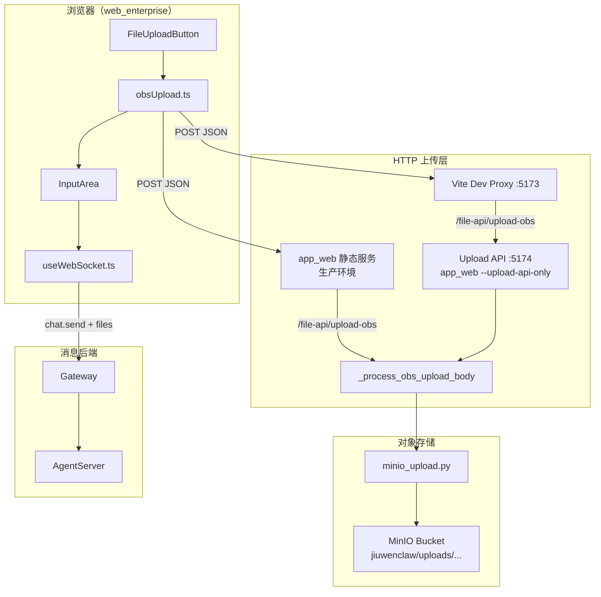
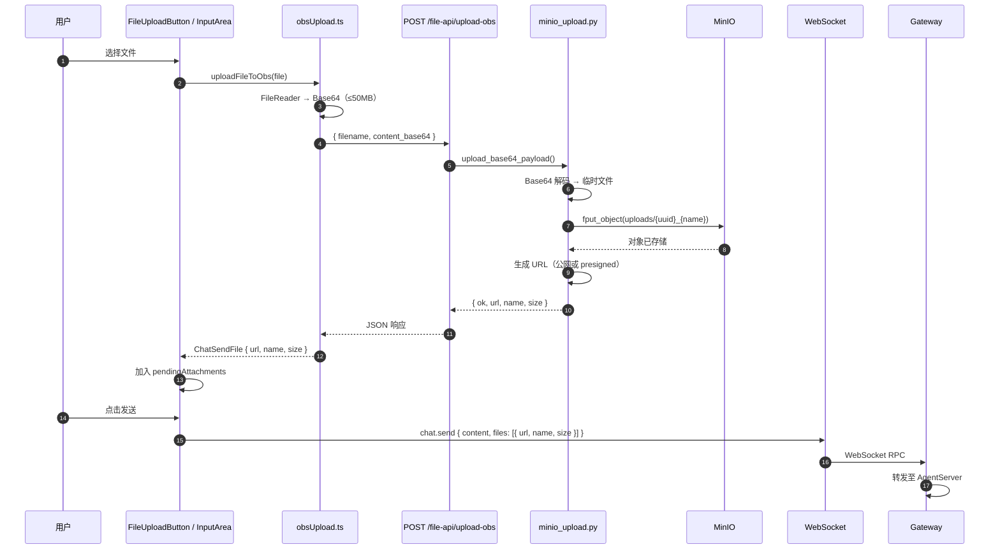
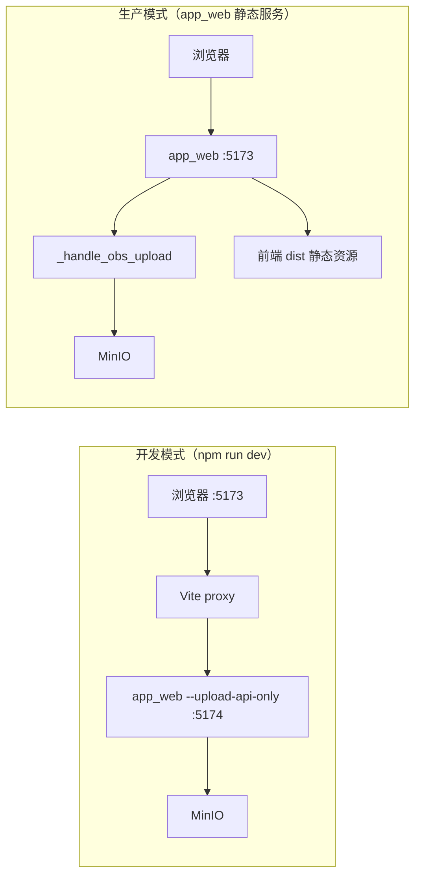
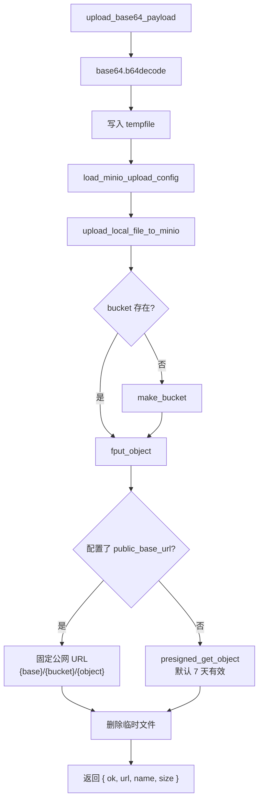

# Web 聊天文件上传

## 模块定位

企业版 Web 聊天界面支持用户选择本地文件作为附件发送。上传与发消息分为两步：

1. **上传**：浏览器将文件编码为 Base64，通过 HTTP 接口写入自建 **MinIO**（S3 兼容对象存储），获得可访问 URL。
2. **发送**：用户点击发送时，附件 URL 随 WebSocket `chat.send` 请求传给 Gateway / AgentServer，不再通过 WebSocket 传输文件二进制。

该方案将「大文件传输」从实时消息通道中剥离，降低 WS 压力，并便于 Agent 通过 URL 按需拉取文件。

## 整体架构



## 端到端时序



## 开发 vs 生产路由



| 模式 | 启动方式 | 上传入口 | 说明 |
|------|----------|----------|------|
| 开发（企业版） | `start_services dev-enterprise` | Vite `:5173` → Upload API `:5174` | 同时启动 upload-api 与 `npm run dev` |
| 开发（仅前端） | `npm run dev` + 手动启动 upload API | 同上 | 需另开 `python -m jiuwenclaw.app_web --upload-api-only --port 5174` |
| 生产 | `start_services web` 或 `python -m jiuwenclaw.app_web` | 同一 `app_web` 进程处理 | `/file-api/upload-obs` 与静态资源同源 |

代理目标可通过环境变量覆盖：

- `JIUWENCLAW_WEB_UPLOAD_PORT`（默认 `5174`）
- `JIUWENCLAW_WEB_UPLOAD_TARGET`（完整 URL，覆盖 host:port）

## 核心模块

### 前端

| 文件 | 职责 |
|------|------|
| `web_enterprise/src/components/ChatPanel/FileUploadButton.tsx` | 文件选择 UI、上传状态、错误提示 |
| `web_enterprise/src/services/obsUpload.ts` | Base64 编码、调用上传 API、校验响应 |
| `web_enterprise/src/components/ChatPanel/InputArea.tsx` | 维护 `pendingAttachments`，发送时附带文件 |
| `web_enterprise/src/hooks/useWebSocket.ts` | `chat.send` 携带 `files` 字段 |
| `web_enterprise/vite.config.ts` | 开发环境 `/file-api/upload-obs` 反向代理 |

**前端约束**

- 单文件最大 **50 MB**（`MAX_UPLOAD_BYTES`）
- 空文件拒绝上传
- 传输格式：JSON `{ filename, content_base64 }`，非 `multipart/form-data`

### 后端 HTTP

| 文件 | 职责 |
|------|------|
| `jiuwenclaw/app_web.py` | `_handle_obs_upload`、`_process_obs_upload_body`、独立 Upload API 服务 |
| `jiuwenclaw/minio_upload.py` | MinIO 配置加载、Base64 解码、对象上传、URL 生成 |
| `jiuwenclaw/start_services.py` | `dev-enterprise` 模式自动启动 upload-api |

### 消息链路

上传完成后，附件以 URL 形式进入聊天消息，不再次上传：

```json
{
  "type": "req",
  "method": "chat.send",
  "params": {
    "session_id": "...",
    "content": "请分析这个文件",
    "files": [
      {
        "url": "https://minio.example.com/jiuwenclaw/uploads/abc123_report.pdf",
        "name": "report.pdf",
        "filename": "report.pdf",
        "size": 102400
      }
    ]
  }
}
```

Gateway 的 `message_handler.py` 对 `chat.send` 另有 `attachments` / `@file` 工作区引用解析逻辑，与 Web MinIO URL 附件是不同路径。

## MinIO 上传细节



**对象命名规则**

```
uploads/{uuid.hex}_{safe_filename}
```

文件名中的 `\` 和 `/` 会替换为 `_`，避免路径注入。

## 配置

配置优先级：**环境变量** > **`config.yaml` 的 `minio` 段**。

### config.yaml

```yaml
minio:
  endpoint:          # 例：127.0.0.1:9000 或 http://minio:9000
  access_key:
  secret_key:
  bucket: jiuwenclaw
  secure: false
  public_base_url:   # 可选；设置后返回固定公网 URL（需 bucket 可读策略）
```

### 环境变量

| 变量 | 说明 |
|------|------|
| `JIUWENCLAW_MINIO_ENDPOINT` | MinIO 地址 |
| `JIUWENCLAW_MINIO_ACCESS_KEY` | Access Key |
| `JIUWENCLAW_MINIO_SECRET_KEY` | Secret Key |
| `JIUWENCLAW_MINIO_BUCKET` | Bucket 名（默认 `jiuwenclaw`） |
| `JIUWENCLAW_MINIO_SECURE` | 是否 HTTPS（`true`/`false`） |
| `JIUWENCLAW_MINIO_PUBLIC_BASE_URL` | 公网访问前缀（可选） |

### MinIO 本地启动示例

```bash
docker run -p 9000:9000 -p 9001:9001 \
  -e MINIO_ROOT_USER=minioadmin \
  -e MINIO_ROOT_PASSWORD=Minio@123456 \
  minio/minio server /data --console-address ":9001"
```

依赖 Python 包：`pip install minio`

## HTTP API

### `POST /file-api/upload-obs`

**请求**

```http
POST /file-api/upload-obs
Content-Type: application/json

{
  "filename": "report.pdf",
  "content_base64": "<base64 编码的文件内容，不含 data: 前缀>"
}
```

**成功响应** `200`

```json
{
  "ok": true,
  "url": "https://...",
  "name": "report.pdf",
  "size": 102400
}
```

**错误响应**

| HTTP | 场景 |
|------|------|
| `400` | JSON 非法、payload 格式错误 |
| `500` | MinIO 配置缺失、上传失败、缺少 `content_base64` |

## 设计要点

| 要点 | 说明 |
|------|------|
| 存储后端 | 自建 MinIO（S3 兼容），接口路径保留 `upload-obs` 命名 |
| 上传与发送解耦 | 先拿 URL，再 `chat.send`；WS 只传元数据 |
| 开发独立进程 | Upload API 可单独监听 `:5174`，与 Vite 热更新服务分离 |
| URL 策略 | 有 `public_base_url` 用固定 URL；否则 presigned（7 天） |
| 前端大小限制 | 50 MB；后端无单独大小校验，受 HTTP body 与 MinIO 限制 |

## 相关文件索引

```
jiuwenclaw/
├── minio_upload.py                          # MinIO 配置与上传
├── app_web.py                               # HTTP 路由与 upload-api 独立服务
├── start_services.py                        # dev-enterprise 启动 upload-api
├── resources/config.yaml                    # minio 配置段
└── web_enterprise/
    ├── vite.config.ts                       # 开发代理
    ├── src/services/obsUpload.ts            # 前端上传服务
    ├── src/components/ChatPanel/
    │   ├── FileUploadButton.tsx
    │   └── InputArea.tsx
    └── src/hooks/useWebSocket.ts            # chat.send 携带 files
```
