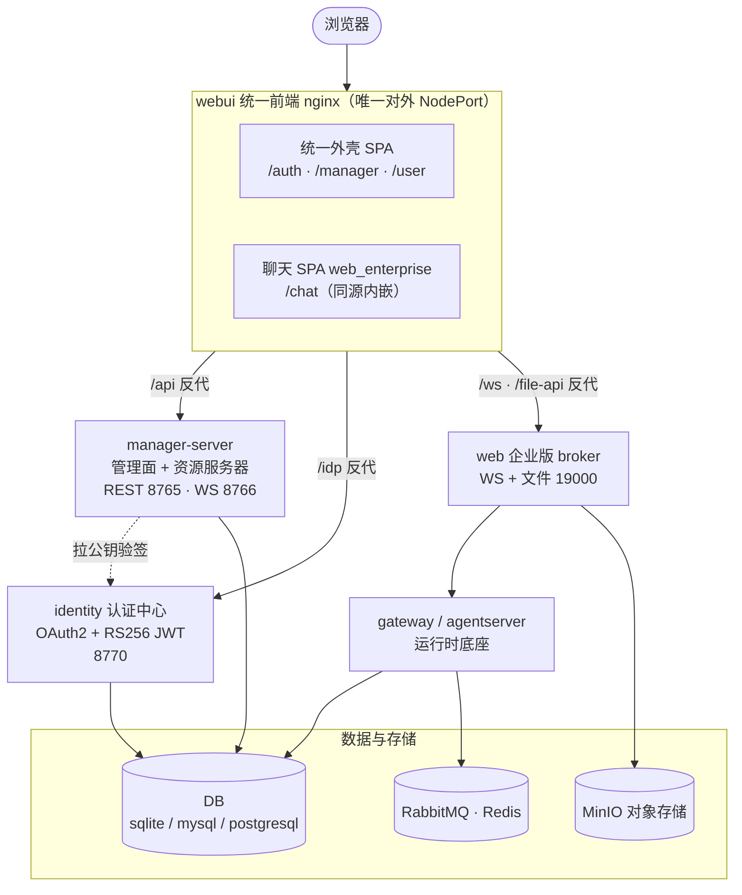
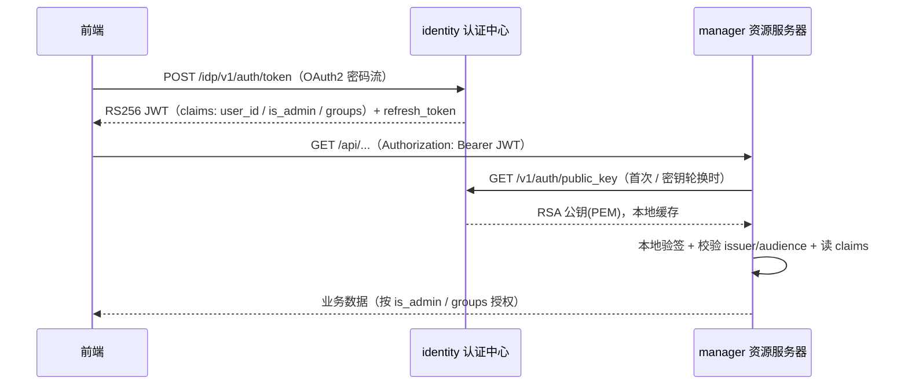
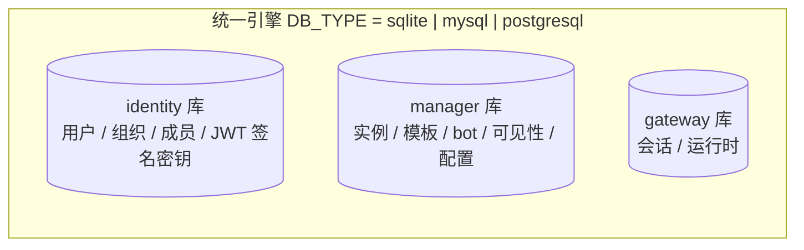

# Web 服务重构设计

本文档描述 JiuWenClaw 企业版 **Web 前后端重构**后的整体架构:以 **OAuth2 + RS256 JWT** 为核心的**独立认证中心**、把管理面后端改造为**资源服务器**、**统一前端**(登录 / 管理面 / 用户面 / 聊天)合为一个容器,以及**数据库抽象**、容器拓扑与请求路由。

> 关联文档:[Web 重构版 k8s 部署说明](./Web重构版k8s部署说明.md) · [Web 重构版本地部署说明](./Web重构版本地部署说明.md)

---

## 一、整体架构

对外只暴露**统一前端**一个入口,其余服务集群内互通。前端为"一个 nginx":发静态 + 反代三类后端;后端拆分为**认证中心 / 管理面(资源服务器) / 聊天 broker** 三类,运行时底座(gateway/agentserver)与基础设施在其后。

---

## 二、服务与职责

| 服务 | 角色 | 端口 | 对外 | 数据 |
|---|---|---|---|---|
| **webui** | 统一前端(nginx):发外壳 SPA + 同源 `/chat` 聊天 SPA + 反代后端 | 80 | NodePort | 无(纯静态 + 反代) |
| **identity** | 认证中心:OAuth2 密码流签发 JWT、公钥分发、组织/用户 IAM | 8770 | 仅集群内 | 独立**身份库** |
| **manager-server** | 管理面 API + **资源服务器**:实例/模板/配置/bot/可见性;验签 JWT | 8765/8766 | 仅集群内 | **管理库** |
| **web** | 企业版 broker:聊天 WS + `/file-api`(文件上传 MinIO / 工作区读写) | 19000 | 仅集群内 | MinIO |
| **gateway / agentserver** | 运行时底座:Agent 执行、会话 | — | 仅集群内 | 运行时库 |

---

## 三、统一前端

单一 TS 工程,**路径式路由**(react-router),一套外壳承载三个平面;聊天以**同源内嵌**方式接入。

- `/auth` —— 登录页(OAuth2 密码流)。
- `/manager/*` —— 管理面(`is_admin` 守卫):实例、模板、用户、组织、bot 与可见性。
- `/user/*` —— 用户面:选组织 → 看可见 bot → bot 页内 **聊天 / 定时任务 / 技能 / 记忆** 四个标签。
- `/chat` —— 企业版聊天 SPA(`web_enterprise`),**同源**由 webui 提供;用户面以 `(user_id, group_id, bot_id)` 经 URL query 注入,前端据此建立会话并透传到运行时(三值在聊天设置里为**只读**)。

nginx 以 `envsubst` 在启动时注入后端地址(`BACKEND_API/IDP/WS`),一份模板同时适配 docker-compose 与 k8s。请求路由:

| 路径 | 反代目标 | 说明 |
|---|---|---|
| `/api/`     | manager-server | 保留前缀;管理 API |
| `/idp/`     | identity | 剥前缀:`/idp/v1/auth/*` → `/v1/auth/*` |
| `/ws`、`/ws/gateway` | web broker | WebSocket(Upgrade) |
| `/file-api/`| web broker | 文件上传/读写,流式、放开请求体 |
| `/chat/`    | 本地静态 | 同源聊天 SPA(SPA 回退) |
| `/`         | 本地静态 | 外壳 SPA(history 回退) |

---

## 四、认证与鉴权(OAuth2 + RS256 JWT)

认证做成**独立服务**,与业务后端解耦;传输统一走 OAuth2 / JWT,信息随令牌下行。**二次开发可替换凭据后端**(默认本库,厂商可对接自有用户体系),协议不变。

要点:

- **签发**:identity 用 RSA 私钥签 RS256 JWT,claims 携带 `user_id / is_admin / groups` 等;同时签发 refresh token,支持 `/refresh`、`/logout`。
- **验签**:管理面作为**资源服务器**,只持有 identity 的**公钥**(经 `/v1/auth/public_key` 拉取并缓存,验签失败自动重拉),据 claims 做 `require_admin` / `get_current_user` 鉴权,**不连身份库**。
- **签名密钥**:RSA 密钥落**身份库单行**,所有副本读同一份 → 无需挂 k8s Secret,重启/扩缩容密钥稳定。

---

## 五、数据库

底层经 **foundation `DBHandler` 抽象**,三种引擎(**sqlite / mysql / postgresql**)由共享变量 `DB_TYPE` 统一切换,业务代码不变。各服务用**物理隔离**的库,身份数据独立成库。

- **切换**:`DB_TYPE` 一处改动,identity / manager / gateway 一起切引擎;mysql/postgresql 由 handler **自动建库**,postgresql 支持独立 `schema`。
- **隔离**:身份(`identity`)、管理(`manager`)、运行时(`gateway`)分库;sqlite 时为不同文件,mysql/postgresql 时为同实例下不同 database。
- **持久化**:用 mysql/postgresql 时,用户、组织、bot、JWT 密钥均落库持久,服务重启不丢。

---

## 六、Bot 可见性与 IAM

- **组织/用户/成员**归口认证中心(身份库);用户可属多组织,亦可"无组织"。
- **bot 可见性**按 `scope_type / scope_id` 三档:`global`(全局)/ `org`(指定组织)/ `user`(指定人)。
- 用户面据当前 `user_id + group_id + JWT.groups` 过滤出**可见 bot**;管理面 `admin` 维护 bot 与可见性绑定。
- 配置模板按 scope(组/用户/bot)绑定,运行时按 `(user_id, bot_id)` 落到对应 Agent 实例与配置。

---

## 七、容器与部署拓扑

- **单一对外入口**:仅 webui 暴露一个 NodePort;identity / manager / web / 运行时均为 ClusterIP,集群内经 Service DNS 互通。
- **镜像参数化**:webui 经 `BACKEND_API/IDP/WS` 环境变量注入后端地址,一份镜像/模板适配本机与集群。
- **可移植**:同一套模板与镜像在 docker-compose(指向 `host.docker.internal`)与 k8s(指向 Service 名)下通用。
- **基础设施**:DB(mysql/postgresql)、Redis、MinIO、RabbitMQ、NFS 由部署框架统一拉起。

---

## 附:端口与协议速查

| 组件 | 端口 | 协议 |
|---|---|---|
| webui | 80(→ NodePort) | HTTP / WS(反代) |
| identity | 8770 | HTTP(OAuth2 / JWKS 风格公钥) |
| manager-server | 8765 / 8766 | HTTP(REST)/ WS |
| web broker | 19000 | WS + HTTP(/file-api) |
