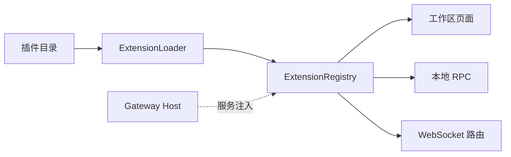

# 全栈应用插件

Application Plugin 可以同时贡献工作区页面、Gateway RPC 和 WebSocket 路由，与
Agent 的 skills、tools、rails 扩展相互独立。



## 纯前端插件

预构建 iframe 页面无需 Python：

```text
hello-plugin/
├── extension.yaml
└── frontend/
    └── dist/
        ├── index.html
        └── assets/...
```

```yaml
id: hello-plugin
name: Hello plugin
version: 1.0.0
description: A minimal Jiuwen application
author: Your name
min_jiuwenswarm_version: "0.2.5"
package_type: application
permissions: [camera]
frontend:
  - id: hello-page
    nav_key: app:hello-plugin
    title: Hello
    render_mode: iframe
    entrypoint: index.html
    position: 100
```

宿主会自动创建插件实例。`nav_key`、`render_mode`、`entrypoint` 和 `position` 的默认值
分别是 `app:{plugin_id}`、`iframe`、`index.html` 和 `100`。

将插件放入 `~/.jiuwenswarm/application_plugins/` 或在配置中增加搜索目录，重启 Gateway：

```yaml
extensions:
  extension_dirs: "C:/dev/jiuwen-plugins;D:/team/plugins"
```

可通过以下通用接口检查发现结果和静态资源：

```text
GET /api/application-plugins
GET /api/application-plugins/{plugin_id}/assets/{asset_path}
```

## 带后端的插件

需要 RPC、WebSocket 或 Core Agent 时增加 `extension.py`：

```python
from jiuwenswarm.extensions.sdk import (
    ApplicationPluginExtension,
    FrontendContribution,
)


class MyPlugin(ApplicationPluginExtension):
    plugin_id = "my-plugin"

    async def initialize(self, config):
        self.logger = config.logger

    async def shutdown(self):
        pass

    def bind_web_channel(self, channel, services):
        async def ping(ws, req_id, params, session_id):
            await channel.send_response(
                ws, req_id, ok=True, payload={"pong": True}
            )

        channel.register_method("plugin.my_plugin.ping", ping, local_only=True)

    def frontend_contributions(self):
        return (
            FrontendContribution(
                id="my-page",
                nav_key="app:my-plugin",
                title="My plugin",
                render_mode="iframe",
                entrypoint="index.html",
            ),
        )


async def register_extensions(registry):
    plugin = MyPlugin()
    registry.register_application_plugin(plugin)
    return [plugin]
```

纯后端插件可不覆盖 `frontend_contributions()`，纯前端插件也无需覆盖
`bind_web_channel()`。插件可覆盖 `is_enabled()`，禁用时宿主会隐藏入口并拒绝新的 RPC 和
WebSocket 连接。配置由插件自己从环境变量或其私有存储读取，宿主不提供业务配置页面。

需要 Core Agent 或媒体附件处理时，使用宿主注入服务：

```python
def bind_web_channel(self, channel, services):
    core_agent_client = services.require_agent_client()
    services.normalize_media_attachments(params, session_id)
```

业务插件不应修改 `ReqMethod`、`AgentWebSocketServer` 或 Agent Adapter；插件 RPC 通过
`channel.register_method(...)` 注册，核心通信复用已有协议。

Python 扩展与 iframe 均运行在 Jiuwen 信任边界内，只应安装可信代码。`camera`、
`microphone` 和 `display_capture` 会控制 iframe 的媒体权限，其余权限当前仅为能力声明。

内置 `jiuwenswarm/extensions/video_duplex` 是完整示例，其配置和测试也保留在插件目录内。
