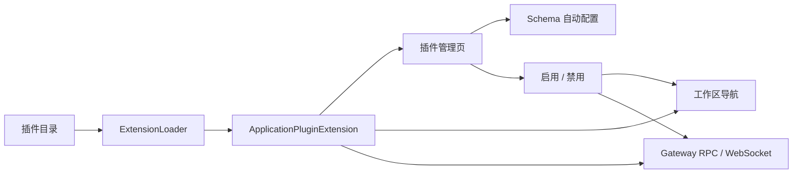
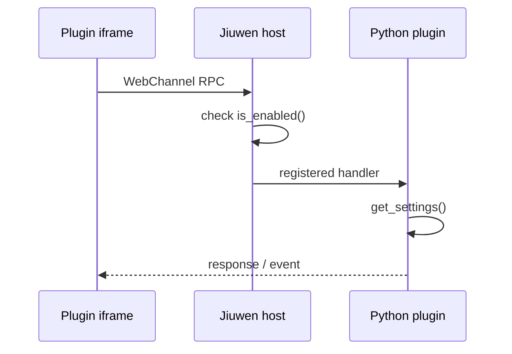

# 全栈应用插件

应用插件可以同时扩展 Jiuwen 的工作区页面、Gateway RPC 和 WebSocket。它与
Agent 的 skills、tools、rails 插件相互独立。



## 最小插件：无需 Python

只提供一个预构建页面时，目录中只需要清单和静态资源：

```text
hello-plugin/
├── extension.yaml
└── frontend/
    └── dist/
        ├── index.html
        └── assets/...
```

```yaml
id: hello-plugin
name: Hello plugin
version: 1.0.0
description: A minimal Jiuwen application
author: Your name
min_jiuwenswarm_version: "0.2.5"
package_type: application
permissions: [camera]

config_schema:
  type: object
  additionalProperties: false
  properties:
    endpoint:
      type: string
      title: Service endpoint
      default: https://example.com/api
      x-group: Connection
      x-order: 10
    api_key:
      type: string
      title: API key
      secret: true
      x-group: Connection
      x-order: 20

frontend:
  - id: hello-page
    nav_key: app:hello-plugin
    title: Hello
    render_mode: iframe
    entrypoint: index.html
    position: 100
```

宿主会自动创建插件实例；插件作者无需编写 `extension.py`。`frontend` 可省略
`nav_key`、`render_mode`、`entrypoint` 和 `position`，默认值分别为
`app:{plugin_id}`、`iframe`、`index.html` 和 `100`。

## 安装与调试

将插件目录复制到 Jiuwen 数据目录下的 `application_plugins`：

```text
~/.jiuwenswarm/application_plugins/hello-plugin
```

设置了 `JIUWENSWARM_DATA_DIR` 时，使用
`$JIUWENSWARM_DATA_DIR/application_plugins`。也可以添加额外搜索目录：

```yaml
extensions:
  extension_dirs: "C:/dev/jiuwen-plugins;D:/team/plugins"
```

重启 Gateway 后打开“更多 → 应用插件”。插件清单、配置和资源可通过以下接口检查：

```text
GET  /api/application-plugins
GET  /api/application-plugins/{plugin_id}/settings
PUT  /api/application-plugins/{plugin_id}/settings
PUT  /api/application-plugins/{plugin_id}/enabled
GET  /api/application-plugins/{plugin_id}/assets/{asset_path}
```

配置更新示例：

```json
{
  "values": {
    "endpoint": "https://example.com/api",
    "api_key": "secret"
  }
}
```

密钥不会由读取接口返回；空字符串表示保留原密钥。显式清除密钥时增加：

```json
{ "values": {}, "clear_secrets": ["api_key"] }
```

## Schema 表单

宿主支持 `string`、`boolean`、`integer`、`number`、`array`、`object`、
`enum`、`required`、长度、正则和数值范围。以下 UI 扩展字段不属于标准 JSON
Schema，但可用于布局：

| 字段 | 作用 |
|---|---|
| `secret: true` / `format: password` | 密码输入及响应遮蔽 |
| `x-group` | 设置分组 |
| `x-order` | 字段顺序 |
| `x-visible-when` | 其他字段满足条件时显示 |

插件默认配置存储在：

```text
~/.jiuwenswarm/config/application_plugins/{plugin_id}.json
```

宿主会限制文件权限并阻止密钥回传到前端，但当前仍以明文保存配置文件。

## 带 Python 后端的插件

需要 RPC、WebSocket 或 Jiuwen Agent 时，增加 `extension.py`：

```python
from jiuwenswarm.extensions.sdk import (
    ApplicationPluginExtension,
    FrontendContribution,
)


class MyPlugin(ApplicationPluginExtension):
    plugin_id = "my-plugin"

    async def initialize(self, config):
        self.logger = config.logger

    async def shutdown(self):
        pass

    def bind_web_channel(self, channel, services):
        async def ping(ws, req_id, params, session_id):
            await channel.send_response(
                ws, req_id, ok=True, payload={"pong": True}
            )

        channel.register_method("plugin.my_plugin.ping", ping, local_only=True)

    def frontend_contributions(self):
        return (
            FrontendContribution(
                id="my-page",
                nav_key="app:my-plugin",
                title="My plugin",
                render_mode="iframe",
                entrypoint="index.html",
            ),
        )


async def register_extensions(registry):
    plugin = MyPlugin()
    registry.register_application_plugin(plugin)
    return [plugin]
```

纯后端插件可以不覆盖 `frontend_contributions()`，纯前端插件也无需覆盖
`bind_web_channel()`。配置可在后端通过 `self.get_settings()` 读取，常规插件不需要
自行实现启停或配置持久化。



插件禁用后仍显示在管理页，但工作区入口会隐藏；宿主会统一拒绝新的插件 RPC 和
WebSocket。Python 扩展与 iframe 当前都运行在 Jiuwen 的信任边界内，只应安装可信
代码。`camera`、`microphone` 和 `display_capture` 会控制 iframe 的媒体权限；
其他权限字段目前是能力声明，尚未形成权限沙箱。

## 内置全双工插件

`jiuwenswarm/extensions/video_duplex` 是第一个应用插件，演示了 bundled React 页面、
RPC、WebSocket、Schema 设置以及旧 `.env` 配置兼容。其模型、ASR、TTS 和开关均位于
侧栏“应用插件 → 全双工”。宿主根据 `extension.yaml` 自动生成设置表单：切换
JoyAI 或 Qwen 时只展示当前 Provider 所需字段，密钥保存后不会回传明文。

设置保存后会更新当前 Gateway 进程及 Jiuwen 实例 `.env`，下一次全双工连接即可使用；
直接手工修改 `.env` 时仍需重启 Gateway。禁用插件后，管理项保留，但工作区入口隐藏，
宿主也会拒绝新的插件 RPC 和 WebSocket 连接。完整配置见[全双工文档](全双工.md)。

当前版本在安装、卸载、升级插件或修改 Python 代码后需要重启 Gateway。
