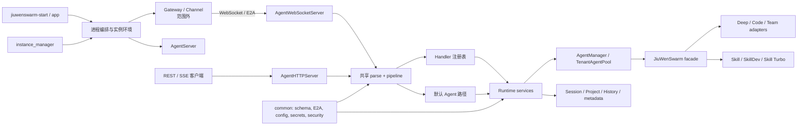
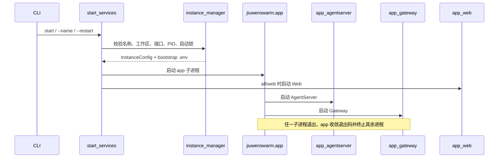
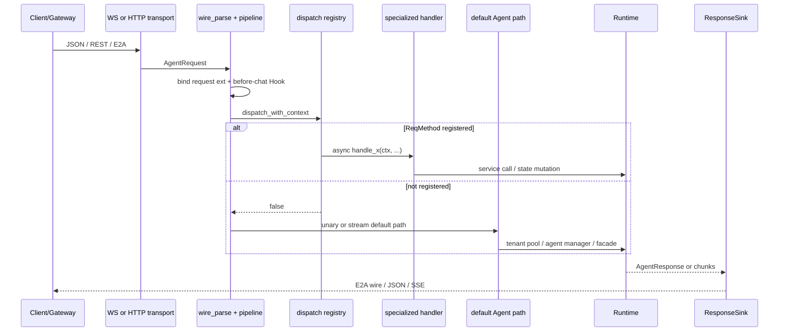
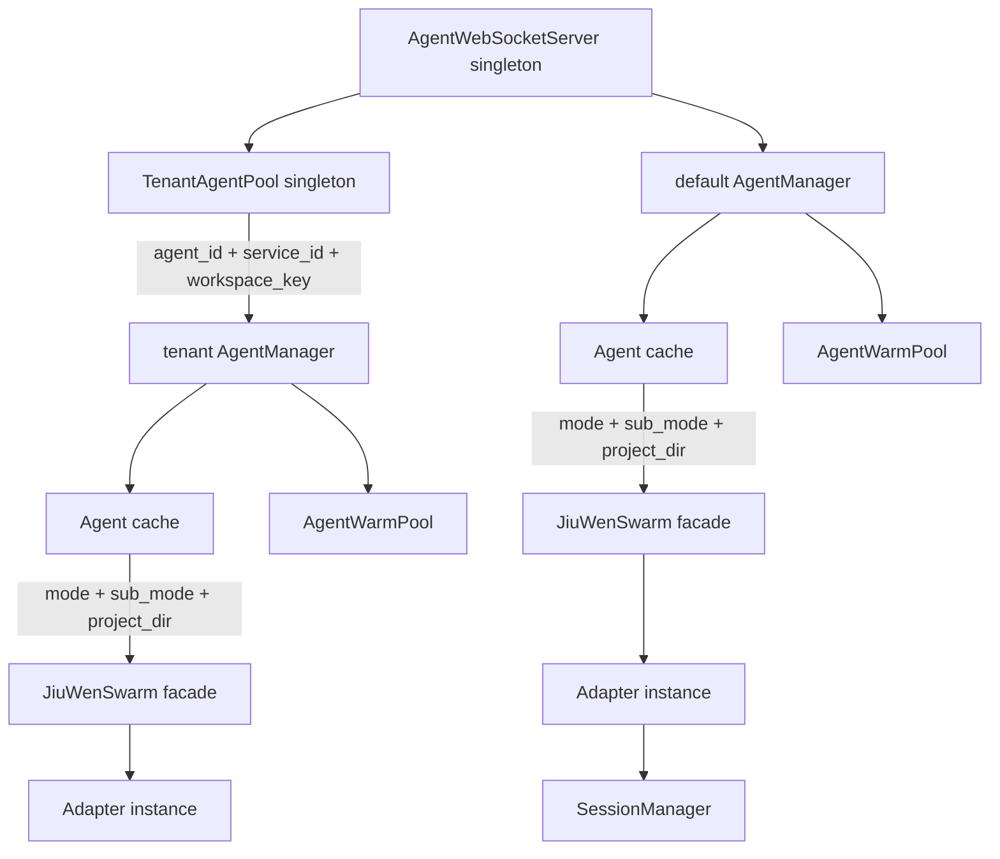
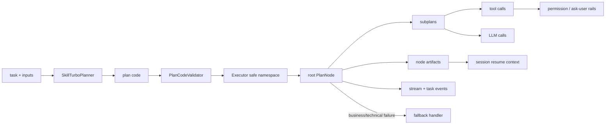

# JiuwenSwarm 核心模块设计说明书

## 1. 文档定位

本说明书描述 `jiuwenswarm` 根包、`common`、`instance_manager` 和 `server` 的当前实现。它回答三个问题：进程如何启动并隔离实例；请求如何跨 HTTP/WebSocket 汇合并进入 Agent；Agent、会话、Skill 与持久状态由谁创建、复用和清理。

逐文件覆盖与全部符号签名分别见[全量源码文件索引](source-inventory.md)和[接口说明总览](interface-reference.md)。本页聚焦跨文件架构与设计约束。

## 2. 系统边界与分层

目标代码不是完整产品的全部代码。Gateway、Channel、具体 Harness/Agent 实现、扩展系统和基础设施包位于本次范围外，但它们通过下列边界与目标模块相连：

- 启动编排通过 [`app.py`](../../../../jiuwenswarm/app.py#L49) 同时拉起 AgentServer 与 Gateway，通过 [`start_services.py`](../../../../jiuwenswarm/start_services.py#L449) 再组合 Web 前端进程。
- Gateway 主要经 WebSocket 把请求交给 [`AgentWebSocketServer`](../../../../jiuwenswarm/server/agent_ws_server.py#L292)；外部系统也可经可选的 [`AgentHTTPServer`](../../../../jiuwenswarm/server/agent_http_server.py#L427) 直接进入相同业务流水线。
- Agent 运行时通过 [`JiuWenSwarm`](../../../../jiuwenswarm/server/runtime/agent_adapter/interface.py#L1027) 门面适配 OpenJiuwen 的 Deep/Code/Team Agent，并把 Skill、SkillDev、Plugin、Symphony 等控制请求在创建重型 Adapter 之前短路处理。
- `common` 承载跨进程/跨层稳定的数据模型、配置、E2A 编解码、secret/security、reasoning/thinking 与诊断工具；`instance_manager` 管理进程之外的多实例配置、端口、PID 和锁。

### 2.1 逻辑层次

| 层次 | 当前实现责任 | 主要代码 |
| --- | --- | --- |
| 启动与实例层 | 早期环境装载、工作区初始化、端口组选择、进程拉起/停止、PID 与启动互斥 | [`dotenv_early.py`](../../../../jiuwenswarm/dotenv_early.py#L95)、[`start_services.py`](../../../../jiuwenswarm/start_services.py#L72)、[`instance_manager`](../../../../jiuwenswarm/instance_manager/__init__.py#L1) |
| 传输层 | WS/HTTP/SSE 监听、入站解析、响应编码、发送预算、背压、服务端推送 | [`agent_ws_server.py`](../../../../jiuwenswarm/server/agent_ws_server.py#L292)、[`agent_http_server.py`](../../../../jiuwenswarm/server/agent_http_server.py#L427)、[`transports/sink.py`](../../../../jiuwenswarm/server/transports/sink.py#L29) |
| 请求编排层 | 构造上下文、触发请求 Hook、表驱动分发、默认 Agent 调用、错误回写 | [`pipeline.py`](../../../../jiuwenswarm/server/pipeline.py#L61)、[`dispatch.py`](../../../../jiuwenswarm/server/dispatch.py#L31)、[`handlers`](../../../../jiuwenswarm/server/handlers/__init__.py#L1) |
| 运行时所有权层 | 租户解析、Agent 缓存/预热/借用、会话队列、配置热更新与清理 | [`agent_manager.py`](../../../../jiuwenswarm/server/runtime/agent_manager.py#L114)、[`tenant_agent_pool.py`](../../../../jiuwenswarm/server/runtime/tenant_agent_pool.py#L63)、[`session_manager.py`](../../../../jiuwenswarm/server/runtime/session/session_manager.py#L23) |
| Agent/Skill 适配层 | 统一 Agent API、不同模式 Adapter、Skill 管理与执行、Skill Turbo 计划图 | [`agent_adapter/interface.py`](../../../../jiuwenswarm/server/runtime/agent_adapter/interface.py#L1027)、[`skill_manager.py`](../../../../jiuwenswarm/server/runtime/skill/skill_manager.py#L473)、[`skill_turbo/executor.py`](../../../../jiuwenswarm/server/runtime/skill_turbo/executor.py#L442) |
| 持久化层 | 会话历史/元数据、项目目录与 Git、Skill 状态、secret 后端 | [`session`](../../../../jiuwenswarm/server/runtime/session/__init__.py#L1)、[`common/secrets`](../../../../jiuwenswarm/common/secrets/__init__.py#L1) |

## 3. 启动、实例与进程模型

### 3.1 早期环境装载必须先于重型导入

[`parse_dotenv_early()`](../../../../jiuwenswarm/dotenv_early.py#L131) 在入口模块导入早期解析 `--dotenv`/`--name`，先确定 `JIUWENSWARM_DATA_DIR`、实例名和端口，再允许导入会读取这些环境变量的其他模块。子进程再次调用 [`load_dotenv_runtime()`](../../../../jiuwenswarm/dotenv_early.py#L95)；由 `jiuwenswarm-start` 注入的端口带 `JIUWENSWARM_CLI_PORTS` 标志，不会被旧 `.env` 覆盖。

这是一个实际的不变量：任何在早期解析之前导入并缓存用户目录/端口的模块，都可能把命名实例错误地绑定到默认实例。

### 3.2 两级进程编排

1. [`start_services.main()`](../../../../jiuwenswarm/start_services.py#L1063) 解析 `all/app/web/dev` 与实例管理动作。
2. 默认实例使用 index 0 端口组；命名实例从 `instances.yaml` 取工作区和端口。冲突时按完整端口组寻找下一组空闲端口并持久化，避免只移动某一个服务端口造成内部地址不一致。
3. `app` 模式启动 [`jiuwenswarm.app`](../../../../jiuwenswarm/app.py#L49)；该进程再启动 `app_agentserver` 和范围外的 `app_gateway`，任一子进程退出都会触发另一子进程终止。
4. `web` 模式单独启动 Web 服务；`all` 是 app + web；`dev` 是 app + 前端开发服务器。

### 3.3 AgentServer 启动与关闭顺序

[`app_agentserver.py`](../../../../jiuwenswarm/server/app_agentserver.py#L1) 的模块级初始化有意承担兼容补丁和安全 Hook 安装：工作区迁移/合并、日志固定、环境装载、shell 安全、SSE 兼容、skip-tool/stream timeout、tool 并发限制、debug trace、thinking hook 和性能 Hook 都发生在服务监听前。

异步主链 [`_run_with_telemetry()`](../../../../jiuwenswarm/server/app_agentserver.py#L234) 先创建扩展注册表并装载扩展，再装载企业配置/日志脱敏等可选状态，创建并启动 WS Server，然后可选启动 HTTP Server、主动推荐引擎和 teammate bootstrap daemon。关闭时先停止后台 daemon/HTTP，再停止 WS 与其 Runtime，最后 flush 性能、可观测性和历史缓冲。

多个企业冷加载步骤使用“记录 warning 后继续”的降级策略；WS 监听是主链，HTTP 启动失败不会让 WS 退出。

## 4. 请求与响应主链

### 4.1 两种传输，一个业务流水线

WebSocket 的 [`_handle_message()`](../../../../jiuwenswarm/server/agent_ws_server.py#L940) 和 HTTP 的 [`dispatch_raw_envelope()`](../../../../jiuwenswarm/server/agent_http_server.py#L464) 都先调用 [`parse_inbound()`](../../../../jiuwenswarm/server/wire_parse.py#L158)。解析结果是 `AgentRequest` 或已经编码好的错误帧；解析模块本身不发送数据。

HTTP 的声明式 REST 路由由 [`ROUTES`](../../../../jiuwenswarm/server/agent_http_routes.py#L82) 把动词/路径映射到 `ReqMethod`，再由 [`build_agent_request()`](../../../../jiuwenswarm/server/agent_http_server.py#L317) 构造相同请求对象。两条路径最终进入 [`dispatch_parsed_request()`](../../../../jiuwenswarm/server/pipeline.py#L61)。

### 4.2 E2A 优先、legacy 可回退

[`E2AEnvelope`](../../../../jiuwenswarm/common/e2a/models.py#L87) 是入站统一信封；`parse_inbound` 先尝试 E2A，解析失败才按旧 Gateway 载荷构造 `AgentRequest`。规范化显式失败时，信封内部可携带 legacy 请求副本作为兼容逃生舱。

出站 [`encode_agent_response_for_wire()`](../../../../jiuwenswarm/common/e2a/wire_codec.py#L232) 与 `encode_agent_chunk_for_wire()` 把业务对象转成 `E2AResponse`。若转换/序列化失败，不直接丢包，而是发出 `E2A.WIRE_ENCODE_ERROR` 并把 legacy 对象放进 metadata，反向解析端也优先识别该副本。

### 4.3 RequestContext 是 Handler 的窄接口

[`RequestContext`](../../../../jiuwenswarm/server/context.py#L92) 固定承载 `request`、`sink`、稳定的 `connection_id` 和 `services`。[`AgentServerServices`](../../../../jiuwenswarm/server/context.py#L58) 只通过 `SERVICE_MEMBERS` 暴露 AgentWebSocketServer 的白名单能力，业务 Handler 不直接散布 `_agent_manager` 等受保护成员访问。

`connection_id` 是互斥语义的一部分：WS 使用连接对象身份，HTTP 使用稳定常量。若 HTTP 每请求生成新值，ACP capability 和 session switch 锁会静默失效。

### 4.4 表驱动 Handler 与默认路径

[`HANDLERS`](../../../../jiuwenswarm/server/dispatch.py#L67) 覆盖连接引导、会话、取消、Team、命令、Agent 定义、扩展、调度、权限与运维请求。`HandlerSpec` 可附加固定参数，也可为流式请求选择另一函数；权限方法在模块装载时动态注册并做重复检查。

没有命中表的请求不是“未知请求”——它进入 [`handlers/_default.py`](../../../../jiuwenswarm/server/handlers/_default.py#L1)：

- `skills.*`、`skilldev.*`、`plugins.*`、`symphony.*` 是无状态控制 RPC，可复用轻量 facade，不触发模式 Adapter 重建。
- 企业/OfficeClaw 请求进入 `TenantAgentPool`；普通请求进入进程默认 `AgentManager`。
- 对话请求先同步 code plan/normal 状态、项目目录和 session metadata，再选择 `mode + sub_mode + project_dir` 对应的 Agent。
- 流式路径登记可取消任务、按 10 秒空闲周期发 keepalive，并在单个 chunk 超出发送预算时停止后续输出。

### 4.5 统一 ResponseSink

[`ResponseSink`](../../../../jiuwenswarm/server/transports/sink.py#L29) 把 Handler 与传输解耦：

| 实现 | 语义 |
| --- | --- |
| `WSSink` | 编码后在连接级 `asyncio.Lock` 内写 socket，防止并发帧交错。 |
| `UnaryHTTPSink` | 暂存业务对象/最后帧供路由渲染；仍施加与 WS 相同的 6 MB 发送预算。 |
| `SSESink` | 编码后写有界队列，通过阻塞形成背压；收尾哨兵使用有超时的 `offer`，消费者断开时不会永久挂起。 |

因此业务层只关心 `send_unary`、`send_chunk`、`send_error` 或少量 `send_wire`；“是否原样发送”统一由布尔返回值表达。

## 5. Runtime 对象模型与状态所有权

### 5.1 三层所有权

- `AgentWebSocketServer` 持有进程级共享能力、连接状态与默认 `AgentManager`。
- [`TenantAgentPool`](../../../../jiuwenswarm/server/runtime/tenant_agent_pool.py#L63) 按企业租户键持有多个 `AgentManager`，并负责控制 RPC 的租户解析、并发创建锁、配置刷新和淘汰。
- [`AgentManager`](../../../../jiuwenswarm/server/runtime/agent_manager.py#L114) 按 `(mode, sub_mode, project_dir)` 缓存 `JiuWenSwarm`，管理借用计数、pin、延迟退休、预热认领与 reload。
- `JiuWenSwarm` 持有 SkillManager 和按模式创建的 Adapter；Adapter 承接 OpenJiuwen Agent/Session 细节。

[`RuntimeScopeKey`](../../../../jiuwenswarm/server/runtime/runtime_scope.py#L21) 把 `service_id`、`agent_id`、`workspace_key` 与可选 `session_id` 规范为值对象；[`tenant_context.py`](../../../../jiuwenswarm/server/runtime/tenant_context.py#L32) 用 `contextvars` 绑定当前请求的工作区路径，避免并发租户互相污染进程全局路径。

### 5.2 创建、借用、热更新与清理

Agent 创建不是简单字典 `setdefault`：`AgentManager` 为 cache key 建独立异步锁，防止并发首请求重复创建。返回给请求的实例增加 borrower；配置 reload 可把旧实例标成退休，但只有 borrower 归零且未 pin 时才真正清理，从而避免热更新中途销毁正在运行的请求。

[`AgentWarmPool`](../../../../jiuwenswarm/server/runtime/agent_warm_pool.py#L123) 维护带配置 revision/fingerprint 的 `WarmSlot`。后台预热让首轮请求认领已经准备好的会话；前台聊天会抑制/延后低优先级准备任务，避免冷启动优化反过来争抢关键路径资源。认领后通过 session marker 与 pin 生命周期防止过早回收。

清理方向与创建相反：先取消/等待会话任务，再清理 facade/adapter 和预热 slot，最后清空 manager/pool 的缓存与锁。Gateway 连接断开时会调用全局 inflight cancel，但按 session 的删除/rewind 走更窄的 `cleanup_session_runtime`。

### 5.3 会话内串行化

[`SessionManager`](../../../../jiuwenswarm/server/runtime/session/session_manager.py#L23) 为每个 session 保存 `PriorityQueue` 和处理器任务。`submit_task` 把工作排入该队列，保证同一会话的运行状态按顺序演进；不同 session 可以并行。关闭会话时先标记 closing、取消当前任务/processor、清理队列与外部观察任务，并把异步收尾纳入追踪。

这层与外层的 `session_stream_tasks` 不同：前者保护 Agent/Session 内部执行顺序，后者记录传输层正在发流的宿主任务，供 `chat.interrupt` 取消。

## 6. 持久状态与一致性

| 状态 | 所有者与介质 | 一致性策略 |
| --- | --- | --- |
| 会话历史 | [`session_history.py`](../../../../jiuwenswarm/server/runtime/session/session_history.py#L1)，JSONL/legacy JSON | 事件按类型合并与缓冲，后台周期 flush；请求/事件类型切换触发边界刷新；进程退出显式 shutdown。 |
| 会话元数据 | [`session_metadata.py`](../../../../jiuwenswarm/server/runtime/session/session_metadata.py#L1)，每会话 metadata | 内存缓存 + 后台写队列；同步请求元信息时补全 project/work mode/team 快照；写入时合并 pin 字段，避免异步旧值覆盖新 pin。 |
| 项目目录 | [`project_store.py`](../../../../jiuwenswarm/server/runtime/session/project_store.py#L112)，项目列表文件 | 进程内锁 + 文件锁，mutate 内重新读盘，临时文件/替换/fsync 保证原子持久化；隐藏与恢复代替直接丢失记录。 |
| Git 状态 | [`project_git.py`](../../../../jiuwenswarm/server/runtime/session/project_git.py#L837) | 所有命令经受控 runner、超时和结构化 `GitError`；分支被其他 worktree 占用、dubious ownership、瞬态仓库状态分别归一。 |
| Skill 状态 | [`skill_manager.py`](../../../../jiuwenswarm/server/runtime/skill/skill_manager.py#L473) 与 SkillDev store | 安装记录、启用状态、来源/版本与磁盘实体对账；远程制品在落盘前做路径和校验验证。 |
| Secret | [`common/secrets`](../../../../jiuwenswarm/common/secrets/__init__.py#L1) | 逻辑 envelope 与 file/env/db/gateway 后端分离；legacy 兼容和 transform 在边界完成。 |

## 7. Agent Adapter 与模式边界

[`AgentAdapter`](../../../../jiuwenswarm/server/runtime/agent_adapter/agent_adapters.py#L1) 定义 facade 所需能力；`interface_deep.py`、`interface_code.py` 和团队辅助模块把 OpenJiuwen 的具体对象、rails、工具、checkpointer 与会话事件转换成 JiuwenSwarm 的 `AgentResponse/Chunk`。

当前模式的关键语义：

- 历史 `agent.plan`/`agent.fast` 在 [`Mode.from_raw()`](../../../../jiuwenswarm/common/schema/message.py#L295) 中统一归一为 `agent`。
- Code 模式仍区分 normal/plan 子模式，并把 plan 的持久状态与前端请求同步；退出 plan 可能发生在工具执行中，默认 Handler 在处理后重新读取状态并推送 `plan.mode_exited`。
- Team 模式的事件、成员、任务和共享 Skill 需要额外 fan-out/agent_ref 元数据，不能被普通单 Agent 响应覆盖。
- `interface_deep` 是高耦合兼容适配器，而不是领域模型本身；它同时承担 SDK 版本差异、rail 注入、工具装载、会话恢复、流事件归一和资源回收，因此是运行时回归风险最高的文件之一。

## 8. Skill 子系统

### 8.1 普通 Skill 管理面

[`SkillManager`](../../../../jiuwenswarm/server/runtime/skill/skill_manager.py#L473) 是 Skill/Plugin 控制 RPC 的门面。它组合本地 Skill、内置 Skill、marketplace、SkillNet、ClawHub、Team Skills Hub、企业 Web 来源和扩展提供方；状态中同时保留目录实体、安装 ledger、来源、版本、启用状态和插件关系。

设计上的几个安全边界：

- 外部名称先经过安全子路径检查，防止 `..`/绝对路径逃逸。
- ZIP/TAR 成员逐项验证后解包；远程 URL 按允许 host、scheme 和重定向策略检查。
- 来源提供方经 [`SourceRegistry`](../../../../jiuwenswarm/server/runtime/skill/source_registry.py#L36) 注册并按 capability 获取，扩展绑定与 provider 生命周期集中关闭。
- 企业白名单由 [`SkillWhitelistSynchronizer`](../../../../jiuwenswarm/server/runtime/skill/skill_whitelist.py#L151) 对账，区分 prebuilt 与 user 来源，避免模板更新误删用户 Skill。
- [`artifact_security.py`](../../../../jiuwenswarm/server/runtime/skill/artifact_security.py#L80) 校验 SkillHub 制品签名/摘要，secret resolver 只提供间接引用解析。

### 8.2 SkillDev 状态机

`skill/skilldev` 将 Skill 创建/改进实现为可暂停、可恢复的阶段流水线。[`SkillDevState`](../../../../jiuwenswarm/server/runtime/skill/skilldev/schema.py#L113) 是 checkpoint 实体；[`SkillDevPipeline`](../../../../jiuwenswarm/server/runtime/skill/skilldev/pipeline.py#L47) 根据阶段表依次执行 init、plan、generate、validate、test design/run、evaluate、description optimize、improve、package。

暂停点的提取数据、恢复确认和下一阶段决策在 schema 中集中声明；状态由 [`StateStore`](../../../../jiuwenswarm/server/runtime/skill/skilldev/store.py#L22) 持久化，工作目录由 `WorkspaceProvider` 管理。Service 把阶段事件转换成 `AgentResponseChunk`，因此它可以复用默认流式响应通道。

### 8.3 Skill Turbo 数据面

Skill Turbo 是代码化执行图，不等同于 SkillManager：

1. [`SkillTurboPlanner`](../../../../jiuwenswarm/server/runtime/skill_turbo/planner.py#L27) 根据任务与可用 Skill 匹配计划代码。
2. [`PlanCodeValidator`](../../../../jiuwenswarm/server/runtime/skill_turbo/validator.py#L203) 用 AST 策略限制导入、调用、删除、异常吞噬等危险构造。
3. [`SkillTurboExecutor`](../../../../jiuwenswarm/server/runtime/skill_turbo/executor.py#L442) 装载根 `PlanNode`，绑定工具/LLM/subplan 回调，管理权限/HITL、并发、流式事件、恢复状态、artifact 和回退次数。
4. [`PlanNode`](../../../../jiuwenswarm/server/runtime/skill_turbo/plan_node.py#L42) 为具体节点提供 `call_tool`、`call_llm`、`execute_subplan` 与流式变体；内置 PPT Skill 由一组节点组成真实流水线。

PPT 内置 Skill 并非单函数模板生成：它包含意图分类、资料解析、需求收集、内容计划/研究、风格与模板上下文、逐页生成、布局/图表检查与修复、导出、讲稿和交付节点。详细节点图见 [Skill 与 Skill Turbo 设计分册](modules/05-runtime-skill-turbo.md)。

## 9. 公共横切能力

`common` 不是杂项目录，而是多个架构边界的共享实现：

- [`config.py`](../../../../jiuwenswarm/common/config.py#L1) 负责 YAML、环境变量解析、overlay 与缓存；企业/租户场景还结合 `local_env_config.py` 的 namespaced tip 环境。
- [`request_ext.py`](../../../../jiuwenswarm/common/request_ext.py#L1) 把允许转发的 header/query 信息放入请求 metadata，并用 contextvar 提升到当前执行上下文。
- [`reasoning_config.py`](../../../../jiuwenswarm/common/reasoning_config.py#L1)、`reasoning_injector.py` 与 `thinking/` 把用户级 thinking 选择映射到不同模型供应商的真实请求参数。
- [`mcp_config.py`](../../../../jiuwenswarm/common/mcp_config.py#L1) 把配置条目转成运行时 MCP server/tool，并管理请求级 OfficeClaw MCP 与 worker 复用。
- [`tool_ownership.py`](../../../../jiuwenswarm/common/tool_ownership.py#L1) 与 `tool_display.py` 分离工具身份/所有权和 UI 展示名称。
- cleanup、debug dump、stage timer、WS diagnostics/limits、version/updater 提供运行维护能力，但不得反向依赖具体 Handler。

## 10. 并发、取消与背压

| 竞争面 | 当前控制机制 | 关键约束 |
| --- | --- | --- |
| 同一 WS 并发发送 | 连接级 `asyncio.Lock`，所有 WSSink 共享 | keepalive、业务 chunk、错误帧和 push 不能绕过同一锁。 |
| 同一 session 执行 | SessionManager 的每会话 PriorityQueue/processor | 取消必须传播 `CancelledError`，不得把取消伪装为成功返回。 |
| 同一 Agent cache key 创建 | AgentManager/TenantAgentPool 的 key 级 lock | 锁粒度按 key，不应把所有租户/模式串行化。 |
| 配置热更新与在途请求 | borrower + pin + pending retirement | 旧实例只在无人使用后清理。 |
| 预热与前台聊天 | WarmPool foreground 计数与后台 pump | 前台请求优先，后台预热可暂停/重排。 |
| SSE 消费慢 | 有界 queue 正常发送阻塞，finish 有超时 | 背压是正常行为；消费者离开后的收尾不能无限等待。 |
| history/metadata 写盘 | 缓冲、后台线程/队列、显式 flush/shutdown | 进程关闭顺序必须保留 flush 机会。 |
| 多进程项目/实例文件 | 文件锁 + 原子替换；InstanceLock + PID | 不能只依赖进程内锁。 |

## 11. 安全与信任边界

1. WS 握手和 Origin 检查集中在 [`common/security/ws_origin.py`](../../../../jiuwenswarm/common/security/ws_origin.py#L1) 与服务入口；该检查默认关闭，只有 `JIUWENSWARM_ENABLE_ORIGIN_CHECK=1` 时才生效。开启后企业版直接放行，非企业版按显式 hostname allowlist（无 Origin 时用 `none`）判断；它不是身份认证。
2. 入站日志对 query、system prompt 与 supplementary info 做遮蔽；secret 值不应进入普通配置/历史。
3. 所有传输实现共享帧大小预算，防止 WS、SSE、HTTP 对相同 payload 出现安全/资源语义分叉。
4. Handler 只能通过 `AgentServerServices` 白名单取服务能力；工具权限、owner scope 和审批账本在 Agent 调用边界再次约束。
5. Skill/插件的目录名、下载 URL、压缩成员、checksum/签名和导入代码分别校验；Skill Turbo 计划代码通过 AST policy 后才 `exec` 到受限 namespace。
6. 项目 Git 操作不拼接 shell 字符串，使用参数列表、超时和结构化错误；危险状态和 worktree 分支占用显式返回。

## 12. 配置、部署模式与降级

[`deployment_mode.py`](../../../../jiuwenswarm/deployment_mode.py#L18) 集中定义 `standalone`、`active-standby`、`distributed` 及其派生策略：是否使用 Gateway Redis/leader election、session/history 后端、cron 默认值、channel overlay 和分布式 channel 白名单。调用方应使用这些 helper，而不是在不同模块重复字符串判断。

系统大量采用“可选能力失败不阻塞主链”的降级：HTTP、预热、企业冷配置、调试追踪、主动推荐或某些扩展初始化失败会记录上下文后继续；但实例端口持久化、核心 WS bind、请求解析/权限、持久 checkpointer 等影响一致性的失败不能静默忽略。

## 13. 扩展点

- 新请求：优先在 `ReqMethod` 增枚举，在 `dispatch.HANDLERS` 注册传输无关的 `async handle_x(ctx)`；外部 REST 需要再增加 `RouteSpec`。默认 Agent 路径仅适合真正由 facade/adapter 解释的请求。
- 新 Handler 能力：先在 `SERVICE_MEMBERS` 明确登记窄接口，不直接从业务文件访问 server 私有字段。
- 新传输：实现 `ResponseSink` 并把入站数据规范为 `AgentRequest`，即可复用 pipeline/handlers。
- 新 Agent 模式：实现/注册 Adapter，并明确 cache key、session metadata、cleanup 与 reload 语义。
- 新 Skill 来源：实现 provider capability，经 `SourceRegistry` 注册；制品仍须通过统一验证和安装 ledger。
- 新 Skill Turbo 节点：继承 `PlanNode`，只通过回调访问 tool/LLM/subplan；内置代码需使用对应 validator policy。

## 14. 兼容性与实现约束

- 多处 `__init__.py` 使用重导出或延迟 `__getattr__`，这些是历史导入路径兼容层，不应被当作重复实现删除。
- E2A 与 legacy wire 双轨仍存在，任何“清理 legacy”必须同时核对 Gateway、ACP/A2A adapter 与 metadata fallback。
- 模块级补丁依赖导入顺序；把它们移入请求路径会改变首请求延迟和兼容行为。
- `skill_manager.py`、`interface.py`、`interface_deep.py`、`team_helpers.py`、`executor.py` 和 PPT 节点包含大量历史兼容与失败修复，接口表只能说明形状，维护时必须阅读对应设计分册和测试。
- 文档行链接绑定本快照；结构性重构后应重新运行 AST 清单和链接/覆盖验证。

## 15. 详细分册

- [启动、公共基础与实例管理](modules/01-bootstrap-common-instance.md)
- [Server 入口、协议、分发与 Handler](modules/02-server-entry-handlers.md)
- [Runtime、Agent 与会话](modules/03-runtime-session-agent.md)
- [普通 Skill Runtime 与 SkillDev](modules/04-runtime-skill.md)
- [Skill Turbo 与内置 PPT 执行图](modules/05-runtime-skill-turbo.md)
