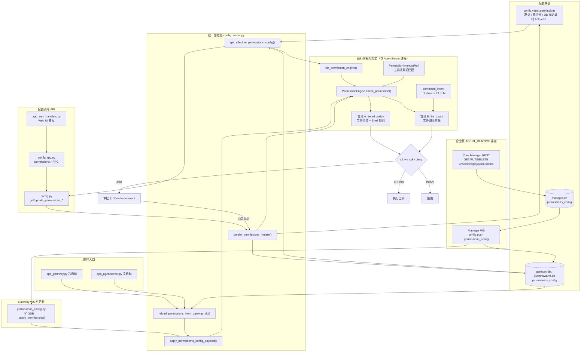
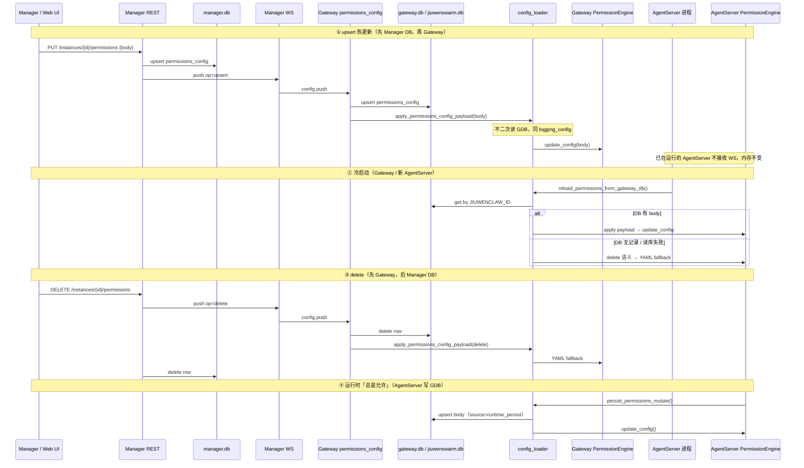
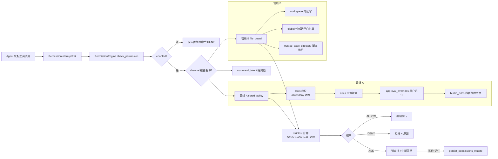
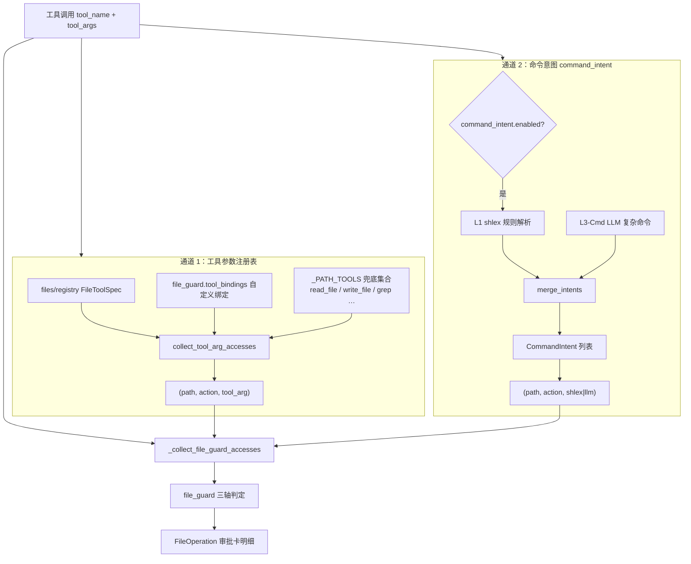
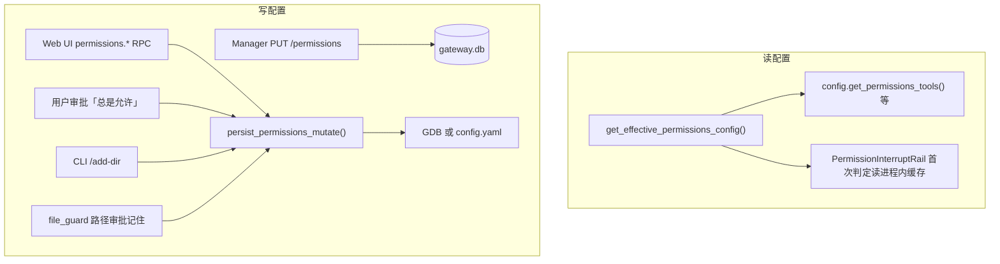

# Permissions 配置架构

本文档描述 JiuWenClaw **工具权限（permissions）配置**的整体架构，涵盖标准版与企业版（`AGENT_RUNTIME`）两种部署模式、**生效粒度**、配置读写链路、运行时判定框架，以及各模块职责对照。

> 相关文档：[工具权限与安全防护](./工具权限与安全防护.md)  
> 企业版 E2E 用例说明：[test_permissions_config.md](../../tests/system_tests/enterprise/test_permissions_config.md)

---

## 一、整体架构




---

## 二、两种部署模式


| 模式      | 判定条件               | 读取来源                                                | 写入目标                                                                     |
| ------- | ------------------ | --------------------------------------------------- | ------------------------------------------------------------------------ |
| **标准版** | `AGENT_RUNTIME` 为空 | 仅 `config.yaml::permissions`                        | 写回 `config.yaml`                                                         |
| **企业版** | `AGENT_RUNTIME` 非空 | `gateway.db` 有行 → 用 DB 整段 `body`；无行 → fallback YAML | Manager REST → `manager.db` → WS → `gateway.db`；运行时审批持久化直接写 `gateway.db` |


**核心入口**：`jiuwenclaw/agentserver/permissions/config_loader.py`


| 函数                                     | 职责                                                                                       |
| -------------------------------------- | ---------------------------------------------------------------------------------------- |
| `is_enterprise_runtime()`              | 判断 `AGENT_RUNTIME` 是否非空                                                                  |
| `get_effective_permissions_config()`   | 返回当前生效的 permissions 段（带进程内缓存）；async 上下文且 `force_reload` 时不跨 loop 读 GDB，有缓存用缓存、无缓存回落 YAML |
| `reload_permissions_from_gateway_db()` | **仅冷启动**：async 读 GDB → `apply_permissions_config_payload()`                              |
| `apply_permissions_config_payload()`   | **热 apply**（同 `logging_config`）：直接用 payload / YAML fallback 更新缓存与引擎，**不在此路径二次读 GDB**     |
| `persist_permissions_mutate()`         | 变更并持久化（企业写 GDB，标准写 YAML）                                                                 |
| `clear_permissions_config_cache()`     | 写操作后清缓存                                                                                  |


---

## 三、生效粒度

permissions **不是按单个 agent 配置**，而是按 **Gateway 实例（`jiuwenclaw_id`）/ AgentServer 进程** 生效。下表汇总各层级的粒度与职责边界。


| 层级        | 粒度                           | 说明                                                                                             |
| --------- | ---------------------------- | ---------------------------------------------------------------------------------------------- |
| **配置存储**  | 每个 `jiuwenclaw_id` 一份        | 企业版：`gateway.db` / `jiuwenswarm.db` 的 `permissions_config.body`；标准版：`config.yaml::permissions` |
| **配置缓存**  | 每个进程一份                       | `config_loader` 进程内缓存；Gateway 与 AgentServer 各自独立                                               |
| **运行时引擎** | 每个 **AgentServer 进程** 一个全局单例 | `PermissionEngine`（`core.py` 中 `_permission_engine`）；同进程内所有 agent 共用                           |
| **实际拦截**  | 仅 **AgentServer**            | `PermissionInterruptRail` → `check_permission()`；Gateway 只加载/同步配置，不校验工具调用                      |


### 同进程内多个 agent

一个 AgentServer 进程内即使有多个 agent（不同 session / 不同 `create_instance`），也**共享同一份** `permissions` 配置与同一个 `PermissionEngine`。`create_instance` 时调用 `init_permission_engine(get_effective_permissions_config())`，更新的是进程级单例，**不会**按 agent id 分叉配置。

### 多个 AgentServer 进程

同一 `jiuwenclaw_id` 下的多个 AgentServer 进程：

- **持久化层**：共用 GDB（或标准版同一份 `config.yaml`）中的同一条 `permissions_config` 记录。
- **内存层**：各进程各自持有 `config_loader` 缓存与 `PermissionEngine` 实例，**不共享**运行时对象。


| 变更场景                            | 已在运行的 AgentServer 是否立刻一致                                    |
| ------------------------------- | ----------------------------------------------------------- |
| **冷启动**（新拉起进程）                  | ✅ 会 `reload_permissions_from_gateway_db()` 读到 GDB 最新 `body` |
| **Manager PUT 热更新**             | ❌ 仅热更新 Gateway 进程；已在跑的 AgentServer **不订阅 Manager WS**       |
| **某 AgentServer 审批「总是允许」写 GDB** | ❌ 其他已在跑的 AgentServer **不会**自动感知                             |
| **本进程 `permissions.`* RPC**     | ✅ 仅更新发起 RPC 的该 AgentServer 进程内存                             |


已在运行的 AgentServer 要与 Manager 下发或 GDB 最新内容对齐，需**重启该进程**，或经 Web `permissions.`* RPC / 本进程审批持久化更新本机引擎（见 [五、企业版配置同步链路](#五企业版配置同步链路)）。

不同 `jiuwenclaw_id` 的 AgentServer 对应 GDB 中不同的 `permissions_config` 行，**不是同一份配置**。

### 请求级差异化（非 per-agent）

当前架构**不支持**「每个 agent 独立一套 permissions」。若需在同一实例内做差异化，仅在**请求上下文**层叠加，均基于同一份全局配置：


| 机制               | 匹配维度                               | 作用                                |
| ---------------- | ---------------------------------- | --------------------------------- |
| `owner_scopes`   | `channel_id` + `principal_user_id` | 数字分身场景；与全局权限取交集，`ask` 可降级为 `deny` |
| `channel_id` 白名单 | `PERMISSION_ENABLED_CHANNELS`      | 部分 channel 可跳过权限检查                |
| `session_id`     | 单次会话                               | 审批状态 / 日志归因，不改变配置本身               |


---

## 四、配置存储结构

`permissions` 段在 **YAML** 与 **DB `body` JSON** 中结构一致：

```yaml
permissions:
  enabled: true              # 总开关
  defaults: ask              # 未在 tools 中列出的工具默认策略
  tools: {...}                 # 整工具档位 allow / ask / deny
  rules: [...]                 # 预置 Shell 命令白/黑名单
  approval_overrides: []       # 用户「总是允许」动态规则
  owner_scopes: {}             # 数字分身 owner 作用域
  deny_guidance_message: ""
  command_intent:              # 命令意图抽取（L1 shlex + L3 LLM）
    enabled: true
    timeout_seconds: 15
    extra_body: {...}
  file_guard:                  # 文件路径三轴
    workspace:
      rw_enabled: true
    global: {}
    trusted_exec_directory: []
    tool_bindings: {}
  external_directory: {...}    # 旧键，加载时自动迁移到 file_guard.global
```

### 数据库表 `permissions_config`


| 字段                          | 类型       | 说明                                              |
| --------------------------- | -------- | ----------------------------------------------- |
| `jiuwenclaw_id`             | string   | Gateway 实例 ID（唯一）                               |
| `body`                      | json     | 完整 permissions 段                                |
| `source`                    | string   | `manager` / `runtime_persist` / `cli_add_dir` 等 |
| `revision`                  | integer  | 变更版本                                            |
| `created_at` / `updated_at` | datetime | 时间戳                                             |


`manager.db` 与 `gateway.db` 同构；Manager 为权威写入源，Gateway 为运行时读库。

---

## 五、企业版配置同步链路




### Manager REST API


| 方法       | 路径                                              | 说明                                                     |
| -------- | ----------------------------------------------- | ------------------------------------------------------ |
| `GET`    | `/api/v1/instances/{jiuwenclaw_id}/permissions` | 读 manager.db；无记录 404                                   |
| `PUT`    | `/api/v1/instances/{jiuwenclaw_id}/permissions` | body 为完整 permissions 段；写 MDB → WS → GDB                |
| `DELETE` | `/api/v1/instances/{jiuwenclaw_id}/permissions` | push delete → Gateway 删 GDB + YAML fallback → 再删 MDB 行 |


### Gateway 与 AgentServer 职责


| 职责                                       | Gateway  | AgentServer                     |
| ---------------------------------------- | -------- | ------------------------------- |
| Manager WS 收包写 GDB                       | ✅        | —                               |
| `apply_permissions_config_payload` 热更新   | ✅（WS 触发） | ❌（不订阅 WS）                       |
| `reload_permissions_from_gateway_db` 冷启动 | ✅        | ✅                               |
| 工具调用前 `PermissionInterruptRail` 校验       | ❌        | ✅                               |
| 审批「总是允许」写 GDB                            | 一般不执行    | ✅（`persist_permissions_mutate`） |


**多 AgentServer 实例**：持久化共享、内存独立及同步时机见 [三、生效粒度](#三生效粒度)。

---

## 六、运行时判定框架




### 三种权限级别


| 级别      | 行为        |
| ------- | --------- |
| `allow` | 直接执行      |
| `ask`   | 弹出审批，用户决定 |
| `deny`  | 拒绝执行      |


### 管线 A：tiered_policy

- **工具档位**（`tools.<name>`）：显式 `allow` / `deny` 直接短路
- **Shell 命令规则**（`rules` / `approval_overrides`）：仅匹配 Shell 工具（`bash`、`mcp_exec_command`、`create_terminal`）的命令文本
- **匹配优先级**：`approval_overrides` → `rules` → `builtin_rules`
- **整命令 deny 扫描**在子命令 allow 匹配之前执行

### 管线 B：file_guard

- **read / write**：workspace 内默认放行（`rw_enabled`）+ `global` 最长前缀白名单
- **exec**：`trusted_exec_directory` 白名单
- 按路径逐条判定，多条访问取 **strictest**（DENY > ASK > ALLOW）

#### 管线 B 的路径来源（两条通道）

`PermissionEngine._collect_file_guard_accesses()` 合并两条独立通道，统一转成 `(Path, action, source)` 三元组后交给 `FileGuardChecker.evaluate_accesses()`：




| 通道            | 适用工具                                                                                | 路径从哪来                                       | `source` 标记            |
| ------------- | ----------------------------------------------------------------------------------- | ------------------------------------------- | ---------------------- |
| **通道 1：工具参数** | 路径类工具（`read_file`、`write_file`、`search_replace`、`grep` 等）及 `tool_bindings` 注册的自定义工具 | 直接读 `tool_args` 里的 `path` / `file_path` 等字段 | `tool_arg`             |
| **通道 2：命令意图** | Shell 类（`bash`、`mcp_exec_command`、`create_terminal`）与代码类（`run_python` 等）            | 从 `command` / `code` 字符串解析隐含的文件读写/执行        | `shlex`（L1）或 `llm`（L3） |


> **分工**：`read_file({path})` 只走通道 1；`bash({command: "cat /etc/hosts"})` 主要走通道 2。Shell 命令的**白名单匹配**（`rules` / `approval_overrides`）属于管线 A，与 `CommandIntent` 无关。

#### CommandIntent 是什么？

`CommandIntent` 是通道 2 的**中间数据结构**（定义于 `command_intent.py`），表示「这条命令会对哪些路径做哪一种原子文件操作」。**本模块只做抽取，不做权限判定**；判定由 `file_guard` 完成。


| 字段           | 类型                | 含义               |
| ------------ | ----------------- | ---------------- |
| `summary`    | `str`             | 给用户看的中文摘要（审批卡文案） |
| `action`     | `read`            | `write`          |
| `paths`      | `tuple[str, ...]` | 规范化绝对路径（POSIX）   |
| `executable` | `str              | None`            |
| `source`     | `shlex`           | `llm`            |


启用条件：`permissions.command_intent.enabled = true`（默认 `true`），且在 `PermissionEngine.check_permission()` 内对 Shell/代码工具调用 `collect_command_intents()`。

**L1 vs L3：**


| 层级     | 方式                                                             | 何时用                                                  |
| ------ | -------------------------------------------------------------- | ---------------------------------------------------- |
| **L1** | `shlex` + 启发式（`cp`/`mv`/`rm`、重定向 `>`/`>>`/`<`、`python x.py` 等） | 始终先跑；简单命令足够                                          |
| **L3** | LLM 静态分析命令字符串（不读磁盘）                                            | 管道、子 shell、`bash -c`、`find -exec`、cmd `if/for` 等复杂结构 |


#### CommandIntent 示例

**示例 1：`bash` + 简单读文件（仅 L1）**

命令：

```bash
cat README.md
```

抽取结果（示意）：

```python
CommandIntent(
    summary="读取 /workspace/README.md",
    action="read",
    paths=("/workspace/README.md",),
    executable="cat",
    source="shlex",
)
```

若路径在 workspace 外且未配置 `file_guard.global` → 管线 B 产出 ASK，审批卡显示 `summary`。

**示例 2：`bash` + 重定向写文件（L1，多条 Intent）**

命令：

```bash
cat /etc/hosts > /tmp/out.txt
```

抽取结果（示意，拆成两条）：

```python
[
    CommandIntent(
        summary="读取 /etc/hosts",
        action="read",
        paths=("/etc/hosts",),
        executable="cat",
        source="shlex",
    ),
    CommandIntent(
        summary="写入 /tmp/out.txt",
        action="write",
        paths=("/tmp/out.txt",),
        executable="cat",
        source="shlex",
    ),
]
```

**示例 3：`bash` + 执行脚本（L1，`exec` 轴）**

命令：

```bash
python scripts/deploy.py
```

```python
CommandIntent(
    summary="通过 python 执行 /workspace/scripts/deploy.py",
    action="exec",
    paths=("/workspace/scripts/deploy.py",),
    executable="python",
    source="shlex",
)
```

`exec` 走 `file_guard.trusted_exec_directory` 白名单，不在白名单则 ASK。

**示例 4：复杂管道（L1 + L3）**

命令：

```bash
find . -name "*.log" -exec rm {} \;
```

- L1 可能抽不全 → L3 闸门打开 → LLM 返回 JSON `intents` 数组
- 典型结果：多条 `action="write"`（删除即写轴语义）的 Intent，`source="llm"`

**示例 5：路径类工具（不走 CommandIntent）**

工具调用：

```json
{ "tool": "write_file", "args": { "path": "/tmp/a.txt", "content": "..." } }
```

- 通道 1 直接得到 `("/tmp/a.txt", "write", "tool_arg")`
- `collect_command_intents()` 对非 Shell 工具返回 `[]`，**不产生** `CommandIntent`

#### 从 CommandIntent 到审批卡

合并后的访问列表经 `file_guard._check_one()` 判定；需要审批的路径会落成 `FileOperation`（与 `CommandIntent` 字段对应，供 UI 渲染）：

```python
FileOperation(
    action="read",           # 来自 CommandIntent.action
    path="/etc/hosts",       # 来自 CommandIntent.paths
    source="shlex",          # 来自 CommandIntent.source
    prompt="是否允许读取 /etc/hosts？",
)
```

用户选「总是允许」后，路径类写入 `file_guard.global`；`exec` 写入 `trusted_exec_directory`（见 `persist_file_operations_allow`）。

---

## 七、模块与功能对照


| 模块             | 路径                                                              | 功能                                                                                          |
| -------------- | --------------------------------------------------------------- | ------------------------------------------------------------------------------------------- |
| **配置加载器**      | `jiuwenclaw/agentserver/permissions/config_loader.py`           | 企业/标准分流；GDB↔YAML fallback；冷启动/热更新；统一持久化                                                     |
| **配置 API**     | `jiuwenclaw/config.py`                                          | `get_permissions_`* / `update_permissions_`*；内部走 loader                                     |
| **权限引擎**       | `jiuwenclaw/agentserver/permissions/core.py`                    | 编排管线 A+B；`check_permission()` 主入口                                                           |
| **工具/命令策略**    | `jiuwenclaw/agentserver/permissions/tiered_policy.py`           | `tools` / `rules` / `approval_overrides` / 内置 deny                                          |
| **文件路径守卫**     | `jiuwenclaw/agentserver/permissions/file_guard.py`              | `file_guard` 三轴；审批后写 `global` / `trusted_exec_directory`                                    |
| **命令意图**       | `jiuwenclaw/agentserver/permissions/command_intent.py`          | 复杂 Shell 路径抽取（`command_intent.enabled`）                                                     |
| **Shell 工具定义** | `jiuwenclaw/agentserver/permissions/shell_tools.py`             | `bash` / `mcp_exec_command` / `create_terminal`                                             |
| **审批持久化**      | `jiuwenclaw/agentserver/permissions/patterns.py`                | 「总是允许」→ `approval_overrides` 或 `tools.`*                                                    |
| **拦截 Rail**    | `jiuwenclaw/agentserver/deep_agent/rails/permission_rail.py`    | 工具调用前 HITL；读 effective config                                                               |
| **RPC 入口**     | `jiuwenclaw/agentserver/permissions/config_rpc.py`              | Web/Agent `permissions.`* 方法                                                                |
| **Manager 服务** | `packages/jiuwenclaw-ee/claw_manager/.../permissions_config.py` | REST 写 manager.db + WS 推送                                                                   |
| **Gateway 同步** | `packages/jiuwenclaw-ee/gateway/.../permissions_config.py`      | WS 收包：先写 GDB，再 `_apply_permissions()` → `apply_permissions_config_payload()`（不 `reload` 读库） |
| **冷启动**        | `jiuwenclaw/app_gateway.py` / `app_agentserver.py`              | `AGENT_RUNTIME` 时 `await reload_permissions_from_gateway_db()`                              |
| **权限校验进程**     | —                                                               | 仅 AgentServer：`PermissionInterruptRail` → `PermissionEngine`                                |


---

## 八、permissions 各字段运行时作用


| 字段                                  | 作用                        | 匹配对象                      |
| ----------------------------------- | ------------------------- | ------------------------- |
| `enabled`                           | 总开关；关闭后大多放行，内置危险命令仍 DENY  | —                         |
| `defaults`                          | 未在 `tools` 中列出的工具默认策略     | 工具名                       |
| `tools`                             | 整工具档位；`allow`/`deny` 直接短路 | 工具名                       |
| `rules`                             | 管理员预置 Shell 白/黑名单         | Shell 命令文本                |
| `approval_overrides`                | 用户审批「总是允许」后动态追加           | Shell 命令文本（优先级高于 `rules`） |
| `command_intent`                    | 是否启用 L1+L3 从命令抽路径         | Shell / 代码工具              |
| `file_guard.workspace`              | 工作区内读写是否默认放行              | 文件路径                      |
| `file_guard.global`                 | 工作区外路径白名单（最长前缀）           | 文件路径                      |
| `file_guard.trusted_exec_directory` | 允许脚本执行的目录                 | exec 路径                   |
| `owner_scopes`                      | 数字分身 owner 维度权限           | 分身场景                      |


### Shell 工具 vs 非 Shell 工具


| 类型      | 工具名                                         | 「总是允许」持久化目标                                 |
| ------- | ------------------------------------------- | ------------------------------------------- |
| Shell   | `bash`、`mcp_exec_command`、`create_terminal` | `approval_overrides`（按命令 pattern）           |
| 非 Shell | `write_file`、`todo_create` 等                | `tools.<name>: allow` 或 `file_guard.global` |


---

## 九、读写入口汇总




---

## 十、进程栈（企业版 E2E）

```
Mock LLM ──HTTP──► AgentServer（子进程）
                        ▲
                        │ Runtime Process deploy
Claw Manager ◄──WS──► Gateway ◄──WS──► 测试客户端 / Web UI
     │                    │
     │ REST               │ 共用 SQLite
     ▼                    ▼
 manager.db          jiuwenswarm.db (GDB)
```

测试用例：`tests/system_tests/enterprise/test_permissions_config_process_e2e.py`

---

## 十一、一句话总结

**生效粒度**：按 `jiuwenclaw_id` 存一份配置，按 **AgentServer 进程** 加载一个 `PermissionEngine` 单例（**非 per-agent**）；同 `jiuwenclaw_id` 下多 AgentServer 共享 GDB、内存各自独立。**配置层**由 `config_loader` 统一做「企业 GDB 优先、YAML fallback」；热更新与 `logging_config` 同模式——**WS 路径只 `apply_permissions_config_payload`，冷启动才 `reload_permissions_from_gateway_db` 读 GDB**。**执行层**仅在 **AgentServer** 由 `PermissionEngine` 双管线判定；**企业版** Manager REST → MDB → WS → Gateway 写 GDB 并热更新 Gateway 内存，AgentServer 靠冷启动读共享 GDB（或本进程审批写库），**标准版**仍只读写 `config.yaml`。