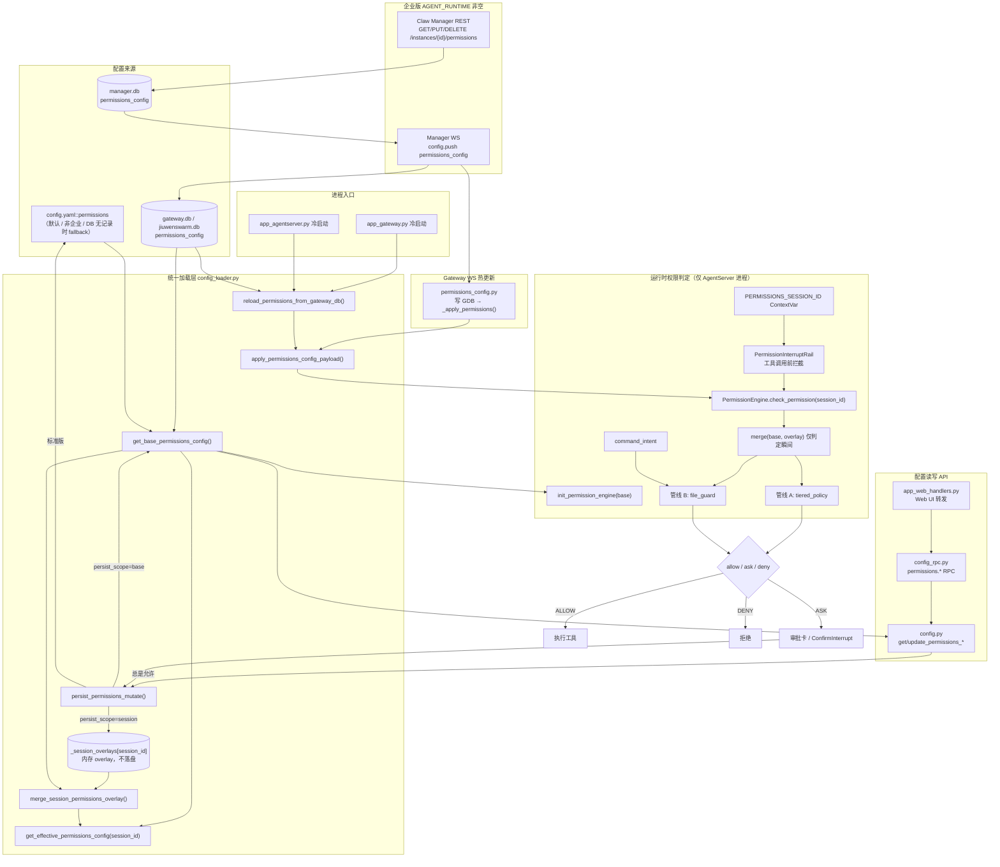
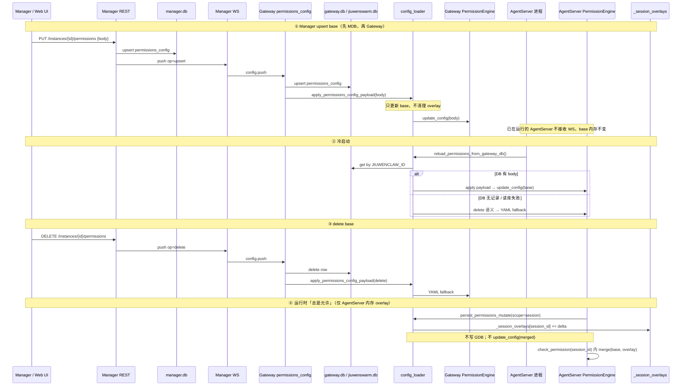
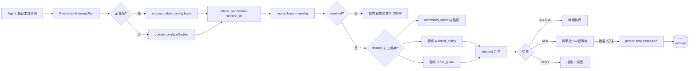
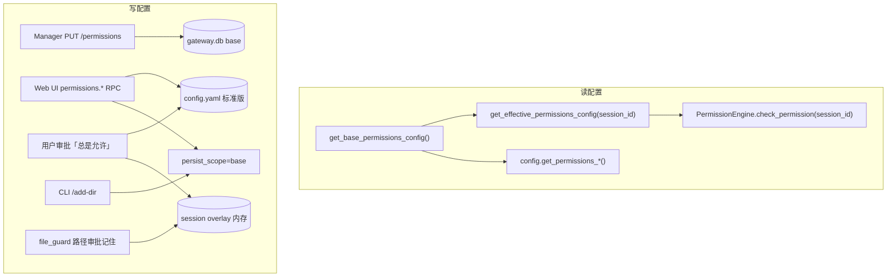

# Permissions 配置架构

本文档描述 JiuWenClaw **工具权限（permissions）配置**的整体架构，涵盖标准版与企业版（`AGENT_RUNTIME`）两种部署模式、**base / overlay 分层**、**生效粒度**、配置读写链路、运行时判定框架，以及各模块职责对照。

> 相关文档：[工具权限与安全防护](./工具权限与安全防护.md)  
> 企业版 E2E 用例说明：[test_permissions_config.md](../../tests/system_tests/enterprise/test_permissions_config.md)

---

## 一、整体架构



---

## 二、两种部署模式

| 模式 | 判定条件 | 读取来源 | 写入目标 |
| --- | --- | --- | --- |
| **标准版** | `AGENT_RUNTIME` 为空 | 仅 `config.yaml::permissions` | 写回 `config.yaml` |
| **企业版** | `AGENT_RUNTIME` 非空 | GDB 有行 → 用 DB 整段 `body` 作 **base**；无行 → fallback YAML | **Manager REST** → MDB → WS → GDB（权威配置）；AgentServer **审批「总是允许」只写内存 overlay，不写 GDB** |

**核心入口**：`jiuwenclaw/agentserver/permissions/config_loader.py`

| 函数 | 职责 |
| --- | --- |
| `is_enterprise_runtime()` | 判断 `AGENT_RUNTIME` 是否非空 |
| `get_base_permissions_config()` | 返回 **base** 段（不含会话 overlay）；带进程内 `_cached_permissions` 缓存 |
| `get_effective_permissions_config(session_id=...)` | 返回 **base + 会话 overlay**（企业版）；标准版等价于 base |
| `merge_session_permissions_overlay(base, session_id)` | 将 base 与 `_session_overlays[session_id]` 合并，供 `PermissionEngine` 判定 |
| `setup_permissions_session_scope(session_id)` | 绑定当前 asyncio Task 的 `PERMISSIONS_SESSION_ID` ContextVar |
| `reload_permissions_from_gateway_db()` | **仅冷启动**：async 读 GDB → `apply_permissions_config_payload()` |
| `apply_permissions_config_payload()` | **热 apply**：更新 **base** 缓存与引擎；**不清理**各会话 overlay |
| `persist_permissions_mutate(..., persist_scope=...)` | 见 [2.1 persist 语义](#21-persist-语义) |
| `clear_permissions_config_cache()` | 清除 base 缓存 |
| `clear_session_permissions_overlay(session_id=...)` | 清除会话 overlay（可选单会话或全部） |

### 2.1 persist 语义

| `persist_scope` | 部署 | 行为 |
| --- | --- | --- |
| `"session"`（默认） | 企业版 | 仅更新 `_session_overlays[session_id]`（内存，不落盘、不写 GDB） |
| `"base"` | 企业版 | 更新进程内 base 缓存 + `PermissionEngine.update_config()`（Web UI RPC、CLI `add_dir` 等管理路径） |
| （无 scope，标准版） | 标准版 | 写 `config.yaml` + 刷新引擎 |

审批「总是允许」、`persist_file_operations_allow` 等 runtime 路径使用 `persist_scope="session"`；`config.py` 内 Web 管理 API 使用 `persist_scope="base"`。

---

## 三、Base 与 Overlay

企业版将 permissions 拆成两层：

```
effective(session_id) = merge(base, overlay[session_id])
```

### 3.1 Base 存什么

**Base** 是实例级、全员共享的管理员策略，对应 `_cached_permissions` / `PermissionEngine.config`（企业版 engine **只持有 base**）。

| 来源 | 说明 |
| --- | --- |
| 企业版 | GDB `permissions_config.body`；冷启动 / Manager WS 热更新 |
| 标准版 | `config.yaml::permissions` |

结构为**完整** `permissions` 段，例如：

```yaml
permissions:
  enabled: true
  defaults: ask
  tools: { bash: ask, Write: guard, ... }
  rules: [...]
  approval_overrides: []       # Manager 预置
  owner_scopes: {}
  command_intent: { enabled: true, ... }
  file_guard:
    workspace: { rw_enabled: true }
    global: {}
    trusted_exec_directory: []
  external_directory: {...}    # 旧键，加载时迁移到 file_guard.global
```

### 3.2 Overlay 存什么

**Overlay** 是某个 **session** 在运行时「总是允许」等操作产生的**增量**，存在 `_session_overlays[session_id]`，**仅内存、不落盘、不写 GDB**。

Overlay **只含与 base 不同的字段**（由 `_extract_session_overlay` 提取），最多三类：

| 字段 | 内容 | 典型来源 |
| --- | --- | --- |
| `tools` | 与 base 不同的工具档位 | 「总是允许」非 Shell 工具 → `{ "Write": "allow" }` |
| `approval_overrides` | base 中不存在的新规则 | Shell「总是允许」→ `{ pattern: "git *", action: "allow" }` |
| `file_guard` | 与 base 不同的文件策略 | 路径「总是允许」→ `global` 路径权限、`trusted_exec_directory` 新增目录 |

**不会**进入 overlay：`enabled`、`defaults`、`rules`、`owner_scopes`、`command_intent` 等（仅 base 管理）。

示例（某 session 多次「总是允许」后）：

```json
{
  "tools": { "Write": "allow" },
  "approval_overrides": [
    { "id": "user_allow_git_...", "pattern": "git *", "action": "allow", "scope": "head" }
  ],
  "file_guard": {
    "global": { "/tmp/project": { "read_enable": true, "write_enable": true } },
    "trusted_exec_directory": ["/opt/tools"]
  }
}
```

### 3.3 合并规则

| 字段 | 合并方式 |
| --- | --- |
| `tools` | overlay 同 key **覆盖** base |
| `approval_overrides` | overlay 规则**追加**到 base 列表（按 pattern+action 去重） |
| `file_guard` | deep merge（`global` 按路径合并，`trusted_exec_directory` 追加） |

Manager / GDB 热更新只替换 **base**，**不清理**已有 session overlay；各 session 的 runtime 变更在 base 更新后仍保留（overlay 与 base 独立合并）。

---

## 四、生效粒度

| 层级 | 粒度 | 说明 |
| --- | --- | --- |
| **配置存储（持久化）** | 每个 `jiuwenclaw_id` 一份 base | 企业版：GDB `permissions_config.body`；标准版：`config.yaml` |
| **Base 缓存** | 每个进程一份 | `_cached_permissions`；Gateway 与 AgentServer 各自独立 |
| **Session overlay** | 每个 `session_id` 一份（仅企业版、仅内存） | `_session_overlays`；进程重启丢失 |
| **运行时引擎** | 每个 AgentServer 进程一个全局单例 | `PermissionEngine.config` = **base**；判定时按 `session_id` 临时 merge overlay |
| **实际拦截** | 仅 AgentServer | `PermissionInterruptRail` → `check_permission(session_id=...)` |

### 同进程内多个 session

- **Base**：同进程所有 session **共享**（来自 GDB / YAML）。
- **Overlay**：各 session **独立**；Session A 的「总是允许」不影响 Session B。
- **PermissionEngine**：单例；企业版 **不在** `update_config` 中写入 overlay，避免污染全局 engine。

请求入口（`interface_deep.py`）通过 `setup_permissions_session_scope(session_id)` 绑定 ContextVar；`PermissionInterruptRail` 将 `session_id` 传入 `check_permission()`，引擎内部 `merge_session_permissions_overlay(self.config, session_id)` 得到本次判定用的 effective config。

### 多个 AgentServer 进程

同一 `jiuwenclaw_id` 下：

- **持久化 base**：共用 GDB（或标准版同一份 `config.yaml`）。
- **内存 base + overlay**：各进程独立；overlay **不跨进程同步**。

| 变更场景 | 已在运行的 AgentServer 是否立刻一致 |
| --- | --- |
| **冷启动**（新进程） | ✅ base 从 GDB 加载；overlay 为空 |
| **Manager PUT 热更新 base** | ❌ Gateway 热更新；已在跑的 AgentServer **不订阅 Manager WS** |
| **某 session 审批「总是允许」** | ✅ 仅该进程、该 session 的 overlay；**不写 GDB**，其他 AgentServer / session 不受影响 |
| **本进程 `permissions.*` RPC（base）** | ✅ 更新本进程 base 缓存与引擎 |

不同 `jiuwenclaw_id` 对应 GDB 中不同的 `permissions_config` 行。

### 请求级差异化

| 机制 | 匹配维度 | 作用 |
| --- | --- | --- |
| **Session overlay** | `session_id` | 企业版 runtime「总是允许」；仅内存 |
| `owner_scopes` | `channel_id` + `principal_user_id` | 数字分身；与 effective 取交集 |
| `channel_id` 白名单 | `PERMISSION_ENABLED_CHANNELS` | 部分 channel 跳过权限检查 |
| `session_id`（审批状态） | 单次会话 | `INTERRUPT_AUTO_CONFIRM_KEY` 等；与 overlay 正交 |

---

## 五、配置存储结构

`permissions` 段在 **YAML** 与 **DB `body` JSON** 中结构一致（见 [3.1 Base](#31-base-存什么)）。

### 数据库表 `permissions_config`

| 字段 | 类型 | 说明 |
| --- | --- | --- |
| `jiuwenclaw_id` | string | Gateway 实例 ID（唯一） |
| `body` | json | 完整 permissions 段（**base**） |
| `source` | string | `manager` 等（**不含** AgentServer runtime overlay） |
| `revision` | integer | 变更版本 |
| `created_at` / `updated_at` | datetime | 时间戳 |

`manager.db` 与 `gateway.db` 同构；Manager 为权威写入源，Gateway / AgentServer **只读** base（AgentServer 不写 GDB）。

### 示例：`permissions_config.body`

Manager REST `PUT` 请求体或 GDB 中 `body` 列的 JSON 结构示例：

```json
{
  "body": {
    "enabled": true,
    "defaults": "ask",
    "tools": {
      "bash": "ask",
      "todo_list": "allow"
    },
    "rules": [
      {
        "id": "shell_allow_pwd",
        "pattern": "pwd *",
        "action": "allow"
      }
    ],
    "approval_overrides": [],
    "deny_guidance_message": "",
    "file_guard": {
      "workspace": {
        "rw_enabled": true,
        "description": ""
      },
      "global": {},
      "trusted_exec_directory": [],
      "tool_bindings": {}
    }
  }
}
```

---

## 六、企业版配置同步链路



### Manager REST API

| 方法 | 路径 | 说明 |
| --- | --- | --- |
| `GET` | `/api/v1/instances/{jiuwenclaw_id}/permissions` | 读 manager.db；无记录 404 |
| `PUT` | `/api/v1/instances/{jiuwenclaw_id}/permissions` | body 为完整 permissions 段；写 MDB → WS → GDB |
| `DELETE` | `/api/v1/instances/{jiuwenclaw_id}/permissions` | push delete → Gateway 删 GDB + YAML fallback → 再删 MDB 行 |

### Gateway 与 AgentServer 职责

| 职责 | Gateway | AgentServer |
| --- | --- | --- |
| Manager WS 收包写 GDB（base） | ✅ | — |
| `apply_permissions_config_payload` 热更新 base | ✅（WS 触发） | ❌（不订阅 WS） |
| `reload_permissions_from_gateway_db` 冷启动 | ✅ | ✅ |
| 工具调用前 `PermissionInterruptRail` 校验 | ❌ | ✅ |
| 审批「总是允许」写 GDB | ❌ | ❌ |
| 审批「总是允许」写 session overlay（内存） | ❌ | ✅ |

---

## 七、运行时判定框架

### PermissionInterruptRail 与 engine 的分工

企业版在首次判定时：

1. `get_base_permissions_config()` 同步 **base** 到 `PermissionEngine`（**不含** overlay）。
2. `check_permission(..., session_id=...)` 内部 `merge(base, overlay[session_id])` 做本次判定。

标准版无 overlay，`get_effective_permissions_config()` 等价于 base，可整体 `update_config`。



### 三种权限级别

| 级别 | 行为 |
| --- | --- |
| `allow` | 直接执行 |
| `ask` | 弹出审批，用户决定 |
| `deny` | 拒绝执行 |

### 管线 A：tiered_policy

- **工具档位**（`tools.<name>`）：显式 `allow` / `deny` 直接短路
- **Shell 命令规则**（`rules` / `approval_overrides`）：仅匹配 Shell 工具命令文本
- **匹配优先级**：`approval_overrides` → `rules` → `builtin_rules`

### 管线 B：file_guard

- **read / write**：workspace 内默认放行 + `global` 最长前缀白名单
- **exec**：`trusted_exec_directory` 白名单
- 路径来源：工具参数注册表 + `command_intent`（L1 shlex + L3 LLM）

用户选「总是允许」后，路径类写入 overlay 的 `file_guard.global`；`exec` 写入 `trusted_exec_directory`（见 `persist_file_operations_allow`）。

---

## 八、模块与功能对照

| 模块 | 路径 | 功能 |
| --- | --- | --- |
| **配置加载器** | `agentserver/permissions/config_loader.py` | base / overlay 分层；GDB↔YAML；session merge；persist scope |
| **配置 API** | `jiuwenclaw/config.py` | `get/update_permissions_*`；读 base；写 `persist_scope=base` |
| **权限引擎** | `agentserver/permissions/core.py` | `check_permission(session_id)`；判定时 merge overlay |
| **工具/命令策略** | `tiered_policy.py` | `tools` / `rules` / `approval_overrides` |
| **文件路径守卫** | `file_guard.py` | `file_guard` 三轴；审批后写 overlay / yaml |
| **审批持久化** | `patterns.py` | 「总是允许」→ overlay 或 yaml |
| **拦截 Rail** | `deep_agent/rails/permission_rail.py` | HITL；企业版 sync base + 传 session_id |
| **请求入口** | `deep_agent/interface_deep.py` | `setup_permissions_session_scope` |
| **RPC 入口** | `config_rpc.py` | Web `permissions.*`；读写 base |
| **Manager 服务** | `claw_manager/.../permissions_config.py` | REST 写 manager.db + WS 推送 |
| **Gateway 同步** | `gateway/.../permissions_config.py` | WS 写 GDB → `apply_permissions_config_payload` |
| **冷启动** | `app_gateway.py` / `app_agentserver.py` | `reload_permissions_from_gateway_db()` |

---

## 九、permissions 各字段运行时作用

| 字段 | 所在层 | 作用 |
| --- | --- | --- |
| `enabled` | base | 总开关 |
| `defaults` | base | 未列出的工具默认策略 |
| `tools` | base + overlay | 整工具档位；overlay 可覆盖单工具 |
| `rules` | base | 管理员预置 Shell 规则 |
| `approval_overrides` | base + overlay | base 预置 + session runtime 追加 |
| `command_intent` | base | L1+L3 路径抽取开关 |
| `file_guard.*` | base + overlay | 三轴；overlay 可追加 global / trusted_exec |
| `owner_scopes` | base | 数字分身 owner 维度 |

### Shell 工具 vs 非 Shell 工具（「总是允许」写入 overlay 的字段）

| 类型 | 工具名 | 持久化目标（overlay 内） |
| --- | --- | --- |
| Shell | `bash`、`mcp_exec_command`、`create_terminal` | `approval_overrides` |
| 非 Shell | `write_file`、`todo_create` 等 | `tools.<name>: allow` 或 `file_guard.global` |

---

## 十、读写入口汇总



---

## 十一、进程栈（企业版 E2E）

```
Mock LLM ──HTTP──► AgentServer（子进程）
                        ▲
                        │ Runtime Process deploy
Claw Manager ◄──WS──► Gateway ◄──WS──► 测试客户端 / Web UI
     │                    │
     │ REST               │ 共用 SQLite
     ▼                    ▼
 manager.db          jiuwenswarm.db (GDB)
                           │
                           └── permissions_config.body = base（overlay 不在库中）
```

测试用例：`tests/system_tests/enterprise/test_permissions_config_process_e2e.py`  
单元测试（session overlay）：`tests/unit_tests/agentserver/test_permissions_session_overlay.py`

---

## 十二、一句话总结

**持久化 base**：按 `jiuwenclaw_id` 存一份 GDB / YAML 管理员策略；Manager REST → MDB → WS → Gateway 写 GDB 并热更新 Gateway 内存 base。**Runtime overlay**：企业版 AgentServer 按 **session_id** 在内存维护「总是允许」增量，**不写 GDB、不落盘**，判定时 `merge(base, overlay)`。**引擎**：`PermissionEngine` 单例持有 base；`check_permission(session_id)` 按会话 merge，避免多 session 互相污染。**标准版**仍整段读写 `config.yaml`，无 overlay 层。
