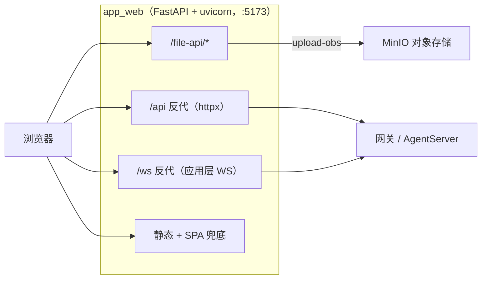
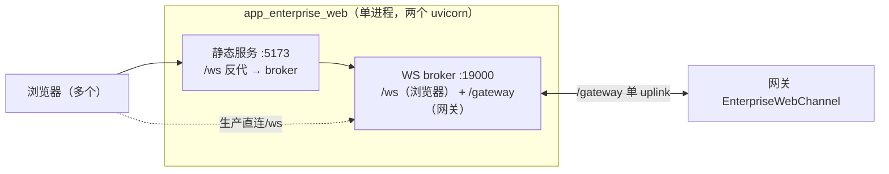

# Web 后端 FastAPI 重构

## 模块定位

面向浏览器的两个 Web 后端 —— **简单版 `app_web.py`** 与 **企业版 `app_enterprise_web.py`** —— 已从手写的 `http.server` + `websockets` + 裸 socket 隧道，重构为 **FastAPI + uvicorn**。

这是一次**只换引擎**的重构：对外契约（命令行、端口、环境变量、WebSocket / HTTP 协议、部署拓扑）逐条不变，前端与网关无任何感知，功能与现状完全一致。重构同时把两个后端的公共能力抽到一个 `jiuwenclaw/webserver/` 包，消除了原先 `app_enterprise_web` 直接 `import` `app_web` 内部符号的紧耦合。

> **FastAPI 与 uvicorn 的关系**：FastAPI 是 Web 框架，负责声明路由、解析请求、产出一个 ASGI 应用对象，本身不监听端口；uvicorn 是 ASGI 服务器，负责绑端口、收 HTTP/WebSocket 连接、把请求喂给 FastAPI。一句话——**FastAPI 是业务逻辑，uvicorn 是发动机**。

## 为什么重构

| 动机 | 说明 |
|---|---|
| 去掉手写网络栈 | 原 `app_web` 用 `select()` 双向对拷 + 手写 WS 帧解析器做 `/ws` 隧道，`app_enterprise_web` 用 `websockets.serve` 自己解帧。容易出错、难维护，交给成熟组件。 |
| 拆掉文件间紧耦合 | `app_enterprise_web` 顶部 `from jiuwenclaw.app_web import _SpaStaticHandler, ...`，动一个必然牵另一个。抽公共包后两者各自独立。 |
| 拆掉 `cgi` 定时炸弹 | `app_web` 的 `/file-api/push` 用 `cgi.FieldStorage` 解析 multipart，而 `cgi` 模块在 Python 3.13 已被移除。改用 FastAPI 的 `UploadFile`。 |
| 统一异步模型 | 同步阻塞代码（MinIO 上传、token 校验）交给 FastAPI 自动调度到线程池，不再阻塞事件循环。 |

## 架构

### 简单版 `app_web`

单进程单端口，做静态托管 + 反向代理。`/api`、`/ws` 默认都代理到 `--proxy-target`（网关）。



`--upload-api-only` 形态只暴露 `POST /file-api/upload-obs`（企业版开发态在 5174 单独跑它配合 Vite）。

### 企业版 `app_enterprise_web`

单进程**双端口**：5173 发静态并把 `/ws` 反代到本地 broker；19000 是有状态 WS broker，桥接「多个浏览器」与「单个网关 uplink」。`--relay-only` 只起 broker（开发态静态交给 Vite）。



**broker 是有状态的多路复用器，不是透明代理**：

- **浏览器 → 网关**：解析 `req` 帧，按 `session_id` 订阅；属于 `CHAT_ACCEPT_METHODS` 的方法先立即回 `accepted` 再转发，其余记 `pending(req_id → conn_id)` 再转发；**所有转发帧都经 `_browser_query` 注入完成 request_ext 透传**。
- **网关 → 浏览器**：`res` 帧按 `id` 点对点回源；`event` 帧按 `_route_conn_id` → `session_id`（广播订阅者）→ `request_id` 三级路由。
- 连接建立即向网关发 `web.connection_ack` 并下发 `connection.ack` 事件给浏览器。

## 目录结构

```
jiuwenclaw/webserver/              # 新增公共包
├─ common.py            WebRuntime 配置体、日志、dist 解析、地址规范化、
│                       路径越权防护、自定义 MIME、/api 反代（httpx）、静态 + SPA 兜底
├─ file_api.py          /file-api/* 全部路由；build_file_api_router(rt, upload_only=)
│                       multipart 用 UploadFile 取代 cgi.FieldStorage
├─ ws_proxy.py          简单版 /ws 应用层反代（透传 path+query+子协议+Origin，记 req/res/event 日志）
├─ enterprise_broker.py 企业版有状态 WS broker（EnterpriseWebWsServer + FastAPI 路由适配）
└─ app.py               app 组装器（见下）

jiuwenclaw/app_web.py              # 瘦身为入口：解析 CLI → 组装 app → uvicorn.run
jiuwenclaw/app_enterprise_web.py   # 瘦身为入口；re-export EnterpriseWebWsServer / CHAT_ACCEPT_METHODS
```

`app.py` 的四个组装函数：

| 函数 | 形态 | 内容 |
|---|---|---|
| `create_simple_web_app(rt)` | 简单版全功能 | `/file-api` + `/api` 反代 + `/ws` 反代 + 静态 |
| `create_upload_api_app(rt)` | 仅上传 | 只挂 `POST /file-api/upload-obs` |
| `create_enterprise_broker_app(broker)` | 企业版 broker | `/ws`（浏览器）+ `/gateway`（网关 uplink） |
| `create_enterprise_static_app(rt)` | 企业版静态 | `/ws` 反代到 broker + 静态（不含 `/api`） |

> **路由注册顺序**：`/file-api`、`/api`、`/ws` 必须先注册，静态 catch-all `/{full_path:path}` 最后注册，否则兜底路由会吃掉前面的路径。

## 关键设计点

- **request_ext 透传**：浏览器握手 query 是 ext 字段的载体（详见《扩展字段透传》《Web 文件上传》）。简单版 `/ws` 反代把原始 `path+query` 原样拼到上游 URL；企业版 broker 把浏览器 query 解析为 `dict[str, list[str]]` 存入 `_browser_query[conn_id]`，转发每一帧时注入为 `{**原帧, "_browser_query": <parse_qs 结果>}`，网关侧 `EnterpriseWebChannel` 据此还原 ext。无 query 时零变更。
- **Origin 校验**：浏览器 `/ws` 握手沿用 `is_allowed_browser_origin`（放行 `127.0.0.1`/`localhost`）。简单版反代会把浏览器 `Origin` 头透传给上游——原裸 socket 隧道连头一起转发，上游有 Origin 校验，FastAPI 版必须显式转发否则上游会拒。网关 `/gateway` 可信，不查 Origin。
- **WS 不再手写解帧**：FastAPI/uvicorn 已完成解压与解码，业务日志直接拿 text 帧解析 `req/res/event`，删掉了原 `_WsTextFrameParser`。
- **双端口同进程**：企业版用 `asyncio.gather` 在一个进程里并发跑两个 `uvicorn.Server`（5173 + 19000），并统一接管 SIGINT/SIGTERM，以**保持 k8s 双端口拓扑不变**。
- **同步代码自动入线程池**：MinIO 上传、download token 校验等阻塞调用写成 FastAPI 同步 `def` 路由 / `UploadFile`，框架自动调度到线程池，不阻塞事件循环。

## 使用方式

### 简单版

```bash
# 全功能（静态 + /api + /ws 反代到网关）
python -m jiuwenclaw.app_web --port 5173 --dist <dist> --proxy-target http://127.0.0.1:19000

# 仅上传（配合 Vite 开发代理，常驻 5174）
python -m jiuwenclaw.app_web --upload-api-only --port 5174
```

参数：`--host`（默认 env `JIUWENCLAW_WEB_HOST` 或 `localhost`）、`--port`（5173）、`--dist`、`--proxy-target`（`http://127.0.0.1:19000`，作 `/api`、`/ws` 默认上游）、`--api-target` / `--ws-target`（分别覆盖）、`--log-level`、`--ws-disable-compress`、`--upload-api-only`。

### 企业版

```bash
# 全形态：静态 5173 + broker 19000
python -m jiuwenclaw.app_enterprise_web --port 5173 --dist <dist>

# 仅 broker（开发态，静态交给 Vite）
python -m jiuwenclaw.app_enterprise_web --relay-only --relay-port 19000
```

参数：`--host` / `--port`（5173，静态）、`--dist`、`--ws-target`（覆盖静态侧 `/ws` 上游，默认指向本地 broker）、`--relay-host` / `--relay-port`（19000，broker）、`--relay-browser-path`（`/ws`）、`--relay-gateway-path`（`/gateway`）、`--relay-only`、`--log-level`、`--ws-disable-compress`。

### 环境变量

| 变量 | 用途 |
|---|---|
| `JIUWENCLAW_WEB_HOST` / `JIUWENCLAW_WEB_PORT` | 静态服务绑定地址 / 端口 |
| `JIUWENCLAW_WEB_PROXY_TARGET` | 简单版 `/api`、`/ws` 默认上游 |
| `ENTERPRISE_WEB_WS_HOST` / `ENTERPRISE_WEB_WS_PORT`（或 `WEB_PORT`） | broker 绑定地址 / 端口 |
| `ENTERPRISE_WEB_BROWSER_PATH`（或 `WEB_PATH`）/ `ENTERPRISE_WEB_GATEWAY_PATH` | broker 浏览器 / 网关路径 |
| `JIUWENCLAW_MINIO_ENDPOINT`/`ACCESS_KEY`/`SECRET_KEY`/`BUCKET`/`SECURE`/`PUBLIC_BASE_URL` | MinIO（或 `config.yaml` 的 `minio.*`） |

### 部署 / 打包

- **Docker**（`docker/Dockerfile.claw`）：容器内通过 `ENV JIUWENCLAW_WEB_HOST=0.0.0.0` 让后端绑全网卡（取代旧的 sed 改源码——重构后源码结构变了，sed 正则不再匹配）。
- **k8s**：拓扑不变，静态 5173 + broker/Service 19000（`deploy/conf/web.template.yaml`、`docker/deployment.yaml`）。
- **桌面 exe**（PyInstaller `scripts/jiuwenclaw.spec`）：`hiddenimports` 已追加 `jiuwenclaw.webserver`（及子模块）、`fastapi`、`collect_submodules("uvicorn"/"websockets")`，否则桌面端以 `-m jiuwenclaw.app_web` 起子进程时会缺依赖崩溃。

## 对外契约（保持不变）

以下是前端 / 网关 / 部署依赖的接口，重构后逐条保持。**任何一条变化都视为破坏性变更，须在 PR 显式说明并同步改调用方。**

**浏览器 ↔ WebPod（`/ws`）**：`req {type,id,method,params}` → `res {type,id,ok,payload?,error?,code?}`；`event {type,event,payload}`。错误码 `BAD_REQUEST` / `UPLINK_UNAVAILABLE`。`CHAT_ACCEPT_METHODS`（`chat.send`/`chat.resume`/`chat.interrupt`/`chat.user_answer`）先回 `{ok:true,payload:{accepted:true,session_id}}` 再转发。事件名 `connection.ack` + `chat.delta/final/error/file/media/tool_call/subtask_update/processing_status/ask_user_question/interrupt_result`。

**网关 ↔ WebPod（`/gateway`）**：单 uplink，新连接替换旧的；WebPod→网关方法 `web.connection_ack`（`params={"conn_id":...}`）；`_browser_query` 注入格式与 `res`/`event` 路由键（`id` / `_route_conn_id` / `session_id` / `request_id`）不变。

**HTTP 路由（简单版）**：静态 + SPA 兜底 + 自定义 MIME + 目录穿越防护；`/api` 反代；`/file-api/*`（GET `list-markdown`/`list-files`/`file-content`/`download`/`ws-debug-config`，POST `push`/`upload-obs`/`rebuild-agent-data`/`file-content`/`ws-debug-config`），错误体 `{"error":"..."}` 与状态码（400/403/404/500）不变。

**MinIO 上传载荷**：入 `{"filename","content_base64"}`，出 `{"url","name","size"}`，缺配置错误文案 + HTTP 500 不变。

**`EnterpriseWebWsServer` 公开 API**（单测契约）：`register_browser_connection`/`attach_gateway_uplink`/`bind_uplink_response_route`/`bind_chat_request_route`/`get_chat_request_route`/`subscribe_conn_to_session`/`get_active_session`/`session_includes_conn`/`has_pending_uplink_request`/`route_uplink_frame`/`route_browser_frame`/`request_gateway_connection_ack`，构造参数 `host/port/browser_path/gateway_path`，模块常量 `CHAT_ACCEPT_METHODS`。

> `bind_uplink_response_route` 走 `_pending_requests`（一问一答，收到 res 即弹出）；`bind_chat_request_route`/`get_chat_request_route` 走 `_chat_request_routes`（chat 事件流持久绑定，供无 `session_id` 的早期事件按 `request_id` 回程并补 `session_id`）。

## 与 link-auth 的关系

link-auth（Ed25519 链路握手鉴权）作用在**控制链路**（Manager↔Gateway、Gateway↔AgentServer）与**配置下发**上，**不在 Web 后端路径**（浏览器↔WebPod、WebPod↔网关 `/gateway` 均无 link-auth）。因此本次重构既不触碰也不会破坏 link-auth，也无需在 Web 后端新增。详见《链路握手鉴权》《配置下发加签验签设计》。

## 测试与验证

| 层级 | 内容 |
|---|---|
| 单元 | `tests/unit_tests/channel/test_app_enterprise_web.py` —— `EnterpriseWebWsServer` 9 方法契约，无需改测试即通过 |
| broker 直测 | 假浏览器 + 假网关：`web.connection_ack`、`CHAT_ACCEPT` 立即 ack、转发、`_browser_query` 透传、event 按 session 广播、res 按 id 路由 |
| 简单版 | TestClient 覆盖静态 / SPA 兜底 / 自定义 MIME / 全部 `/file-api` / `upload-obs` 错误路径 |
| 进程级全栈 | 浏览器 → broker(`/ws`) → 真网关(`/gateway`) → AgentServer，收到 `connection.ack` 并 `config.get` 返回真实模型；简单版 `/ws` 反代经同链路验证 query 透传 |
| 系统 e2e | `tests/system_tests/enterprise/test_gateway_runtime_e2e.py`（标记 `@pytest.mark.skip`，CI 默认跳过，需真网关环境手动跑） |
