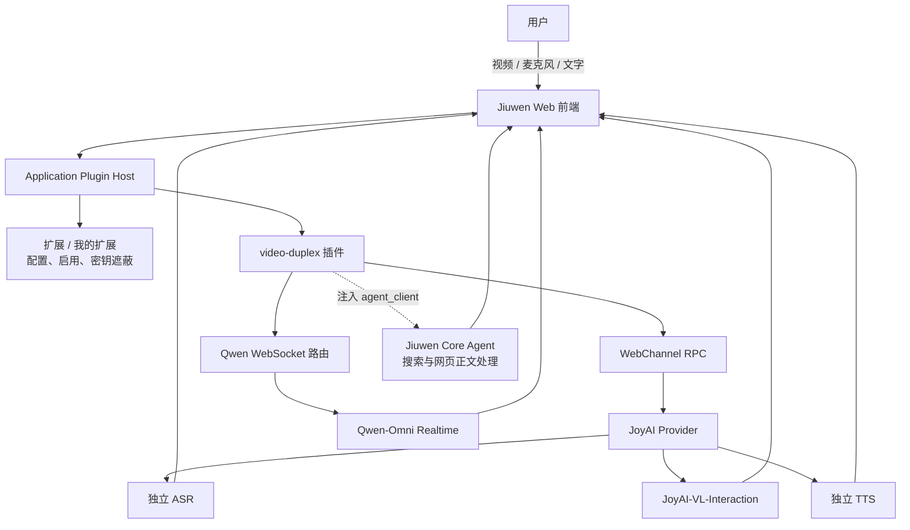
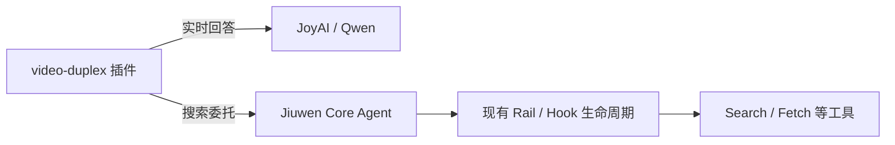
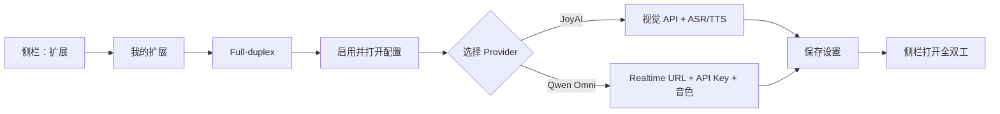
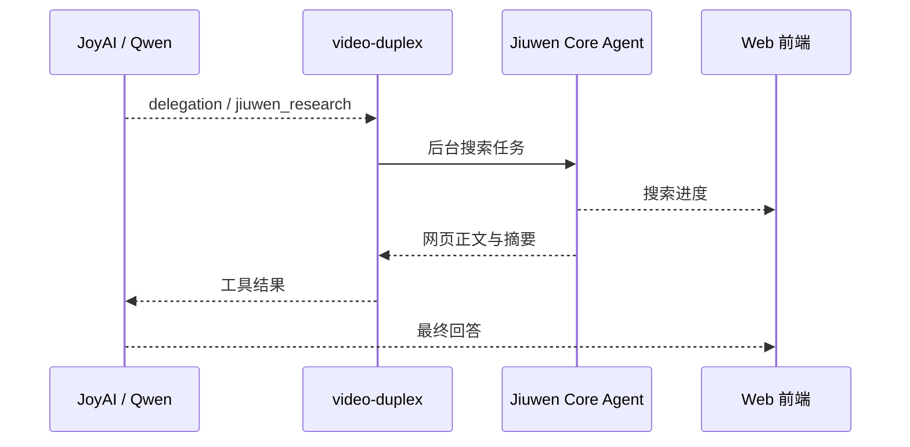

# 全双工：JoyAI 与 Qwen 配置和使用

全双工是 JiuwenSwarm 的内置 Application Plugin，提供摄像头、共享屏幕、本地视频、
麦克风和文字输入的实时多模态交互。插件支持两条 Provider 链路：

- **JoyAI-VL-Interaction**：最新画面与文本走 Chat Completions，语音由独立 ASR/TTS 处理。
- **Qwen-Omni Realtime**：视频、原生音频和文字通过持久 WebSocket 传输，模型直接返回转写、文字和语音。

## 1. 插件架构



`ExtensionLoader` 发现 `jiuwenswarm/extensions/video_duplex` 后，将插件注册到
`ExtensionRegistry`。通用宿主随后完成以下工作：

- 根据 `extension.yaml` 自动生成配置表单并管理启用状态；
- 把插件页面加入工作区导航；
- 注册插件 WebChannel RPC 和 Qwen WebSocket 路由；
- 向插件注入 `agent_client`，复用 Jiuwen Core Agent 执行搜索。

实时媒体回答留在插件运行时中，不直接注册或修改 Core Hook。只有搜索委托进入
Jiuwen Core Agent 后，才沿用现有 Rail、Memory、权限与工具生命周期：



全双工代码不再直接放在 Jiuwen 的 WebChannel 或主前端目录中。插件入口见
`jiuwenswarm/extensions/video_duplex/extension.py`，声明见
`jiuwenswarm/extensions/video_duplex/extension.yaml`。

## 2. 安装与启动

```bash
git clone https://github.com/openJiuwen-ai/jiuwenswarm.git
cd jiuwenswarm
uv venv --python=3.11
uv sync
uv run jiuwenswarm-init
uv run jiuwenswarm-start debug
```

默认访问 `http://127.0.0.1:5173`。首次启动或插件前端有修改时不要使用
`--skip-build`；只修改 Python 且已有最新前端构建时可运行：

```bash
uv run jiuwenswarm-start debug --skip-build
```

## 3. 在前端完成配置

全双工的日常配置不需要手工编辑 `.env`。



操作步骤：

1. 从侧栏打开 **扩展**，切换到 **我的扩展**。
2. 找到 **Full-duplex**，确认插件已启用。
3. 打开配置，选择 `joyai` 或 `qwen_omni`。
4. 填写当前 Provider 显示的字段，点击 **保存设置**。
5. 从侧栏进入 **全双工**，选择画面来源并启动会话。

配置表单由插件的 `config_schema` 自动生成：切换 Provider 或语音协议时，只展示
当前链路需要的字段。API Key 保存后不会回传明文；再次打开时显示为遮蔽值，留空保存
表示保留原密钥。

保存操作会同时更新当前 Gateway 进程和 Jiuwen 实例配置，**下一次全双工连接即可使用，
无需重启服务**。若直接手工修改 `.env`，仍需重启 Gateway。

### 3.1 JoyAI

在设置中填写：

| 分组 | 字段 | 示例或说明 |
|---|---|---|
| 视频模型 | 视频模型运行时 | `joyai` |
| 视频模型 | JoyAI API Base | `https://modelservice.jdcloud.com/v1` |
| 视频模型 | JoyAI API Key | 已开通 JoyAI-VL-Interaction 的 Key |
| 视频模型 | JoyAI 模型 | `jdopensource/JoyAI-VL-Interaction` |
| ASR 与 TTS | 语音通道 | `openai_http` 或 `native_ws` |
| ASR 与 TTS | ASR 完整接口 | HTTP API 地址或完整 WebSocket 地址 |
| ASR 与 TTS | TTS 完整接口 | HTTP API 地址或完整 WebSocket 地址 |

选择 `openai_http` 后还需填写语音 API Key、ASR 模型、TTS 模型和 TTS 音色。
例如 SiliconFlow 可使用 OpenAI 兼容的 `/audio/transcriptions` 与 `/audio/speech`
接口。选择 `native_ws` 时，填写配套 ASR/TTS 服务的完整 WebSocket 地址。

> `JoyAI API Base` 填到 `/v1`，不要填写到 `/chat/completions`。JoyAI 视觉模型本身
> 不接收麦克风音频，也不生成音频，因此必须配置独立 ASR/TTS 才能使用完整语音交互。

### 3.2 Qwen Omni Realtime

在阿里云百炼开通 `qwen3.5-omni-flash-realtime`，并在设置中填写：

| 分组 | 字段 | 示例或说明 |
|---|---|---|
| 视频模型 | 视频模型运行时 | `qwen_omni` |
| 视频模型 | Qwen Realtime WebSocket | 工作空间对应的 `wss://.../realtime` 地址 |
| 视频模型 | Qwen API Key | 与 URL 地域、工作空间一致的 API Key |
| 视频模型 | Qwen 模型 | `qwen3.5-omni-flash-realtime` |
| 视频模型 | Qwen 音色 | 模型支持的音色，例如 `Cherry` |

浏览器只连接 Jiuwen Gateway 暴露的 `/ws/video/qwen-omni`。上游 URL 和 API Key
保留在服务端，由 Gateway 完成鉴权并追加模型参数。Qwen 原生处理 ASR 和语音输出，
不会读取 JoyAI 的独立语音配置。

### 3.3 Core Agent 与搜索

两个 Provider 都复用 Jiuwen Core Agent 完成外部信息检索：



因此需要在 Jiuwen 主设置中配置可用的主对话模型，并按需启用免费搜索。搜索进度由
Core Agent 产生，插件只负责转发；搜索期间全双工媒体会话仍可继续收发。

## 4. Provider 行为对比

| 能力 | JoyAI-VL-Interaction | Qwen-Omni Realtime |
|---|---|---|
| 模型连接 | 逐帧 Chat Completions | 持久 Realtime WebSocket |
| 模型输入 | 最新图像 + 文本 | 原生音频 + 最新图像 + 文本 |
| 模型输出 | 文本、静默或控制动作 | 原生转写、文本、音频和函数调用 |
| 语音识别 | 独立 ASR | Realtime 会话原生完成 |
| 语音合成 | 独立 TTS | Realtime 会话原生返回音频增量 |
| 视频节奏 | 空闲时约每秒发送最新帧 | 每秒最多发送一幅最新画面 |
| 会话状态 | `x-streaming-session` | Realtime conversation session |
| 搜索触发 | `delegation` | `jiuwen_research` function call |
| 搜索执行 | Jiuwen Core Agent | Jiuwen Core Agent |

两条链路共用相同的前端打断体验：用户开始说话时停止旧音频、保留已显示文字并继续
采集麦克风。JoyAI 链路停止独立 TTS；Qwen 链路同时向 Realtime 会话发送
`response.cancel`。

## 5. 使用流程

1. 从侧栏进入 **全双工**。
2. 选择摄像头、共享屏幕或本地视频。
3. 点击启动并授予画面、麦克风权限。
4. 通过语音或文字提问；回答文字显示在会话区，音频由当前 Provider 播放。
5. 用户说话可打断正在播放的回答；搜索进度不会阻塞后续媒体输入。
6. 点击停止结束当前媒体和模型会话。

## 6. 验证

### 6.1 通用检查

- **扩展 -> 我的扩展**中 Full-duplex 为启用状态，工作区入口可见。
- 保存 Provider 配置后，新连接返回正确的 Provider。
- 摄像头、共享屏幕和本地视频均能持续预览。
- 麦克风转写、回答文字、语音播放和用户打断正常。
- 需要外部信息的问题能显示 Core Agent 搜索进度并返回有依据的回答。

### 6.2 JoyAI

- 浏览器请求中只向 Jiuwen 发送音频，不直接向 JoyAI 视觉 API 发送音频。
- Gateway 日志中能看到独立 ASR 转写、JoyAI 帧请求和独立 TTS 结果。
- 上一个帧请求未完成时不会无限排队；下一次请求使用最新画面。

### 6.3 Qwen

在浏览器开发者工具的 Network / WS 中检查：

1. `/ws/video/qwen-omni` 返回 `101 Switching Protocols`。
2. 会话收到 `session.created`，且 `session.update` 没有配置错误。
3. 说话后收到原生转写、文字和音频事件。
4. 打断时发送 `response.cancel`，已显示文字不会消失。
5. 搜索调用使用同一 `call_id` 收到 `function_call_output`。

只看到本地 WebSocket `101` 不代表上游服务可用，必须完成一次转写和模型回答。

## 7. 日志与排障

日志目录为 `~/.jiuwenswarm/logs/`：

| 文件 | 重点内容 |
|---|---|
| `joyai-video.jsonl` | 帧请求、原始结果、延迟和限流 |
| `asr-results.jsonl` | ASR 结果、空结果、噪音过滤和延迟 |
| `video-task-routing.jsonl` | Core Agent 搜索、TTS、Qwen 工具调用和回填 |
| `realtime-interrupt.jsonl` | Realtime 会话状态和打断事件 |

| 现象 | 检查项 |
|---|---|
| 没有 Full-duplex 入口 | 在“扩展 -> 我的扩展”中启用插件；确认前端是最新构建 |
| `JoyAI frame request failed` | JoyAI Base、Key、模型授权和模型标识 |
| ASR/TTS 请求失败 | 语音协议、完整端点、Key、模型和音频格式 |
| `qwen_gateway_config_error` | Realtime URL、API Key、模型名称和 URL 格式 |
| `qwen_gateway_upstream_error` | 百炼工作空间、地域、授权和网络访问 |
| 搜索受限或超时 | Jiuwen 主模型、搜索开关、代理和目标网页访问 |
| 页面仍是旧版本 | 不带 `--skip-build` 重启 debug 服务后强制刷新 |

Windows 实时查看示例：

```powershell
Get-Content "$HOME\.jiuwenswarm\logs\joyai-video.jsonl" -Wait -Tail 50
Get-Content "$HOME\.jiuwenswarm\logs\video-task-routing.jsonl" -Wait -Tail 50
```

## 8. 高级：无界面配置

只有无界面部署或排障时才建议手工编辑实例 `.env`：

- Windows：`%USERPROFILE%\.jiuwenswarm\config\.env`
- macOS/Linux：`~/.jiuwenswarm/config/.env`

JoyAI 示例：

```dotenv
VIDEO_DUPLEX_ENABLED=true
VIDEO_LIVE_MODE=joyai
JOYAI_API_BASE=https://modelservice.jdcloud.com/v1
JOYAI_API_KEY=pk-your-key
JOYAI_MODEL_NAME=jdopensource/JoyAI-VL-Interaction

VOICE_PROTOCOL=openai_http
VOICE_ASR_ENDPOINT=https://api.siliconflow.cn/v1/audio/transcriptions
VOICE_TTS_ENDPOINT=https://api.siliconflow.cn/v1/audio/speech
VOICE_API_KEY=sk-your-key
VOICE_ASR_MODEL=FunAudioLLM/SenseVoiceSmall
VOICE_TTS_MODEL=FunAudioLLM/CosyVoice2-0.5B
VOICE_TTS_VOICE=FunAudioLLM/CosyVoice2-0.5B:anna
```

Qwen 示例：

```dotenv
VIDEO_DUPLEX_ENABLED=true
VIDEO_LIVE_MODE=realtime
VIDEO_REALTIME_PROVIDER=qwen_omni
QWEN_OMNI_REALTIME_URL=wss://your-workspace.example.com/api-ws/v1/realtime
QWEN_OMNI_API_KEY=sk-your-key
QWEN_OMNI_MODEL_NAME=qwen3.5-omni-flash-realtime
QWEN_OMNI_VOICE=Cherry
```

手工修改后重启 Gateway。不要把真实 API Key 提交到 Git。

## 9. 关键代码

| 职责 | 入口 |
|---|---|
| 插件声明与配置 Schema | `jiuwenswarm/extensions/video_duplex/extension.yaml` |
| 插件注册、配置映射、RPC/WS 贡献 | `jiuwenswarm/extensions/video_duplex/extension.py` |
| 全双工 React 页面 | `jiuwenswarm/extensions/video_duplex/frontend/VideoLivePanel/index.tsx` |
| JoyAI 前端调度 | `jiuwenswarm/extensions/video_duplex/frontend/VideoLivePanel/joyaiProvider.ts` |
| Qwen Realtime 会话 | `jiuwenswarm/extensions/video_duplex/frontend/VideoLivePanel/qwenOmniSession.ts` |
| Provider 编排与 Web RPC | `jiuwenswarm/extensions/video_duplex/backend/video_live.py` |
| JoyAI 协议适配 | `jiuwenswarm/extensions/video_duplex/backend/joyai_provider.py` |
| ASR/TTS 适配 | `jiuwenswarm/extensions/video_duplex/backend/video_voice.py` |
| Qwen WebSocket 代理 | `jiuwenswarm/extensions/video_duplex/backend/qwen_omni_gateway.py` |
| 搜索任务与进度 | `jiuwenswarm/extensions/video_duplex/backend/video_search.py` |
| 通用插件管理 API | `jiuwenswarm/extensions/application_host.py` |
| 插件发现与绑定 | `jiuwenswarm/extensions/loader.py`、`registry.py` |
