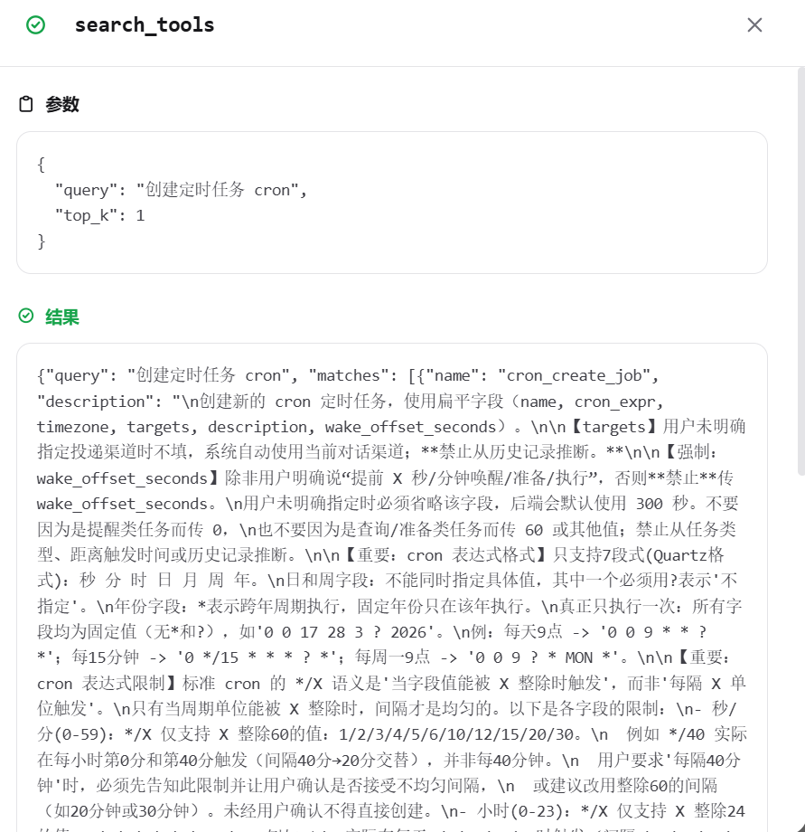

# 按需检索：工具发现与直接调用
---

## 概念科普

### 按需检索是什么

按需检索是 JiuwenSwarm 面向**注册工具数量较多**场景提供的工具发现与调用机制。它要解决的是两个问题：**怎么让模型知道有这些工具**，以及**怎么在不撑爆上下文的前提下调用它们**。

- **工具发现**解决"怎么知道有这些工具"：每轮对话只向模型暴露少量基座工具 + 一个 `search_tools` 检索入口，其余专业工具收进隐藏清单。模型需要某个能力时，先用自然语言搜，系统返回匹配工具的完整定义（含参数 JSON Schema）。
- **直接调用**解决"怎么调用"：搜到的工具**不写进 `tools[]`**，模型直接按工具名发起 tool call，由 ability_manager 按名解析执行。`tools[]` 全程不变。

可以把按需检索理解为一种"目录式工具调用"：模型不一次性背下所有工具，而是像查目录一样——看导航 → 搜需要的 → 按名直调。架构上和 Anthropic 的 `tool_search` cookbook 同构，但完全跑在 agent 端，不依赖服务端改造，**对任意 LLM（不只 Claude）生效**。

#### 为什么要按需检索

当注册工具数量达到几十个时，把全部工具 schema 注入每轮 LLM 调用会带来两个问题：

| 问题 | 影响 |
|------|------|
| 上下文占用过高 | 每轮 8–15K token 光是工具 schema，长对话 N 轮 = N × 浪费，用户任务和历史更容易被挤出上下文 |
| 注意力分散 + 选错工具 | 工具越多，模型越容易被无关工具干扰，漏掉真正需要的工具或选了近似但不对的工具 |

按需检索通过"少量基座 + 检索入口 + 隐藏清单"把每轮注入压到 ~9 个工具，模型需要专业能力时再按需搜出来用。

#### 搜到之后为什么不写进 tools[]

这是和传统"工具加载"方案最关键的区别。传统做法是搜到工具后把它**加载进 `tools[]`**，下一轮模型就能在 `tools[]` 里看到它——但这会让 `tools[]` 每轮变化，破坏 LLM 的 prefix cache（KV-cache），长对话里每轮都要重算前缀。

按需检索的做法：搜到的工具**只在 `search_tools` 的返回消息（ToolMessage）里**出现完整定义，**不进 `tools[]`**。模型从消息里读到 schema → 直接按名发起 tool call → ability_manager 按名解析执行（不检查它在不在这轮的 `tools[]` 里）。

好处：

- **`tools[]` 全程恒定** → prefix cache 100% 命中 → 长对话省 token、降延迟。
- **同轮可调**：模型这一轮搜到，下一个 LLM turn 就能直接调（不用等下一轮 `tools[]` 更新）。
- **会话内复用**：搜过一次的工具，其 schema 已经在消息历史里，后续轮次不用重搜就能再调。

#### 它解决什么问题

- **工具太多时怎么注入**：不全量塞 schema，只注入基座 + 检索入口，按需搜。
- **搜到之后怎么调**：不进 `tools[]`，按名直调，`tools[]` 恒定保 cache。
- **怎么让模型知道有什么可搜**：在系统提示里给一份"隐藏工具摘要"（按域分桶，列类别+数量+能力+工具名），模型据此判断要不要搜、搜什么。
- **任意模型可用**：纯 agent 端实现，不要求服务端 `defer_loading` 之类的改造，GLM/DeepSeek/Claude 都能跑。

### 基本工作流

```text
用户发消息
   ↓
before_model_call：注入"工具导航 + 隐藏工具摘要 + 使用规则"，过滤 inputs.tools 只留基座+检索入口
   ↓
LLM 看到 ~9 个工具 + 一份隐藏工具摘要
   ↓
LLM 判断需要某个不在列表里的能力 → 调 search_tools(query, top_k)
   ↓
search_tools 返回匹配工具的完整定义（name + description + parameters JSON Schema）
   ↓ （同一个 agent loop，下一个 LLM turn）
LLM 从返回消息里读到 schema → 按 parameters 构造参数 → 直接按名发起 tool call
   ↓
ability_manager 按名解析（不检查 tools[]）→ 执行 → 返回结果
   ↓
LLM 继续或回复
```

`tools[]` 在整个流程里始终是那 ~9 个，从第一轮到最后一轮完全不变；每轮真正的"可用工具"由消息历史里的 search 结果决定，而不是由 `tools[]` 决定。

### 运行时工具

启用按需检索后，模型会获得一个检索入口工具。模型会根据任务自动决定何时搜，无需用户手动调用。

| 工具 | 作用 | 使用时机 |
|------|------|----------|
| `search_tools` | 用自然语言描述需求，返回最相关的若干工具的完整定义（含参数 JSON Schema）| 需要某个不在当前可用列表里的能力时；返回的工具可直接按名调用，无需任何额外步骤 |

`search_tools` 的参数只有两个：`query`（自然语言描述需求，中英文均可）和 `top_k`（返回数量，1–3，默认 3）。返回结构示例：

```json
{
  "query": "搜索记忆",
  "matches": [
    {
      "name": "memory_search",
      "description": "在持久化记忆中搜索...",
      "parameter_summary": "fields: query, limit",
      "parameters": {
        "type": "object",
        "properties": { "query": {"type": "string"}, "limit": {"type": "integer", "default": 10} },
        "required": ["query"]
      }
    }
  ],
  "count": 1,
  "note": "以上工具已找到（含完整参数定义）。这些工具不在你的 tools 列表中，但已注册可直接按 name 调用。请根据每个工具的 parameters（JSON Schema）构造参数，直接发起 tool call。"
}
```

模型照 `parameters` 构造参数，直接 `tool_call: memory_search(query="...")`，不需要 `memory_search` 出现在 `tools[]` 里。

---

## 操作指导

### 1. 开启按需检索

**默认关闭（opt-in）。** 按需检索默认不启用——不开时所有工具全量注入 `tools[]`，系统行为和没有这个功能一样，零影响。

开启方式：直接改配置文件

```yaml
# ~/.jiuwenswarm/config/config.yaml
react:
  progressive_tool_enabled: true       # 默认 false，改成 true 开启
```

改完重启服务生效。

**开启后**：主 agent 和 swarm member（子 agent）两条路径同时启用——同一个开关控制。主 agent 使用 `JiuWenProgressiveToolRail`（dense embedding + boost + ghost 过滤 + 完整 JSON Schema 返回）；swarm member 使用 `AutoLoadProgressiveToolRail`（基类关键词搜索 + `detail_level=3`）。

**关闭后**：`progressive_tool_enabled: false` → rail 不构建 → 不注册 `search_tools` → 不加载 embedding 模型 → 不过滤 `tools[]` → 不注入导航/隐藏摘要 → 不触发 ghost 过滤 → `common/tool_retrieval/` 模块不被 import → 整套功能完全休眠，不影响其他任何东西。系统回到全量注入（所有工具直接在 `tools[]` 里）。

### 2. 正常对话即可，不需要指定工具

启用后，正常输入任务，模型会自己判断何时搜。例如：

```text
帮我建个定时任务，今天三点提醒我喝水
```

模型发现"创建定时任务"的能力不在基座工具里 → 调 `search_tools` → 拿到 `cron_create_job` 的完整 schema → 直接按名调用。全程不需要用户点名用哪个工具。


如果想降低模型"该搜却没搜"的概率，可以在任务里顺带点一下能力域：

```text
帮我查一下 wiki 里的资料，顺便定个后天下午三点的提醒
```

这样模型更倾向先 `search_tools("wiki 查询")` / `search_tools("创建定时任务")` 再调用。

### 3. 看检索与调用过程

在聊天消息里可以看到：

- 模型调了 `search_tools`，query 是什么、返回了哪些工具。
- 模型按返回的 schema 直接调用了对应工具（这些工具不在 `tools[]` 里但能调通）。
- 整个会话里 `tools[]` 的工具列表始终是那 ~9 个，没有因为搜到新工具而膨胀。



![tools[] 恒定不膨胀](../assets/images/tool_retrieval_tools_constant.png)

如果需要离线分析完整链路（每轮注入了什么、搜了什么、调了什么、成功率多少），可以开启 prompt capture：

```bash
JIUWENSWARM_PROMPT_CAPTURE=1
```

捕获文件在 `~/.jiuwenswarm/agent/.logs/prompt_capture/<session_id>.jsonl`，每行一次 LLM 调用。

### 4. 隐藏工具摘要长什么样

系统提示里的"工具导航"段会列出当前 session 下所有**没注入 `tools[]`** 的工具，按域分桶，每类给：类别名 + 数量 + 能力描述 + 工具名列表。例如：

```text
### 隐藏工具（需 search_tools 发现）
- 定时任务（8 个）：创建、查看、修改定时任务。工具：cron_create_job, cron_list_jobs, ...
- 记忆系统（4 个）：搜索、读取、写入、编辑持久化记忆。工具：memory_search, read_memory, ...
- LLM Wiki（3 个）：导入文件、自然语言查询、健康检查。工具：wiki_ingest, wiki_query, wiki_lint
- 会话管理（4 个）：创建、取消、查看后台会话任务。工具：session_new, session_cancel, session_list
- 技能管理（4 个）：搜索、安装、卸载、查看技能。工具：search_skill, install_skill, ...
...
```

模型据此知道"有什么可搜"，不会盲猜。隐藏清单是动态生成的——已经搜到并常驻的工具不会重复出现在隐藏清单里。

---

## 配置说明

按需检索的开关和参数在用户运行时配置文件里：

```text
~/.jiuwenswarm/config/config.yaml
```

### 配置项说明

#### `react.progressive_tool_enabled`

是否启用按需检索。**默认 `false`（opt-in）**——不开时所有工具全量注入，按需检索代码不构建、不 import、零影响。

设为 `true` 后，主 agent 和 swarm member 两条路径同时启用（同一个开关控制）。主 agent 使用 `JiuWenProgressiveToolRail`（dense embedding + boost + ghost 过滤 + 完整 JSON Schema 返回）；swarm member 使用 `AutoLoadProgressiveToolRail`（基类关键词搜索 + `detail_level=3`）。开启后 `before_model_call` 会注入工具导航 + 隐藏摘要 + 使用规则，过滤 `inputs.tools` 只保留基座工具和检索入口。改完重启服务生效。

#### `react.progressive_tool_max_loaded_tools`（v3.2 已废弃）

历史配置项（v1 auto-load 时代的 LRU 上限，默认 `16`）。v3.2 删除了 `load_tools` 元工具和整套 LRU/cap/三级降级后，`session_visible` 不再被 search 改变、`tools[]` 全程恒定，此配置已无实际作用，保留仅为向后兼容，可忽略。

#### `react.always_visible_tools` / `react.default_visible_tools`

基座工具集合。`always_visible_tools` 是每轮必然注入的工具（如 `bash`、`read_file`、`write_file`、`edit_file`、`glob`、`grep`、`fetch_webpage` 等），不参与检索；`default_visible_tools` 是首轮默认可见的补充集合。这两个集合决定了"基座 + 检索入口"一共多少个（典型 ~9 个）。

#### `react.tool_retrieval`（v3.2 配置化）

按需检索算法的三个旋钮。默认值足够大多数场景；需要调召回质量或性能时改这里，改完重启生效，不用动代码。

| 配置项 | 默认值 | 作用 |
|--------|--------|------|
| `desc_cap` | `256` | dense 检索时每个工具描述的截断长度（字符）。值小→长描述（如 `cron` 伞形工具的 10KB 规则）被砍更多，防止描述堆砌压过专用工具；值大→保留更多上下文但 dense 可能偏向长描述工具 |
| `embedding_model` | `BAAI/bge-small-zh-v1.5` | 向量模型名（fastembed 支持的模型）。换 `BAAI/bge-base-zh-v1.5` 更准但加载慢、内存大 |
| `top_k_max` | `3` | `search_tools` 返回工具数上限。调大能看到更多候选，但每轮多占 token |

#### 环境变量

| 变量 | 默认 | 作用 |
|------|------|------|
| `JIUWENSWARM_PROMPT_CAPTURE` | 未设 | 设为 `1` 开启 prompt capture，记录每轮 LLM 调用的完整输入输出 |

#### 附：配置项示例

```yaml
react:
  progressive_tool_enabled: false     # 默认关闭（opt-in），改成 true 开启按需检索
  # progressive_tool_max_loaded_tools: 8    # v3.2 已废弃（LRU/cap 已删），仅兼容
  always_visible_tools:
    - bash
    - read_file
    - write_file
    - edit_file
    - glob
    - grep
    - fetch_webpage
  default_visible_tools: []
  tool_retrieval:
    desc_cap: 256
    embedding_model: BAAI/bge-small-zh-v1.5
    top_k_max: 3
```

```bash
# 开启 prompt capture 用于离线分析
JIUWENSWARM_PROMPT_CAPTURE=1
```

---

## 常见问题

### 为什么开启后模型没有调 search_tools？

可能原因：

- 当前任务用基座工具（bash、read_file 等）就能完成，不需要专业工具。
- 模型判断当前 `tools[]` 里已有可用工具。
- 任务描述太笼统，模型没意识到需要某个隐藏能力。

可以在任务里顺带点一下能力域（如"查一下 wiki""建个定时任务""搜一下记忆"），降低"该搜却没搜"的概率。

### 搜到的工具为什么不在 tools[] 里也能调？

这是按需检索的核心设计。`ability_manager` 解析 tool call 时按**工具名**从注册表查，不检查它在不在这轮请求的 `tools[]` 里。所以 `search_tools` 返回的工具只要名字对、参数按 schema 构造，就能直接调通。这样 `tools[]` 可以永远不变，保住 prefix cache。

### tools[] 不变，那每轮"可用工具"怎么变？

每轮真正可用的工具由**消息历史里的 search 结果**决定。模型这一轮搜到 `memory_search`，它的完整 schema 就进了消息历史；下一轮模型在历史里看到这个 schema，就能再调，不用重搜。所以"可用工具集"随会话推进自然增长，但不通过修改 `tools[]` 实现——这是和"加载进 tools[]"的旧方案最本质的区别。

### 为什么有时搜出来的工具不对？

按需检索的检索层用本地语义模型（BAAI/bge-small-zh）+ 名称/动词匹配做排序，对**中英文混合 + 工具名带下划线**的 query 比较稳，但对纯中文、无工具名的 query 偶尔会错排（比如"创建定时任务"可能把 `cron_list_jobs` 排到 `cron_create_job` 前面）。这属于检索算法的已知局限，后续会引入 BM25 混合检索改善。模型通常会重搜或在后续轮次纠正。

### 它会自动安装新工具吗？

不会。按需检索只在**已注册**的工具里搜。安装新工具（技能/MCP）仍走技能系统或 MCP 配置。

### 它和 Symphony（技能编排与分发）是什么关系？

两者面向不同粒度：

- **按需检索**面向**工具**（单个 ability）：搜到 → 按名直调。
- **Symphony**面向**技能**（成套能力）：检索候选技能 → 编排成技能链 → 执行。

按需检索解决"几十个工具怎么注入和调用"；Symphony 解决"几十个技能怎么选和怎么串"。两者可以共存：工具层用按需检索，技能层用 Symphony。

### 它会替代集群模式的 Leader 派发吗？

不会。按需检索只负责工具的发现与按名调用。任务怎么拆、团队怎么组织、子任务怎么分发，仍由 JiuwenSwarm 原有运行模式（集群/Leader 派发）完成。

### 模型不一样，效果一样吗？

机制层（`tools[]` 恒定、按名直调、JSON Schema 返回）与模型无关，任意支持 function calling 的 LLM 都能跑。但"会不会主动搜""搜的 query 好不好""能不能照 schema 构造对参数"依赖模型本身的指令跟随和工具使用能力——DeepSeek/Claude 系列表现较好，较弱的模型可能需要更明确的提示。

---

## 相关文档

- [Symphony：技能编排与智能分发](Symphony-技能编排与分发.md)
- [配置说明](配置信息.md)
