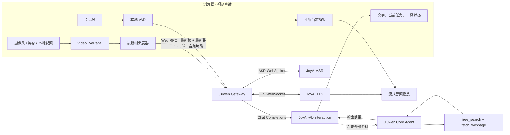
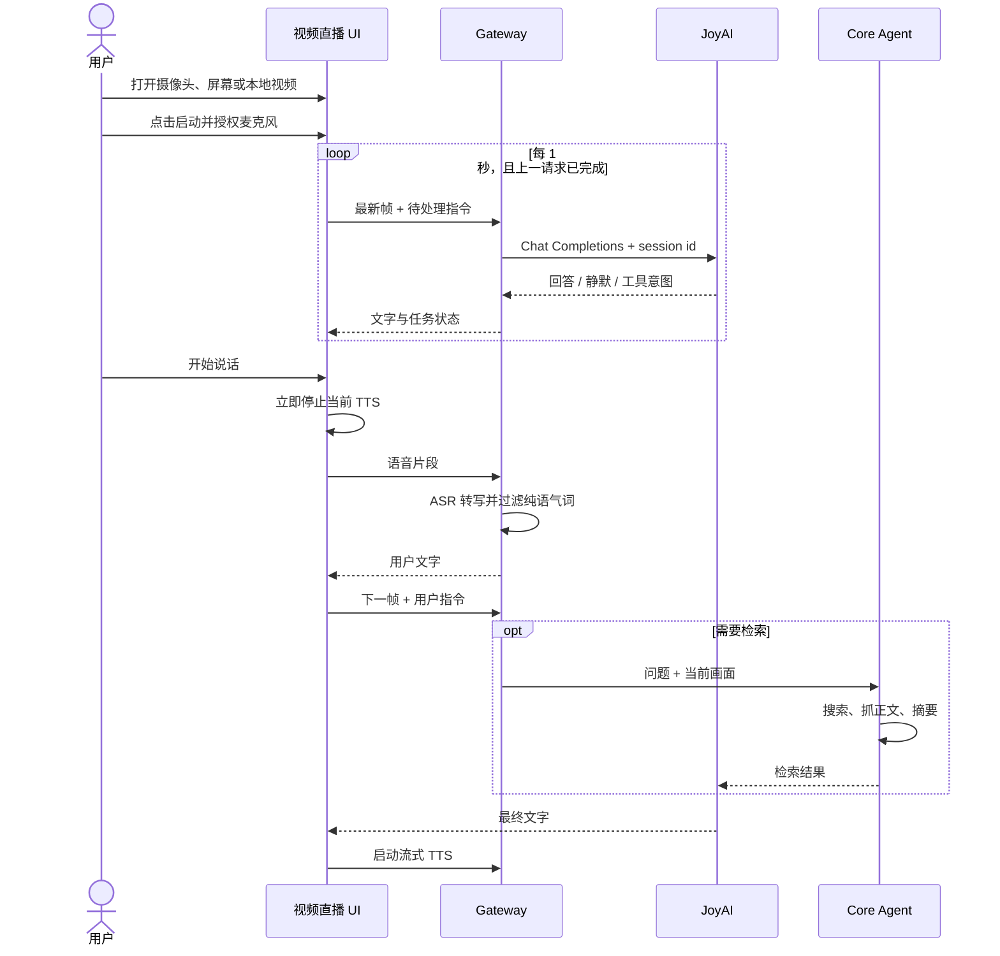

# 视频直播：JoyAI 配置与使用

视频直播工作区面向摄像头、共享屏幕、本地视频和麦克风的实时多模态交互。当前稳定路径以 **JoyAI-VL-Interaction** 为核心；原生 Realtime/MiniCPM Provider 仍在开发和协议适配阶段，不作为本文的生产验收基线。

## 1. 功能结构



JoyAI 路径不是 Realtime WebSocket：浏览器每秒调度一次最新画面，上一请求仍在执行时跳过该次调度；Gateway 将图片和当前指令发送到 OpenAI 兼容的 `/chat/completions`。同一视频会话复用 `x-streaming-session`，由 JoyAI 服务维护其支持的流式上下文。

## 2. 环境要求

| 组件 | 要求 |
| --- | --- |
| Python | `>=3.11,<3.14`，推荐 3.11 |
| Node.js | 18 或更高版本 |
| 浏览器 | Chrome/Edge 107 或更高版本 |
| JoyAI 视觉服务 | OpenAI 兼容 `/v1/chat/completions` |
| 语音服务 | JoyAI ASR/TTS WebSocket，或 OpenAI 兼容 ASR/TTS |
| 主模型 | Jiuwen Core Agent 使用的 OpenAI 兼容模型 |

仓库只包含 JiuwenSwarm 和 JoyAI 适配层，不包含模型权重与推理服务。

## 3. 安装

```bash
git clone https://github.com/openJiuwen-ai/jiuwenswarm.git
cd jiuwenswarm
uv venv --python=3.11
uv sync
uv run jiuwenswarm-init
```

需要手动安装前端依赖时：

```bash
cd jiuwenswarm/channels/web/frontend
npm install
cd ../../../..
```

实例环境变量位于：

- Windows：`%USERPROFILE%\.jiuwenswarm\config\.env`
- macOS/Linux：`~/.jiuwenswarm/config/.env`

## 4. 配置

### 4.1 主模型与搜索

视频直播的外部信息检索由 Jiuwen Core Agent 完成，因此仍需配置主模型：

```dotenv
API_BASE=https://api.example.com/v1
API_KEY=your-api-key
MODEL_NAME=your-chat-model
MODEL_PROVIDER=OpenAI

FREE_SEARCH_DDG_ENABLED=true
FREE_SEARCH_BING_ENABLED=false
```

网络需要代理时可增加：

```dotenv
FREE_SEARCH_PROXY_URL=http://127.0.0.1:7890
FREE_SEARCH_SSL_VERIFY=true
```

搜索链路先调用 `free_search` 获取候选页面，再调用 `fetch_webpage` 抓取正文，最后由主模型压缩结果并回填给 JoyAI。生产环境不建议关闭 TLS 校验。

### 4.2 JoyAI 视觉与原生语音

```dotenv
VIDEO_LIVE_MODE=joyai

JOYAI_API_BASE=http://127.0.0.1:8070/v1
JOYAI_API_KEY=EMPTY
JOYAI_MODEL_NAME=jdopensource/JoyAI-VL-Interaction

JOYAI_VOICE_PROVIDER=native
JOYAI_ASR_WS_URL=ws://127.0.0.1:8994/ws/asr
JOYAI_TTS_WS_URL=ws://127.0.0.1:8992/ws/tts
```

配置规则：

- `JOYAI_API_BASE` 填到 `/v1`，代码会追加 `/chat/completions`。
- `JOYAI_API_KEY` 必须符合服务端要求；无需鉴权的本地服务可使用 `EMPTY`。
- JoyAI 不会自动复用 `VIDEO_API_BASE`、`VIDEO_API_KEY` 或 `VIDEO_MODEL_NAME`。
- `JOYAI_VOICE_PROVIDER=native` 时，ASR 与 TTS 使用独立 WebSocket。

### 4.3 OpenAI 兼容语音替代方案

没有 JoyAI 原生 ASR/TTS 时：

```dotenv
JOYAI_VOICE_PROVIDER=openai

ASR_API_BASE=https://api.example.com/v1
ASR_API_KEY=your-asr-key
ASR_MODEL_NAME=your-asr-model
ASR_API_MODE=transcription

TTS_API_BASE=https://api.example.com/v1
TTS_API_KEY=your-tts-key
TTS_MODEL_NAME=your-tts-model
TTS_VOICE=your-voice
```

`ASR_API_MODE=transcription` 使用 `/audio/transcriptions`；若服务通过 `/chat/completions` 接收音频，则改为 `ASR_API_MODE=chat`。

### 4.4 远端服务与 SSH 隧道

下面只展示端口映射方式，远端端口以实际部署为准：

```bash
ssh -p <ssh-port> -N -T \
  -o ExitOnForwardFailure=yes \
  -o ServerAliveInterval=30 \
  -L 8070:127.0.0.1:<joyai-port> \
  -L 8992:127.0.0.1:<tts-port> \
  -L 8994:127.0.0.1:<asr-port> \
  <user>@<model-host>
```

保持隧道窗口运行，再使用上文的本机 `127.0.0.1` 地址。不要把 SSH 密钥或真实 API Key 写入仓库。

## 5. 启动与更新

首次启动或前端有修改时：

```bash
uv run jiuwenswarm-start debug
```

只修改 Python 且已有最新前端构建时：

```bash
uv run jiuwenswarm-start debug --skip-build
```

默认访问 `http://127.0.0.1:5173`。若端口被占用，以启动输出为准。

```bash
# 状态
uv run jiuwenswarm-start --status default

# 停止
uv run jiuwenswarm-stop
```

## 6. 使用流程



操作步骤：

1. 进入 Web UI 的“视频直播”。
2. 选择摄像头、共享屏幕或本地视频。
3. 点击启动，授予画面和麦克风权限。
4. 直接提问，或提出“每当……时……”等持续观察任务。
5. 查看“当前任务”、搜索状态、文字回答与语音播放。
6. 回答播放期间直接说出新指令即可打断；停止按钮会结束本次视频会话。

## 7. 验证

### 7.1 端口与 HTTP

Windows：

```powershell
Test-NetConnection 127.0.0.1 -Port 5173
Test-NetConnection 127.0.0.1 -Port 8070
Test-NetConnection 127.0.0.1 -Port 8992
Test-NetConnection 127.0.0.1 -Port 8994

Invoke-RestMethod http://127.0.0.1:8070/v1/models
```

macOS/Linux：

```bash
curl -I http://127.0.0.1:5173
curl http://127.0.0.1:8070/v1/models
```

端口连通只证明进程正在监听，不能替代协议与端到端验证。

### 7.2 最小验收

- 三种画面来源均能预览且画面持续更新。
- 画面变化后，JoyAI 基于最新画面回答。
- 麦克风输入、ASR、文字回答和 TTS 可用。
- 用户插话时旧音频立即停止，新指令正常进入下一帧请求。
- 持续任务显示在“当前任务”并能继续观察。
- 搜索成功时返回基于网页正文的答案；失败时不伪造结果。

## 8. 日志与排障

日志目录：`~/.jiuwenswarm/logs/`。

| 文件 | 重点内容 |
| --- | --- |
| `joyai-video.jsonl` | 帧请求、原始模型结果、延迟、限流 |
| `asr-results.jsonl` | ASR 结果、空结果、语气词过滤、延迟 |
| `video-task-routing.jsonl` | 当前任务、搜索、TTS、打断事件 |
| `realtime-interrupt.jsonl` | 浏览器 VAD 与会话状态 |

Windows 实时查看：

```powershell
Get-Content "$HOME\.jiuwenswarm\logs\joyai-video.jsonl" -Wait -Tail 50
Get-Content "$HOME\.jiuwenswarm\logs\video-task-routing.jsonl" -Wait -Tail 50
```

常见故障：

| 现象 | 检查项 |
| --- | --- |
| `JoyAI frame request failed` | `JOYAI_API_BASE`、模型名、鉴权及 `/chat/completions` |
| ASR/TTS 连接关闭 | 隧道、WebSocket 地址、远端服务日志 |
| 页面仍是旧版本 | 从源码目录执行不带 `--skip-build` 的 debug 启动，再强制刷新 |
| 搜索受限或超时 | 主模型配置、搜索开关、网络代理与目标网页访问 |
| 回答触发 429 | 降低请求频率或提高服务额度；客户端会指数退避后恢复 |

## 9. MiniCPM / 原生 Realtime 状态

仓库保留 `VIDEO_LIVE_MODE=realtime` 的 Provider 抽象和原生 WebSocket 客户端，用于 MiniCPM 等 Realtime/duplex 服务的后续适配。目前该路径仍在开发，协议兼容性、参考音频、视频帧输入和端到端稳定性尚未作为正式能力验收。生产部署请使用本文的 JoyAI 配置。
