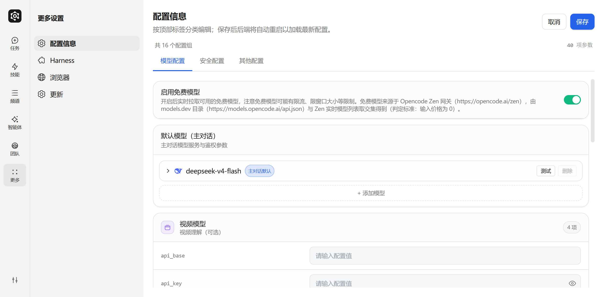
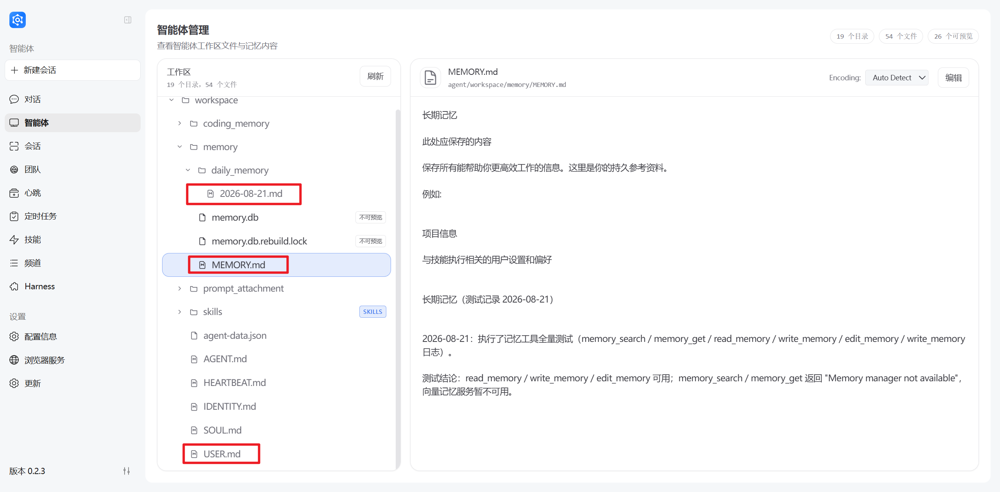

# 记忆系统

记忆系统让 JiuwenClaw 拥有跨对话的持久记忆能力，自动将关键信息写入文件长期保存，配合语义检索随时召回。

**外接记忆 Providers**，支持接入第三方记忆服务（OpenJiuwen LTM、Mem0、OpenViking）或自定义插件。

---

## 引擎开关

通过 `memory.engine` 配置项控制记忆引擎挂载：

| 值 | 说明 |
|----|------|
| `builtin` | 仅内置记忆（默认，兼容旧配置） |
| `external` | 仅外接记忆（LTM / Mem0 / OpenViking / 插件） |
| `both` | 内置 + 外接并存 |
| `none` | 全部关闭 |

---

## 配置说明

### 内置记忆配置

记忆检索默认进行 BM25 全文检索，用户可选择配置 `EMBED_API_KEY`，使用向量 + BM25 混合检索以获得最佳召回效果。通过以下环境变量配置 Embedding 服务，用于语义向量搜索：

| 环境变量 | 说明 |
|----------|------|
| EMBED_API_KEY | Embedding 服务的 API Key（不配置则使用 mock provider） |
| EMBED_API_BASE | Embedding 服务的 URL |
| EMBED_MODEL | Embedding 模型名称 |



### 外接记忆配置

配置位置：`config.yaml` 的 `memory.external` 段。

```yaml
memory:
  engine: external   # 或 both
  external:
    provider: mem0   # 选一个：openjiuwen | mem0 | openviking | <plugin-name>
    user_id: __default__
    scope_id: __default__

    # Provider-specific 配置
    openjiuwen:
      kv_type: shelve
      vector_type: chroma
      db_type: sqlite
    mem0:
      api_key: ""
      user_id: ""
      agent_id: ""
      rerank: true
    openviking:
      endpoint: http://127.0.0.1:1933
      api_key: ""
      account: root
      user: default
```

#### 支持的 Providers

| Provider | 说明 | 必要配置 |
|----------|------|----------|
| `openjiuwen` | 本地长期记忆（KV + 向量 + DB） | 无（使用默认路径 ~/.jiuwenclaw/memory/ltm） |
| `mem0` | 云端事实抽取与语义检索 | `api_key`（从 mem0.ai 获取） |
| `openviking` | 字节上下文数据库 | `endpoint`, `api_key` |
| `<plugin-name>` | 自定义插件 | ~/.jiuwenclaw/plugins/memory/<name>/ |

#### 外接记忆环境变量

| 变量 | 说明 |
|------|------|
| `MEMORY_EXTERNAL_PROVIDER` | Provider 名称（覆盖 config.yaml） |
| `MEMORY_USER_ID` | 数据隔离标识 |
| `MEMORY_SCOPE_ID` | Scope 标识 |
| `MEM0_API_KEY` | Mem0 API 密钥 |
| `MEM0_USER_ID` | Mem0 用户标识 |
| `OPENVIKING_ENDPOINT` | OpenViking 服务地址 |
| `OPENVIKING_API_KEY` | OpenViking API 密钥 |

### Dreaming 配置

Dreaming 是后台离线记忆整合机制（详见下文 [Dreaming 睡时记忆整理](#dreaming-睡时记忆整理)）。默认关闭，需显式开启。

```yaml
memory:
  dreaming:
    agent:
      enabled: false
      interval_seconds: 14400   # 默认 4 小时
    code:
      enabled: false
      interval_seconds: 14400
```

环境变量覆盖：

| 变量 | 说明 |
|------|------|
| `DREAMING_AGENT_ENABLED` | Agent 模式 Dreaming 开关 |
| `DREAMING_CODE_ENABLED` | Code 模式 Dreaming 开关 |
| `DREAMING_INTERVAL` | 扫描间隔（秒），覆盖两种模式 |

LLM 调用复用 `models.default`，无需额外模型配置。

---

## 内置记忆文件结构


## 记忆文件结构

记忆采用纯 Markdown 文件存储，Agent 通过文件工具直接操作：

```
{workspace_dir}/memory
├── MEMORY.md               # 长期记忆
├── USER.md                 # 用户档案
└── YYYY-MM-DD.md           # 每日会话记录
```

### memory/MEMORY.md（长期记忆）

存放长期有效、极少变动的关键信息。
- **用途**：存储决策、偏好、持久性事实
- **更新**：Agent 通过 write / edit 文件工具写入

### USER.md（用户档案）

存储当前用户的基本信息，帮助 Agent 更好地个性化服务。
- **用途**：存储用户姓名、职业、爱好、位置等个人信息
- **更新**：Agent 通过 write / edit 文件工具更新用户信息

### YYYY-MM-DD.md（每日日志）

每天一页，追加写入，记录当天的工作与交互。
- **用途**：记录日常笔记和运行上下文
- **更新**：Agent 通过 write / edit 文件工具追加写入，对话过长需要进行总结时自动触发

## 记忆写入触发

在与用户交互过程中，JiuwenClaw 会根据需要自动触发记忆写入，将关键信息写入记忆文件长期保存。 

| 信息类型 | 写入目标 | 操作方式 | 示例 |
|----------|----------|----------|------|
| 决策、偏好、持久事实 | memory/MEMORY.md | write / edit 工具 | "项目使用 Python 3.12"、"偏好 pytest 框架" |
| 用户个人信息 | memory/USER.md | write / edit 工具 | 用户姓名、职业、爱好等 |
| 日常笔记、运行上下文 | memory/YYYY-MM-DD.md | write / edit 工具 | "今天修复了登录 Bug"、"部署了 v2.1" |
| 用户说"记住这个" | memory/YYYY-MM-DD.md | write 工具 | "记住我把项目文件存在了D盘" |


## 架构概览

记忆系统的三条写入通道相互独立、并行运作，共用同一个存储与检索层：

```
                       用户 / Agent
                            │
        ┌───────────────────┼───────────────────┐
        ↓                   ↓                   ↓
  ┌──────────────┐   ┌──────────────┐   ┌──────────────┐
  │ 会话内即时    │   │ Dreaming     │   │ Agent Team   │
  │ 写入         │   │ 后台离线提取  │   │ 协同提取      │
  │              │   │              │   │              │
  │ Agent 主动    │   │ Orchestrator │   │ Leader 在    │
  │ 调用工具      │   │ 周期触发 LLM │   │ round 末触发 │
  └──────┬───────┘   └──────┬───────┘   └──────┬───────┘
         │                  │                  │
         └──────────────────┼──────────────────┘
                            ↓ 写入 Markdown
            ┌─────────────────────────────────────┐
            │ MemoryIndexManager（共用索引层）     │
            │  持久化 / 监控 / 混合检索 / 按需读取 │
            └────────────────┬────────────────────┘
                             ↑ 检索 / 读取
                       用户 / Agent
```

> 索引层内部细节见下文「技术架构」。

| 通道 | 触发方 | 写入时机 | 典型目标 |
|------|--------|----------|----------|
| 会话内即时写入 | Agent 自主调用工具 | 对话进行中 | `MEMORY.md` / `USER.md` / `YYYY-MM-DD.md` / `coding_memory/*.md` |
| Dreaming 离线提取 | 进程内 Orchestrator | 闲时周期触发 | `DREAMING.md` / `consolidated_{hash}.md` |
| Agent Team 协同 | Leader 在 round 结束触发 | 团队 round 完成后 | 团队 `TEAM_MEMORY.md` + 各成员个人记忆 |

三条通道共用同一个 **MemoryIndexManager** 做索引与检索，从而 Agent 读取时无需关心"这条记忆是哪条通道写入的"。

### 长期记忆管理能力

| 能力 | 说明 |
|------|------|
| 记忆持久化 | 通过文件工具（read / write / edit）将关键信息写入 Markdown 文件，文件即真实数据源 |
| 文件监控 | 通过 watchdog 监控文件改动，异步更新本地数据库（语义索引 & 向量索引） |
| 语义搜索 | 通过向量嵌入 + BM25 混合检索，按语义召回相关记忆 |
| 文件读取 | 直接通过文件工具读取对应的 Memory Markdown 文件，按需加载保持上下文精简 |


### 技术架构

```
┌─────────────────────────────────────────────────────────────────┐
│                     MemoryIndexManager                          │
├─────────────────────────────────────────────────────────────────┤
│  ┌─────────────┐  ┌─────────────┐  ┌─────────────────────┐      │
│  │ Config      │  │ Embedding   │  │ SQLite Database     │      │
│  │ (config.py) │  │ Provider    │  │ - chunks            │      │
│  └─────────────┘  └─────────────┘  │ - files             │      │
│         │                │         │ - embedding_cache   │      │
│         │                │         │ - chunks_fts (FTS5) │      │
│         │                │         │ - chunks_vec (vec0) │      │
│         │                │         └─────────────────────┘      │
│         │                │                   │                  │
│         ▼                ▼                   ▼                  │
│  ┌───────────────────────────────────────────────────────────┐  │
│  │                    Search Pipeline                        │  │
│  │  Query ──► Embed ──► Vector Search ──┐                    │  │
│  │                                      ├─► Merge ──► Results|  |
│  │  Query ──► FTS5 Search ──────────────┘                    │  │
│  └───────────────────────────────────────────────────────────┘  │
└─────────────────────────────────────────────────────────────────┘
```


## 记忆检索

### 记忆检索方式

Agent 有两种方式获取记忆：

| 方式 | 适用场景 | 示例 |
|------|----------|------|
| 语义搜索 | 不确定记在哪个文件，按意图模糊召回 | "之前关于部署流程的讨论" |
| 直接读取 | 已知具体日期或文件路径，精确查阅 | 读取 `memory/2026-02-28.md` |

### 混合搜索流程

```
Query ──► Embed ──► Vector Search ──┐
                                    ├─► Merge ──► Results
Query ──► FTS5 Search ──────────────┘
```

搜索结果按混合分数排序：`score = vectorWeight * vectorScore + textWeight * textScore`。默认向量检索权重 0.7，全文检索权重 0.3。


## Dreaming 睡时记忆整理

除了 Agent 在对话中即时写入外，JiuwenClaw 还提供 **Dreaming** 机制：闲时周期性扫描历史会话，调用 LLM 提取值得长期保留的内容，自动写入长期记忆文件。Agent 与 Code 两种模式共用同一管道。

| 模式 | 抽取目标 | 输出文件 |
|------|----------|----------|
| `agent` | 用户偏好、背景、关注领域 | `{workspace}/memory/DREAMING.md`（单文件，最多 50 条，超限淘汰最旧） |
| `code`  | 调试根因、API 边界行为、设计决策等可复用技术经验 | `{workspace}/coding_memory/consolidated_{hash}.md`（每条独立文件，按内容 SHA256 去重） |

启用方式见上文 [配置说明 → Dreaming 配置](#dreaming-配置)。

### 工作机制

- **定时调度**：进程内 Orchestrator 按 `interval_seconds` 周期触发，启动后延迟 120s 再首次执行
- **忙碌退避**：Agent 正在处理请求时跳过本次扫描，下一周期再试
- **增量扫描**：通过 checkpoint 记录已处理 session，不重复处理；不足 4 轮对话或超过 30 天的会话跳过
- **成本控制**：单次最多处理 10 个 session，压缩后限制 30K tokens；每个 session 最多产出 5 条
- **失败重试**：LLM 调用失败的 session 不标记，下次重试；JSON 解析失败则跳过

与上面"记忆写入触发"的区别：前者依赖 Agent 在会话内即时判断"该记什么"，Dreaming 则在闲时回看完整对话再决定，是离线沉淀通道。


## Agent Team 团队记忆

Agent Team 模式下，每个团队拥有双层记忆：

| 层 | 谁可访问 | 写入方 |
|----|---------|--------|
| 个人记忆 | 该成员独占 | 成员自身（在会话中调用记忆工具） |
| 团队记忆 | 所有成员只读 | Leader 在 round 结束后由提取 agent 自动写入 |

### 团队生命周期与记忆行为

| 生命周期 | 个人记忆 | 团队记忆 | 适用场景 |
|---------|---------|---------|---------|
| **临时团队（temporary）** | 只读访问父 agent 的 workspace 记忆 | 无 | 单次任务、即用即弃 |
| **持久团队（persistent）** | 每个成员独立读写 | 自动提取 + 跨 round 累积 | 长期协作、需经验沉淀 |

### 数据布局

```
~/.openjiuwen/.agent_teams/{team_name}/
├── team-memory/                          # 团队共享记忆
│   └── TEAM_MEMORY.md
├── workspaces/
│   ├── alice_workspace/                   # 新成员（团队内创建）
│   │   ├── memory/                        # general 模式个人记忆
│   │   └── coding_memory/                 # coding 模式个人记忆
│   └── bob_workspace -> ~/.openjiuwen/bob_workspace/   # 旧成员 symlink
└── team-workspace/                        # 团队共享文件区（非记忆）
```

- **新成员**：在 team home 下新建 workspace，记忆从零积累
- **旧成员（predefined）**：通过 symlink 指向已有的个人 workspace，原有记忆自动延续
- 个人记忆使用 `memory/` 还是 `coding_memory/` 由团队创建时的 scenario（`general` / `coding`）决定

### 团队记忆自动提取

持久团队的 **Leader** 在每个 round 结束后会 spawn 一个提取 agent，从本 round 的任务记录和团队消息中提炼出值得长期保留的内容，更新到 `TEAM_MEMORY.md`。提取分四类：

| 标签 | 含义 |
|------|------|
| `[decision]` | 团队决策：为何选 A 不选 B、关键权衡 |
| `[lesson]` | 经验教训：什么有效、什么导致返工、可复用的模式 |
| `[member]` | 成员特长：谁擅长什么、谁负责哪个领域 |
| `[context]` | 项目背景：业务约束、截止日期、利益相关方要求 |

提取 agent 自主完成"读已有记忆 → 分析本轮记录 → 合并/更新/淘汰"，文件保持在 200 行以内。临时团队不触发提取。

### 隔离

- **跨团队**：每个团队的 `team_name` 进入存储路径和索引 key（`agent_id = "{team_name}.{member_name}"`），不同团队的同名成员记忆相互不可见
- **跨成员**：每个成员有独立索引实例，看不到对方个人记忆，仅共享团队记忆
- **临时团队**：只读访问父 workspace，无法污染源记忆
