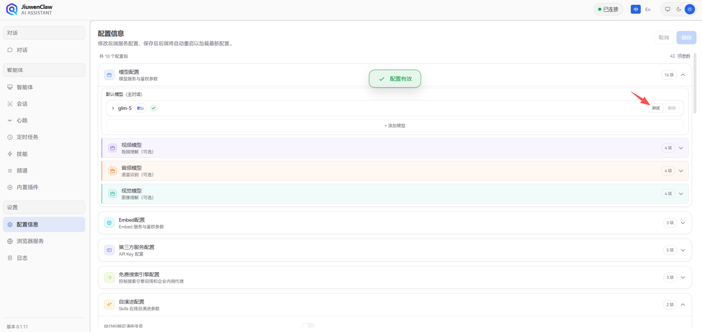
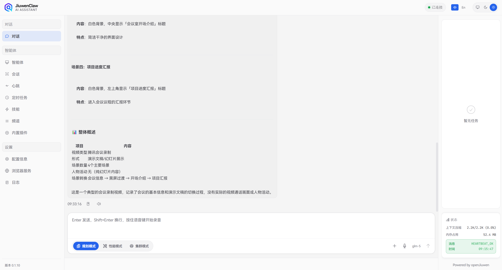
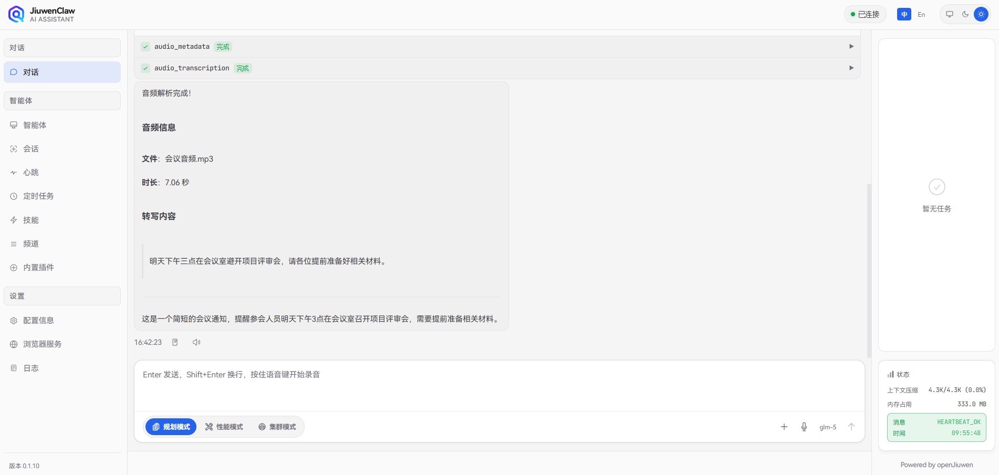
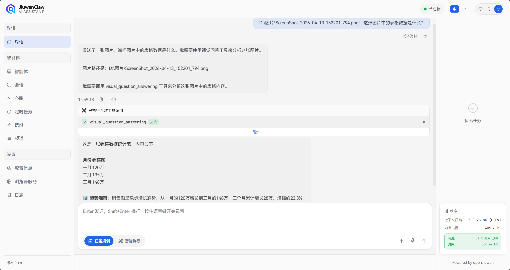
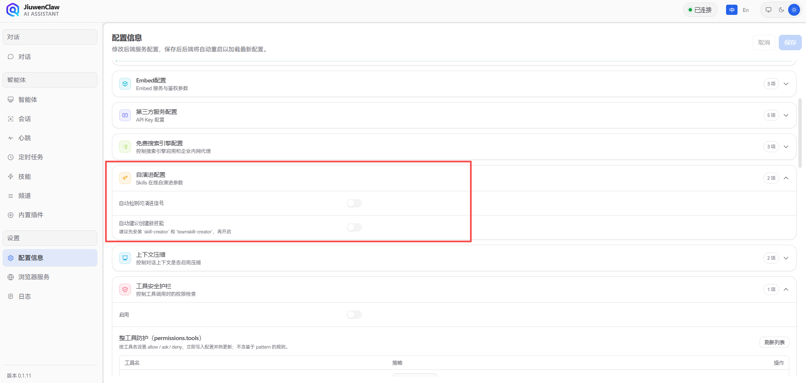
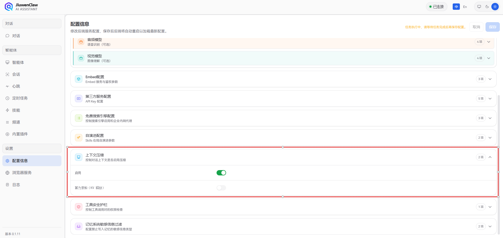
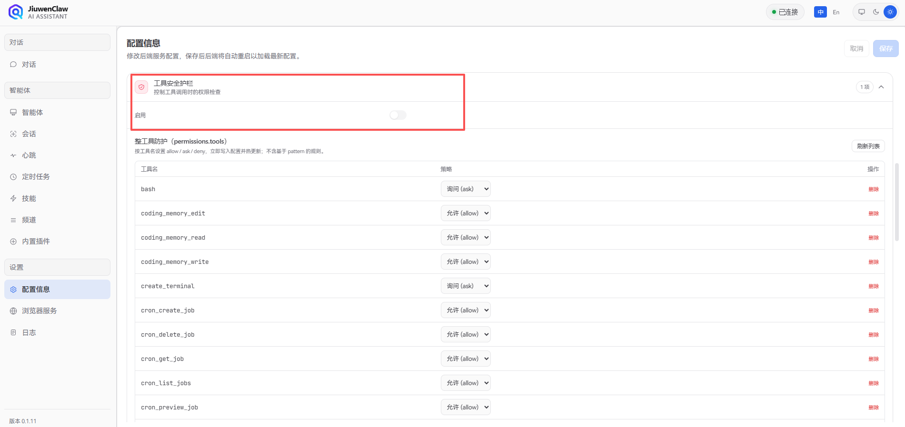

# 配置信息

JiuwenClaw 的配置信息是您与智能体交互的基础设置。通过合理的配置，您可以连接不同的模型服务、启用多模态能力、配置第三方服务，以及调整系统行为参数。

本文档将详细介绍 JiuwenClaw 前端配置面板中的各项配置，帮助您快速上手并充分发挥系统能力。

---

## 一、配置入口

在左侧导航栏打开 **配置信息**，即可在网页上查看和修改与模型、第三方服务、免费搜索等相关的设置。修改后请点击保存；是否需等待服务就绪，以您使用的部署方式为准。


配置面板包含以下主要区域：

- **模型配置**：默认对话模型、视频/音频/视觉模型（详见 [二、模型配置](#二模型配置)）
- **Embed 配置**：向量嵌入服务（详见 [三、Embed 配置](#三embed-配置)）
- **第三方服务**：Jina、博查、Serper、Perplexity、GitHub 等（详见 [四、第三方服务配置](#四第三方服务配置)）
- **自演进配置**：技能自动改进能力（详见 [五、自演进配置](#五自演进配置)）
- **上下文压缩**：对话历史管理策略（详见 [六、上下文压缩](#六上下文压缩)）
- **工具安全护栏**：工具调用权限检查（详见 [七、工具安全护栏](#七工具安全护栏)）

> 💡 **提示**：模型配置（`api_base`、`api_key`、`model`、`model_provider`）为必填项，其他配置均为可选。

---

## 二、模型配置

> 在使用 JiuwenClaw 之前，您需要先向模型提供商申请 API 密钥。请访问相应提供商的官网，按照指引申请 API 密钥。

### 2.1 支持配置的模型

JiuwenClaw 支持配置多种类型的模型，以满足不同场景的需求：

| 模型类型     | 作用                                                   | 能力要求                                                 | 是否必选 |
| ------------ | ------------------------------------------------------ | -------------------------------------------------------- | -------- |
| **默认模型** | 主对话核心模型，处理所有文本对话、任务规划、工具调用等 | 需具备**工具调用（Function Calling）**能力，支持多轮对话 | ✅ 必选   |
| **视频模型** | 视频理解与分析，支持视频内容问答、场景识别等           | 需具备**视频理解**能力，能处理视频输入                   | ⭕ 可选   |
| **音频模型** | 语音识别与处理，支持语音转文字、音频内容分析等         | 需具备**语音识别/音频理解**能力                          | ⭕ 可选   |
| **视觉模型** | 图像理解与分析，支持图像问答、OCR、场景描述等          | 需具备**图像理解**能力，能处理图片输入                   | ⭕ 可选   |
| **图片生成模型** | 根据文本描述生成图片，支持AI绘画、图像创作等        | 需具备**图像生成**能力，能根据文本生成图片               | ⭕ 可选   |

> 💡 **提示**：默认模型是系统运行的基础，必须正确配置。视频、音频、视觉、图片生成模型为可选配置，当您需要相应多模态能力时再配置即可。

### 2.2 配置项说明

每种模型类型都包含以下配置项：

| 配置项           | 说明              | 备注                                                         |
| ---------------- | ----------------- | ------------------------------------------------------------ |
| `api_base`       | 模型 API 基础地址 | 填写服务商提供的 API 地址，**无需包含 `/chat/completions` 后缀**，系统会自动补齐 |
| `api_key`        | 模型 API 密钥     | 从模型服务商官网获取，注意保密                               |
| `model`          | 模型名称          | 填写具体的模型 ID，如 `gpt-4o`、`claude-3-opus`、`deepseek-chat` 等           |
| `model_provider` | 模型提供商类型    | 支持 `OpenAI`、`Azure`、`SiliconFlow` 等，用于适配不同服务商的 API 格式 |

> 💡 **测试功能**：配置面板提供了**测试按钮**，填写完模型配置后，可以点击"测试"按钮验证 API 连接是否正常。系统会发送一个简单的测试请求，如果成功会显示"测试成功"，否则会提示错误信息。



#### 配置示例

以 OpenAI 兼容 API 为例：

```
api_base: https://api.openai.com/v1
api_key: sk-your-openai-api-key
model: gpt-4o
model_provider: OpenAI
```

> 💡 **提示**：大多数模型服务商都提供 OpenAI 兼容的 API，您可以根据实际使用的服务商调整 `api_base` 和 `model` 参数。

### 2.4 多模型管理与别名

配置面板的**模型列表**区块支持同时维护多个模型，方便在不同模型间快速切换。

每个模型条目包含以下字段：

| 字段 | 是否必填 | 说明 |
|------|---------|------|
| `model_name` | 必填 | 模型在 API 层的名称（如 `gpt-4o`、`deepseek-chat`） |
| `alias` | 选填 | 显示名称 / 切换标识符；不填时自动取 `model_name` 的值 |
| `api_base` | 必填 | 该模型的 API 地址 |
| `api_key` | 必填 | 该模型的 API 密钥 |
| `model_provider` | 必填 | 提供商（如 `OpenAI`、`DeepSeek`） |
| `temperature` | 选填 | 采样温度，默认 `0.95` |

**`alias` 规则**：
- 留空时存储时自动赋值为 `model_name`；
- 在所有已配置模型中必须全局唯一：不能与其他模型的 `alias` 或 `model_name` 相同；
- 切换模型时（Web 下拉 / CLI `\model <name>`）可用 `alias` 或 `model_name` 作为标识符。

列表首位为默认使用的模型；可在 UI 中拖拽排序或点击"设为默认"调整首位。

### 2.3 多模态模型效果展示

当您配置了视频、音频或视觉模型后，JiuwenClaw 将自动启用相应的多模态能力。以下是各模型的应用场景示例：

#### 视频模型应用

以 **GLM-4.6V-Flash11** 视频理解 API 为例：

当您向 JiuwenClaw 发送视频文件并提问时，系统会调用视频模型进行分析：

```
用户：请分析这个视频，告诉我视频中有哪些主要场景？
[发送视频文件：meeting_recording.mp4]

JiuwenClaw：根据视频分析，该视频包含以下主要场景：
1. 会议室开场介绍（0:00-2:30）
2. 项目进度汇报（2:30-8:15）
3. 问题讨论环节（8:15-12:00）
4. 总结与下一步计划（12:00-15:00）
```



#### 音频模型应用

以 **GLM-ASR-2512** 音频模型为例：

当您发送音频文件时，系统会调用音频模型进行语音识别或分析：

```
用户：请帮我转录这段录音的内容
[发送音频文件：voice_message.m4a]

JiuwenClaw：转录结果如下：
"明天下午三点在会议室B开项目评审会，请各位提前准备好相关材料..."
```



#### 视觉模型应用

以 **GLM-4.6V-Flash11** 视觉模型为例：

当您发送图片并提问时，系统会调用视觉模型进行图像理解：

```
用户：这张图片中的表格数据是什么？
[发送图片：data_chart.png]

JiuwenClaw：根据图像分析，这是一个销售数据统计表：
- 一月销售额：120万
- 二月销售额：135万
- 三月销售额：148万
整体呈上升趋势...
```



---

## 三、Embed 配置

Embed（嵌入）模型用于将文本转换为向量表示，是 JiuwenClaw 记忆系统实现语义检索的核心组件。

### 3.1 作用说明

Embed 模型的主要作用：

- **语义检索**：将记忆内容转换为向量，支持基于语义相似度的检索，而非简单的关键词匹配
- **记忆召回**：当您询问历史信息时，系统能更准确地找到相关记忆
- **混合检索**：与 BM25 全文检索结合，提供最佳的召回效果

> 💡 **提示**：Embed 配置为可选。若不配置，系统将使用 Mock Provider 进行基础检索。配置后可获得更精准的语义搜索能力。关于记忆系统的详细内容，请参考 [记忆](记忆.md) 文档。

### 3.2 配置项说明

| 配置项           | 说明                    | 参考格式                        | 备注                          |
| ---------------- | ----------------------- | ------------------------------- | ----------------------------- |
| `embed_api_base` | Embed 服务 API 基础地址 | `https://api.siliconflow.cn/v1` | 填写 Embed 服务商的 API 地址  |
| `embed_api_key`  | Embed 服务 API 密钥     | `sk-xxxxxxxxxxxxxxxx`           | 从服务商官网获取              |
| `embed_model`    | Embed 模型名称          | `BAAI/xxx`        | 建议使用支持中文的 Embed 模型 |


---

## 四、第三方服务配置

本节与 **「一、1.4」「一、1.5」** 对应，便于单独查阅「搜索与外部服务」相关能力。以下配置项均在 **配置信息** 面板中展示（均为可选）。

| 配置项 | 说明 | 参考 |
| --- | --- | --- |
| `jina_api_key` | Jina；网页抓取及部分搜索能力 | [Jina](https://jina.ai/) |
| `bocha_api_key` | 博查 Bocha Web Search | [博查开放平台](https://open.bochaai.com/) |
| `serper_api_key` | Serper 搜索 | [Serper](https://serper.dev/) |
| `perplexity_api_key` | Perplexity | [Perplexity](https://www.perplexity.ai/) |
| `github_token` | GitHub；SkillNet 等 | [GitHub Tokens](https://github.com/settings/tokens) |
| `teamskills_hub_token` | TeamSkillsHub 用户 Token | [TeamSkillsHub](https://teamskills.openjiuwen.com) |

> ⚠️ **注意**：均为可选。不填写时，对应能力可能不可用或走降级策略，以实际产品行为为准。

---

## 五、自演进配置

自演进配置控制 JiuwenClaw 的 Skills 自动改进能力。



### 开关说明

- **配置项**：`evolution.enabled`
- **默认值**：`false`（关闭）
- **作用**：启用后，系统会自动检测 Skills 执行过程中的问题，并生成改进建议，持续优化技能表现

当开启自演进后，系统会：

1. 监听 Skills 执行过程和对话内容
2. 检测执行错误、用户反馈等改进信号
3. 自动生成改进建议并记录

> 📖 **详情**：关于自演进机制的详细说明，请参考 [Skill 自演进](Skill自演进.md) 文档。

---

## 六、上下文压缩

上下文压缩配置控制对话历史的管理策略。



### 开关说明

- **配置项**：`context_engine.enabled`
- **默认值**：`true`（开启）
- **作用**：启用后，当对话内容超出上下文窗口限制时，系统会自动压缩和卸载部分内容，保持对话流畅

当开启上下文压缩后，系统会：

1. 监控对话消息数量和 Token 数量
2. 当超出阈值时，自动识别并归档"大而次要"的内容
3. 保留简要索引，为当前任务腾出空间

> 📖 **详情**：关于上下文压缩机制的详细说明，请参考 [上下文压缩卸载](上下文压缩卸载.md) 文档。

---

## 七、工具安全护栏

工具安全护栏配置控制工具调用时的权限检查机制。



### 开关说明

- **配置项**：`permissions.enabled`
- **默认值**：`false`（关闭）
- **作用**：启用后，系统会在执行敏感工具操作前进行权限检查，根据配置策略决定是否需要用户确认

当开启工具安全护栏后，系统会：

1. 检查每个工具调用的权限配置
2. 根据规则判断行为：`allow`（直接执行）、`ask`（询问用户）、`deny`（拒绝执行）
3. 对于 `ask` 类操作，会弹出确认框让用户决定

### 权限规则示例

```yaml
permissions:
  enabled: true
  defaults:
    "*": "allow"           # 默认允许所有操作
  tools:
    mcp_exec_command:
      "*": "ask"           # 命令执行默认需确认
      patterns:
        - pattern: "rm -rf"
          action: "deny"   # 危险命令直接拒绝
```

---

## 八、高级配置

除 **配置信息** 页中的表单项外，产品还可通过**主配置**调整超时、温度、心跳间隔、上下文窗口阈值等（与界面中的「上下文压缩」「权限」「记忆禁忌」等开关配合使用）。**本文不列出这些项在磁盘上的位置**；若您需要离线修改或批量下发，请咨询部署方或管理员。

### 8.1 主配置中常见的逻辑项（概念名）

下列为**主配置**里常见的逻辑路径名称，仅供与运维文档或发行说明对照；**不是**「配置信息」页上的每一个字段。

| 配置项（概念路径） | 说明 | 默认值（常见） |
| --- | --- | --- |
| `preferred_language` | 界面语言 | `zh` |
| `models.*.model_client_config.timeout` | 模型请求超时（秒） | `1800` |
| `models.*.model_client_config.verify_ssl` | 是否校验 SSL | `false` |
| `models.*.model_config_obj.temperature` | 温度 | `0.95` |
| `heartbeat.every` | 心跳间隔（秒） | `3600` |
| `context_engine.max_messages` | 上下文消息数阈值 | `100` |
| `context_engine.max_tokens` | 上下文 Token 阈值 | `100000` |

<a id="dotenv-configuration"></a>

### 8.2 与界面以外的运行参数

浏览器自动化、网络代理、部分搜索链路的细粒度开关等，可能由**运行环境或部署模板**提供，**不一定**出现在 **配置信息** 页。普通用户只需完成界面上的必填项与业务相关密钥即可；其余由管理员或运维处理。

### 8.3 配置生效的优先顺序（概念）

从高到低一般为：**您在 Web「配置信息」中保存的设置** → **运行环境注入的变量** → **产品内置默认**。具体行为以您使用的版本与部署方式为准。

> 💡 **提示**：保存后若短时间内未生效，可稍候重试或联系管理员确认服务是否已重载。

---

## 常见问题

### Q: 配置保存后没有生效？

A: 配置保存后系统会自动重启后端服务，请等待几秒钟后再试。如果仍未生效，请检查配置格式是否正确。

### Q: 如何查看当前使用的模型？

A: 在配置面板中可以看到当前配置的模型信息。也可以通过系统日志查看实际调用的模型。

### Q: 多模态模型必须配置吗？

A: 不必须。视频、音频、视觉模型都是可选的。只有当您需要使用相应的多模态功能时才需要配置。

---