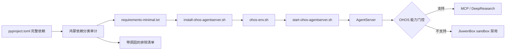
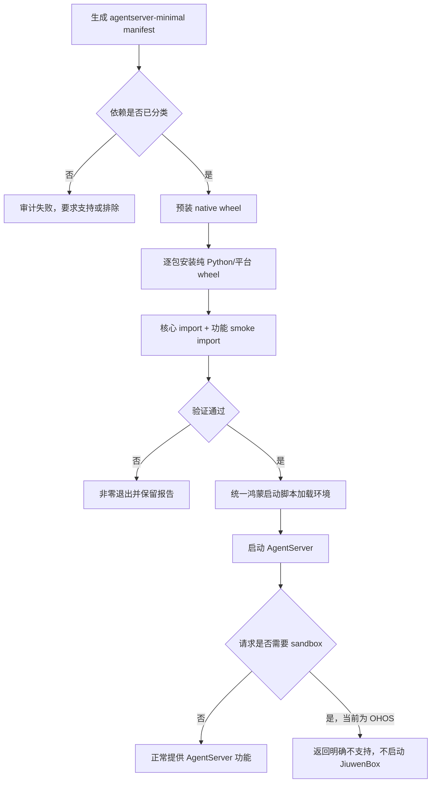
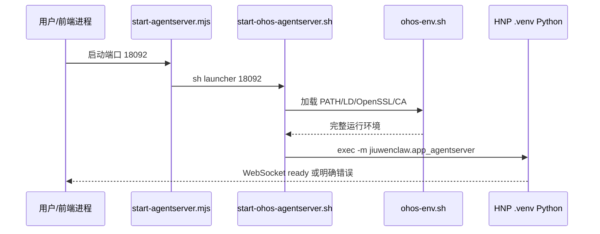

# 鸿蒙主分支依赖与 AgentServer 运行适配设计

## 0. 规格与验收边界

### 0.1 问题与目标

Jiuwen 主分支合入后新增了 JiuwenBox、DeepResearch 文档转换、MCP 等运行代码及依赖。鸿蒙当前采用 `requirements-minimal.txt`、本地 native wheel 和 `--no-deps` 安装 JiuwenClaw，因此主分支 `pyproject.toml` 的依赖不会自动完整进入鸿蒙环境。

本方案的目标是保证鸿蒙上的 AgentServer 可以稳定安装、启动并使用已纳入精简栈的功能，同时明确 JiuwenBox 沙箱在鸿蒙上的功能边界，避免安装成功后在懒加载或子进程阶段才暴露缺包、动态库丢失或平台能力不支持的问题。

### 0.2 范围

- 范围内：Jiuwen 仓内鸿蒙依赖清单、安装验证、AgentServer 启动入口、Python 子进程环境继承、鸿蒙平台功能门控。
  - 范围内：主分支新增的 `latex2mathml`、`mathml2omml`、`markdown`、`markdown-it-py`、`PyYAML`、`fastapi`、`mcp`、`python-docx` 等依赖的鸿蒙策略。
- 范围外：relay-claw 改动、鸿蒙原生 HAP 构建、完整 JiuwenBox 沙箱的鸿蒙移植、Windows/Linux 沙箱行为调整。

### 0.3 行为规则与边界条件

| 场景/触发 | 前置条件 | 预期结果 | 异常或边界结果 | 兼容性 |
| --- | --- | --- | --- | --- |
| 执行鸿蒙安装脚本 | HNP Python、OpenSSL、Rust/native wheel 已准备 | 依赖安装到仓内 `.venv`，核心与已支持的懒加载模块均可 import | 核心模块失败时脚本非零退出并生成报告 | 不改变非鸿蒙安装流程 |
| 启动 AgentServer | 已完成安装 | 统一加载 `ohos-env.sh` 后启动 `.venv/bin/python` | 缺少动态库、解释器或核心模块时启动前失败并给出缺项 | 保留 Node 调试入口 |
| AgentServer 拉起 Python 子进程 | 父进程环境可正常运行 HNP Python | 子进程继承 Python、OpenSSL、CA、PATH 等运行环境 | 禁止使用极简白名单丢弃 `LD_LIBRARY_PATH` | 非鸿蒙继续沿用原逻辑 |
| 用户在鸿蒙开启 sandbox | 运行平台标识为 `ohos` | 返回明确的“不支持”结果，不拉起 JiuwenBox | 不允许将 OHOS 误判为普通 Linux 后执行 bwrap/seccomp 路径 | Windows/Linux 行为不变 |
| 主分支新增 Python 依赖 | CI 或本地运行依赖审计 | 每个差异必须进入鸿蒙清单或带原因进入排除清单 | 未分类差异阻止合入 | 允许鸿蒙精简栈有意裁剪 |

### 0.4 验收标准

- [ ] AC-1：在鸿蒙设备执行 `sh scripts/install-ohos-agentserver.sh` 后，核心依赖和已支持的懒加载功能依赖全部通过 import 验证，报告中无未分类失败。
- [ ] AC-2：先加载正常 shell 环境再经 Node 启动 AgentServer，`LD_LIBRARY_PATH` 中的 HNP Python、OpenSSL 和已有路径均被保留。
- [ ] AC-3：AgentServer 可以监听默认端口 `18092`，并完成一次 WebSocket 握手；停止后无遗留 AgentServer 子进程。
- [ ] AC-4：鸿蒙上即使配置 `sandbox.enabled=true`，也不会启动 `uvicorn`/JiuwenBox/bwrap，而是返回可诊断的平台不支持信息。
- [ ] AC-5：修改 `pyproject.toml` 新增依赖但未更新鸿蒙支持或排除策略时，依赖审计测试失败。
- [ ] AC-6：Windows/Linux 的 JiuwenBox 自动启动和现有非鸿蒙安装方式不发生行为变化。

### 0.5 已确认与待确认项

- 已确认：鸿蒙安装采用 `requirements-minimal.txt` 生成 `agentserver-minimal` manifest，JiuwenClaw 本体使用 `--no-deps` 安装。
- 已确认：当前 Node 启动器直接覆盖 `LD_LIBRARY_PATH`，没有保留 HNP Python lib、动态 OpenSSL 路径和父进程路径。
- 已确认：`JiuwenBoxRunner` 使用环境白名单创建 `uvicorn` 子进程，白名单不包含 `LD_LIBRARY_PATH`、OpenSSL 和 CA 环境。
- 已确认：JiuwenBox 的 Unix 实现依赖 bwrap、namespace、seccomp、Landlock、cgroup 等 Linux 能力，当前没有 OHOS 实现。
- 已确认：鸿蒙 manifest 当前包含新增的六项依赖，但没有 `python-docx` 和 `uvicorn`；DeepResearch 代码直接 import `docx`。
- 待确认：鸿蒙产品是否计划支持 JiuwenBox 的非沙箱代理能力；若需要，应设计独立的 proxy-only profile，而不是开启 Linux sandbox。

## 1. 需求简介

### 1.1 需求背景

这次风险不是单个包能否 `pip install`，而是依赖声明、精简安装、启动器和子进程四层存在不同的环境与功能假设。主分支在完整安装环境中由包管理器补齐传递依赖；鸿蒙为了避开不可编译 native 包，主动绕过了这套闭包，因此需要显式维护平台适配。

### 1.2 需求场景分析

- 安装阶段：纯 Python 包通常可直接安装，但其传递依赖可能包含 `pydantic-core`、`rpds-py`、`cryptography`、`cffi`、`lxml` 等 native 包，必须命中鸿蒙 wheel。
- 启动阶段：`.venv/bin/python` 是 HNP Python 的入口，运行依赖父进程的动态库搜索路径；任何覆盖环境的包装器都会再次触发 `libpython3.12.so.1.0`、`libintl.so.8` 等加载失败。
- 懒加载阶段：DeepResearch、MCP、JiuwenBox 并非都在 AgentServer 冷启动时 import，仅验证 `jiuwenclaw` 无法证明具体功能可用。
- 子进程阶段：JiuwenBox 使用同一解释器拉起 `python -m uvicorn`，若重建环境变量，即使父进程正常也可能单独失败。

### 1.3 对现有功能影响分析

安装脚本需要补齐依赖分类、import 验证和漂移检测。启动方式对用户保持不变，仍可使用 `node start-agentserver.mjs` 或 shell 命令，但二者最终应进入同一个鸿蒙启动脚本。鸿蒙默认不提供 JiuwenBox 沙箱能力，配置入口应显示或返回明确的不支持状态。

### 1.4 架构影响分析（包括版本兼容性）

改动仅落在 Jiuwen 的鸿蒙脚本、平台判断和测试。`pyproject.toml` 仍是全平台完整依赖源，`requirements-minimal.txt` 是鸿蒙支持闭包；两者通过显式支持/排除策略建立可审计关系。非鸿蒙入口不加载 `ohos-env.sh`，Windows/Linux 沙箱路径保持不变。

### 1.5 技术选型

- 沿用 POSIX shell 作为鸿蒙环境编排入口，复用现有 `scripts/ohos/ohos-env.sh`。
- 沿用 manifest 逐包安装模式，避免重新引入一次性 resolver 导致 native 包源码构建。
- 使用显式环境变量 `JIUWENCLAW_RUNTIME_PLATFORM=ohos` 标识平台，不依赖 `sys.platform == "linux"` 的模糊判断。
- 依赖验证采用“包级 import + 关键业务模块 smoke import”，覆盖懒加载路径。

## 2. 方案设计

### 2.1 设计约束

- HNP Python 运行时必须继承完整父环境，禁止通过 `env -i` 或不完整白名单启动 Python。
- 鸿蒙精简栈不安装 `uvicorn[standard]`，避免引入 `uvloop`、`httptools`、`watchfiles` 等额外 native 构建。
- JiuwenBox sandbox 在鸿蒙上默认关闭；当前产品不提供鸿蒙侧启用入口，AgentServer 不自动拉起 JiuwenBox，sandbox 配置 RPC 返回平台不支持。
- 安装脚本失败必须可诊断；“pip 成功但核心 import 失败”不能视为成功。
- 不修改 relay-claw，不改变 Windows/Linux 的完整依赖与沙箱能力。

### 2.2 整体设计方案

方案分为四层：依赖分类层负责决定鸿蒙支持闭包；安装层负责逐包安装和验证；启动层统一构造运行环境；能力门控层阻止鸿蒙进入未支持的 Linux sandbox 路径。

### 2.3 方案详细设计

#### 2.3.1 总体详细设计流程

#### 2.3.2 依赖闭包设计

当前新增包按鸿蒙风险分组：

| 分组 | 依赖 | 策略 |
| --- | --- | --- |
  | 纯 Python、直接支持 | `latex2mathml`、`mathml2omml`、`markdown`、`markdown-it-py`、`PyYAML`、`fastapi`、`mcp` | 保留在 `requirements-minimal.txt` 并 import 验证 |
| 纯 Python但依赖 native | `python-docx` | 加入精简依赖；确保先安装本地 `lxml` wheel；验证 `import docx` |
| 重复顶层模块 | `jieba3k` | 鸿蒙继续只装现有 `jieba`；二者都提供 `jieba` 顶层包，禁止同时安装造成文件覆盖；记录为有理由排除 |
| JiuwenBox 服务端 | `uvicorn[standard]` | 默认鸿蒙 profile 排除；sandbox 不支持时不应启动服务。未来 proxy-only profile 仅安装普通 `uvicorn`，不带 `standard` extra |
| native 传递依赖 | `pydantic-core`、`rpds-py`、`cryptography`、`cffi`、`lxml`、`jiter` | 继续由 P0 wheel 预装/单独验证，禁止回退源码构建 |

同时对主分支约束做版本对齐：`httpx`、`beautifulsoup4`、`json-repair` 和 OpenTelemetry 上限应取完整依赖与鸿蒙适配约束的交集，避免精简清单允许安装主分支已不再支持的旧版或过新版。

#### 2.3.3 安装与验证设计

`scripts/install-ohos-agentserver.sh` 保持现有 phase 顺序，新增两类验证：

  1. 包级验证：增加 `docx`、`mathml2omml`，保留 `yaml`、`fastapi`、`mcp`、`markdown`、`markdown_it`、`latex2mathml`。
2. 业务 smoke import：至少覆盖 DeepResearch 转换模块和 MCP stdio 工具模块，发现只在懒加载时出现的缺包。

验证结果分为 `required` 和 `excluded`，不再把失败笼统描述为“正常”。支持闭包内任何 import 失败都应使脚本非零退出；明确排除的平台功能不参与成功判定。

依赖漂移检查从 `pyproject.toml` 提取包名，与以下集合比较：

- `requirements-minimal.txt`：鸿蒙支持的直接依赖。
- `OHOS_EXCLUDED_DEPENDENCIES`：有原因、有责任人的排除项。
- 由 agent-core harmonyos profile 提供的依赖：避免重复安装但必须可追踪。

#### 2.3.4 启动环境设计

新增 `scripts/start-ohos-agentserver.sh` 作为唯一鸿蒙启动实现：

- source `scripts/ohos/ohos-env.sh`；
- 设置 `JIUWENCLAW_RUNTIME_PLATFORM=ohos`；
- 验证 `.venv/bin/python` 和核心模块；
- 使用 `ohos_native_ld_library_path` 构造并导出动态库路径；
- `exec "$VENV_DIR/bin/python" -m jiuwenclaw.app_agentserver --port "$PORT"`。

`start-agentserver.mjs` 仅负责参数和进程生命周期，调用上述 shell 脚本，不再硬编码或覆盖 `PATH`、`LD_LIBRARY_PATH`、OpenSSL、Rust 与 CA 路径。

#### 2.3.5 子进程环境设计

`JiuwenBoxRunner` 当前的环境白名单会删除动态库与证书环境。Windows/Linux 原有安全收敛仍保留，但运行解释器所需的环境必须进入允许集合：`LD_LIBRARY_PATH`、`SSL_CERT_FILE`、`SSL_CERT_DIR`、`OPENSSL_DIR` 以及平台标识。

鸿蒙能力门控应在调用 `JiuwenBoxRunner.ensure_running()` 前生效，因此正常情况下不会创建 JiuwenBox 子进程。子进程继承修复仍应实施，避免未来 proxy-only 模式或其他 Python 子进程重复触发同类问题。

#### 2.3.6 鸿蒙功能门控

`ohos-env.sh` 导出 `JIUWENCLAW_RUNTIME_PLATFORM=ohos`。AgentServer 使用统一 helper 判断当前运行平台：

- 鸿蒙：sandbox capability 为 `unsupported`，自动启动直接跳过，配置写操作返回明确错误。
- Windows/Linux：沿用现有 `sys.platform` 与 JiuwenBox 行为。
- 未识别平台：保持 fail-closed，不自动启动 sandbox。

不能仅以 `sys.platform == "linux"` 判断可用性，因为 OHOS Python 的平台标识和 Linux 兼容层行为不足以证明 bwrap、namespace、seccomp、Landlock、cgroup 均可用。

#### 2.3.7 接口设计

新增内部环境变量：

| 名称 | 默认值 | 用途 | 兼容策略 |
| --- | --- | --- | --- |
| `JIUWENCLAW_RUNTIME_PLATFORM` | 非鸿蒙不设置 | 明确标识 `ohos`，驱动能力门控 | 仅鸿蒙 launcher 设置 |
| `OHOS_AGENTSERVER_PORT` | `18092` | shell launcher 默认端口 | CLI 端口参数优先 |

不新增外部网络 API。现有 sandbox RPC 在鸿蒙返回结构化不支持错误，不写入会导致下次启动误触发的启用状态。

#### 2.3.8 界面与数据结构设计

Jiuwen 仓本次无界面改动。用户通过安装报告、启动日志和现有 sandbox RPC 获知结果。

不新增持久化业务数据。依赖排除清单建议使用 Python 常量或文本清单维护，每项至少包含包名、排除原因和对应功能，供测试读取。

## 3. 可靠可用性设计

- 安装脚本逐包执行并保留 summary，失败后可从失败 phase 重新运行；不删除已有 `.venv`，除非用户显式设置 `RECREATE_VENV=1`。
- 启动前打印解释器、site-packages 和关键动态库目录，不打印凭据或完整用户环境。
- Node 进程透传 shell/Python 退出码和 SIGTERM，确保 AgentServer 可正常清理。
- 依赖验证覆盖冷启动与懒加载，不以单独 `import jiuwenclaw` 代替功能验证。
- sandbox 不支持时不自动启动 JiuwenBox，也不改变默认本地执行模式；不静默宣称本地执行具有沙箱隔离能力。

## 4. 安全隐私设计

- 不将完整 `os.environ` 写入日志；仅记录路径类诊断字段，证书、令牌、代理认证信息不得输出。
- 鸿蒙禁止误入 Linux sandbox 路径，避免在缺少隔离能力时把普通进程误标为“沙箱”。
- pip 镜像与 `trusted-host` 沿用现状，但供应链风险需单独治理；依赖清单应固定合理版本范围并优先使用已验证 wheel。
- 子进程环境继承采用必需变量允许集，不把无关业务密钥自动传给未来的 JiuwenBox 进程。

## 5. 性能成本设计

- 新增纯 Python 包主要增加安装时间与包体积，对 AgentServer 冷启动影响较小；业务模块仍可懒加载。
- 不安装 `uvicorn[standard]` 可避免额外 native wheel、源码编译和包体增长。
- 启动 preflight 只执行有限 import，目标额外耗时不超过 3 秒；实际阈值以鸿蒙设备实测为准。
- 依赖漂移检查只解析 TOML/文本文件，可在秒级完成。

## 6. 实施计划

1. P0：补 `python-docx` 与 `docx` 验证，统一鸿蒙 shell 启动器，修复 Node 覆盖环境问题（覆盖 AC-1、AC-2、AC-3）。
2. P0：增加显式 OHOS 平台标识和 sandbox 门控，阻止 JiuwenBox/bwrap 自动启动（覆盖 AC-4、AC-6）。
3. P1：补依赖版本交集、业务 smoke import 和子进程必需环境允许集（覆盖 AC-1、AC-2）。
4. P1：增加完整依赖与鸿蒙支持/排除集合的漂移测试（覆盖 AC-5）。
5. P2：在真实鸿蒙 PC 完成安装、启动、WebSocket、MCP、DeepResearch 和关闭回归。

## 7. 验证方案

- 静态检查：`sh -n` 检查全部 OHOS shell；Node 启动器运行语法检查；manifest 生成结果包含预期包和 import 名。
- 单元测试：依赖差异分类、平台 capability、sandbox RPC 不支持结果、Node 环境不覆盖逻辑。
- 集成测试：使用可控 fake Python 记录 Node/shell 传入环境，断言父 `LD_LIBRARY_PATH`、OpenSSL 和 CA 路径仍存在。
- 鸿蒙实机：全新 `.venv` 安装，运行 import/smoke 清单，启动 AgentServer 并完成 WebSocket 握手。
- 负向测试：删除一个必需包、清空 HNP Python lib 路径、设置 `sandbox.enabled=true`，分别验证安装失败、启动失败和 sandbox fail-closed。
- 回归：Windows/Linux 现有 JiuwenBox 自动启动测试与 AgentServer 测试保持通过。

## 8. 风险与待确认项

- P0 风险：`python-docx` 会依赖 native `lxml`；必须确认现有 OHOS lxml wheel 与 Python 3.12 ABI 匹配。
- P0 风险：当前 Node 启动器覆盖 `LD_LIBRARY_PATH`，可能直接复现此前 HNP Python loader 故障。
- P1 风险：若后续新增其他配置入口或外部环境强制开启 sandbox，需在实际 sys operation 创建路径补充平台门控；当前产品入口不提供该能力。
- P1 风险：`mcp` 版本升级可能改变传递依赖并重新引入 native 包，需要 manifest 与实机安装报告共同验证。
- P1 风险：`jieba` 与 `jieba3k` 共享 import 命名空间，同时安装可能发生文件覆盖；鸿蒙精简栈应只保留一个实现。
- 待确认：鸿蒙是否需要 JiuwenBox proxy-only；若需要，另行定义 `ohos-agentserver-proxy` profile，并使用不带 `standard` extra 的 `uvicorn`。
- 待确认：启动 preflight 的 3 秒目标需在目标鸿蒙 PC 上实测后固化。
