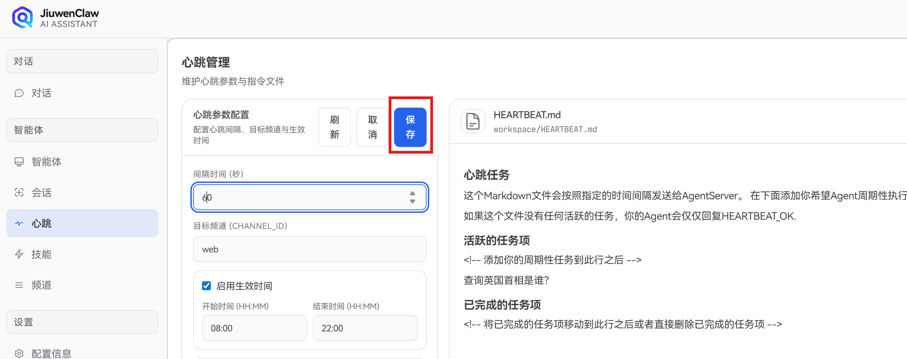
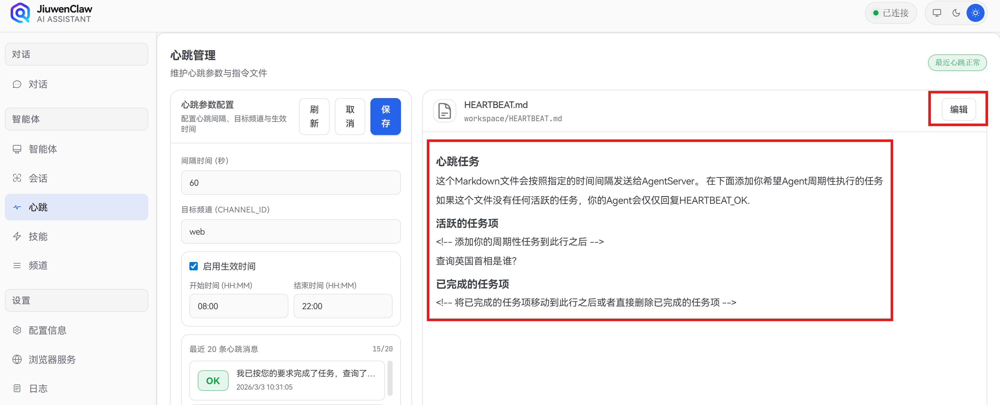

# Heartbeat 心跳功能使用说明

Heartbeat（心跳）是 网关按固定间隔向 AgentServer 发送的探活请求，用于检测连接与 Agent 是否可用；若配置了 `workspace/HEARTBEAT.md`，还可驱动 Agent 周期性执行其中列出的任务。并且支持用户选择频道返回 Agent 执行的结果（默认web）。

---

## 1. 功能概述

- **探活**：每隔一定时间向 AgentServer 发一次请求，确认服务正常。
- **可选任务**：若项目根下存在 `workspace/HEARTBEAT.md`，Agent 会读取其中的「活跃的任务项」，按顺序执行并将结果写回工作目录；若无该文件或无任务，则仅返回 `HEARTBEAT_OK`。
- **结果回传**：心跳响应可通过配置回传到指定 Channel（如 Web 前端），便于在界面上查看最近一次心跳状态与内容。

---

## 2. 配置方式

配置方式共有三种，修改配置文件，修改环境变量，在web前端设置。

### 2.1 配置文件 `config/config.yaml`

在 `config/config.yaml` 中配置 `heartbeat` 段：

```yaml
heartbeat:
  # 心跳间隔（秒），默认 3600
  every: 3600
  # 心跳结果回传的 channel（如 "web" 表示 Web 前端）
  target: web
  # 心跳生效时间段（本地时间），仅在此区间内发送心跳；不配置则始终生效
  active_hours:
    start: 08:00
    end: 22:00
```


| 字段             | 含义           | 说明                                                                                            |
| -------------- | ------------ | --------------------------------------------------------------------------------------------- |
| `every`        | 心跳间隔（秒）      | 必须 > 0，例如 60 表示每分钟一次，3600 表示每小时一次。                                                            |
| `target`       | 回传目标 channel | 一般为 `web`，表示把心跳响应通过 WebChannel 推到前端；留空或不存在则不回传。                                               |
| `active_hours` | 生效时间段        | `start` / `end` 格式为 `HH:MM`（24 小时制）。仅当当前时间在 [start, end] 内才发心跳；不配置则全天生效。支持跨午夜（如 22:00–06:00）。 |


### 2.2 环境变量（覆盖 YAML）


| 变量名                          | 含义           | 示例     |
| ---------------------------- | ------------ | ------ |
| `HEARTBEAT_INTERVAL`         | 心跳间隔（秒）      | `3600` |
| `HEARTBEAT_RELAY_CHANNEL_ID` | 回传目标 channel | `web`  |
| `HEARTBEAT_TIMEOUT`          | 单次心跳请求超时（秒）  | `30`   |


环境变量优先级高于 `config/config.yaml` 中的 `heartbeat` 段。

### 2.3 前端「心跳」面板

Web 端左侧导航进入 **心跳** 面板，可：

- 查看当前心跳配置（间隔、回传目标、生效时间段)

- 修改上述配置并保存（会写回 `config/config.yaml` 的 `heartbeat` 段，并重启心跳服务）。

- 在 `最近 20 条心跳消息` 显示框里可以查看心跳历史记录，包括每次心跳的状态（正常 / 告警）、内容与时间。

---

## 3. HEARTBEAT.md 与周期性任务

### 3.1 文件位置与作用

- **路径**：项目根下的 `workspace/HEARTBEAT.md`（与 web端 文件一致）。在web端，该文件在面板右侧，可以点击 `编辑` 进行修改。

- **作用**：若该文件存在且「活跃的任务项」不为空，每次心跳时 Agent 会读取该段内容，按顺序执行任务，并把结果以 Markdown 等形式保存在工作目录；若文件不存在或无任务，则仅返回 `HEARTBEAT_OK`。

### 3.2 文件格式

`workspace/HEARTBEAT.md` 建议结构如下（与仓库内模板一致即可）：

```markdown
# 心跳任务

在下面添加你希望 Agent 周期性执行的任务。
若没有任何活跃任务，Agent 会仅回复 HEARTBEAT_OK。

## 活跃的任务项

<!-- 在此行之后添加待执行任务，每行一条，以 "- " 开头 -->

例如：
- 检查邮件并汇总未读标题
- 生成今日工作摘要到 workspace/daily-summary.md

## 已完成的任务项

<!-- 将已完成的任务移动到此段或删除 -->
```

- **活跃的任务项**：`## 活跃的任务项` 与 `## 已完成的任务项` 之间的、以 `-`  开头的行会被解析为待办，由 Agent 按顺序执行。
- 以 `<!--` 开头的注释行会被忽略。
- 任务执行完成后，可将对应项移动到「已完成的任务项」或删除，避免重复执行。

### 3.3 Agent 行为简述

- 每次心跳请求会带上固定提示词，要求 Agent：若存在 `HEARTBEAT.md` 则读取「活跃的任务项」并依次完成，结果保存到工作目录；否则仅回复 `HEARTBEAT_OK`。
- 服务端实现会读取 `workspace/HEARTBEAT.md`，解析出任务列表，拼成一条 chat 请求发给 Agent，走正常对话流程；解析失败或任务列表为空时，直接返回 `HEARTBEAT_OK`。

---

## 4. 前端展示与事件

- **状态**：心跳面板和工具栏会显示最近心跳状态（如「最近心跳正常」/ 告警）、最近一次心跳内容与时间。
- **事件**：当 `target` 为 `web` 时，每次心跳响应会通过 `heartbeat.relay` 事件推到前端，用于更新状态与历史记录；若内容非 `HEARTBEAT_OK`，可能以弹窗形式提示，便于查看任务执行结果或异常信息。

---

## 5. 常见问题

**Q：修改了 `config/config.yaml` 的 heartbeat 段，为何没生效？**  
A：应用启动时读取配置；若通过前端「心跳」面板修改，会写回 YAML 并自动重启心跳服务。若直接改 YAML，需重启整个应用（如重启 jiuwenclaw-web）后新配置才会生效。

**Q：如何只在工作时间发心跳？**  
A：在 `heartbeat.active_hours` 中设置 `start` / `end`，例如 `start: 09:00`、`end: 18:00`，则仅在 09:00–18:00 之间发送心跳。

**Q：心跳请求超时怎么办？**  
A：可设置环境变量 `HEARTBEAT_TIMEOUT`（秒）。超时后本次心跳记为失败，会在日志中打 WARNING

**Q：HEARTBEAT.md 放在哪里？**  
A：必须放在项目根下的 `workspace/HEARTBEAT.md`，即与 Agent 使用的 workspace 目录一致；否则会被视为「无自定义任务」，仅返回 `HEARTBEAT_OK`。

---

## 6. 相关代码与配置索引

- 心跳服务实现：`jiuwenclaw/gateway/heartbeat.py`（`GatewayHeartbeatService`、`HeartbeatConfig`）。
- 配置读取与写回：`config/config.py` 的 `update_heartbeat_in_config`；应用启动时在 `app.py` 中从 `config/config.yaml` 的 `heartbeat` 段及环境变量构建 `HeartbeatConfig`。
- Agent 侧 HEARTBEAT.md 处理：`jiuwenclaw/agentserver/interface.py` 中根据 `request.params` 的 `heartbeat` 键读取 `workspace/HEARTBEAT.md` 并触发任务。
- 前端：`jiuwenclaw/web/src/components/HeartbeatPanel/`、`heartbeat.get_conf` / `heartbeat.set_conf`、`heartbeat.relay` 事件。

