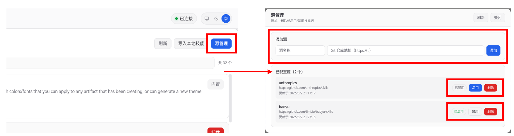

# Skills 技能系统说明

JiuwenClaw 的 **Skills (技能)** 系统允许为 Agent 动态地扩展能力、提供工具权限控制、以及补充系统提示词等功能。通过直观的前端「技能」面板和完善的后端机制，用户可以轻松地安装、卸载、导入和管理来自不同源的技能。

## 1. 技能来源

JiuwenClaw 支持安装多种来源的技能：

- **项目/内置 (Project/Built-in)**：随代码库或项目自带默认存在的技能。
- **本地 (Local)**：用户从本地文件系统（通过绝对路径或相对路径）导入的自定义技能。
- **市场 (Marketplace)**：从配置的第三方 Git 仓库（例如远程的技能合集仓库）下载和安装的外部插件与技能。

## 2. 前端「技能」面板

JiuwenClaw 提供了直观的「技能」面板，涵盖了技能的完整生命周期管理：

- **技能列表与检索**：
  - 展示所有可用技能，涵盖本地已安装和 Marketplace 中未安装的技能。
  - 支持通过关键词快速过滤（匹配名称、描述、作者或标签）。


- **技能详情预览**：
  - 单击技能可查看其详细元数据，如：来源、状态（已安装/未安装/内置）、版本、作者等。
  - 显示该技能指定的 **允许工具 (Allowed Tools)**，直观了解其具备的扩展能力。
  - 支持直接在界面上预览技能文件 (`SKILL.md`) 的正文内容。


- **操作与生命周期管理**：
  - **安装**：对来自 Marketplace 但尚未安装的技能，可以一键安装。支持手动指定 `plugin@marketplace` 的规格格式进行精确安装。
  - **卸载**：将不再需要的 Marketplace 技能移除，释放空间并保持环境整洁。
  - **导入本地技能**：通过输入服务器上的本地 `SKILL.md` 路径或文件夹目录，将其拷贝进入系统工作区并激活。


- **源管理**：
  - **添加源**：添加一个第三方的 Marketplace 市场源 (Git 仓库地址)，添加后默认禁用。
  - **启用源**：启用一个第三方的 Marketplace 市场源，启用后会自动拉取该市场的最新技能列表。
  - **禁用源**：禁用一个第三方的 Marketplace 市场源，禁用后不再显示该市场的技能列表，但不会删除该市场的本地缓存。
  - **删除源**：删除一个第三方的 Marketplace 市场源，删除后会删除该市场的本地缓存，并从系统中移除该市场。



## 3. 后端「技能」管理机制

后端的底层管理由 `jiuwenclaw/agentserver/skill_manager.py` 驱动。

### 3.1 目录与文件存储
系统内所有的技能数据默认独立存放于 Workspace 目录下：
- **`workspace/agent/skills/`**：存放当前已被系统识别、安装或导入的可执行技能。每个技能以独立文件夹存在。
- **`workspace/agent/skills/_marketplace/`**：作为缓存目录，存放通过 Git 克隆下来的各个 Marketplace 仓库，内部包含了供用户安装的众多未激活插件。

### 3.2 状态持久化
整个技能生态的状态信息被持久化保存在 **`workspace/skills_state.json`** 中。该文件记录了：
- 用户配置的所有 Marketplace 列表及其启用/禁用状态。
- 当前已安装插件的详细记录（包含插件名、所属市场、版本、Git Commit Hash 及安装时间戳）。
- 手动导入的本地技能记录。

### 3.3 核心处理逻辑
- **远端同步 (Git 协作)**：系统在后台使用 `git clone` 和 `git pull` 等命令与 Marketplace 仓库交互，确保市场列表缓存随时保持更新。
- **元数据解析**：智能解析 `SKILL.md`。系统能够读取并解析文件开头的 `YAML frontmatter` (由 `---` 包裹的内容)，抽取出如 `name`、`description`、`allowed_tools` 等关键元数据。若没有配置元数据，则智能回退以文件夹/文件名称作为技能名。
- **冲突处理机制**：在安装市场技能或导入本地技能发生同名冲突时，后端具备安全拦截机制，同时开放 `force` 强制覆盖参数处理更新逻辑。

## 4. 「技能」开发指南

如果你想自己编写一个技能，其核心就是一个命名为 `SKILL.md` 的文件。
你可以通过 JiuwenClaw 帮助你生成，推荐使用 `YAML frontmatter` 来声明其属性，标准结构如下：

```markdown
---
name: my-custom-skill
version: 1.0.0
author: your-name
description: 这个技能用于演示如何编写自定义 Agent 技能
tags: [demo, tools]
allowed_tools: [webSearch, readFile]
---

# 技能正文 / Agent 提示词

在此处编写希望赋予 Agent 的能力描述、系统背景设定或工作流指导。
当你将 allowed_tools 包含进来时，系统会在加载此技能时，动态给 Agent 赋予相应工具的执行权限。
```

**关键字段说明**：
- **`name`**：技能的唯一标识符（必需，若缺省会以文件名兜底）。
- **`allowed_tools`**：一个字符串数组。声明该技能需要请求哪些系统工具（如网络搜索、文件读取等）。
- **正文**：这部分内容在实际运行时，会被编织到大模型 Agent 的提示词上下文中，从而影响 Agent 的行为和心智。