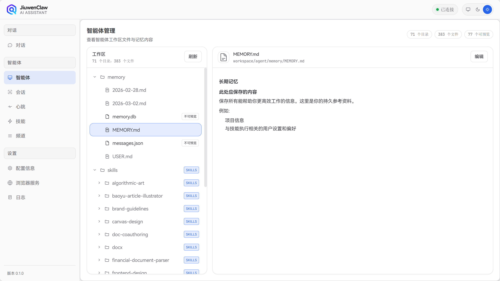

# 智能体

`workspace` 是 JiuwenClaw 的运行时工作目录，存放 Agent 的记忆、技能、会话数据及用户可配置的心跳任务。在**源码模式**下使用项目根目录的 `workspace`；在**包安装模式**（whl）下，首次运行会将包内预置的 `workspace` 复制到 `~/.jiuwenclaw/workspace`。



## 目录结构总览

```
workspace/
├── HEARTBEAT.md           # 心跳任务配置（预置模板，用户可编辑）
├── agent-data.json        # Agent 列表元数据（动态生成）
├── skills_state.json      # Skill 安装/市场状态（动态生成）
├── agent/                 # Agent 工作区
│   ├── memory/            # 记忆系统
│   │   ├── USER.md        # 用户身份信息（用户/Agent 创建）
│   │   ├── MEMORY.md      # 长期记忆（用户/Agent 创建）
│   │   ├── YYYY-MM-DD.md  # 按日期的当日记忆（动态生成）
│   │   ├── messages.json  # 消息压缩存储（动态生成）
│   │   └── memory.db      # 向量检索数据库（动态生成）
│   ├── skills/            # 技能目录
│   │   ├── _marketplace/  # 市场仓库克隆目录（预置空目录）
│   │   └── <skill-name>/  # 各技能（预置 + 市场安装）
│   └── SOUL.md            # Agent 灵魂/人格描述（预置）
└── session/               # 会话工作目录（动态生成）
    ├── sess_<id>/         # 普通会话
    │   ├── todo.md        # 待办列表（TodoToolkit 创建）
    │   └── *.md, *.json   # 会话中生成的文件
    └── heartbeat_<id>/    # 心跳任务会话
```

---

## 预置内容（Pre-configured）

随包或源码自带的、用户可直接使用或修改的内容：

| 路径 | 说明 |
|------|------|
| `HEARTBEAT.md` | 心跳任务模板。若存在且「活跃的任务项」不为空，Agent 会按心跳间隔读取并执行；否则仅返回 `HEARTBEAT_OK`。用户可在 Web 端编辑。 |
| `agent/SOUL.md` | Agent 灵魂/人格描述，用于系统提示词。 |
| `agent/skills/` | 内置技能目录。每个技能包含 `SKILL.md`、`prompts/`、`references/` 等。 |
| `agent/skills/_marketplace/` | 技能市场仓库克隆目录，预置为空，用于存放从市场安装的插件。 |
| `agent/memory/` | 记忆目录结构。`USER.md`、`MEMORY.md` 可由用户或 Agent 首次创建。 |

---

## 动态生成内容（Dynamically Generated）

由系统或 Agent 在运行过程中创建和更新的内容：

| 路径 | 说明 |
|------|------|
| `agent-data.json` | 由 `scripts/generate-agent-folders.js` 生成，供 Web 端展示 Agent 列表。 |
| `skills_state.json` | 由 `SkillManager` 维护，记录已安装的市场插件及状态。 |
| `agent/memory/YYYY-MM-DD.md` | 按日期生成的当日记忆文件，Agent 通过 `write_memory` 等工具写入。 |
| `agent/memory/messages.json` | 消息压缩存储，用于记忆系统。 |
| `agent/memory/memory.db` | 向量检索数据库（ChromaDB），用于 `memory_search`。 |
| `agent/skills/<skill>/evolutions.json` | 技能演化记录，由技能优化流程生成。 |
| `session/<session_id>/` | 每个会话对应一个子目录，由 `app.py` 创建。 |
| `session/<session_id>/todo.md` | 由 `TodoToolkit` 创建，存储该会话的待办列表。 |
| `session/<session_id>/*` | 会话中 Agent 生成的其他文件（如查询结果、解析数据等）。 |

---

## 相关配置

- **Skill 根目录**：`config/config.yaml` 中 `skill_base_dir` 默认为 `workspace/agent/skills`。
- **记忆工作目录**：`workspace/agent`（即 `get_agent_workspace_dir()`）。
- **会话目录**：`workspace/session`，每个 `session_id` 对应一个子目录。
