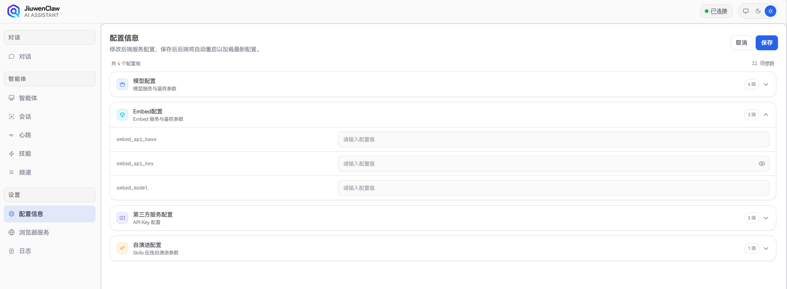
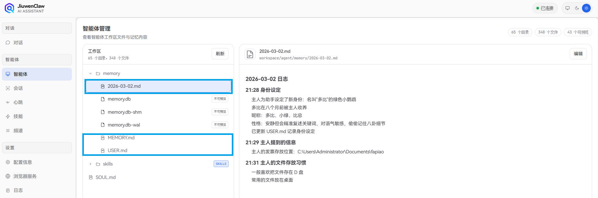

# 记忆系统

记忆系统让 JiuwenClaw 拥有跨对话的持久记忆能力，自动将关键信息写入文件长期保存，配合语义检索随时召回。

## 配置说明

记忆检索默认进行 BM25 全文检索，用户可选择配置 `EMBED_API_KEY`，使用向量 + BM25 混合检索以获得最佳召回效果。通过以下环境变量配置 Embedding 服务，用于语义向量搜索：

| 环境变量 | 说明 |
|----------|------|
| EMBED_API_KEY | Embedding 服务的 API Key（不配置则使用 mock provider） |
| EMBED_API_BASE | Embedding 服务的 URL |
| EMBED_MODEL | Embedding 模型名称 |




## 记忆文件结构

记忆采用纯 Markdown 文件存储，Agent 通过文件工具直接操作：

```
{workspace_dir}/memory
├── MEMORY.md               # 长期记忆
├── USER.md                 # 用户档案
└── YYYY-MM-DD.md           # 每日会话记录
```

### memory/MEMORY.md（长期记忆）

存放长期有效、极少变动的关键信息。
- **用途**：存储决策、偏好、持久性事实
- **更新**：Agent 通过 write / edit 文件工具写入

### USER.md（用户档案）

存储当前用户的基本信息，帮助 Agent 更好地个性化服务。
- **用途**：存储用户姓名、职业、爱好、位置等个人信息
- **更新**：Agent 通过 write / edit 文件工具更新用户信息

### YYYY-MM-DD.md（每日日志）

每天一页，追加写入，记录当天的工作与交互。
- **用途**：记录日常笔记和运行上下文
- **更新**：Agent 通过 write / edit 文件工具追加写入，对话过长需要进行总结时自动触发

## 记忆写入触发

在与用户交互过程中，JiuwenClaw 会根据需要自动触发记忆写入，将关键信息写入记忆文件长期保存。 

| 信息类型 | 写入目标 | 操作方式 | 示例 |
|----------|----------|----------|------|
| 决策、偏好、持久事实 | memory/MEMORY.md | write / edit 工具 | "项目使用 Python 3.12"、"偏好 pytest 框架" |
| 用户个人信息 | memory/USER.md | write / edit 工具 | 用户姓名、职业、爱好等 |
| 日常笔记、运行上下文 | memory/YYYY-MM-DD.md | write / edit 工具 | "今天修复了登录 Bug"、"部署了 v2.1" |
| 用户说"记住这个" | memory/YYYY-MM-DD.md | write 工具 | "记住我把项目文件存在了D盘" |


## 架构概览

```
用户 / Agent
     │
     ▼
MemoryIndexManager 长期记忆管理
              ├── 记忆持久化（文件工具）
              ├── 文件监控（watchdog）
              ├── 语义搜索（向量 + BM25）
              └── 文件读取（按需加载）
```

### 长期记忆管理能力

| 能力 | 说明 |
|------|------|
| 记忆持久化 | 通过文件工具（read / write / edit）将关键信息写入 Markdown 文件，文件即真实数据源 |
| 文件监控 | 通过 watchdog 监控文件改动，异步更新本地数据库（语义索引 & 向量索引） |
| 语义搜索 | 通过向量嵌入 + BM25 混合检索，按语义召回相关记忆 |
| 文件读取 | 直接通过文件工具读取对应的 Memory Markdown 文件，按需加载保持上下文精简 |


### 技术架构

```
┌─────────────────────────────────────────────────────────────────┐
│                     MemoryIndexManager                          │
├─────────────────────────────────────────────────────────────────┤
│  ┌─────────────┐  ┌─────────────┐  ┌─────────────────────┐      │
│  │ Config      │  │ Embedding   │  │ SQLite Database     │      │
│  │ (config.py) │  │ Provider    │  │ - chunks            │      │
│  └─────────────┘  └─────────────┘  │ - files             │      │
│         │                │         │ - embedding_cache   │      │
│         │                │         │ - chunks_fts (FTS5) │      │
│         │                │         │ - chunks_vec (vec0) │      │
│         │                │         └─────────────────────┘      │
│         │                │                   │                  │
│         ▼                ▼                   ▼                  │
│  ┌───────────────────────────────────────────────────────────┐  │
│  │                    Search Pipeline                        │  │
│  │  Query ──► Embed ──► Vector Search ──┐                    │  │
│  │                                      ├─► Merge ──► Results|  |
│  │  Query ──► FTS5 Search ──────────────┘                    │  │
│  └───────────────────────────────────────────────────────────┘  │
└─────────────────────────────────────────────────────────────────┘
```


## 记忆检索

### 记忆检索方式

Agent 有两种方式获取记忆：

| 方式 | 适用场景 | 示例 |
|------|----------|------|
| 语义搜索 | 不确定记在哪个文件，按意图模糊召回 | "之前关于部署流程的讨论" |
| 直接读取 | 已知具体日期或文件路径，精确查阅 | 读取 `memory/2026-02-28.md` |

### 混合搜索流程

```
Query ──► Embed ──► Vector Search ──┐
                                    ├─► Merge ──► Results
Query ──► FTS5 Search ──────────────┘
```

搜索结果按混合分数排序：`score = vectorWeight * vectorScore + textWeight * textScore`。默认向量检索权重 0.7，全文检索权重 0.3。

