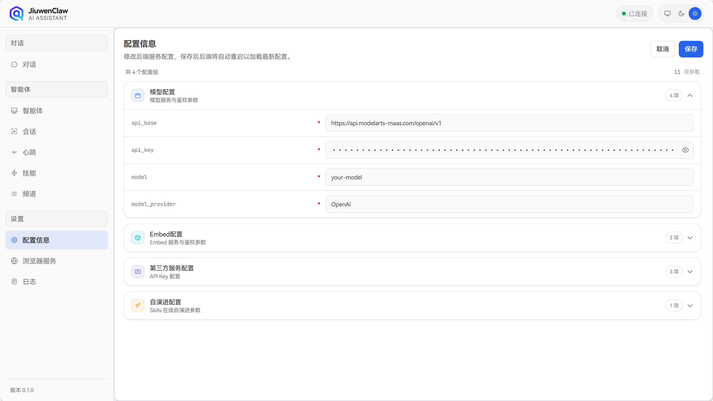

# 配置说明

JiuwenClaw 的配置来源包括：`config/config.yaml`、`.env` 环境变量、以及 Web 前端各面板。本文档说明**哪些可在前端配置**、**哪些需手动修改文件**，以及各配置项的作用。

---

## 一、前端配置面板可配置

以下配置可通过 Web 端对应面板修改并保存，系统会自动写回配置文件或 `.env`。

**入口**：左侧导航 → **配置**

**保存目标**：`.env`（环境变量）

| 配置项 | 环境变量 | 说明 |
|--------|----------|------|
| `api_base` | `API_BASE` | 模型 API 基础地址（如 `https://api.deepseek.com`） |
| `api_key` | `API_KEY` | 模型 API 密钥 |
| `model` | `MODEL_NAME` | 模型名称（如 `deepseek-chat`） |
| `model_provider` | `MODEL_PROVIDER` | 模型提供商（如 `OpenAI`） |
| `embed_api_base` | `EMBED_API_BASE` | Embed 服务 API 地址 |
| `embed_api_key` | `EMBED_API_KEY` | Embed 服务 API 密钥 |
| `embed_model` | `EMBED_MODEL` | Embed 模型名称 |
| `jina_api_key` | `JINA_API_KEY` | Jina 搜索 API 密钥 |
| `serper_api_key` | `SERPER_API_KEY` | Serper 搜索 API 密钥 |
| `perplexity_api_key` | `PERPLEXITY_API_KEY` | Perplexity API 密钥 |
| `evolution_auto_scan` | `EVOLUTION_AUTO_SCAN` | 是否每轮对话后自动扫描可演进技能（`true`/`false`） |

**说明**：保存后后端会重启以加载新配置。模型配置（`api_base`、`api_key`、`model`、`model_provider`）为必填项。

## 二、前端不可配置

以下配置需通过**直接编辑 `config/config.yaml`** 或 **`.env`** 修改，无 Web 界面。

### 1. config.yaml 中仅文件可改的项

| 路径 | 说明 |
|------|------|
| `react.agent_name` | Agent 名称，默认 `main_agent` |
| `react.max_iterations` | 最大迭代轮数，默认 50 |
| `react.context_engine_config.enable_reload` | 是否启用上下文重载 |
| `react.evolution.enabled` | 是否启用 Skills 在线自演进 |
| `react.evolution.skill_base_dir` | Skill 根目录，默认 `workspace/agent/skills` |
| `tools` | 启用的工具列表（如 `todo`、`skill`） |
| `browser.remote_debugging_address` | 远程调试地址 |
| `browser.remote_debugging_port` | 远程调试端口 |
| `browser.user_data_dir` | Chrome 用户数据目录 |
| `browser.profile_directory` | Chrome 配置文件目录 |

---

### 2. 仅环境变量可配置的项

| 环境变量 | 说明 |
|----------|------|
| `HEARTBEAT_TIMEOUT` | 单次心跳请求超时（秒） |
| `HEARTBEAT_RELAY_CHANNEL_ID` | 心跳回传 channel（覆盖 config.yaml 的 `target`） |
| `HEARTBEAT_INTERVAL` | 心跳间隔（秒），覆盖 config.yaml 的 `every` |
| `BROWSER_RUNTIME_MCP_ENABLED` | 是否启用浏览器 MCP 运行时 |
| `BROWSER_RUNTIME_MCP_CLIENT_TYPE` | MCP 客户端类型（`stdio` / `sse` / `streamable-http`） |
| `BROWSER_RUNTIME_MCP_SERVER_PATH` | MCP 服务地址 |
| `PLAYWRIGHT_CDP_URL` | Playwright 连接 Chrome 的 CDP 地址 |
| `PLAYWRIGHT_TOOL_TIMEOUT_S` | Playwright 工具超时（秒） |
| `BROWSER_TIMEOUT_S` | 浏览器任务超时（秒） |
| `JIUWENCLAW_CONFIG_DIR` | 自定义 config 目录路径 |

更多环境变量见 `.env.template`。

---

### 3. 配置优先级

- **环境变量** > **config.yaml**
- 例如：`config.yaml` 中 `react.model_name: ${MODEL_NAME:-deepseek-chat}` 会先读 `MODEL_NAME` 环境变量，无则用默认值 `deepseek-chat`。
- 前端 ConfigPanel 保存的项会写入 `.env`，下次启动时优先加载。
