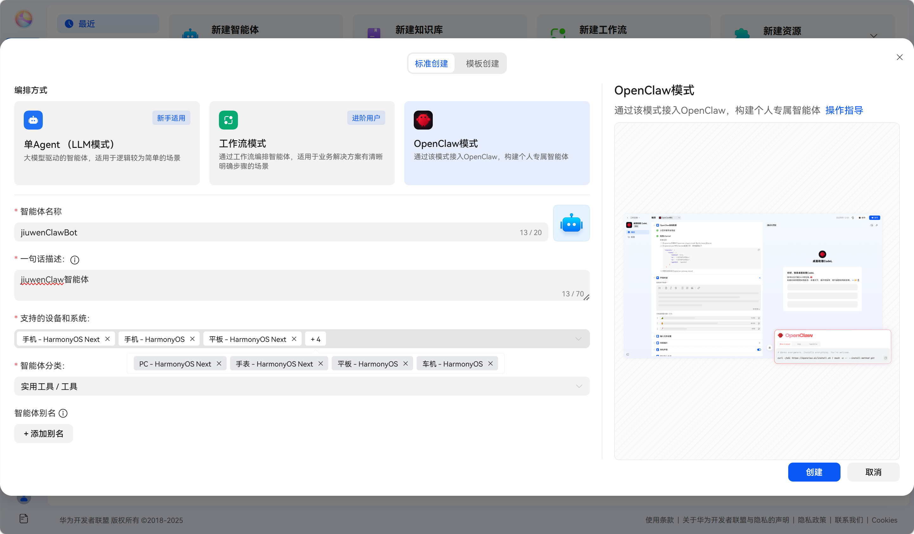
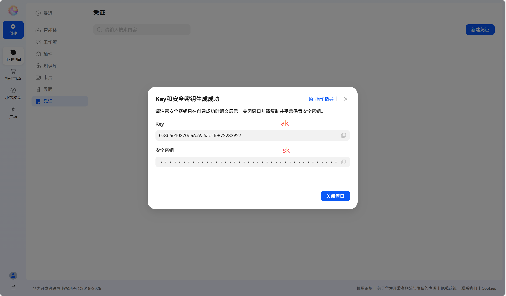
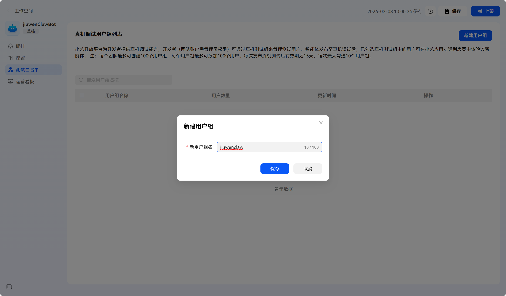
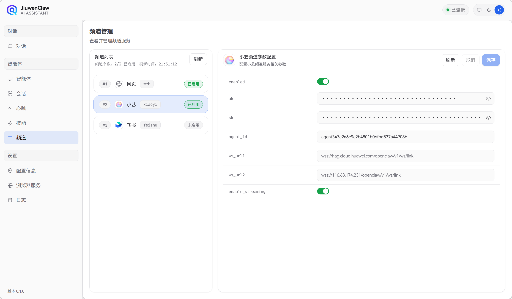
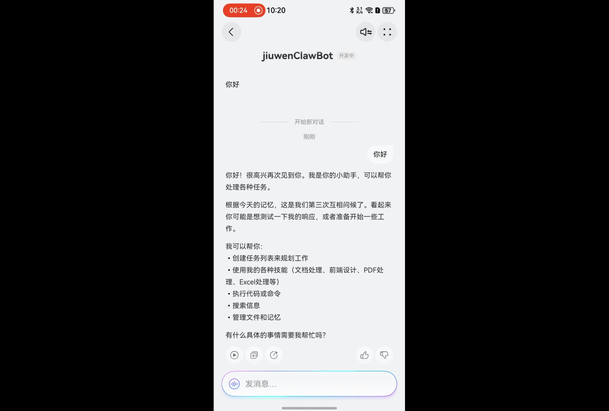

# 简介： **通用聊天界面，统一消息中枢**

JiuwenClaw 的​**频道**​，是您与不同聊天平台对话的**渠道**。JiuwenClaw 已经实现了**鸿蒙小艺、飞书**等channel的无缝接入，并持续拓展至更多元渠道。可以直接在通过 **飞书**、**鸿蒙生态终端的小艺app** 应用直接与JiuweClaw对话。

配置频道有两种方式：

* **网页配置**​（推荐）— 在 JiuwenClaw前端页面，点击 **`智能体` **/ **`频道`**卡片，在频道管理模块，填写相关配置。

* **手动编辑 `config.yaml`** — 默认在 `~/.jiuwenclaw/config.yaml` （由首次 `jiuwenclaw-start` 启动时自动生成），将需要的频道设 `enabled: true` 并填好鉴权信息；保存后自动重载，无需重启。

  

# 小艺

[演示视频](../assets/xiaoyi_channel.mp4)

## 1. 创建小艺智能体

通过在 [小艺开放平台 ](https://developer.huawei.com/consumer/cn/hag/abilityportal/#/)创建JiuwenClaw模式的智能体，即可与JiuwenClaw服务无缝接入。


第一步： 创建JiuwenClaw模式的智能体



第二步：创建凭证及添加白名单

点击新建凭证，并​**保存ak与sk信息**​。




小艺开放平台为开发者提供真机调试能力，通过配置白名单分组，添加用户账号，可以在鸿蒙终端与小艺智能体对话。添加成功并上架成功后，可在终端小艺应用中使用该智能体。





勾选新建的用户组


第三步：上架智能体

填写开场白对话，点击上架按钮


## 2. 绑定频道

方式一： 将小艺开放平台获取到的**ak、sk、agentId**信息，填写至JiuwenClaw的小艺频道，开启使用，点击保存即可开启对话了。



方式二： 修改 `~/.jiuwenclaw/config/config.yaml`

``````
channels:
  xiaoyi:
    # 华为小艺 A2A 配置
    ak: "小艺平台凭证 ak"
    sk: "小艺平台凭证 sk"
    agent_id: "创建的agent ID"
    enable_streaming: true
    enabled: true
``````

保存后若服务已运行会自动重载，未运行可以执行 `jiuwenclaw-start` 启动服务。


## 3. 智能体对话

方式1： 直接在网页与智能体应用对话


方式2：在鸿蒙终端小艺应用，找到已上架的应用，直接对话




# 飞书


## 1. 创建飞书自建应用
1. 访问 [飞书开放平台](https://open.feishu.cn/) 并登录。
2. 进入**开发者后台**，点击**创建企业自建应用**。
3. 填写应用名称、描述，并上传图标，点击**创建**。

## 2. 添加机器人能力
1. 在应用配置页面，左侧选择**添加应用能力**。
2. 点击**机器人**下的**添加**按钮。

## 3. 记录机器人应用凭证
1. 进入飞书机器人管理后台
2. 记录 App ID 与 App Secret供后续配置使用

## 4. 配置权限
1. 左侧选择**权限管理** -> **API权限**。
2. 搜索并开通以下关键权限（用于收发消息）：
   - `im:message` 相关：以应用的身份发消息、获取用户发给机器人的单聊消息、接收群聊中@机器人消息事件。
   - `contact:user.employee_id:readonly`：获取用户ID信息。
   - 也可以批量导入权限，参考火山引擎文档中的权限列表。

## 5. 配置事件订阅（接收消息）
1. 左侧选择**事件与回调**。
2. **添加事件**：
   - 点击**添加事件**，搜索并添加 `im.message.receive_v1`（接收消息事件） 。
   - 如果希望收到消息后能被动回复，此事件必须添加。
3. （可选）**配置加密策略**：如果启用了加密，需要保存 `Encrypt Key`。

## 6. 发布应用
1. 左侧选择**版本管理与发布**，点击**创建版本** 。
2. 填写版本号、更新说明，选择可用范围（通常选择**全体成员**或部分成员）。
3. 提交审核。如果企业开启了免审，版本会立即生效 。
4. 飞书APP中登陆提交应用的账号即可看到发布的聊天机器人

## 7. 在群聊中添加机器人（可选）
1. 打开飞书客户端，进入需要添加机器人的群组。
2. 点击群设置 -> **群机器人** -> **添加机器人**，搜索你创建的应用名称并添加 。

## 8. 配置飞书Channel
1. 启动前端服务后，在“频道-飞书”自己中打开Enable开关并配置第三步记录的 App ID 与 App Secret