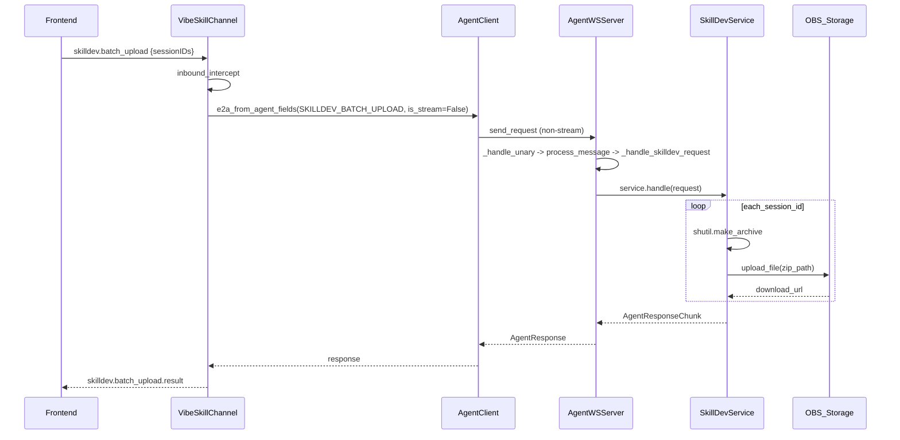

# 批量打包上传 / 下载解压接口方案

## 接口总览

- `skilldev.batch_upload` — 枚举 `SKILLDEV_BATCH_UPLOAD` — 前端→后端 — 批量打包 `service_xxx` 目录并上传 OBS
- `skilldev.batch_download` — 枚举 `SKILLDEV_BATCH_DOWNLOAD` — 前端→后端 — 批量下载 URL 并解压到对应目录

使用 `skilldev.*` 前缀的好处：`_SKILLDEV_METHODS` 通过 `m.value.startswith("skilldev.")` 自动匹配，**interface.py 无需任何修改**。

## 前端请求设计

### 1. 打包上传 - WebSocket `skilldev.batch_upload`

```json
{
  "type": "skilldev.batch_upload",
  "sessionIDs": ["session_abc", "session_def"]
}
```

### 2. 下载解压 - WebSocket `skilldev.batch_download`

```json
{
  "type": "skilldev.batch_download",
  "items": [
    {"sessionID": "session_abc", "url": "https://obs.../xxx.zip", "name": "skill_name_a"},
    {"sessionID": "session_def", "url": "https://obs.../yyy.zip", "name": "skill_name_b"}
  ]
}
```

## 返回设计

### 打包上传返回

```json
{
  "type": "skilldev.batch_upload.result",
  "properties": {
    "results": [
      {"sessionID": "session_abc", "url": "https://obs.../abc.zip", "name": "service_session_abc.zip", "status": "success"},
      {"sessionID": "session_def", "url": "", "name": "", "status": "error", "error": "目录不存在"}
    ]
  }
}
```

### 下载解压返回

```json
{
  "type": "skilldev.batch_download.result",
  "properties": {
    "results": [
      {"sessionID": "session_abc", "status": "success"},
      {"sessionID": "session_def", "status": "error", "error": "下载失败"}
    ]
  }
}
```

## 实现修改的文件（共 3 个）

### 1. `jiuwenclaw/schema/message.py` - 新增 ReqMethod 枚举

在 `SKILLDEV_FILE_WRITE` 之后新增：

```python
SKILLDEV_BATCH_UPLOAD = "skilldev.batch_upload"
SKILLDEV_BATCH_DOWNLOAD = "skilldev.batch_download"
```

### 2. `jiuwenclaw/channel/vibeskill_channel.py` - 入站拦截

在 `inbound_intercept` 中新增两个 type 分支：

```python
if msg_type == "skilldev.batch_upload":
    return await self._handle_batch_upload(ws, data)
if msg_type == "skilldev.batch_download":
    return await self._handle_batch_download(ws, data)
```

**`_handle_batch_upload`** / **`_handle_batch_download`** 实现模式（参考 `_handle_http_export`）：
1. 从 data 中提取参数
2. 构建 E2A envelope（`e2a_from_agent_fields`, is_stream=False）
3. 调用 `_send_agent_request(env)` 同步等待 AgentServer 响应
4. 将响应 payload 包装为 WS 事件推送给前端

### 3. `jiuwenclaw/agentserver/skilldev/service.py` - 核心业务实现

在 `_METHOD_DISPATCH` 中注册：

```python
ReqMethod.SKILLDEV_BATCH_UPLOAD: "_handle_batch_upload",
ReqMethod.SKILLDEV_BATCH_DOWNLOAD: "_handle_batch_download",
```

**`_handle_batch_upload` 实现逻辑**：
1. 从 params 取 `session_ids` 列表
2. 遍历每个 session_id：
   - 定位 `get_user_workspace_dir() / f"service_{session_id}"` 目录
   - 使用 `shutil.make_archive` 打成 zip
   - 调用 `_create_upload_file_obs().upload_file(zip_path)` 获取 download_url
   - 记录结果 `{session_id, url, name, status}`
3. 返回 `AgentResponseChunk(payload={"results": [...]}, is_complete=True)`

**`_handle_batch_download` 实现逻辑**：
1. 从 params 取 `items` 列表（每项含 session_id, url, name）
2. 遍历每个 item：
   - 目标路径 `get_user_workspace_dir() / f"service_{session_id}"`
   - 调用 `download_file(url, temp_path)` 下载 zip
   - 使用 `shutil.unpack_archive` 解压到目标路径
   - 记录结果 `{session_id, status}`
3. 返回 `AgentResponseChunk(payload={"results": [...]}, is_complete=True)`

## 无需修改的文件

- **interface.py** — `_SKILLDEV_METHODS` 使用 `m.value.startswith("skilldev.")` 自动包含新枚举，零改动
- **agent_ws_server.py** — 非流式请求自动走 `_handle_unary` -> `process_message` -> `_handle_skilldev_request`

## 数据流全链路


