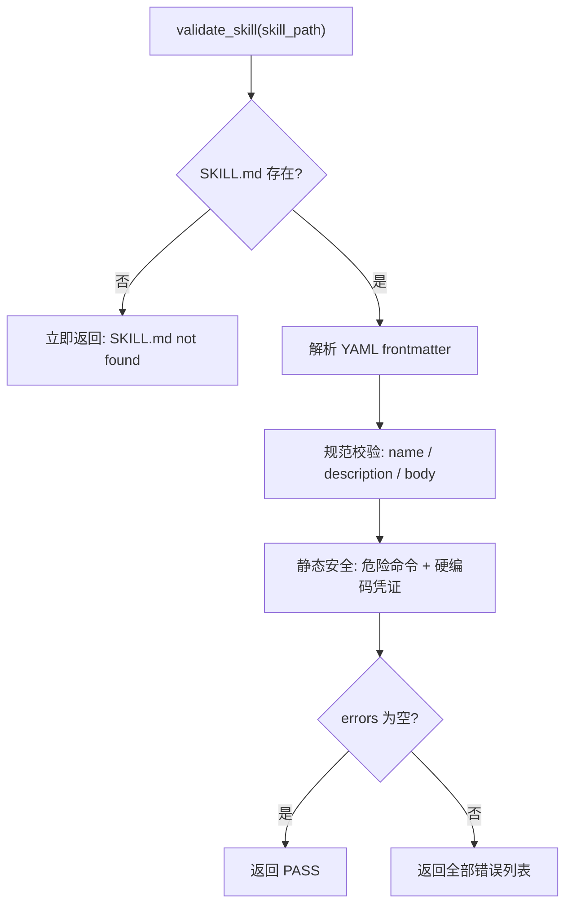

# Skill 本地校验规则（validate.py）设计说明

## 1. 定位

`skills/skill-verifier/scripts/validate.py` 是 Skill 本地规范与安全校验的**单一真源**，替代原先分散在三处的校验逻辑：

- `skill-creator/scripts/quick_validate.py`
- `skill-standardizer/validate.py`
- `direct_import.py` 内联校验

调用方式：

```bash
python3 -m scripts.validate <workspace>
```

脚本会在 `<workspace>/skill/` 下定位含 `SKILL.md` 的技能根目录（`find_skill_root`），再执行 `validate_skill()`。

返回值：

- 成功：`(True, "Skill is valid!")`
- 失败：`(False, "- 错误1\n- 错误2\n...")` — 一次性收集**全部**错误，便于一次修复。

---

## 2. 校验流程概览



校验分为两大类：

| 类别 | 扫描范围 | 说明 |
|------|----------|------|
| **结构/规范** | `SKILL.md` | frontmatter 格式、必填字段、命名与长度限制 |
| **静态安全** | `SKILL.md` + `scripts/**` | 危险命令模式、硬编码凭证、路径遍历 |

---

## 3. 结构 / 规范校验

### 3.1 文件与 Frontmatter

| 校验项 | 规则 | 失败时行为 |
|--------|------|------------|
| `SKILL.md` 存在 | 技能目录下必须有该文件 | 立即返回，不继续 |
| YAML frontmatter | 文件以 `---` 开头，且符合 `---\n...\n---` 格式 | 立即返回 |
| Frontmatter 可解析 | 合法 YAML，解析结果为字典 | 立即返回 |
| 重复 key | frontmatter 中不允许重复字段名 | 追加错误 |
| 必填字段 | 必须有 `name`、`description` | 追加错误 |

**Frontmatter 白名单（当前未启用）**

代码中定义了 `ALLOWED_FRONTMATTER_KEYS`：

```
name, description, license, allowed-tools, metadata, compatibility
```

对应校验逻辑已被注释，**不会**因出现额外 key 而失败。

### 3.2 `name` 字段

| 规则 | 限制 |
|------|------|
| 类型 | 必须是字符串 |
| 非空 | 去空白后不能为空 |
| 命名格式 | kebab-case：仅 `[a-z0-9-]+` |
| 连字符 | 不能以 `-` 开头/结尾，不能含 `--` |
| 长度 | 最多 **64** 字符 |
| 目录一致 | 必须与技能目录名相同（`name == skill_path.name`） |

### 3.3 `description` 字段

| 规则 | 限制 |
|------|------|
| 类型 | 必须是字符串 |
| 非空 | 去空白后不能为空 |
| 字符上限 | 含 CJK 字符：最多 **512** 字符；否则最多 **1024** 字符 |

CJK 判定：字符落在 Unicode `\u4e00`–`\u9fff` 范围内即视为含中文。

**Token 上限（当前未启用）**

常量 `DESCRIPTION_MAX_TOKENS = 300` 及对应校验已被注释。

### 3.4 `SKILL.md` 正文（body）

frontmatter 闭合 `---` 之后的内容为正文。

| 规则 | 限制 |
|------|------|
| 非空 | 去空白后不能为空 |
| 行数 | 最多 **500** 行（`BODY_MAX_LINES`） |

**Token 上限（当前未启用）**

常量 `BODY_MAX_TOKENS = 5000` 及对应校验已被注释。

### 3.5 双限策略说明

模块文档声明采用「**字符 + token 双限**」策略，并实现了 `_estimate_tokens()`：

- 含 CJK：按 **0.6 token/字符** 估算
- 不含 CJK：按 **0.3 token/字符** 估算

**当前实际生效的只有字符/行数限制**；token 相关校验均处于注释状态。与 `skill-verifier-gate-design.md` 中「统一字符+token 双限口径」的目标相比，token 部分尚未落地。

---

## 4. 静态安全校验

由 `_validate_static_security_all()` 执行，扫描 UTF-8 文本文件；非 UTF-8（二进制）文件跳过。

### 4.1 扫描范围

| 检查类型 | 扫描文件 |
|----------|----------|
| 路径遍历 | `SKILL.md` + `scripts/**` |
| 危险命令 | 仅 `scripts/**`（**不含** `SKILL.md`） |
| 硬编码凭证 | `SKILL.md` + `scripts/**` |

### 4.2 路径遍历

若扫描到的相对路径中包含 `..` 段，报 `Path traversal detected`。

### 4.3 危险命令模式（`DANGEROUS_PATTERNS`）

仅在 `scripts/**` 中逐行匹配：

| 类别 | 检测内容 | 标签 |
|------|----------|------|
| 破坏性删除 | `rm ... -rf` 类递归强制删除 | `forced recursive deletion` |
| 危险权限 | `chmod ... 777` | `world-writable permissions` |
| 危险权限 | `chmod ... u+s`（setuid） | `setuid bit modification` |
| 远程下载并执行 | `curl/wget/fetch \| bash/sh/zsh/dash/ash/source` | `piped remote shell execution` |
| 远程下载并执行 | PowerShell `iwr/irm/Invoke-WebRequest/Invoke-RestMethod \| iex/Invoke-Expression` | `piped remote powershell execution` |
| 混淆执行 | `base64 -d/--decode \| bash/sh/...` | `base64 decode then execute` |
| 混淆执行 | `certutil -decode` | `certutil decode (potentially obfuscated payload)` |
| 混淆执行 | PowerShell `-EncodedCommand` / `-Enc` | `powershell encoded command` |
| 混淆执行 | `[Convert]::FromBase64String(` | `powershell base64 decode` |
| 动态执行 | `eval(` | `dynamic eval execution` |
| 动态执行 | `exec(` | `dynamic exec execution` |
| 动态执行 | `os.system(` | `os.system execution` |
| 动态执行 | `subprocess.call/run/Popen` 且 `shell=True` | `subprocess shell=True execution` |

错误格式示例：

```
Security check failed in scripts/foo.sh:12: prohibited command pattern `piped remote shell execution`
```

### 4.4 硬编码凭证（`CREDENTIAL_PATTERNS`）

在 `SKILL.md` 与 `scripts/**` 中逐行匹配：

| 类型 | 模式概要 |
|------|----------|
| AWS Access Key | `\bAKIA[0-9A-Z]{16}\b` |
| OpenAI API Key | `\bsk-[A-Za-z0-9_-]{20,}\b` |
| Anthropic API Key | `\bsk-ant-[A-Za-z0-9_-]{20,}\b` |
| GitHub Token | `\bgh[pousu]_[A-Za-z0-9]{36}\b` |
| 私钥 | `-----BEGIN (RSA|EC|DSA)? PRIVATE KEY-----` |
| 带凭证的数据库 URL | `(postgresql\|mongodb\|mysql\|redis)://user:pass@...` |
| JWT | `eyJ...` 三段式 token |
| 密码赋值 | `password = "..."`（值 ≥ 6 字符） |
| 通用密钥赋值 | `api_key/secret/token/password/credential = ...`（值 ≥ 12 字符） |

错误格式示例：

```
Security check failed in SKILL.md:42: possible hardcoded credential (`openai_api_key`)
```

### 4.5 占位符豁免（`_is_placeholder`）

为减少模板/示例误报，匹配到的凭证值若符合占位符启发式则跳过：

- 环境变量语法：`${VAR}`、`$ENV_NAME`
- 尖括号占位：`<placeholder>`
- 常见前缀/子串：`your_`、`example`、`sample`、`placeholder`、`enter_`、`insert_`、`replace_`、`env_`、`your...`
- 重复占位：`xxxxxx`（≥6）、`******`（≥6）
- 假 key：`sk-XXXXXX`（X 重复 ≥6）

---

## 5. 辅助函数

| 函数 | 作用 |
|------|------|
| `find_skill_root(skill_dir)` | 在 `skill/` 下定位技能根目录：优先当前目录含 `SKILL.md`；否则唯一子目录含 `SKILL.md`；否则 `rglob` 第一个命中 |
| `_iter_scannable_files()` | 返回 `(SKILL.md, scripts/**)` 的 UTF-8 文本文件列表 |
| `_iter_script_text_files()` | 仅 `scripts/**`，不含 `SKILL.md` |
| `_contains_cjk()` | 判断是否含 CJK 字符 |
| `_estimate_tokens()` | token 估算（当前未被校验逻辑调用） |
| `_find_duplicate_frontmatter_key()` | 检测 frontmatter 重复 key |

---

## 6. 与校验闸门的关系

本地 `validate` 是 `skill-verifier` 闸门的第一道关卡（见 `skill-verifier-gate-design.md`）：

```
validate（本地）→ package → upload → safety_scan（远程风控）
     ↑
  失败则短路，不进入后续步骤
```

本文件描述的规则仅覆盖 **validate 阶段**；远程 `safety_scan` 由平台风控脚本负责，不在 `validate.py` 范围内。

---

## 7. 常量速查

| 常量 | 值 | 状态 |
|------|-----|------|
| `DESCRIPTION_MAX_CHARS_CJK` | 512 | 生效 |
| `DESCRIPTION_MAX_CHARS_EN` | 1024 | 生效 |
| `DESCRIPTION_MAX_TOKENS` | 300 | 未启用 |
| `BODY_MAX_LINES` | 500 | 生效 |
| `BODY_MAX_TOKENS` | 5000 | 未启用 |
| `name` 最大长度 | 64 | 生效 |

---

## 8. 源码位置

```
jiuwenclaw/agentserver/skilldev_agent/skills/skill-verifier/scripts/validate.py
```

相关设计文档：

- `skill-verifier-gate-design.md` — 闸门整体架构与调用方式
- `static-evaluation-design.md` — 静态评估（含质量维度，与本地 validate 互补）
