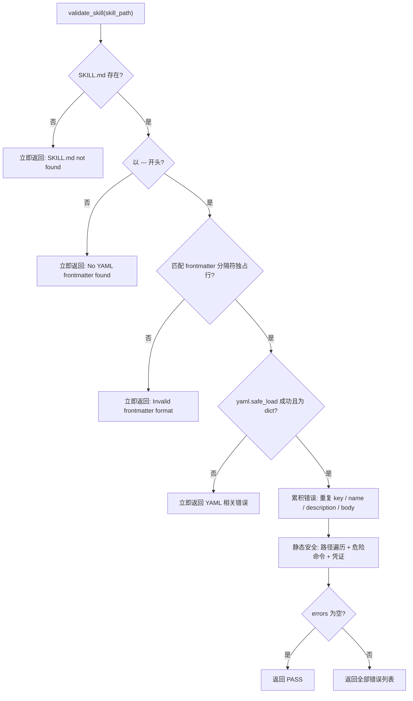

# Skill 本地校验规则（validate.py）设计说明

> **源码真源：** `jiuwenclaw/agentserver/skilldev_agent/skills/skill-verifier/scripts/validate.py`  
> **同步说明：** 本文档与上述文件保持一致；规范常量与 `jiuwenclaw/agentserver/skilldev/utils/skill_md_validation.py` 注释要求对齐，但 validate.py 覆盖范围更广（含目录名校验与 `scripts/**` 安全扫描）。

---

## 1. 定位

`validate.py` 是 Skill 本地**规范 + 静态安全**校验的单一真源，替代原先分散在三处的校验逻辑：

- `skill-creator/scripts/quick_validate.py`
- `skill-standardizer/validate.py`
- `direct_import.py` 内联校验

模块 docstring 声明采用「**字符 + token 双限**」（dual-limit policy）；当前代码中 token 上限校验被注释，**实际生效的是字符/行数限制**（见 §3.5）。

### 1.1 公开 API

| 符号 | 签名 / 行为 |
|------|-------------|
| `validate_skill(skill_path)` | `(bool, str)` — 对技能根目录执行全部校验；失败时返回 bullet 列表 |
| `find_skill_root(skill_dir)` | `Path \| None` — 在 `<workspace>/skill/` 下定位含 `SKILL.md` 的根目录 |
| `main(argv)` | CLI 入口，exit code 见 §1.3 |

### 1.2 调用方式

```bash
python3 -m scripts.validate <workspace>
```

执行路径：`<workspace>/skill/` → `find_skill_root()` → `validate_skill(skill_root)`。

### 1.3 CLI 退出码

| 码 | 含义 |
|----|------|
| `0` | 校验通过（打印 `Validation passed.`） |
| `1` | 找不到 skill 根目录，或 `validate_skill` 失败 |
| `2` | 参数错误（用法：`python3 -m scripts.validate <workspace>`） |

### 1.4 返回值格式

- 成功：`(True, "Skill is valid!")`
- 失败：`(False, "- 错误1\n- 错误2\n...")` — **一次性收集全部错误**，便于一次修复

---

## 2. 校验流程概览



### 2.1 错误收集策略

| 阶段 | 行为 |
|------|------|
| **致命错误（立即返回，不继续）** | `SKILL.md` 不存在；`SKILL.md` 不是 UTF-8/UTF-8 BOM；缺少起始 `---`；frontmatter 未按独占行分隔符闭合；YAML 解析失败；frontmatter 非 dict |
| **可累积错误（继续收集）** | 重复 key；`name` / `description` / body 规范违规；全部静态安全项 |

### 2.2 校验大类

| 类别 | 扫描范围 | 说明 |
|------|----------|------|
| **结构/规范** | `SKILL.md` | frontmatter 格式、必填字段、命名与长度限制 |
| **静态安全** | `SKILL.md` + `scripts/**` | 路径遍历、危险命令（仅 scripts）、硬编码凭证 |

扫描支持 **UTF-8** 与 **UTF-8 with BOM**。`scripts/**` 下含 NUL 字节的文件视为二进制并跳过；其他无法按 UTF-8/UTF-8 BOM 解码的文件会作为非 UTF-8 文本报错。

---

## 3. 结构 / 规范校验

### 3.1 文件与 Frontmatter

| 校验项 | 规则 | 失败消息 / 行为 |
|--------|------|-----------------|
| `SKILL.md` 存在 | 技能根目录下必须有该文件 | `SKILL.md not found`（立即返回） |
| `SKILL.md` 编码 | 必须为 UTF-8 或 UTF-8 with BOM | `SKILL.md must be UTF-8 encoded`（立即返回） |
| 起始分隔符 | `content.startswith("---")` | `No YAML frontmatter found`（立即返回） |
| 闭合格式 | 正则 `^---[ \t]*\r?\n(.*?)\r?\n---[ \t]*(?:\r?\n\|$)`（`re.DOTALL`） | `Invalid frontmatter format`（立即返回） |
| YAML 解析 | `yaml.safe_load(frontmatter_text)` | `Invalid YAML in frontmatter: ...`（立即返回） |
| 类型 | 解析结果必须为 `dict` | `Frontmatter must be a YAML dictionary`（立即返回） |
| 重复 key | 逐行匹配 `^([A-Za-z0-9_-]+)\s*:`，检测文本层重复 | `Duplicate key in SKILL.md frontmatter: {key}` |
| 必填字段 | 必须存在 `name`、`description` | `Missing 'name'/'description' in frontmatter` |

**Frontmatter 格式注意：** 起始和闭合 `---` 分隔符必须独占一行，允许行尾空格/Tab，支持 Unix `\n` 与 Windows `\r\n`。`UTF-8 with BOM` 会在读取时自动移除，不影响 `content.startswith("---")`。

**Frontmatter 白名单（当前未启用）**

```python
ALLOWED_FRONTMATTER_KEYS = {
    "name", "description", "license",
    "allowed-tools", "metadata", "compatibility",
}
```

对应校验（`unexpected = set(frontmatter.keys()) - ALLOWED_FRONTMATTER_KEYS`）已被注释，**不会因额外 key 失败**。

### 3.2 `name` 字段

| 规则 | 限制 | 失败消息 |
|------|------|----------|
| 类型 | 必须是 `str` | `Name must be a string, got {type}` |
| 非空 | `.strip()` 后不能为空 | `Name cannot be empty` |
| kebab-case | 仅 `[a-z0-9-]+` | `Name '{name}' should be kebab-case ...` |
| 连字符 | 不能以 `-` 开头/结尾，不能含 `--` | `Name '{name}' cannot start/end with hyphen ...` |
| 长度 | ≤ **64** 字符 | `Name is too long ({n} characters). Maximum is 64 characters.` |
| 目录一致 | `name == skill_path.name` | `Name '{name}' must match directory name '{dir}'` |

> **与 framework 层差异：** `skilldev/utils/skill_md_validation.py` 的 `validate_skill_md_content()` 仅校验文件内容，**不包含**「name 与目录名一致」检查。

### 3.3 `description` 字段

| 规则 | 限制 | 失败消息 |
|------|------|----------|
| 类型 | 必须是 `str` | `Description must be a string, got {type}` |
| 非空 | `.strip()` 后不能为空 | `Description cannot be empty` |
| 字符上限 | 含 CJK：≤ **512**；否则 ≤ **1024** | `Description is too long ({n} characters). Maximum is {max} characters.` |

CJK 判定（`_contains_cjk`）：存在字符 `\u4e00` ≤ char ≤ `\u9fff`。

**Token 上限（当前未启用，代码已注释）**

```python
DESCRIPTION_MAX_TOKENS = 300
# desc_tokens = _estimate_tokens(description)
# if desc_tokens > DESCRIPTION_MAX_TOKENS: ...
```

### 3.4 `SKILL.md` 正文（body）

frontmatter 闭合 `---` 之后、经 `.lstrip("\n")` 处理的内容。

| 规则 | 限制 | 失败消息 |
|------|------|----------|
| 非空 | `.strip()` 后不能为空 | `SKILL.md body cannot be empty` |
| 行数 | ≤ **500** 行（`len(body.splitlines())`） | `SKILL.md body is too long ({n} lines). Maximum is 500 lines.` |

**Token 上限（当前未启用，代码已注释）**

```python
BODY_MAX_TOKENS = 5000
# body_tokens = _estimate_tokens(body)
# if body_tokens > BODY_MAX_TOKENS: ...
```

### 3.5 双限策略与 token 估算

`_estimate_tokens(text)` 已实现但未被校验逻辑调用：

| 文本类型 | 估算系数 |
|----------|----------|
| 含 CJK | **0.6** token / 字符 |
| 不含 CJK | **0.3** token / 字符 |

结果：`ceil(len(text) * factor)`。

**当前实际生效：** 字符数（description）、行数（body）、name 长度；token 双限尚未落地。

---

## 4. 静态安全校验

由 `_validate_static_security_all(skill_path, skill_content)` 执行。

### 4.1 扫描范围

| 检查类型 | 函数 / 范围 | 扫描文件 |
|----------|-------------|----------|
| 路径遍历 | `_iter_scannable_files` | `SKILL.md` + `scripts/**` UTF-8 / UTF-8 BOM 文本 |
| 危险命令 | `_iter_scannable_files` 中的脚本文本 | **仅** `scripts/**`（不含 `SKILL.md`） |
| 硬编码凭证 | `_iter_scannable_files` | `SKILL.md` + `scripts/**` UTF-8 / UTF-8 BOM 文本 |

`_iter_scannable_files` 对 `SKILL.md` 使用已读入的 `skill_content`，避免重复 IO；`scripts/**` 只读取一次，供危险命令与凭证扫描复用。

### 4.1.1 编码处理

- `SKILL.md` 使用 UTF-8/UTF-8 BOM 读取；无法解码时立即失败：`SKILL.md must be UTF-8 encoded`。
- `scripts/**` 使用 UTF-8/UTF-8 BOM 读取；含 NUL 字节的文件视为二进制并跳过。
- `scripts/**` 中不含 NUL 字节但无法 UTF-8 解码的文件视为非 UTF-8 文本并报错：

```
Non-UTF-8 text file detected: {rel}. Use UTF-8 or UTF-8 with BOM.
```

### 4.2 路径遍历

对 scannable 文件计算 `file_path.relative_to(skill_path)`，若 `rel.parts` 含 `".."`：

```
Path traversal detected: {rel}
```

### 4.3 危险命令模式（`DANGEROUS_PATTERNS`，共 13 条）

在 `scripts/**` 中**逐行**匹配；一行命中多条则产生多条错误。

| # | 标签 | 匹配意图 |
|---|------|----------|
| 1 | `forced recursive deletion` | `\brm\b` + 同行内 `-rf` 变体（`-[a-z]*r[a-z]*f[a-z]*`） |
| 2 | `world-writable permissions` | `\bchmod\b` + 同行 `777` |
| 3 | `setuid bit modification` | `\bchmod\b` + 同行 `u+s` |
| 4 | `piped remote shell execution` | `curl/wget/fetch` \| `bash/sh/zsh/dash/ash/source` |
| 5 | `piped remote powershell execution` | `iwr/irm/Invoke-WebRequest/Invoke-RestMethod` \| `iex/Invoke-Expression` |
| 6 | `base64 decode then execute` | `base64 -d/--decode` \| shell |
| 7 | `certutil decode (potentially obfuscated payload)` | `certutil -decode` |
| 8 | `powershell encoded command` | `-EncodedCommand` 或 `-Enc` / `-enc` |
| 9 | `powershell base64 decode` | `[Convert]::FromBase64String(` |
| 10 | `dynamic eval execution` | `eval(` |
| 11 | `dynamic exec execution` | `exec(` |
| 12 | `os.system execution` | `os.system(` |
| 13 | `subprocess shell=True execution` | `subprocess.call/run/Popen` + 同行 `shell=True` |

错误格式：

```
Security check failed in {rel}:{line_no}: prohibited command pattern `{label}`
```

### 4.4 硬编码凭证（`CREDENTIAL_PATTERNS`，共 9 条）

在 `SKILL.md` 与 `scripts/**` 中逐行匹配。每条为 `(pattern, label, value_group)`：

| 标签 | 模式概要 | value_group |
|------|----------|-------------|
| `aws_access_key_id` | `\bAKIA[0-9A-Z]{16}\b` | `None`（整段匹配做占位符判断） |
| `openai_api_key` | `\bsk-[A-Za-z0-9_-]{20,}\b` | `None` |
| `anthropic_api_key` | `\bsk-ant-[A-Za-z0-9_-]{20,}\b` | `None` |
| `github_token` | `\bgh[pousu]_[A-Za-z0-9]{36}\b` | `None` |
| `private_key` | `-----BEGIN (RSA \|EC \|DSA )?PRIVATE KEY-----` | `None` |
| `db_url_with_credentials` | `(postgresql\|mongodb\|mysql\|redis)://user:pass@...` | `None` |
| `jwt_token` | `eyJ...` 三段 JWT | `None` |
| `password_assignment` | `password := ...`（值 ≥ 6 字符） | 命名组 `val` |
| `generic_secret_assignment` | `api_key/secret/token/password/credential := ...`（值 ≥ 12 字符） | 命名组 `val` |

占位符过滤逻辑：

- `value_group` 为 `str`：取 `m.groupdict()[value_group]`
- `value_group` 为 `int`：取 `m.group(value_group)`
- `value_group` 为 `None`：取 `m.group(0)` 整段匹配

若提取值经 `_is_placeholder()` 判定为模板值，**跳过**该命中。

错误格式：

```
Security check failed in {rel}:{line_no}: possible hardcoded credential (`{label}`)
```

### 4.5 占位符豁免（`_is_placeholder`）

`_PLACEHOLDER_SUBSTRINGS`：

```
your_, example, sample, placeholder, enter_, insert_, replace_, env_
```

以下情况视为占位符（不报凭证错误）：

| 条件 | 示例 |
|------|------|
| 空 / 仅空白 | `""` |
| `${...}` | `${API_KEY}` |
| `$ENV` 形 | `$MY_VAR` |
| `<...>` | `<your-api-key>` |
| 去引号后为空 | `""` / `''` |
| 含上述子串（小写） | `your_api_key` |
| 以 `your` 开头 | `your-key-here` |
| 仅 `x` 重复 ≥6 | `xxxxxx` |
| 仅 `*` 重复 ≥6 | `******` |
| 假 OpenAI key | `sk-XXXXXX`（X/x ≥6） |

---

## 5. `find_skill_root` 解析规则

在 `<workspace>/skill/`（即 CLI 传入的 `workspace / "skill"`）下定位技能根目录：

```
1. skill_dir 不是目录 → None
2. skill_dir/SKILL.md 存在 → 返回 skill_dir
3. 统计直接子目录中含 SKILL.md 的目录：
   - 恰好 1 个 → 返回该子目录
   - 多于 1 个 → logger.warning + 返回 None（歧义）
4. skill_dir.rglob("SKILL.md") → 返回第一个 SKILL.md 的 parent
5. 均未命中 → None
```

CLI 在步骤 4/5 失败时输出：`Validation failed: cannot find skill root under <workspace>/skill/`。

---

## 6. 辅助函数

| 函数 | 作用 |
|------|------|
| `validate_skill(skill_path)` | 主校验入口 |
| `find_skill_root(skill_dir)` | 定位 skill 根目录（§5） |
| `_validate_static_security_all()` | 静态安全，返回 `list[str]` |
| `_iter_scannable_files(skill_path, skill_content)` | `SKILL.md` + `scripts/**` UTF-8 / UTF-8 BOM 文本，并返回解码错误 |
| `_read_utf8_text(path)` | 读取 UTF-8 / UTF-8 BOM 文本；含 NUL 字节时标记为二进制 |
| `_contains_cjk(text)` | CJK 字符检测 |
| `_estimate_tokens(text)` | token 估算（当前未接入校验） |
| `_find_duplicate_frontmatter_key(text)` | frontmatter 文本层重复 key |
| `_is_placeholder(value)` | 凭证占位符豁免 |

---

## 7. 与校验闸门的关系

本地 `validate` 是 `skill-verifier` 闸门的第一道关卡（见 `skill-verifier-gate-design.md`）：

```
validate（本地）→ package → upload → safety_scan（远程风控）
     ↑
  失败则短路，不进入后续步骤
```

本文件规则仅覆盖 **validate 阶段**；远程 `safety_scan` 不在 `validate.py` 范围内。

---

## 8. 与 skilldev framework 层的关系

Agent 侧 `validate.py` 与 Server 侧 `skilldev/utils/skill_md_validation.py` 共享同一套**规范常量**与 frontmatter 规则，但职责不同：

| 维度 | `validate.py`（agent / verifier） | `skill_md_validation.py`（file.write 护栏） |
|------|-----------------------------------|---------------------------------------------|
| 输入 | 技能根目录 `Path` | `SKILL.md` 字符串 |
| 输出 | `(bool, 人类可读错误列表)` | 首个 `error_codes` 错误码 |
| name 与目录名 | **校验** | 不校验 |
| `scripts/**` 危险命令 | **校验** | 不校验 |
| SKILL.md 凭证 | **校验** | **校验** |
| scripts 凭证 | **校验** | 不校验（仅 content 参数） |
| 错误收集 | 全部错误一次返回 | 命中集合后取 `min(error_code)` |

Server 侧错误码定义见 `skilldev/error_codes.py`（`999001260`–`999001276` 为 SKILL.md；`999001280`–`999001284` 为 scripts 安全，供 framework 扩展使用）。

---

## 9. 常量速查

| 常量 | 值 | 生效状态 |
|------|-----|----------|
| `DESCRIPTION_MAX_CHARS_CJK` | 512 | ✅ |
| `DESCRIPTION_MAX_CHARS_EN` | 1024 | ✅ |
| `DESCRIPTION_MAX_TOKENS` | 300 | ❌（已注释） |
| `BODY_MAX_LINES` | 500 | ✅ |
| `BODY_MAX_TOKENS` | 5000 | ❌（已注释） |
| name 最大长度 | 64 | ✅ |
| `DANGEROUS_PATTERNS` | 13 条 | ✅ |
| `CREDENTIAL_PATTERNS` | 9 条 | ✅ |

---

## 10. 相关文档

| 文档 | 说明 |
|------|------|
| `skill-verifier-gate-design.md` | 闸门整体架构与三种调用 |
| `static-evaluation-design.md` | 静态评估（质量维度，与本地 validate 互补） |
| `skilldev/error_codes.py` | file.write / SKILL.md / scripts 错误码 |
