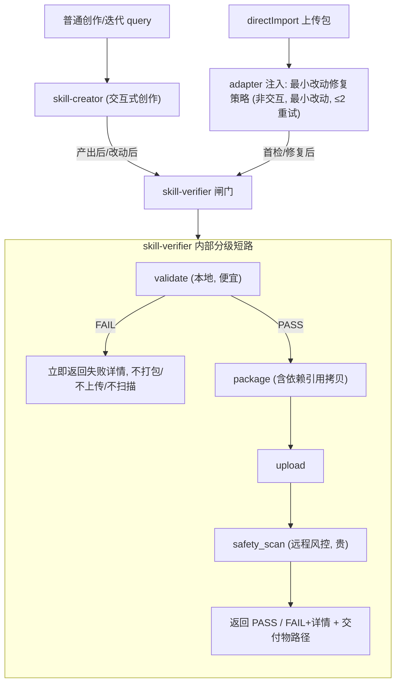

# Skill 校验闸门（skill-verifier）重构设计方案

## 背景与目标

当前 SkillDev Agent 提供两项核心能力：

1. **从 0 创建** 一个符合规范、通过风控的 skill（`skill-creator`）。
2. **解析用户上传的 skill**，使其符合规范、通过风控（`skill-standardizer`）。

其中：

- **规范校验**：直接检查生成的 skill 文件即可（本地、便宜）。
- **风控校验**：需要先把 skill 打包，上传到平台，再调用平台风控脚本（远程、昂贵）。

现有实现存在两个缺口：

1. `skill-creator` **未集成风控**——它只有本地校验 + 打包，目录里根本没有 `safety_scan` / `upload_skill`，从 0 创建的 skill 永远不过风控。
2. **首阶段（生成/解析）完成后，用户继续要求改动 skill 时，没有重新打包 + 风控校验的设计**。

本方案重构整个校验体系，统一两条链路的"校验闸门"，补齐上述缺口。

---

## 核心问题分析

把"检查是否可上架"这件事拆开看，存在 **3 个正交关注点**：

| 关注点 | 性质 | 当前归属 |
|--------|------|---------|
| **校验闸门** `validate→package→upload→safety_scan` | 确定性、脚本化、可复用 | 绑死在 standardizer |
| **创作上下文的修复** | 交互式、开放式（可自由重写） | skill-creator |
| **导入上下文的修复** | 非交互、最小改动（保语义） | skill-standardizer |

关键结论：

- **校验闸门对"从 0 创建"和"上传规范化"是完全相同的流水线**，唯一差异在前置的创作/改造阶段。把闸门绑死在 standardizer 是两个缺口的根因。
- **导入 vs 创作的修复差异只是"操作策略"**（非交互+最小改动 vs 交互+开放），不是必须独立成 skill 的理由。该策略最自然的归宿是 **adapter 给 directImport 注入的 query 模板**（本就按需加载，且 adapter 已在为导入注入专用 query）。
- 当前还存在**三套规则不一致的本地校验器**（`skill-creator/quick_validate.py`、`skill-standardizer/validate.py`、`direct_import.py` 内联基于 token 的校验），是重复带来的漂移。

---

## 目标架构



### 设计决策

1. **抽出 `skill-verifier`（纯确定性闸门原语）**：独占唯一一套 `validate / package / upload / safety_scan`，内部分级短路，对外提供三种调用。这是唯一的硬约束。
2. **删除 `skill-standardizer`**：导入修复策略转由 adapter 注入 query 承载。
3. **`skill-creator` 创作职责不变**，只把校验/打包改为调用 verifier。
4. **导入路径不加载 creator 工作流**（避免误用"自由重写"），用 `verifier 闸门 + 注入的最小改动修复策略`。
5. **共享的"skill 结构规范 + description 上限规则"抽到 `skill-verifier/references`**，creator 与导入修复都引用，做到规则单一真源。

---

## skill-verifier 详细设计

### 三种调用

| 命令 | 作用 | 使用场景 |
|------|------|---------|
| `python3 -m scripts.validate <workspace>` | 仅本地规范校验，不打包/不扫描 | 修复子循环里反复快速校验、可选功能过程中的护栏 |
| `python3 -m scripts.safety_scan <skill-name> <url>` | 对已有 url 直接风控扫描 | directImport **首检**复用用户上传包 url（省一次上传） |
| `python3 -m scripts.gate <workspace>` | 完整闸门：validate 短路 → package → upload → safety_scan | 规范稳定后的终检，产出交付物 |

### 内部分级短路（关键）

完整闸门**不是无脑顺序执行的原子操作**，而是分级短路：

```
1. validate（本地、便宜）
   └─ 失败 → 立刻返回失败详情，不打包、不上传、不扫描
2. validate 通过 → package（含依赖引用拷贝、排除 *.bak-*）
3. package 通过 → upload
4. → safety_scan（远程、贵）
   └─ 返回 PASS / FAIL+详情 + 交付物路径
```

这样规范没过的中间改动只付出一次本地 `validate` 的成本，行为等价于现状的"先改到规范通过再打包风控"。

### 校验规则单一真源

- 以 verifier 的 `validate` 为唯一真源，替代并删除现存三套校验器。
- 口径统一：采用"**字符 + token 双限**"的较严口径。
  - 现状 `validate.py`：字符制（description CJK≤512 / 其他≤1024、正文≤500 行）。
  - 现状 `direct_import.py`：token 制（description≤300 token、正文≤5000 token、CJK≤256 字）。
- `package` 必须包含 `package_skill.py` 的 `copy_dependency_references`（standardizer 旧 `package.py` 缺该步）。
- 结构规范知识、description 上限规则抽到 `skill-verifier/references`，供 creator 与导入修复引用。

---

## 再校验策略（保证后续改动不绕过风控）

- **每次改动后立即跑 `validate`**（便宜，给即时反馈）。
- **改动会使上一次闸门结果失效**：任何文件改动后，要产出可交付物 / 宣告可上架，**必须重新跑完整闸门并通过**。
- 因短路存在，规范没过的中间改动不会触发打包/上传/远程扫描。
- 效果：既保证"后续改动绝不绕过风控"（交付物恒以一次新鲜的完整闸门通过为前提），又避免每次编辑都远程扫描的浪费。

---

## 三条链路的工作流

### 1. 普通创作 / 迭代

```
捕获意图 → 编写 skill 文件 → 产出后跑 verifier 完整闸门 → 交付物
改动后：先 validate；产出交付物时重跑完整闸门
失败修复：交互式、开放式（可追问、可重构）
```

### 2. directImport 上传包规范化

```
adapter 解压 → 注入 query（引导 verifier 闸门 + 最小改动修复策略）
首检：validate + safety_scan(导入包 url)
  ├─ 两项均通过 → package → 交付物
  └─ 任一不通过 → 非交互最小改动 reshape → 重新打包上传 → 重扫
      重试 ≤2 次，超过则停止并告知用户
修复契约：非交互（除首次失败外不问用户）、最小改动、保语义、禁子代理
```

### 3. 可选功能（评测 / 描述优化）与闸门衔接

两个 opt-in 流程都在"最终交付前"运行，对文件影响不同：

- **评测**（`references/evaluation.md`）：真实改动 skill 文件（按 benchmark 迭代改 body/scripts），产物在 `evals/`（skill 目录外，不进包）。
- **描述优化**（`references/description-optimization.md`）：循环中仅临时原地改 `description` 再 teardown 还原；**唯一持久改动**是 Step 4 用户批准后写回的获胜描述。

整合流程（同时要求两者时）：

```
1. 捕获意图 → 起草 skill
2. [可选·评测] 用例→确认→运行→评分→benchmark→改 skill→迭代  (期间仅用 validate 护栏)
3. [可选·描述优化] 在 skill 主体稳定后(评测之后)进行；Step4 批准后写回获胜 description
4. ★ 终检：verifier 完整闸门 → 交付物
5. 之后再改动 → 交付物失效，重跑闸门
```

衔接规则：

1. **完整闸门只在所有改文件工作结束后跑一次**；评测每轮、描述优化循环都只用 `validate` 护栏。
2. **顺序：评测在前、描述优化在后**（描述须反映最终行为）。
3. **绝不在描述优化"原地临时改 description"窗口内跑闸门**；须等 teardown + 应用获胜描述之后。
4. **描述优化候选必须遵守 verifier 的 description 规则**，避免选出在终检 validate 反而不合规的获胜描述。
5. 打包排除 `*.bak-*`，避免描述优化遗留的 `SKILL.md.bak-*` 进包。

---

## 对现有内容的改动清单

### 新增

| 路径 | 内容 |
|------|------|
| `skills/skill-verifier/SKILL.md` | "对 `<workspace>/skill/` 跑校验闸门，返回 PASS/FAIL+详情；不创作、不交互"；说明三种调用与短路语义 |
| `skills/skill-verifier/scripts/validate.py` | 由 standardizer `validate.py` 迁入，作为唯一校验真源（统一字符+token 双限口径） |
| `skills/skill-verifier/scripts/package.py` | 合并 `package.py` + `package_skill.py` 的 `copy_dependency_references`，排除 `*.bak-*` |
| `skills/skill-verifier/scripts/upload_skill.py` | 由 standardizer 迁入 |
| `skills/skill-verifier/scripts/safety_scan.py` | 由 standardizer 迁入 |
| `skills/skill-verifier/scripts/gate.py` | 新增：编排 validate 短路 → package → upload → safety_scan |
| `skills/skill-verifier/scripts/__init__.py` | 新增 |
| `skills/skill-verifier/references/*.md` | skill 结构规范 + description 上限规则（单一真源） |

### 修改

| 文件 | 改动 |
|------|------|
| `skills/skill-creator/SKILL.md` | Step 3"打包"改为"调用 verifier 完整闸门"；新增"改动后须重过闸门才产出交付物"；明确可选功能衔接规则（评测在前/描述优化在后、过程用 `validate` 护栏、终检一次完整闸门、描述优化候选遵守 verifier description 规则）；结构规范与 description 规则引用改指向 `skill-verifier/references` |
| `prompts.py` | 第 0 节路由改为两类（创作→creator+闸门；directImport/规范化→verifier+注入修复策略）；第 3 节内置 Skill 路径增加 `skill-verifier`、移除 `skill-standardizer`；第 4 节去掉内联的详细 standardizer 流程，收敛为纯路由 |
| `utils/direct_import.py` | `build_direct_import_fix_query` 改为引导 verifier 闸门并内联导入修复策略；内联预校验与 verifier `validate` 口径对齐（或直接调用 verifier 的 `validate`） |
| `adapter.py` | `_handle_direct_import` 的 `combined_query` 改为引导 `skill-verifier` + 注入最小改动修复策略；首检复用导入包 url |

### 删除

| 路径 | 原因 |
|------|------|
| `skills/skill-standardizer/`（整个目录） | 闸门迁入 verifier，导入修复策略转为 adapter 注入 query |
| `skills/skill-creator/scripts/quick_validate.py` | 校验统一到 verifier |
| `skills/skill-creator/scripts/package_skill.py` | 打包统一到 verifier |

---

## 回归验证

1. **directImport**：首检（validate + scan(导入 url)）→ 失败 reshape → 重新打包上传 → 重扫，≤2 次。
2. **普通创作**：产出后过完整闸门；构造一个 validate 失败的 skill，确认**未**触发 package/upload/scan。
3. **改动后再校验**：改文件 → validate；validate 通过后产出交付物时跑完整闸门。
4. **可选功能**：分别在仅评测、仅描述优化、两者都开三种情况下，确认完整闸门只在最后跑一次、顺序正确、描述优化窗口内不跑闸门。
