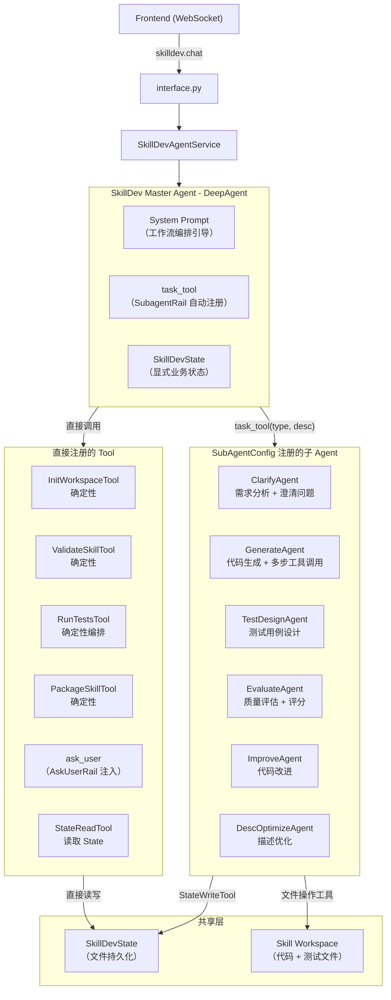

# SkillDev Agent 化改造设计报告

> 版本：v2.0  
> 日期：2026-05-12  
> 状态：评审稿（修正 SubAgent 可行性评估，提出混合架构）

---

## 1. 背景与目标

### 1.1 现状

SkillDev 当前采用**确定性状态机**（Pipeline + StageHandler）架构，通过硬编码的阶段顺序驱动 Skill 创建流程。核心编排逻辑在 `pipeline.py` 的 `STAGE_HANDLERS` 映射和 `run()`/`resume()` 循环中。

```
INIT → CLARIFY → [挂起:QUESTION_CLARIFY] → GENERATE → VALIDATE
  → [挂起:SKIP_TESTS_CONFIRM] → TEST_DESIGN → TEST_RUN → EVALUATE
  → [挂起:REVIEW] → IMPROVE → (回到TEST_RUN)
  → [挂起:DESC_OPTIMIZE_CONFIRM] → DESC_OPTIMIZE → PACKAGE → COMPLETED
```

**优势：** 流程确定性强、状态可持久化（checkpoint）、挂起/恢复可靠。

**不足：** 流程固化、无法根据上下文动态调整、用户交互受限于预定义挂起点、不支持自由对话式交互。

### 1.2 改造目标

将 SkillDev 改造为 **Agent 驱动的编排架构**：主 Agent 接收用户指令，通过工具和子代理完成 Skill 创建全流程。Agent 可以根据上下文动态决策，支持对话式交互。

---

## 2. 框架能力审计

在设计目标架构前，需要对 openjiuwen Agent 框架的关键能力做准确评估。

### 2.1 SubAgentConfig + SubagentRail + TaskTool 机制

**可用性确认：** `openjiuwen.harness.tools.task_tool` 模块**已可用**，`create_task_tool()` 和 `TaskTool` 类完整实现（171 行）。`SubagentRail` 在 `init()` 时调用 `create_task_tool()` 注册 `task_tool` 到主 Agent，框架原生的 SubAgent 委派链路**完整可用**。

**完整链路：**

```
SubagentRail.init(agent)
  → create_task_tool(parent_agent, available_agents_desc)
  → 注册 TaskTool 到 Runner.resource_mgr + agent.ability_manager
  
主 Agent LLM 调用 task_tool(subagent_type="xxx", task_description="...")
  → TaskTool.invoke()
    → parent_agent.create_subagent(type, sub_session_id)
      → _find_subagent_spec(type)  # 按 agent_card.name 匹配
      → 根据 spec 构建 DeepAgent 实例
    → subagent.invoke({"query": task_description, "conversation_id": sub_session_id})
    → 返回 ToolOutput(data={"output": result["output"]})
```

**SubAgentConfig 配置能力（完整）：**

| 字段 | 说明 | SkillDev 适用性 |
|------|------|----------------|
| `agent_card` | AgentCard（name + description） | 各阶段名称和描述 |
| `system_prompt` | 子 Agent 系统提示词 | 各阶段专属 prompt |
| `tools` | `List[Tool \| ToolCard]` | 阶段专属工具 + 共享 State 工具 |
| `mcps` | MCP 服务配置 | 按需 |
| `model` | 可覆盖父 Agent 模型 | 不同阶段可用不同模型 |
| `rails` | 自定义 Rail 列表 | 事件转发 Rail 等 |
| **`workspace`** | **可显式指定 Workspace** | **✅ 共享 Skill 工作区** |
| `enable_task_loop` | 外层任务循环 | GENERATE/IMPROVE 可启用 |
| `max_iterations` | ReAct 迭代上限 | 各阶段独立配置 |
| `factory_name` | 工厂模式（browser/code/research） | 可扩展自定义工厂 |
| `factory_kwargs` | 工厂参数 | — |

**`create_subagent` 关键行为：**
1. **工作区处理：** 如果 `spec.workspace is not None`，直接使用 `spec.workspace`；否则在父工作区下创建 `/{sub_session_id}` 子目录。**这意味着只要在 SubAgentConfig 中显式设置 workspace，子 Agent 可以与父 Agent 共享同一工作区。**
2. **工具隔离：** 子 Agent 的 AbilityManager 完全由 `spec.tools` 决定，**不继承父 Agent 工具**
3. **无嵌套子代理：** `subagents=None, enable_async_subagent=False`
4. **工厂分派：** `factory_name` 支持 `browser_agent`/`code_agent`/`research_agent`，可扩展

**数据传递约束（仍然存在但可绕过）：**
- TaskTool 输入仅为 `task_description`（自然语言文本）
- TaskTool 输出仅为 `result["output"]`（字符串）
- **绕过方案：** 为子 Agent 注册 `SkillDevStateReadTool` / `SkillDevStateWriteTool`，子 Agent 通过工具调用读写共享的 `SkillDevState`

**JiuWenClaw 产品使用现状：**
- 主 Agent 层面已用自定义 `spawn_subagent`/`fork_agent`（`ForkAgentExecutor`）替代 SubagentRail
- 代码注释："已使用subagent tool替代subagent rail"，SubagentRail 被构建后立即 unregister
- `spawn_subagent` 特点：共享父工作区、继承父工具（排除列表过滤）、隔离上下文、SessionProxy 事件转发
- `fork_agent` 特点：共享父工作区、继承父消息历史（KVCache 复用）

**综合评估：** SubAgentConfig 机制**完整可用**，workspace 隔离问题通过显式配置可解决，数据传递限制可通过共享 State 工具绕过。SubAgent 方案在 SkillDev 场景下**可行**。

### 2.2 AskUserRail 中断机制

**实现方式：** 基于 `BaseInterruptRail` 的工具拦截模式：
1. Agent 调用 `ask_user` 工具
2. `AskUserRail.before_tool_call()` 拦截该调用
3. 首次调用（无用户输入）：抛出 `AbortError(ToolInterruptException)`，中断 Agent 执行
4. `InterruptRequest`（含问题文本 + payload schema）被序列化推送到前端
5. 用户回答后，Agent 被 resume，`resolve_interrupt()` 收到 `user_input`，返回 `RejectResult(tool_result=answer)`
6. Agent 继续执行，`ask_user` 工具的"返回值"就是用户的回答

**评估：** 机制成熟，JiuWenClaw 产品主 Agent 已大规模使用。但 `InterruptRequest` 仅支持简单的 `message + payload_schema` 结构，不支持现有 SkillDev 的复杂结构化交互（多选题、按钮组、benchmark 展示等），**需要扩展或自定义**。

### 2.3 上下文管理与压缩

**ContextEngine** 在对话历史增长到接近窗口限制时自动触发压缩（`context.compressed` 事件）。

**框架深度审计补充（基于源码阅读）：**

**上下文窗口的多层约束：**
1. `ContextEngineConfig.max_context_message_num`：消息缓冲区硬上限，超出时 `ContextMessageBuffer._if_need_resize()` 直接丢弃较早消息
2. `default_window_message_num` / `default_window_round_num`：发给模型时的滑动窗口（轮的定义：从 user 到不再带 tool_calls 的 assistant）
3. **Processor 链触发阈值**：链 A（摘要链）中 `MessageSummaryOffloader` 60K tokens、`DialogueCompressor` 100K tokens 等；链 B（预置链）含 `ToolResultBudgetProcessor`、`MicroCompactProcessor`、`FullCompactProcessor`

**压缩行为详解：**
- `MessageSummaryOffloader`：将旧 tool 消息卸载为占位符，原文存入 `OffloadMessageBuffer`（session context state 内），可通过 `reload_original_context_messages` 回拉
- `DialogueCompressor` / `RoundLevelCompressor`：生成摘要文本替换原始 ReAct 块
- `FullCompactProcessor`：将多条消息压缩为"分析+长文摘要"单条
- **关键结论：** 摘要替换原始消息后，结构化 tool payload（如 JSON benchmark 结果）**不可逆丢失**（除非仍在 offload buffer 未超容）

**SessionMemoryManager（并行机制）：**
- 路径：`{workspace}/context/{session_id}_context/session_memory/session_context.md`
- 触发条件：首次 token ≥ 10000，之后增量 ≥ 5000 tokens 且 tool_calls 增量 ≥ 3
- 产出：**有损 Markdown 笔记**（不是原始消息 JSON），偏向任务连续性而非精确数据恢复
- 仅处理"已完成 API 轮"的上下文，避免半截 tool 轮污染笔记

**对 SkillDev 的关键约束：**
- SkillDev 全流程可能跨越 10+ 个阶段，每个阶段的 Agent/SubAgent 输出会累积到主 Agent 的对话历史
- GENERATE 阶段的输出（完整 Skill 文件集）、EVALUATE 阶段的 benchmark JSON 等结构化数据体积大
- **上下文压缩会不可逆丢失结构化中间数据**——被压缩为摘要后，后续阶段无法准确引用
- SessionMemoryManager 的 Markdown 笔记无法替代结构化 state 的精确性

### 2.4 Checkpointer 与状态恢复

Agent 框架的 `CheckpointerFactory` 支持会话级别的 checkpoint/restore。

**框架深度审计补充：**

**JiuWenClaw 产品使用 SQLite 持久化：**
- `PersistenceCheckpointerProvider` + `db_path = f"{checkpoint_path}/checkpoint"` 的 SQLite 方案
- Session state 中保存 `{"context": {各 context 的 save_state()}}` 和 `"deep_agent"` 状态
- `SessionModelContext.save_state()` 保存消息列表 + offload 消息

**DeepAgent task loop 对 SkillDev 的启示：**
- `enable_task_loop=True` 时，一次 `invoke` 内可跑多轮外层 round（`TaskLoopController` + `LoopCoordinator`）
- 循环由 `TaskCompletionRail` 停止条件、`follow_up` 队列、`task_plan` 任务列表控制
- 对 SkillDev 编排有借鉴意义：主 Agent 可利用 task loop 模式实现"阶段完成→自动进入下一阶段"的连续执行

**核心限制（仍然成立）：**
- 恢复的是**对话历史**（消息序列），不是**结构化业务状态**
- 现有 `SkillDevState` 包含 20+ 个字段的结构化数据（eval_results、feedback_history、external_tools 等），这些无法由对话历史可靠恢复
- 服务重启后，Agent 需要从对话历史"回忆"当前进度——不如显式 state 可靠

---

## 3. 方案约束分析

在确认 SubAgentConfig + TaskTool 机制完整可用的基础上，分析纯 SubAgent 方案和纯 Tool 方案各自的约束。

### 3.1 纯 SubAgent 方案的约束

**✅ 已解决的问题：**
- ~~SubAgent 委派不可用~~ → `create_task_tool` 已确认可用
- ~~工作区隔离冲突~~ → `SubAgentConfig.workspace` 可显式指定共享工作区

**仍需注意的约束：**

**a) 上下文膨胀（可控）：**
- 主 Agent prompt 需包含：工作流程描述 + 6 个 SubAgent card 描述（注入 `task_tool` 描述中）+ 确定性 Tool card
- 全流程累积的对话历史（task_tool 调用 + 返回文本）会增长
- **缓解：** SubAgent 返回摘要而非完整数据，结构化数据通过共享 State 传递

**b) 数据传递为文本中转（可绕过）：**
- TaskTool 输入/输出均为文本
- **绕过方案：** 子 Agent 通过 `SkillDevStateWriteTool` 将结构化结果写入共享 State，主 Agent 无需解析子 Agent 的文本输出中的 JSON
- 示例：ClarifyAgent 内部调用 `state_write(key="clarification_questions", value=[...])`，返回给主 Agent 的文本只是 "已生成 4 个澄清问题"

**c) 工作流确定性（需 prompt 工程 + 防护）：**
- LLM 可能不严格按顺序调用 SubAgent/Tool
- **缓解：** Tool/SubAgent 内部做前置校验 + SkillDevEventRail 在 `before_tool_call` 中校验阶段合法性

**d) 不支持子 Agent 嵌套：**
- 子 Agent 不能再创建子代理
- **影响：** TestRun 阶段如需并行执行多个测试用例，不能在 SubAgent 内部再 fork

### 3.2 纯 Tool-centric 方案的约束

**a) 自由度受限：**
- Tool 参数必须预定义，不如 SubAgent 的自然语言 task_description 灵活
- 对于开放式任务（如 GENERATE "根据需求生成 Skill 代码"），Tool 参数难以涵盖所有可能的上下文

**b) 内部 Agent 管理开销：**
- 每个 AI Tool 需自行管理内部 Agent 的创建、执行、异常处理
- 不享受框架的 SubAgent 生命周期管理（session 隔离、checkpoint、事件传播等）

**c) 不利于未来演进：**
- 随着框架 SubAgent 机制成熟，Tool-centric 方案需要大量重构才能迁移到 SubAgent

### 3.3 共性约束（两种方案都需面对）

- **Token 开销：** AI 阶段无论用 SubAgent 还是 Tool 内部 Agent，都需要 LLM 推理（与现有 `create_stage_agent` 开销持平）
- **上下文压缩丢失：** 结构化中间数据不能仅存于对话历史，需显式 State
- **用户交互复杂性：** 现有 AskUserRail 不支持 SkillDev 的富交互格式，需扩展

---

## 4. 推荐架构方案：混合架构（SubAgent + Tool + 显式状态）

### 4.1 核心思路

```
主 Agent（轻量编排，DeepAgent + SubagentRail）
  ├── SubAgent：AI 密集型阶段（通过 TaskTool 委派，框架原生机制）
  ├── Tool：确定性阶段（直接调用，无 LLM 开销）
  ├── AskUser 中断机制：与用户交互
  └── SkillDevState：显式业务状态（SubAgent 和 Tool 共享读写）
```

**核心决策：AI 密集型阶段用 SubAgent，确定性阶段用 Tool，状态管理始终为显式。**

理由：
1. SubAgent 适合开放式 AI 推理任务（Clarify、Generate、Improve 等），子 Agent 有独立上下文、独立工具集、独立迭代上限——与现有 `create_stage_agent()` 隔离模式一致
2. Tool 适合确定性操作（Init、Validate、Package 等），无需 LLM 推理，直接函数执行更快更可靠
3. `SubAgentConfig.workspace` 可显式指定共享工作区，解决隔离冲突
4. SubAgent 和 Tool 都通过 `SkillDevState` 共享结构化数据，不依赖 TaskTool 的文本传递
5. 利用框架原生 SubagentRail → TaskTool → create_subagent 链路，享受框架的 session 隔离和生命周期管理

### 4.2 阶段分类

| 阶段 | 类型 | 理由 |
|------|------|------|
| INIT | **Tool** | 纯确定性操作（创建目录、写入模板） |
| CLARIFY | **SubAgent** | 需要 LLM 分析需求、生成结构化问题 |
| GENERATE | **SubAgent** | 核心 AI 代码生成，需多步工具调用 |
| VALIDATE | **Tool** | 确定性校验（语法检查、SKILL.md 解析） |
| TEST_DESIGN | **SubAgent** | 需要 LLM 设计测试用例 |
| TEST_RUN | **Tool** | 确定性测试执行编排（parallel worker） |
| EVALUATE | **SubAgent** | 需要 LLM 分析测试结果、质量评估 |
| IMPROVE | **SubAgent** | 需要 LLM 根据反馈修改代码 |
| DESC_OPTIMIZE | **SubAgent** | 需要 LLM 优化技能描述 |
| PACKAGE | **Tool** | 确定性打包操作 |

**6 个 SubAgent + 4 个 Tool**

### 4.3 目标架构



### 4.4 数据流设计

SubAgent 和 Tool 通过 **共享 SkillDevState** 传递结构化数据，TaskTool 的文本通道仅传递摘要：

```
1. 主 Agent 调用 task_tool(subagent_type="clarify", task_description="分析用户需求: ...")
2. ClarifyAgent 执行 → 内部调用 state_write(key="clarification_questions", value=[...])
3. ClarifyAgent 返回文本摘要: "已生成 4 个澄清问题，涉及输入格式、输出要求..."
4. 主 Agent 收到摘要 → 调用 ask_user(confirm_type="question_clarify") 与用户交互
5. 用户回答后 → 主 Agent 调用 state_write(key="clarification_answers", value={...})
6. 主 Agent 调用 task_tool(subagent_type="generate", task_description="根据澄清结果生成 Skill")
7. GenerateAgent 执行 → 通过 state_read 获取完整 QA 对 → 生成代码 → 写入 State 和文件
```

**关键：** 结构化数据（questions、answers、eval_results 等）始终通过 State 传递，不依赖 TaskTool 文本解析。

### 4.5 三种方案对比

| 维度 | 纯 SubAgent | 纯 Tool-centric | **混合架构（推荐）** |
|------|------------|-----------------|-------------------|
| AI 阶段调用 | TaskTool 自然语言委派 | Tool 结构化参数 | **SubAgent（自然语言委派）** |
| 确定性阶段调用 | 也走 SubAgent（浪费） | Tool 直接调用 | **Tool 直接调用** |
| AI 推理隔离 | SubAgent 天然隔离 ✅ | Tool 内部自建 Agent | **SubAgent 天然隔离 ✅** |
| 数据传递 | 纯文本中转（有损） | 结构化参数 | **State 共享（无损）+ 文本摘要** |
| 框架利用度 | 高（原生机制） | 低（自建） | **高（原生 SubAgent + Tool）** |
| 主 Agent 上下文 | 较大（SubAgent 描述） | 较小（Tool card） | **中等（6 SubAgent + 4 Tool）** |
| 状态管理 | 对话历史（不可靠） | 显式 State | **显式 State ✅** |
| 未来演进性 | 天然支持 | 需重构 | **天然支持 ✅** |

---

## 5. 详细设计

### 5.1 SkillDev Master Agent

**职责：** 轻量级工作流编排。根据用户指令和当前状态，决定调用哪个 SubAgent/Tool、如何处理返回值、何时与用户交互。

**构建方式：**
```python
def create_skilldev_master_agent(
    model: Model,
    state: SkillDevState,
    workspace_path: str,
    deps: SkillDevDeps,
) -> DeepAgent:
    workspace = Workspace(root_path=workspace_path)
    
    # 共享 State 工具（注册到子 Agent 使用）
    state_read_tool = SkillDevStateReadTool(state)
    state_write_tool = SkillDevStateWriteTool(state)
    shared_state_tools = [state_read_tool, state_write_tool]
    
    # 确定性 Tool（直接注册到主 Agent）
    direct_tools = [
        InitWorkspaceTool(state, workspace_path, deps),
        ValidateSkillTool(state, workspace_path),
        RunTestsTool(state, workspace_path, deps),
        PackageSkillTool(state, workspace_path),
        state_read_tool,  # 主 Agent 也可读 State
    ]
    
    # SubAgent 配置（AI 密集型阶段）
    subagents = [
        build_clarify_subagent_config(model, workspace, shared_state_tools, deps),
        build_generate_subagent_config(model, workspace, shared_state_tools, deps),
        build_test_design_subagent_config(model, workspace, shared_state_tools, deps),
        build_evaluate_subagent_config(model, workspace, shared_state_tools, deps),
        build_improve_subagent_config(model, workspace, shared_state_tools, deps),
        build_desc_optimize_subagent_config(model, workspace, shared_state_tools, deps),
    ]
    
    rails = [
        AskUserRail(),                # ask_user 中断机制（扩展版）
        SkillDevEventRail(state),     # 事件转换
    ]
    
    return create_deep_agent(
        model=model,
        card=AgentCard(
            name="skilldev_master",
            description="SkillDev 主编排 Agent，负责驱动 Skill 创建全流程",
        ),
        system_prompt=MASTER_SYSTEM_PROMPT.format(
            workspace=workspace_path,
            state_summary=state.to_status_dict(),
        ),
        tools=direct_tools,
        subagents=subagents,         # SubagentRail 自动注册 task_tool
        rails=rails,
        max_iterations=80,
        workspace=workspace,
        enable_task_loop=True,        # 支持多步连续执行
    )
```

**System Prompt 设计原则：**
- 描述完整工作流步骤和各 SubAgent/Tool 的调用时机
- 注入当前 `SkillDevState` 摘要（断点续传时恢复进度）
- 明确 SubAgent 通过 `task_tool` 调用，确定性操作通过直接 Tool 调用
- 强调结构化数据通过 State 传递（SubAgent 内部会写入 State）
- 使用 few-shot 示例引导正确的调用顺序

### 5.2 SubAgent 配置模式

每个 AI SubAgent 遵循统一配置模式：

```python
def build_clarify_subagent_config(
    model: Model,
    workspace: Workspace,
    shared_state_tools: list[Tool],
    deps: SkillDevDeps,
) -> SubAgentConfig:
    # 阶段专属工具 + 共享 State 工具
    stage_tools = [
        *shared_state_tools,                    # state_read + state_write
        *get_clarify_stage_tools(deps),         # 阶段特定工具（如有）
    ]
    
    return SubAgentConfig(
        agent_card=AgentCard(
            name="clarify_agent",               # TaskTool 通过此 name 匹配
            description="分析用户的 Skill 创建需求，生成结构化澄清问题",
        ),
        system_prompt=CLARIFY_AGENT_PROMPT,     # 复用/改进现有 clarify_stage 的 prompt
        tools=stage_tools,
        model=model,                            # 可按阶段选用不同模型
        workspace=workspace,                    # ⚠️ 关键：显式指定共享工作区
        enable_task_loop=False,                 # 单轮执行足够
        max_iterations=15,                      # 阶段级迭代上限
    )
```

**SubAgent 内部执行流程（以 ClarifyAgent 为例）：**
```
1. 收到 task_description: "分析用户需求: 帮我创建一个搜索 arXiv 的 Skill"
2. 通过 state_read(key="user_query") 获取完整需求上下文
3. LLM 推理 → 生成澄清问题列表
4. 调用 state_write(key="clarification_questions", value=[...]) 写入 State
5. 返回文本摘要: "已生成 4 个澄清问题"
```

### 5.3 确定性 Tool 设计模式

确定性 Tool 直接操作 State 和文件系统，无 LLM 推理：

```python
class InitWorkspaceTool(Tool):
    def __init__(self, state: SkillDevState, workspace_path: str, deps: SkillDevDeps):
        super().__init__(ToolCard(
            name="init_workspace",
            description="初始化 Skill 工作区（创建目录结构、写入初始模板）",
            parameters={...},
        ))
        self._state = state
        self._workspace_path = workspace_path
        self._deps = deps
    
    async def invoke(self, inputs, **kwargs) -> ToolOutput:
        # 确定性操作：创建目录、写文件、更新 State
        # 复用现有 InitStageHandler 的核心逻辑
        ...
        self._state.stage = SkillDevStage.CLARIFY
        return ToolOutput(success=True, data={"workspace": str(workspace_path)})
```

### 5.4 共享 State 工具

```python
class SkillDevStateReadTool(Tool):
    """允许 SubAgent 和主 Agent 读取 SkillDevState 的指定字段。"""
    
    def __init__(self, state: SkillDevState):
        super().__init__(ToolCard(
            name="state_read",
            description="读取 SkillDev 任务状态的指定字段",
            parameters={
                "type": "object",
                "properties": {
                    "keys": {
                        "type": "array",
                        "items": {"type": "string"},
                        "description": "要读取的字段名列表",
                    }
                },
                "required": ["keys"],
            },
        ))
        self._state = state
    
    async def invoke(self, inputs, **kwargs) -> ToolOutput:
        keys = inputs.get("keys", [])
        result = {}
        for key in keys:
            if hasattr(self._state, key):
                result[key] = getattr(self._state, key)
        return ToolOutput(success=True, data=result)


class SkillDevStateWriteTool(Tool):
    """允许 SubAgent 将结构化结果写入 SkillDevState。"""
    
    def __init__(self, state: SkillDevState):
        super().__init__(ToolCard(
            name="state_write",
            description="将阶段执行结果写入 SkillDev 任务状态",
            parameters={
                "type": "object",
                "properties": {
                    "key": {"type": "string", "description": "字段名"},
                    "value": {"description": "字段值（JSON 兼容类型）"},
                },
                "required": ["key", "value"],
            },
        ))
        self._state = state
    
    async def invoke(self, inputs, **kwargs) -> ToolOutput:
        key = inputs.get("key")
        value = inputs.get("value")
        if hasattr(self._state, key):
            setattr(self._state, key, value)
            return ToolOutput(success=True, data={"updated": key})
        return ToolOutput(success=False, error=f"Unknown state field: {key}")
```

**设计要点：**
- `SkillDevState` 对象在主 Agent 层创建，通过工具闭包传递给所有 SubAgent
- SubAgent 通过 `state_read` / `state_write` 读写 State，**不需要通过 TaskTool 文本通道传递结构化数据**
- Tool 直接持有 State 引用，可直接 `self._state.xxx = ...`
- State 的 checkpoint/持久化由 Service 层管理（每次 Tool/SubAgent 执行完毕后）

### 5.3 用户交互设计

**方案：扩展 AskUserRail**

现有 `AskUserRail` 的 `InterruptRequest` 仅支持简单的 `message + payload_schema`。SkillDev 需要支持：
- 结构化多选题（澄清阶段）
- 带 benchmark 数据的审阅确认（REVIEW 阶段）
- 简单二选一确认（SKIP_TESTS_CONFIRM、DESC_OPTIMIZE_CONFIRM）

**设计：** 自定义 `SkillDevAskUserRail` 继承 `BaseInterruptRail`，支持富交互格式：

```python
class SkillDevAskUserRail(BaseInterruptRail):
    def __init__(self):
        super().__init__(tool_names=["ask_user"])
    
    async def resolve_interrupt(self, ctx, tool_call, user_input, ...):
        if user_input is None:
            # 从 tool_call.arguments 提取结构化交互配置
            request = self._build_rich_request(tool_call)
            return self.interrupt(request)
        # 用户已回答
        return self.reject(tool_result=json.dumps(user_input))
    
    def _build_rich_request(self, tool_call):
        args = parse_tool_args(tool_call)
        # 支持 confirm_type / questions / actions 等富格式
        return InterruptRequest(
            message=args.get("message", ""),
            payload_schema={
                "confirm_type": args.get("confirm_type"),
                "title": args.get("title"),
                "questions": args.get("questions"),
                "actions": args.get("actions"),
                "data": args.get("data"),
            }
        )
```

**交互流程：**
1. 主 Agent 调用 `ask_user(confirm_type="question_clarify", questions=[...])`
2. `SkillDevAskUserRail` 拦截 → 推送 `InterruptRequest` 给前端
3. 前端根据 `confirm_type` 渲染对应 UI（多选题 / 审阅面板 / 确认弹窗）
4. 用户提交回答 → Agent resume → 主 Agent 获得 `ask_user` 工具的返回值（用户答案）
5. 主 Agent 调用下一个 Tool 继续流程

### 5.4 状态管理

**保留 SkillDevState 作为显式业务状态**，但调整生命周期：

```
现有：Pipeline.run() 阶段边界 checkpoint
改造后：每个 Tool 执行完毕后由 Service 层 checkpoint
```

State 同时服务于：
- **Tool 之间的数据传递**：Tool A 写入 `state.clarification_questions`，Tool B 读取
- **断点续传**：服务重启后从 state 恢复，告知主 Agent 当前进度
- **前端查询**：`skilldev.status` 接口保持不变

### 5.5 事件系统

**目标：** 尽量复用现有事件类型，前端改动最小化。

| 现有事件 | Agent 化来源 | 变化 |
|---------|-------------|------|
| `skilldev.started` | Service 层发起 | 不变 |
| `skilldev.stage_changed` | SkillDevEventRail 在 Tool 调用前触发 | 触发方式改变 |
| `skilldev.progress` | Tool 内部 emit | 不变 |
| `skilldev.agent_thinking` | Tool 内部 Agent 的流式输出 | 不变 |
| `skilldev.agent_output` | Tool 内部 Agent 的流式输出 | 不变 |
| `skilldev.confirm_request` | AskUserRail 中断时推送 | payload 结构不变 |
| `skilldev.todos_update` | SkillDevEventRail 根据 Tool 调用计算 | 触发方式改变 |
| `skilldev.artifact_ready` | Tool 返回后由 Service 层推送 | 不变 |
| `skilldev.completed` | Agent 会话结束 | 不变 |

### 5.6 API 设计

```
# 新增/改造
skilldev.chat        → 统一对话入口（合并 start + respond）

# 保留不变
skilldev.status      → 查状态/列任务
skilldev.download    → 下载产物
skilldev.cancel      → 取消任务
skilldev.parse_skill → 导入 skill 包
skilldev.file.list   → 文件树
skilldev.file.read   → 读文件

# 废弃
skilldev.start       → 被 skilldev.chat 替代
skilldev.respond     → 被 skilldev.chat 替代
```

**`skilldev.chat` 协议：**
```json
// 首次启动
{
  "method": "skilldev.chat",
  "params": {
    "task_id": "sd_xxx",
    "message": "帮我创建一个搜索 arXiv 的 Skill",
    "files": [...],
    "skill_packages": [...],
    "tool_spec_files": [...]
  }
}

// 后续交互（回答问题、审阅确认等）
{
  "method": "skilldev.chat",
  "params": {
    "task_id": "sd_xxx",
    "message": "...",
    "user_input": { ... }  // 结构化回答
  }
}
```

---

## 6. 分批实施计划

### 第一批：基础设施 + 共享 State 工具 + 确定性 Tool

**范围：** 搭建目录结构、共享 State 工具、主 Agent 骨架、确定性 Tool

**新增文件：**
- `skilldev/agent/__init__.py`
- `skilldev/agent/master_agent.py` — 主 Agent 工厂函数（含 SubAgentConfig 注册）
- `skilldev/agent/prompts.py` — system prompt 模板（master + 各 SubAgent）
- `skilldev/agent/state_tools.py` — `SkillDevStateReadTool` / `SkillDevStateWriteTool`
- `skilldev/agent/tools/__init__.py`
- `skilldev/agent/tools/init_workspace_tool.py`
- `skilldev/agent/tools/validate_skill_tool.py`
- `skilldev/agent/tools/package_skill_tool.py`
- `skilldev/agent/tools/run_tests_tool.py`

**验证标准：** 主 Agent 能调用 InitTool → ValidateTool → PackageTool → RunTestsTool 四个确定性 Tool，State 读写工具正常工作。

### 第二批：核心 SubAgent（Clarify + Generate）+ AskUser 交互

**范围：** ClarifyAgent + GenerateAgent SubAgentConfig + AskUser 扩展

**新增文件：**
- `skilldev/agent/subagents/__init__.py`
- `skilldev/agent/subagents/clarify_config.py` — `build_clarify_subagent_config()`
- `skilldev/agent/subagents/generate_config.py` — `build_generate_subagent_config()`
- `skilldev/agent/rails/ask_user_rail.py` — SkillDev 富交互 AskUserRail

**验证标准：** 
- 主 Agent 通过 `task_tool(subagent_type="clarify_agent", ...)` 成功委派给 ClarifyAgent
- ClarifyAgent 通过 `state_write` 写入澄清问题
- 主 Agent 通过 `ask_user` 与用户交互
- GenerateAgent 通过 `state_read` 获取完整 QA 对并生成代码
- 完成 INIT → CLARIFY → [交互] → GENERATE → VALIDATE 全链路

### 第三批：测试评测 SubAgent

**范围：** TestDesignAgent + EvaluateAgent + ImproveAgent SubAgentConfig

**新增文件：**
- `skilldev/agent/subagents/test_design_config.py`
- `skilldev/agent/subagents/evaluate_config.py`
- `skilldev/agent/subagents/improve_config.py`

**验证标准：** task_tool 委派 → TestDesign → RunTests(Tool) → Evaluate → [REVIEW 交互] → Improve → 回到 RunTests 的迭代循环正常工作。

### 第四批：描述优化 SubAgent + Service 重构 + 集成

**范围：** DescOptimizeAgent + SkillDevAgentService + interface.py 集成 + 事件 Rail

**新增/改造文件：**
- `skilldev/agent/subagents/desc_optimize_config.py`
- `skilldev/agent/rails/event_rail.py` — 事件转换 Rail
- `skilldev/agent_service.py` — 新的 Agent 化 Service（与旧 `service.py` 并存）
- `interface.py` — 新增 `_get_skilldev_agent_service()` 路径

**验证标准：** 全流程端到端（INIT → ... → PACKAGE），前端事件兼容。

### 第五批：切换与清理

**范围：** 废弃旧代码，统一入口

**操作：**
- `interface.py` 中 `_get_skilldev_service()` 切换到 Agent 化 Service
- 旧 `service.py` / `pipeline.py` / `stages/*.py` 标记 deprecated
- 前端 API 从 `skilldev.start/respond` 迁移到 `skilldev.chat`

---

## 7. 风险与缓解

### 7.1 主 Agent 工作流遵从率

**风险：** LLM 不严格按照 system prompt 定义的工作流顺序调用 SubAgent/Tool。

**缓解：**
- SubAgent 内部通过 `state_read` 做前置校验（如 GenerateAgent 检查 `clarification_answers` 已存在）
- SkillDevEventRail 在 `before_tool_call` 中校验阶段合法性，拒绝不合理的调用
- System prompt 使用强约束语言并提供 few-shot 示例
- 必要时在关键分支处使用 Rail 强制引导（如 VALIDATE 失败后强制回到 GENERATE）

### 7.2 上下文窗口限制

**风险：** 全流程累积的 task_tool 调用 + Tool 调用历史过长。

**缓解：**
- SubAgent 返回**文本摘要**而非完整数据（结构化数据已写入 State）
- Tool 返回**精简结果**（详细信息在 State 中）
- 主 Agent 启用 `enable_task_loop=True` + ContextEngine 自动压缩
- 断点续传时注入当前 State 摘要作为上下文恢复

### 7.3 SubAgent 与 State 一致性

**风险：** SubAgent 通过 `state_write` 写入 State 时可能写入不合规数据。

**缓解：**
- `SkillDevStateWriteTool` 内部做类型校验和字段白名单
- 关键字段（如 `stage`、`status`）只允许主 Agent 或 Service 层更新
- State 写入后由 Service 层触发 checkpoint

### 7.4 TaskTool 不支持流式输出

**风险：** `TaskTool.stream()` 当前为空实现（`pass`），SubAgent 执行过程中主 Agent 无法获取流式进度。

**缓解：**
- SubAgent 的中间输出通过 SkillDevEventRail 直接推送给前端（不经主 Agent）
- SubAgent 配置 Rail 将 `agent_thinking` / `agent_output` 事件转发到父 session
- 参考 `SubagentSessionProxy`（JiuWenClaw 的 `subagent_executor` 中的实现）的事件转发模式

### 7.5 向后兼容

**风险：** 旧版前端无法使用 `skilldev.chat` 接口。

**缓解：**
- 第四批实施中新旧 Service 并存
- `service.py` 保留 `_handle_start` / `_handle_respond` 作为兼容入口
- 通过配置开关切换新旧路径

---

## 8. 与替代方案的对比

### 8.1 三种架构方案全面对比

| 维度 | 纯 SubAgent | 纯 Tool-centric | **混合架构（本文推荐）** |
|------|------------|-----------------|----------------------|
| 框架原生度 | 高（SubagentRail + TaskTool） | 低（自建 Agent 管理） | **高（SubAgent + Tool 均为原生）** |
| AI 阶段隔离 | 天然隔离 ✅ | 需自建 Agent ⚠️ | **天然隔离 ✅** |
| 确定性阶段效率 | 低（也走 LLM） ❌ | 高（直接执行） ✅ | **高（直接执行）✅** |
| 数据传递 | 纯文本（有损） ⚠️ | 结构化参数 ✅ | **State 共享 + 文本摘要 ✅** |
| 上下文开销 | 最大（全部 SubAgent 描述） | 中（Tool cards） | **中等（6 SubAgent + 4 Tool）** |
| 工作流控制 | 全 LLM 驱动 ⚠️ | 部分确定 | **AI 阶段 LLM + 确定阶段固定 ✅** |
| 灵活性 | 最高（开放式 task） | 受限（固定参数） | **AI 阶段灵活 + 确定阶段可靠** |
| 未来框架演进 | 天然适配 | 需重构 | **天然适配 ✅** |
| 代码复用 | 需重写为 SubAgent prompt | 需包装为 Tool | **按阶段特点选择最优方式** |
| 实施风险 | 中（TaskTool 可用但数据限制） | 低（成熟机制） | **低 ✅** |

### 8.2 与 JiuWenClaw spawn_subagent 方案的对比

JiuWenClaw 产品层用 `spawn_subagent`/`fork_agent`（`ForkAgentExecutor`）替代了 SubagentRail。该方案的特点：

| 维度 | SubAgentConfig + TaskTool | ForkAgentExecutor |
|------|--------------------------|-------------------|
| 工具继承 | 不继承，按 `spec.tools` 配置 | 继承父 Agent 全部工具（排除列表过滤） |
| 工作区 | 可显式配置 | 与父 Agent 共享 |
| System prompt | 完全自定义 | 基础 prompt + 角色 prompt |
| Session 管理 | 框架 `sub_session_id` | `SubagentSessionProxy` 事件转发 |
| 适用场景 | 有明确职责和专属工具的子 Agent | 通用型任务委派 |

**对 SkillDev 的选择：** 推荐 SubAgentConfig 方案，因为 SkillDev 的各阶段有**明确的专属职责和工具集**，不需要继承父 Agent 的全部工具。SubAgentConfig 的精确工具配置更适合。

---

## 9. 总结

本设计报告在原方案基础上，通过完整的框架能力审计（确认 TaskTool/SubagentRail 可用、SubAgentConfig.workspace 可配置、共享 State 机制可行），修订为 **混合架构（SubAgent + Tool + 显式状态）** 方案。核心设计：

1. **AI 密集型阶段用 SubAgent**（Clarify/Generate/TestDesign/Evaluate/Improve/DescOptimize），利用框架原生 SubAgentConfig + SubagentRail + TaskTool 链路，子 Agent 有独立上下文和专属工具
2. **确定性阶段用 Tool**（Init/Validate/RunTests/Package），直接函数执行，无 LLM 开销
3. **共享 SkillDevState**：SubAgent 通过 `StateReadTool`/`StateWriteTool` 读写，Tool 直接操作——结构化数据不依赖 TaskTool 文本通道
4. **SubAgentConfig.workspace 显式设置**为共享 Skill 工作区，解决工作区隔离问题
5. **扩展 AskUserRail** 支持 SkillDev 的富交互格式
6. **渐进式实施**，新旧架构可并存切换
