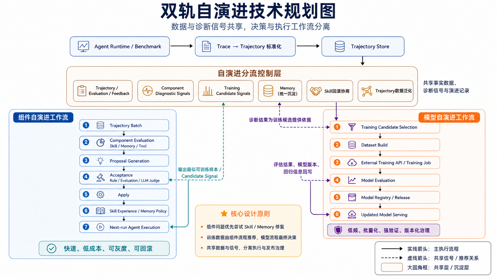

# 自演进架构设计

## 1. 背景和目标

JiuwenSwarm 的 Agent 在执行任务时会产生 OTEL trace。trace 记录了用户输入、模型调用、工具调用、执行结果、错误事件、输出内容等事实信息。自演进系统的目标，是从这些真实 trace 中发现可改进的问题，并把改进结果沉淀到合适的目标存储。

当前设计不引入持久化 trajectory 作为新的核心数据结构。系统直接以 trace 为事实来源，在读取和分析阶段构造临时视图。这样可以减少中间转换成本，也能保持与 OTEL 可观测体系、离线诊断和后续分析工具兼容。

第一阶段目标不是建设完整自动训练和自动发布平台，而是完成一个可运行、可审计、可灰度的自演进闭环：

- 从真实 trace 中发现 Skill、Memory、Tool 或 Model 相关问题。
- 生成结构化 Proposal，明确证据、根因、修复建议、预期收益和风险。
- 通过 DecisionPolicy 判断 Proposal 是否可接受。
- 通过 ApplyWriter 将已通过决策的 Proposal 写入目标存储。
- 为模型自演进沉淀经过准入的 `training_candidates`，但不在主流程里触发训练。

## 2. 总体边界

自演进分为两条轨道。

组件自演进轨道面向 Skill、Memory 等外部行为组件。它的结果可以在下一轮 Agent 执行中被检索使用，因此必须控制写回风险、数量和可回滚性。

模型自演进轨道面向训练数据和模型能力内化。它不直接修改在线行为，也不在 PDA 主流程中训练模型。PDA 只负责发现和准入训练候选；后续由独立的 Model Evolution Worker 消费 `training_candidates`，加工为训练样本并交付外部训练团队。详细设计见 [model-evolve.md](./model-evolve.md)。

这两个轨道共享 trace、任务评估结果和诊断信号，但决策和执行边界不同。把二者混在同一个 Apply 逻辑中，会导致组件修复和模型训练数据互相污染，尤其是失败 trace 容易被无差别沉淀为训练数据。

## 3. PDA 框架

自演进主流程采用 PDA 框架：

1. Process：`ProposalGenerator` 从 trace 生成 Proposal。
2. Decision：`DecisionPolicy` 对 Proposal 做验证、评分和风险判断。
3. Action：`ApplyWriter` 对已通过决策的 Proposal 执行写回。

PDA 的核心价值是让算法实现和工程框架解耦。AHE 是其中一种 ProposalGenerator / DecisionPolicy 实现，后续可以增加其他算法，但都必须遵守相同的 Proposal、DecisionResult、ApplyRecord 契约。

系统不允许绕过 Decision 直接写回。无论是组件经验、Memory Policy，还是模型训练候选，都必须先形成 Proposal，再经过 Decision，最后由对应 ApplyWriter 写入。

## 4. 核心数据对象

### Proposal

Proposal 是演进过程的核心中间对象。它描述一个候选改动或候选数据沉淀动作。

Proposal 必须回答五个问题：

- 基于什么 trace 证据。
- 根因是什么。
- 准备如何修复或沉淀。
- 预期影响是什么。
- 风险是什么。

关键字段：

| 字段 | 说明 |
|---|---|
| `proposal_id` | Proposal 唯一 ID |
| `target_type` | 目标类型：`skill` / `memory` / `training` |
| `target_id` | 目标对象 ID，例如 skill 名称 |
| `proposal_type` | 更细的 Proposal 类型 |
| `failure_evidence` | 指向 trace/span/field 的证据引用 |
| `root_cause` | 根因说明 |
| `targeted_fix` | 修复或沉淀方案 |
| `predicted_impact` | 预期收益 |
| `risk` | 风险说明 |
| `metadata` | 非核心扩展信息 |

`metadata` 不能承载主流程依赖字段。核心流程依赖字段必须显式建模，否则后续审计、迁移和兼容会变困难。

### DecisionResult

DecisionResult 是某个 DecisionPolicy 对 Proposal 的判断结果。

关键字段：

| 字段 | 说明 |
|---|---|
| `decision_id` | 决策结果 ID |
| `proposal_id` | 被评估的 Proposal |
| `policy_name` | 决策策略名称 |
| `score` | 评分 |
| `suggestion` | `candidate` / `active` / `rejected` |
| `blocking` | 是否硬阻断 |
| `failed_checks` | 失败检查项 |
| `metadata` | 策略附加信息 |

DecisionPolicy 不直接写回，也不应修改 Proposal。Pipeline 根据所有 DecisionResult 聚合 Proposal 最终状态。

### ApplyRecord

ApplyRecord 记录写回动作和结果，是审计链的最后一环。

关键字段：

| 字段 | 说明 |
|---|---|
| `apply_id` | 写回记录 ID |
| `proposal_id` | 来源 Proposal |
| `target_type` | 写回目标类型 |
| `target_store` | 具体目标存储 |
| `status` | `applied` / `skipped` / `failed` |
| `stored_object_id` | 写入对象位置或 ID |
| `reason` | 写回结果说明 |

通过 `trace_id -> proposal_id -> decision_id -> apply_id -> stored_object_id`，系统必须能追踪一次自演进从证据到写回结果的完整链路。

## 5. AHE 算法在 PDA 中的位置

AHE 是当前阶段的主要算法实现。它负责把一批 trace 转换为可审计的 Proposal。

AHE 内部流程：

1. LOAD：从 TraceBatch 中读取 trace_id。
2. CLEAN：使用 `OtelTraceAdapter` 将 OTEL span 转换为 clean_trace。
3. EVAL：使用 `TraceOutcomeEvaluator` 判断任务结果是 `pass`、`fail` 还是 `uncertain`。
4. DIAG：对 fail / uncertain trace 使用 `DiagnosisAgent` 做根因诊断。
5. GOV：使用 `ExperienceGovernor` 获取当前 skill 的治理上下文。
6. PROPOSE：生成符合 PDA 契约的 Proposal。

当前 AHE 的重点是组件自演进，因此默认只对 `fail` / `uncertain` trace 继续诊断和生成 Proposal。模型自演进如果要使用高质量 pass trace，需要扩展 AHE 的 pass trace 分支，生成 `target_type=training` 的 Proposal，再交给模型训练候选 DecisionPolicy 准入。

## 6. 组件自演进轨道

组件自演进面向 Skill 和 Memory 等外部行为组件。

典型流程：

1. AHE 从失败 trace 中定位组件问题。
2. Proposal 指向 `target_type=skill` 或 `target_type=memory`。
3. DecisionPolicy 检查证据、根因、治理规则和风险。
4. ApplyWriter 写入 Skill Experience Store 或 Memory Policy Store。
5. 下一轮 Agent 执行时按配置决定是否检索这些演进结果。

组件自演进的设计重点是安全和可控：

- 不直接修改系统内置组件。
- 不创建不存在的 skill。
- 不无限制增加 experience。
- 不替换已验证有效的高质量 experience。
- 不把 candidate 经验直接固化进 `SKILL.md`。

## 7. 经验治理

ExperienceGovernor 提供组件自演进的治理上下文。它的职责不是生成 Proposal，而是定义哪些操作在当前状态下合法。

第一版建议将经验操作收敛为四类：

| 操作 | 含义 |
|---|---|
| `ADD` | 新增 experience |
| `UPDATE` | 修改已有 experience，包括合并证据、修订内容、替换低质量内容 |
| `DEPRECATE` | 标记已有 experience 废弃 |
| `NOOP` | 不操作 |

此前的 `MERGE`、`REPLACE`、`UPDATE` 容易在顶层操作语义上重复。更合理的做法是保留一个顶层 `UPDATE`，再用 `update_mode` 表达细分意图，例如 `merge_evidence`、`revise_content`、`replace_content`。这样 DecisionPolicy 的流程不需要变复杂，具体治理规则仍由 ExperienceGovernor 负责。

治理规则应包含：

- `ADD` 只能在 skill 未达到经验数量上限时允许。
- `UPDATE + merge_evidence` 的目标应来自相似经验。
- `UPDATE + replace_content` 的目标应来自可替换经验。
- `UPDATE + revise_content` 不应修改 protected experience，除非后续引入更严格的人审机制。
- `DEPRECATE` 不能作用于 protected experience。
- `NOOP` 始终允许。

是否属于 similar、replaceable、protected，第一版不强制依赖大模型。可以先用结构化统计和启发式规则判断，例如内容相似度、使用次数、score、是否 applied、正负反馈等。后续如果启发式不足，再引入 LLM judge 或 embedding 相似度。

## 8. 模型自演进轨道

模型自演进在 PDA 中只做到“训练候选发现与准入”。它不训练模型，也不确认训练结果。

PDA 侧需要支持两类 training Proposal：

1. `positive_pass_trace`：高置信 pass trace，经 `PositiveTrainingCandidateEvaluator` 判断有训练价值。
2. `model_failure_trace`：fail / uncertain trace 经 Diagnosis 和 Proposal 归因为模型问题，再经 `FailureTrainingCandidateEvaluator` 判断可训练。

通过 Decision 的 training Proposal 由 `TrainingCandidateWriter` 写入 `training_candidates`。后续由 Model Evolution Worker 消费这些候选，并写入 `model_training_samples`。

模型自演进详细设计，包括评估器 prompt、表结构、Worker 状态机和 `exported != trained` 的边界，见 [model-evolve.md](./model-evolve.md)。

## 9. 写回目标

当前 PDA 支持三类写回目标：

| target_type | ApplyWriter | 目标存储 | 说明 |
|---|---|---|---|
| `skill` | `SkillExperienceWriter` | Skill Experience Store | 写入用户 skill 的 evolutions.json |
| `memory` | `MemoryPolicyWriter` | Memory Policy Store | 写入 memory policy |
| `training` | `TrainingCandidateWriter` | training_candidates | 写入模型训练候选队列 |

重要约束：`training_candidates` 只能由 active 的 `target_type=training` Proposal 写入。Pipeline 不应把所有 Proposal 的 `failure_evidence` 自动塞入训练候选表，否则会绕过模型训练准入。

## 10. 触发、采样和数量控制

自演进不应对所有 trace 实时触发。第一版建议支持以下触发方式：

- 手动指定 trace_id。
- 按时间窗口采样。
- 按最近 N 条 trace 采样。
- Benchmark 或受控实验结束后触发。

采样器只负责选 trace，不负责分析。Pipeline 消费已经选好的 TraceBatch。

Proposal 数量需要控制，否则会出现 proposal 泛滥、效果无法归因和组件互相影响。第一版建议：

- 每批最多 10 条 trace。
- 每批最多 3 个 Proposal。
- 会影响下一轮执行的 behavior proposal 最多 1 到 2 个。
- Training Proposal 不直接影响执行，但仍要经过 Decision 准入。

## 11. 数据连续性

系统必须保证以下审计链成立：

1. trace 通过 `Proposal.failure_evidence` 被引用。
2. Proposal 通过 `proposal_id` 关联 DecisionResult。
3. ApplyRecord 通过 `proposal_id` 关联 Proposal。
4. ApplyRecord 的 `stored_object_id` 指向实际写入对象。
5. 下一轮 Agent 是否使用写回结果，应能通过运行时检索日志或后续 trace 观察。

这条链路用于回答三个问题：

- 这次演进为什么发生。
- 它通过了哪些决策。
- 它到底写到了哪里。

## 12. 非目标和风险

第一阶段不做完整自动化闭环。明确非目标如下：

- 不自动训练模型。
- 不自动发布模型。
- 不自动把 candidate 经验固化进 `SKILL.md`。
- 不重新执行真实用户 trace。
- 不做完整 workspace commit / rollback。
- 不把外部 API、权限、环境问题伪装成 skill 或模型问题。

主要风险：

- LLM 诊断可能把环境问题误判为组件问题或模型问题。
- pass trace 如果不经过准入，会引入低价值训练数据。
- failure trace 如果没有明确 desired behavior，会变成不可训练噪声。
- 经验治理规则如果过松，会污染 Skill Experience Store。
- 如果 `metadata` 被滥用，会破坏 schema 的可维护性。

## 13. 第一阶段开发建议

第一阶段应优先完成以下工作：

1. 确保 Pipeline 中 `training_candidates` 只由 `TrainingCandidateWriter` 写入。
2. 扩展 AHE，使其能为 pass trace 和 model failure trace 生成 `target_type=training` Proposal。
3. 新增 `ModelTrainingDecisionPolicy`，内部调用 pass/failure 两类训练候选评估器。
4. 扩展 `training_candidates` 表到模型自演进第一版结构。
5. 新增 Model Evolution Worker，消费 `training_candidates` 并生成 `model_training_samples`。
6. 保持组件自演进和模型自演进的 Apply 边界独立。

第一阶段的验收重点不是证明模型训练效果，而是证明：

- trace 能支撑 Proposal 生成。
- Decision 能拒绝不可靠 Proposal。
- Apply 只写入 active Proposal。
- 组件演进和模型训练候选沉淀互不污染。
- 训练候选能被 Worker 消费并加工为样本。

## 14. 结论

自演进系统的核心不是让 Agent 自动修改一切，而是建立从 trace 到 Proposal、Decision、Apply 的可审计链路。

组件自演进负责低成本、可回滚的外部行为优化。模型自演进负责沉淀经过准入的训练候选，并交给独立 Worker 和外部训练流程处理。

这个边界会牺牲一部分自动化速度，但能降低训练数据污染、组件误修改和在线行为不可控的风险。
