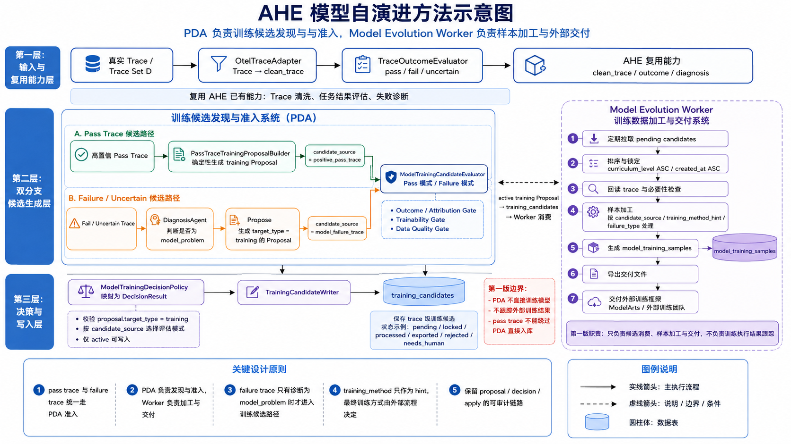

# AHE 模型自演进设计

## 1. 背景和目标

JiuwenSwarm 当前的 AHE(Agentic Harness Engineering) 流程已经可以基于真实 trace 做组件自演进：清洗 trace、判断任务结果、诊断失败原因、生成 Proposal、经过 Decision 后写入对应存储。模型自演进要复用这条链路里的 trace 处理和诊断能力，但目标不同。

组件自演进解决的是“是否应该修改 Skill、Memory 等外部行为组件”。模型自演进解决的是“哪些真实 trace 值得沉淀为后续训练候选数据”，因此模型自演进第一版的目标是建立一个可审计、可控、低复杂度的数据入口：

- PDA(Propose Decision Apply) 负责发现和准入训练候选。
- Model Evolution Worker 负责消费候选、加工样本并交付外部训练框架进行训练。
- 第一版不自动训练模型，不跟踪外部训练结果。
- 和外部训练框架对接的结果以及相应存储当前文档暂不设计。

## 2. 系统边界

模型自演进分为两个模块。

PDA 主流程是训练候选发现与准入系统。它负责读取真实 trace，判断 trace 是否值得进入训练候选池，并通过 `TrainingCandidateWriter` 写入 `training_candidates`表。

Model Evolution Worker 是训练数据加工与交付系统。它从 `training_candidates` 拉取数据，回读 trace，完成数据样本的二次筛选和加工后交由ModelArts团队训练框架进行训练，被选中的训练样本写入 `model_training_samples`表。

整体流程如下：

1. 真实 trace 经 `OtelTraceAdapter` 转为 clean_trace(该步骤来自AHE算法)。
2. `TraceOutcomeEvaluator`评估器判断任务结果是 `pass`、`fail` 还是 `uncertain`(该步骤来自AHE算法)。
3. 高置信 `pass` trace 由确定性的 `PassTraceTrainingProposalBuilder` 生成 `target_type=training` 的 Proposal，不进入 Diagnosis。
4. fail / uncertain trace 先进入 Diagnosis 和 Propose(Diagnosis和Propose仍然来自AHE算法)。
5. 所有 training Proposal 统一进入 `ModelTrainingCandidateEvaluator`，根据 `candidate_source` 使用 pass 或 failure 评估模式。
6. `ModelTrainingDecisionPolicy` 根据 Proposal 和 Evaluator 结果决定 training Proposal 是否 active(该步骤需要新增)。
7. `TrainingCandidateWriter` 只写入步骤6决策为 active 的 training Proposal。
8. Model Evolution Worker 定期消费 `training_candidates`，生成 `model_training_samples` 并交付外部模型训练框架进行训练。

## 3. 复用 AHE 的部分

模型自演进复用 AHE 中已经稳定的三个能力。

`OtelTraceAdapter` 负责把 OTEL span 转换成 clean_trace。clean_trace 包含用户输入、最终输出、消息序列、工具定义、工具结果、LLM 调用数量、subagent 摘要等信息。第一版模型训练评估器可以以 clean_trace 为主要输入。

`TraceOutcomeEvaluator` 只负责判断任务是否完成。它不判断 trace 是否适合训练。这个职责边界必须保持，否则 evaluator 会同时承担任务完成判断和训练数据质量判断，后续难以维护。

`DiagnosisAgent` 只用于 fail / uncertain trace。它负责诊断失败原因，并为后续判断问题是否属于模型行为问题提供依据。

`clean_trace` 可以作为第一版评估输入，它适合判断对话、最终输出、工具调用摘要和可训练性；如果训练候选准入依赖这些外部事实，评估器应返回 `human_review` 或 `reject`。

传给训练候选评估器(`ModelTrainingCandidateEvaluator`)的输入是裁剪后的结构化对象，而不是完整 trace 原文：

```json
{
  "trace_id": "...",
  "clean_trace": {
    "user_message": "...",
    "input": {},
    "output": {},
    "messages": [],
    "tool_definitions": [],
    "generation_count": 0,
    "subagents": []
  },
  "trace_outcome": {},
  "diagnosis_result": {},
  "proposal": {}
}
```

pass trace 评估只需要 `clean_trace`、`trace_outcome` 和自动生成的 training Proposal。failure trace 评估需要 `clean_trace`、`trace_outcome`、`diagnosis_result` 和 training Proposal。

## 4. Pass Trace 候选准入

pass trace 可以成为成功示范，但不能默认进入训练池。一个任务完成了，只说明这次交互结果可接受，不代表它有训练价值。

pass trace 进入训练候选评估前，只做轻量门槛：

- `TraceOutcome.outcome == pass`。
- `TraceOutcome.confidence` 达到阈值。
- clean_trace 中能提取基本用户输入和最终输出。

不要用“输入或输出长度过短”作为硬规则。NL2SQL、命令生成、代码片段、正则生成等任务可能天然很短，但训练价值很高。

### PassTraceTrainingProposalBuilder

`PassTraceTrainingProposalBuilder` 用于把高置信 pass trace 纳入 PDA。它不需要调用 LLM，也不做训练价值判断，只根据固定规则生成标准 training Proposal。

生成条件：

- `TraceOutcome.outcome == pass`。
- `TraceOutcome.confidence` 达到阈值。
- `trace_id`、用户输入和最终输出可提取。

生成的 Proposal：

```json
{
  "target_type": "training",
  "proposal_type": "flag_training_candidate",
  "targeted_fix": {
    "candidate_source": "positive_pass_trace",
    "training_method_hint": "unknown",
    "privacy_action": "none"
  }
}
```

当前 AHE 实现只对 `fail` 和 `uncertain` trace 做诊断和 proposal 生成，pass trace 会被跳过。因此模型自演进开启时，需要在 pass 分支增加这个确定性 builder。pass trace 也必须先生成 `target_type=training` 的 Proposal，再进入 Evaluator 和 Decision，不能绕过 PDA 直接写入 `training_candidates`。

### ModelTrainingCandidateEvaluator(pass 模式)

`ModelTrainingCandidateEvaluator` 在 pass 模式下判断该 trace 是否值得作为正向训练候选。第一版只做必要语义判断，不引入复杂规则、embedding 聚类或多阶段打分。

敏感信息检测可以作为独立的数据安全检查，但不要和“是否高质量示范”混在一个规则筛选器里。

Prompt 草案：

```text
你是一名模型训练数据筛选评估器，负责判断一条已完成任务的 Agent trace 是否适合作为模型训练候选样本。

你会收到：
1. clean_trace：标准化后的 trace，包括用户输入、最终输出、消息序列、工具调用摘要等。
2. trace_outcome：TraceOutcomeEvaluator 给出的 pass 结果和 confidence。
3. proposal：系统自动生成的 training Proposal，candidate_source 为 positive_pass_trace。

请只判断这条 trace 是否适合作为训练候选，不要重新评估任务是否完成。

评估标准：
- 是否体现可泛化的模型能力，例如任务理解、约束遵循、工具使用、格式遵循、错误恢复或清晰表达。
- 是否不是纯寒暄、确认、闲聊、模板化回复或无学习价值交互。
- 最终输出是否值得模型模仿。
- 如果存在工具调用，工具调用路径是否没有明显坏味道，例如无意义重试、误用工具、忽略工具结果。
- 是否存在隐私或敏感信息风险；如果有，判断是否可以通过脱敏保留训练价值。
- 不要因为输入或输出短就直接拒绝；NL2SQL、命令生成、代码片段等任务可能天然很短。

输出 JSON，不要输出 JSON 以外内容：
{
  "eligible": true,
  "training_method_hint": "sft | opd | grpo | ppo | preference | unknown",
  "privacy_action": "none | redact | human_review | reject",
  "reason": "简短说明",
  "failed_checks": []
}
```

## 5. Failure Trace 候选准入

fail / uncertain trace 不能直接作为训练样本。原始失败输出只能作为 negative evidence。只有当诊断和 Proposal 都指向模型行为问题时，才允许进入模型训练候选路径。

进入候选路径的必要条件：

- `TraceOutcome.outcome` 是 `fail` 或 `uncertain`。
- Diagnosis 判断失败主要来自模型行为问题。
- Propose 明确生成 `target_type=training` 的 Proposal。
- Decision 判断该 trace 具备训练价值。

### 模型问题分类

Propose 阶段应输出稳定的 `failure_type`，供 Decision 和 Worker 使用：

| failure_type | 含义 |
|---|---|
| `instruction_following_error` | 未正确遵循用户指令或约束 |
| `tool_selection_error` | 应使用工具但未使用，或选择了错误工具 |
| `planning_error` | 任务拆解、步骤规划或执行顺序错误 |
| `hallucination` | 编造事实、结果、工具输出或系统状态 |
| `uncertainty_calibration_error` | 应表达不确定却过度自信，或不该拒答却拒答 |
| `recovery_from_tool_error` | 工具失败后没有合理恢复、重试或解释 |
| `context_use_error` | 没有正确使用上下文、历史消息或检索结果 |
| `format_or_schema_error` | 输出格式、schema、JSON、SQL 等结构不符合要求 |

### ModelTrainingCandidateEvaluator(failure 模式)

`ModelTrainingCandidateEvaluator` 在 failure 模式下判断失败 trace 是否适合进入训练候选池。它不负责重新诊断所有问题，而是核对 clean_trace、Diagnosis 和 training Proposal 是否一致。

评估输入：

```json
{
  "trace_id": "...",
  "clean_trace": {
    "user_message": "...",
    "input": {},
    "output": {},
    "messages": [],
    "tool_definitions": [],
    "generation_count": 0,
    "subagents": []
  },
  "trace_outcome": {
    "outcome": "fail | uncertain",
    "score": 0.0,
    "confidence": 0.0,
    "reason": "...",
    "missing_requirements": []
  },
  "diagnosis_result": {
    "attribution": "model_problem | skill_problem | tool_problem | environment_problem | external_dependency | unclear",
    "root_cause": "...",
    "evidence": []
  },
  "proposal": {
    "target_type": "training",
    "proposal_type": "flag_training_candidate",
    "failure_evidence": [],
    "root_cause": "...",
    "targeted_fix": {}
  }
}
```

第一版只做三个 gate：

- Outcome / Attribution Gate：确认 trace 是 fail / uncertain，且诊断归因为 model_problem，Proposal 也是 training。
- Trainability Gate：确认 bad_behavior 和 desired_behavior 清楚，且能泛化到同类任务。
- Data Quality Gate：确认 trace、input/output、messages 和 evidence 足够完整；不足时进入 human_review 或 reject。

Prompt 草案：

```text
你是一名模型训练候选准入评估器，负责判断一条失败或不确定的 Agent trace 是否适合作为模型训练候选。

你会收到：
1. clean_trace：标准化后的 trace，包括用户输入、最终输出、消息序列、工具调用摘要等。
2. trace_outcome：TraceOutcomeEvaluator 对任务结果的判断。
3. diagnosis_result：AHE Diagnosis 对失败原因的诊断。
4. proposal：AHE Propose 生成的训练候选 Proposal。

你的任务：
- 判断该失败是否确实主要来自模型行为问题，而不是 skill、工具实现、环境权限、外部 API、用户输入不可满足或平台基础设施问题。
- 判断这条 trace 是否能形成明确、可泛化的训练信号。
- 判断 proposal 中的 failure_type、bad_behavior、desired_behavior 是否和 trace 证据一致。
- 判断数据是否完整到足以交给 Worker 后续加工。

拒绝条件：
- diagnosis_result 不是 model_problem，或证据不足。
- proposal.target_type 不是 training。
- failure_type 不属于预定义 taxonomy。
- bad_behavior 或 desired_behavior 为空、泛泛而谈或无法从 trace 证据支持。
- 问题更适合通过组件经验、工具修复、权限配置、外部服务恢复解决。
- clean_trace 缺少关键用户输入、最终输出或必要上下文。
- 包含敏感信息且无法脱敏保留训练价值。

注意：
- 原始失败输出只能作为 rejected/negative evidence，不能直接作为正向训练 target。
- 如果需要人工补充 corrected response，应设置 privacy_action 或 failed_checks 表达，不要强行判为可直接训练。
- 不要因为 trace 复杂就拒绝；复杂 trace 可以设置 curriculum_level=3。

输出 JSON，不要输出 JSON 以外内容：
{
  "eligible": true,
  "training_method_hint": "sft | opd | grpo | ppo | preference | unknown",
  "failure_type": "instruction_following_error | tool_selection_error | planning_error | hallucination | uncertainty_calibration_error | recovery_from_tool_error | context_use_error | format_or_schema_error",
  "privacy_action": "none | redact | human_review | reject",
  "curriculum_level": 2,
  "bad_behavior": "模型实际表现出的错误行为",
  "desired_behavior": "希望模型学习到的正确行为",
  "reason": "简短说明",
  "failed_checks": []
}
```

failure trace 通过评估后，Proposal 的核心字段如下：

```json
{
  "target_type": "training",
  "proposal_type": "flag_training_candidate",
  "targeted_fix": {
    "candidate_source": "model_failure_trace",
    "training_method_hint": "opd",
    "failure_type": "tool_selection_error",
    "privacy_action": "none",
    "bad_behavior": "模型没有调用工具而直接猜测。",
    "desired_behavior": "模型应调用工具并基于工具结果回答。"
  }
}
```

## 6. Decision 和 Apply 边界

模型训练候选统一由 `ModelTrainingDecisionPolicy` 处理。它本身保持很薄，只负责稳定的 PDA 决策语义：

- 校验 `proposal.target_type == training`。
- 校验 `candidate_source` 是 `positive_pass_trace` 或 `model_failure_trace`。
- 调用 `ModelTrainingCandidateEvaluator` 对应模式。
- 将 Evaluator 输出映射为 `DecisionResult`。

DecisionPolicy 输出标准 `DecisionResult`。详细评估报告放在 `DecisionResult.metadata`，这部分内容可以`training_candidate`表中 `proposal_id` 追溯完整 PDA 过程。

`TrainingCandidateWriter` 只做一件事：把 `target_type=training` 且 Decision 后 `state=active` 的 Proposal 写入 `training_candidates`。

## 7. 数据表设计

### training_candidates

`training_candidates` 是 PDA 写入的训练候选队列表，保存 trace 级候选，不保存最终训练样本。需要查看某个 candidate 的 PDA 处理详情时，通过 `proposal_id` 关联 `proposals`、`decision_results`、`apply_records`。

虽然当前数据库字段可以允许 `proposal_id` 为空，但模型自演进第一版应在应用层要求所有 candidate 都来自一个 `target_type=training` 的 Proposal。pass trace 如果要入库，也必须先生成 training Proposal。

```sql
CREATE TABLE IF NOT EXISTS training_candidates (
    id INTEGER PRIMARY KEY AUTOINCREMENT,
    trace_id TEXT NOT NULL,
    status TEXT NOT NULL DEFAULT 'pending',
    proposal_id TEXT,
    batch_id TEXT,

    candidate_source TEXT NOT NULL,
    failure_type TEXT,
    training_method_hint TEXT DEFAULT 'unknown',
    privacy_action TEXT DEFAULT 'none',
    curriculum_level INTEGER NOT NULL DEFAULT 2,

    locked_by TEXT,
    locked_at TEXT,
    consumed_at TEXT,

    created_at TEXT NOT NULL,
    updated_at TEXT
);

CREATE UNIQUE INDEX IF NOT EXISTS idx_training_candidates_trace_proposal
    ON training_candidates(trace_id, proposal_id);
CREATE INDEX IF NOT EXISTS idx_training_candidates_status_created
    ON training_candidates(status, curriculum_level, created_at);
CREATE INDEX IF NOT EXISTS idx_training_candidates_failure_type
    ON training_candidates(failure_type);
```

字段说明：

| 字段 | 说明 |
|---|---|
| `trace_id` | 原始 OTEL trace ID，Worker 通过它回读完整 trace |
| `status` | 队列状态：`pending` / `locked` / `processed` / `exported` / `rejected` / `needs_human` |
| `proposal_id` | 触发该候选的 Proposal ID，用于关联 PDA 处理结果 |
| `batch_id` | PDA 处理批次 |
| `candidate_source` | `positive_pass_trace` 或 `model_failure_trace` |
| `failure_type` | 模型问题 taxonomy；pass trace 可为空 |
| `training_method_hint` | `sft` / `opd` / `grpo` / `ppo` / `preference` / `unknown` |
| `privacy_action` | `none` / `redact` / `human_review` / `reject` |
| `curriculum_level` | 第一版粗粒度课程等级 |
| `locked_by` / `locked_at` | Worker 并发消费锁 |
| `consumed_at` | Worker 已消费时间 |

`curriculum_level` 第一版只做粗排序：

| level | 来源 | 含义 |
|---|---|---|
| `1` | `positive_pass_trace` | 高置信 pass trace，适合作为成功示范或评估样本 |
| `2` | `model_failure_trace` | 明确模型问题，且 desired_behavior 清楚 |
| `3` | `model_failure_trace` / `human_review` | 多轮、多工具、失败恢复复杂，或需要人工补充 target |

第一版不在该表保存 `worker_action`、`sample_type`、`priority`、`confidence`、`quality_score`、`decision_report`。这些字段要么可由已有字段推导，要么已经存在于 `decision_results.metadata`，要么会让第一版排序过早复杂化。

### model_training_samples

`model_training_samples` 保存 Worker 从 candidate 加工出的样本。一个 candidate 可以产生 0、1 或多条 sample。第一版只保存样本构造和检索必需字段。

```sql
CREATE TABLE IF NOT EXISTS model_training_samples (
    sample_id TEXT PRIMARY KEY,
    candidate_id INTEGER NOT NULL,
    trace_id TEXT NOT NULL,
    proposal_id TEXT,

    training_method_hint TEXT DEFAULT 'unknown',
    failure_type TEXT,

    input_messages TEXT NOT NULL,
    target_output TEXT,
    rejected_output TEXT,

    privacy_status TEXT NOT NULL DEFAULT 'unchecked',
    status TEXT NOT NULL DEFAULT 'ready',

    created_at TEXT NOT NULL,
    updated_at TEXT,

    FOREIGN KEY(candidate_id) REFERENCES training_candidates(id)
);

CREATE INDEX IF NOT EXISTS idx_model_training_samples_candidate
    ON model_training_samples(candidate_id);
CREATE INDEX IF NOT EXISTS idx_model_training_samples_status
    ON model_training_samples(status);
CREATE INDEX IF NOT EXISTS idx_model_training_samples_failure_type
    ON model_training_samples(failure_type);
```

字段说明：

| 字段 | 说明 |
|---|---|
| `sample_id` | 样本唯一 ID，例如 `sample-{candidate_id}-{hash}` |
| `trace_id` | 来源 trace，便于直接检索 |
| `proposal_id` | 来源 Proposal，便于追溯 PDA 判断 |
| `training_method_hint` | 训练方法建议，不作为强约束 |
| `failure_type` | 模型错误类型 |
| `input_messages` | JSON，训练输入消息序列 |
| `target_output` | 正例输出；pass trace 可用原始高质量输出，failure trace 可能为空待人工补充 |
| `rejected_output` | 负例输出，通常来自失败 trace 的原始 assistant 输出 |
| `privacy_status` | `unchecked` / `clean` / `redacted` / `blocked` |
| `status` | `ready` / `needs_human` / `rejected` / `exported` |

其中 bad/desired behavior 可以从 `proposals.targeted_fix` 或 `decision_results.metadata` 追溯。

## 8. Worker 消费流程

Worker 第一版只负责把已准入 candidate 转成外部可消费样本，不重新做模型问题归因。

流程：

1. 定期拉取 `status=pending` 的 `training_candidates`。
2. 按 `curriculum_level ASC, created_at ASC, id ASC` 排序。
3. 锁定一批候选，状态从 `pending` 变为 `locked`。
4. 回读 trace，做必要性检查（可选项）。
5. 按 `candidate_source`、`training_method_hint`、`failure_type` 做最小样本加工。
6. 写入 `model_training_samples`。
7. 写出外部交付文件。
8. 更新 candidate 和 sample 状态。

第一版 `batch_size = 100`。候选不足时按实际数量导出

### 状态语义

`training_candidates` 状态：

| 状态 | 含义 | 写入方 |
|---|---|---|
| `pending` | PDA 已准入，等待 Worker 消费 | `TrainingCandidateWriter` |
| `locked` | Worker 已领取，防止多个 Worker 重复处理 | Worker |
| `processed` | Worker 已完成 trace 回读、脱敏检查和样本加工，并写入 `model_training_samples` | Worker |
| `exported` | candidate 对应样本已交付到外部训练团队可消费的位置 | Worker |
| `rejected` | Worker 发现数据不可用，例如 trace 缺失、结构损坏、隐私不可处理、重复无价值 | Worker |
| `needs_human` | 需要人工补标、脱敏确认或 corrected response | Worker / 人工流程 |

`model_training_samples` 状态：

| 状态 | 含义 | 写入方 |
|---|---|---|
| `ready` | Worker 已生成样本，样本可被交付 | Worker |
| `exported` | 样本已写入外部交付文件、目录或对象存储位置 | Worker |
| `needs_human` | 样本需要人工处理，例如补充 target、确认脱敏或标注 chosen/rejected | Worker / 人工流程 |
| `rejected` | 样本加工后发现不可用，不进入外部交付 | Worker |

`exported` 只表示“已交付/已导出”，不表示“已经被训练使用”，也不表示“训练完成”。第一版没有外部训练 job 表，也不跟踪训练平台回执，因此不能用 `exported` 表示 `trained`。如果后续需要跟踪训练是否消费、成功或失败，应等外部团队接口明确后再新增训练任务表或回执字段。

### 去重和排序

第一版使用数据库唯一索引和简单 hash 去重：

- `training_candidates` 使用 `(trace_id, proposal_id)` 唯一索引。
- `model_training_samples` 使用 `sample_id` 去重。
- 可选样本 hash：`hash(trace_id + candidate_source + failure_type + training_method_hint)`。

第一版不引入 embedding 聚类。更细的课程学习策略也不进入第一版表结构，只使用 `training_candidates.curriculum_level` 做粗粒度排序。

## 9. 第一阶段开发建议

第一阶段只实现最小闭环：

1. 扩展 AHE pipeline 的 training Proposal 生成能力。
   - pass trace 使用确定性的 `PassTraceTrainingProposalBuilder`，不调用 LLM Proposer。
   - failure trace 继续复用 Diagnosis 和 Propose。
2. 新增统一的 `ModelTrainingCandidateEvaluator`，内部支持 pass 和 failure 两种模式。
3. 新增 `ModelTrainingDecisionPolicy`，只做准入校验和 `DecisionResult` 映射。
4. 扩展 `TrainingCandidateWriter`，把 active training Proposal 写入 `training_candidates`。
5. 扩展 `training_candidates` 表到本文第一版结构。
6. 新增 Worker，消费 pending candidate。
7. 新增 `model_training_samples` 表。
8. Worker 生成可交付文件，并更新 candidate / sample 状态。

第一阶段不做：

- 不自动触发模型训练。
- 不自动生成复杂 corrected response。
- 不依赖 embedding 去重。
- 不把 human_review 样本混入自动导出。
- 不把所有 pass trace 直接入库。
- 不强制导出 JSONL + manifest 双文件格式。
- 不设计 `model_training_batches` 表，等外部团队接口明确后再补。

## 10. 风险和待确认事项
1. 外部训练团队接口尚未完全确定，因此第一版不设计训练 job 表，也不表达 trained 状态。代价是系统只能证明样本已交付，不能证明样本已被训练消费。

2. failure trace 的 corrected response 在非OPD训练模式下，可能需要人工或更强模型生成。第一版允许 `target_output` 为空，并通过 `needs_human` 标记需要人工补充。

3. clean_trace 不一定包含所有外部副作用。如果判断依赖文件产物、附件或外部服务状态，评估器可能需要提升为Agent。

4. 训练方法只作为 `training_method_hint`。最终使用 SFT、OPD、GRPO、PPO 还是其他方法，由外部训练流程决定。

## 11. 结论

模型自演进的数据入口必须经过 PDA 准入。pass trace 和 failure trace 都不能直接写入训练池。

第一版的核心闭环是：

高置信 pass trace 自动生成轻量 training Proposal，再由 `ModelTrainingCandidateEvaluator` 准入；failure trace 经过 Diagnosis、training Proposal 和 `ModelTrainingCandidateEvaluator` 准入；通过 Decision 的 training Proposal 由 `TrainingCandidateWriter` 写入 `training_candidates`；Worker 再消费 candidate，生成 `model_training_samples` 并交付外部训练团队。

这个设计保留了 PDA 审计链，同时避免把 trace 筛选做成复杂的多阶段流程。第一版只做必要准入，后续再根据训练团队反馈增强排序、去重和课程学习策略。
