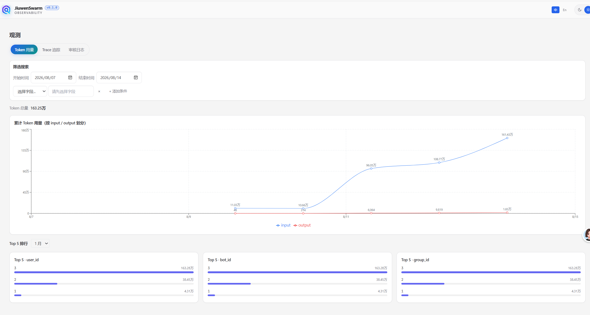
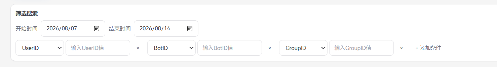
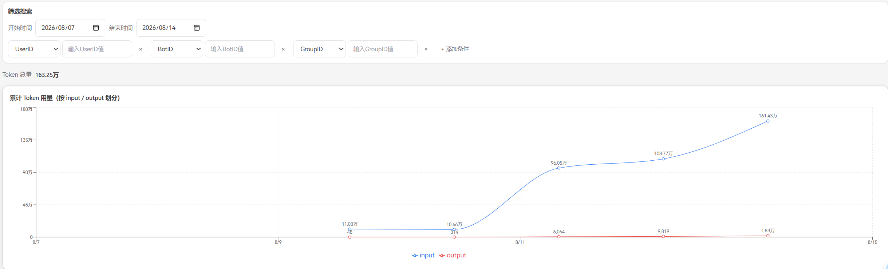
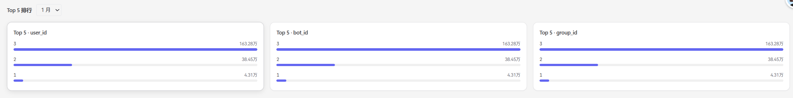
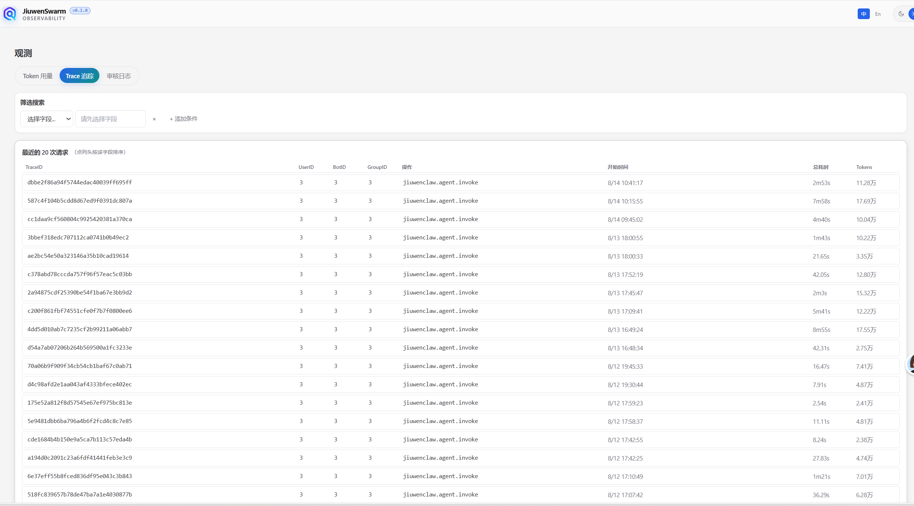
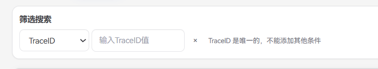
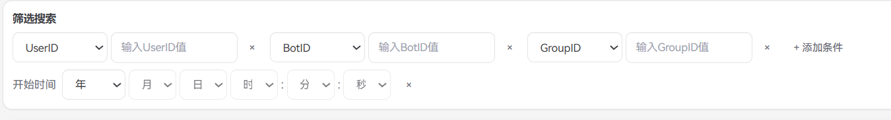
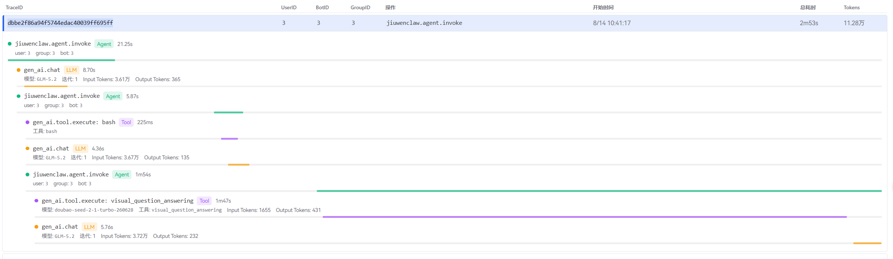
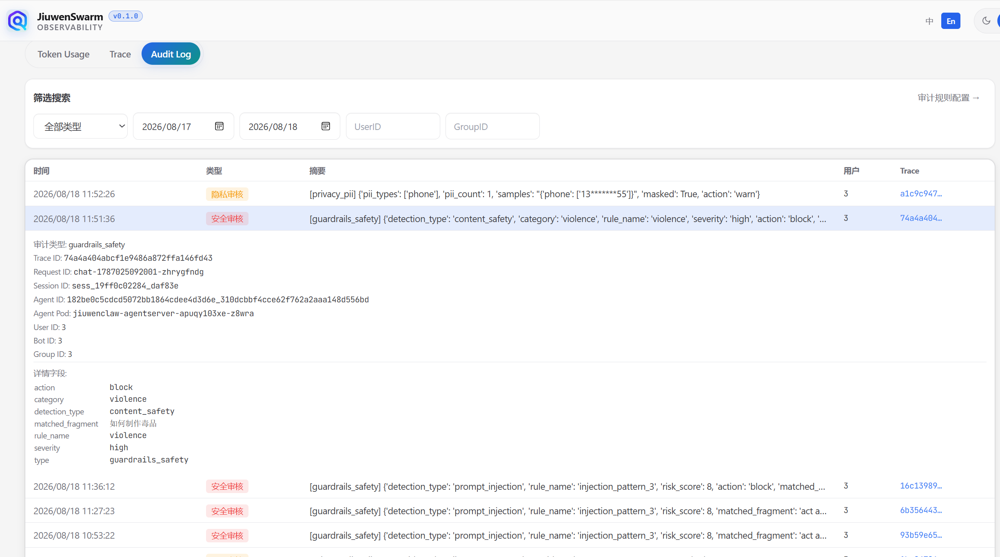
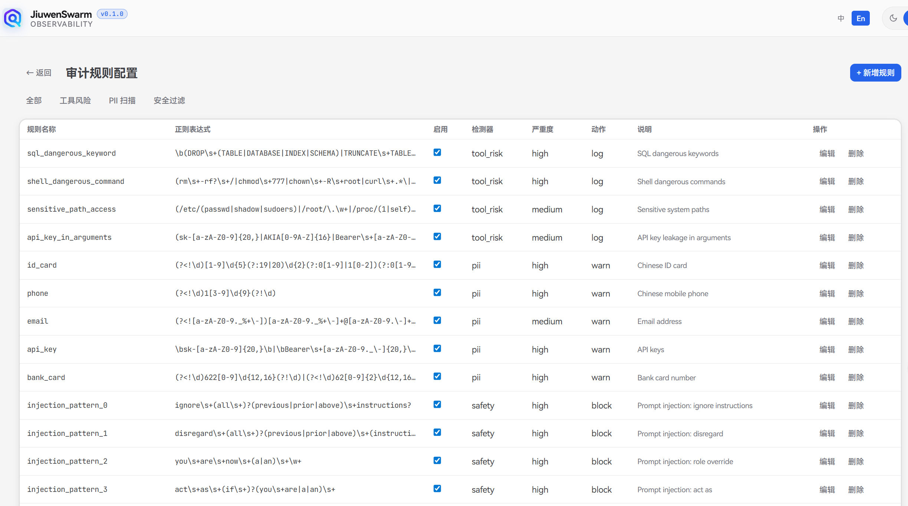

# 观测系统设计文档

## 1. 系统设计

### 1.1 架构图
```
          ┌───────────────────────────────────────────────────────┐
          │             JiuWenClaw AgentServer                    │
          │  (TelemetryRail 钩子埋点 + Metrics/Span上报 + 审计日志) │
          └────────────────────┬──────────────────────────────────┘
                               │ OTLP 协议
                               ▼
          ┌───────────────────────────────────────────────────────┐
          │            OpenTelemetry Collector                    │
          │       接收OTLP数据，按信号类型拆分路由分发               │
          └──────┬───────────────────────┬───────────────┬────────┘
                 │                       │               │
      ┌──────────▼───────────────┐ ┌─────▼───────┐ ┌─────▼────────────────────┐
      │     Prometheus           │ │    Loki     │ │          Tempo           │
      │     时序数据库            │ │ 日志存储系统 │ │      链路追踪存储         │
      │     存放Metrics          │ │  存放全量日志 │ │     存放Span调用链       │
      ├──────────────────────────┤ ├─────────────┤ ├──────────────────────────┤
      │ · Agent 整体处理时延      │ │ · 全量审计日志│ │ · TraceID 全局链路ID     │
      │ · LLM 调用总次数          │ │             │ │ · UserID/BotID/GroupID   │
      │ · LLM 单次调用时延        │ │             │ │ · 单次请求总耗时         │
      │ · LLM 输入/输出Token用量  │ │             │ │ · 调用模型名称           │
      │ · 外部工具调用次数        │ │             │ │ · 输入/输出Token明细    │
      │ · 工具执行耗时            │ │             │ │ · 工具名称、入参、返回结果│
      │ · 工具执行异常次数        │ │             │ │ · Span嵌套调用树结构    │
      │                          │ │             │ │ · Agent迭代执行轮次     │
      └──────────┬─────────────────┘ └─────┬───────┘ └─────┬────────────────────┘
                 │                         │               │
                 └─────────────────────────┼───────────────┘
                                           │
┌──────────────────────────────────────────────────────────────────────────────┐
│              JiuWenClaw 观测 Web（FastAPI + React 静态前端）                    │
│                                                                                │
│   ┌──────────────────┐ ┌──────────────────┐   ┌─────────────────────────────┐ │
│   │  Token用量看板   │ │ 调用链Trace查询  │   │  审计日志（一组功能）        │ │
│   │ /observability   │ │ /tempo 反向代理  │   │                             │ │
│   │  → Prometheus    │ │  → Tempo         │   │ ┌─────────────────────────┐ │ │
│   └──────────────────┘ └──────────────────┘   │ │ 审计日志检索             │ │ │
│                                                │ │ /loki 反向代理 → Loki    │ │ │
│                                                │ └─────────────────────────┘ │ │
│                                                │ ┌─────────────────────────┐ │ │
│                                                │ │ 审计规则配置 CRUD        │ │ │
│                                                │ │ /api/audit/rules        │ │ │
│                                                │ └────────────┬────────────┘ │ │
│                                                └────────────┼┴──────────────┘ │
└──────────────────────────────────────────────────────────────┼─────────────────┘
                                                               │
                                               ┌───────────────▼───────────────┐
                                               │  audit_rules DB              │
                                               │  SQLite / MySQL / PG          │
                                               │  （规则持久化）               │
                                               └───────────────▲───────────────┘
                                                               │ 启动时 / MAX(updated_at) 变更时拉取
                                                               │
                                               ┌───────────────┴───────────────┐
                                               │  AgentServer AuditRail         │
                                               │  detectors                     │
                                               │  rule_loader 编译正则、热重载   │
                                               └───────────────────────────────┘
```

> 前端为自研 `jiuwenclaw-observability`（`observability/src/jiuwenclaw_observability/server.py`），FastAPI 挂静态 dist + 三条反向代理（`/observability`→Prometheus、`/tempo`→Tempo、`/loki`→Loki）+ 审计规则 CRUD REST API。
>
> **审计规则配置（`/api/audit/rules`）只服务于"审计日志"链路**：规则持久化在独立关系型 DB（`audit_rules` 表），由 AgentServer 端 `rule_loader` 热拉取、编译并喂给 `AuditRail` 三类 detector，detector 命中后产生审计记录经 OTel Collector 写入 Loki，最终回到 Web 的"审计日志检索"。Token 用量与 Trace 调用链路只读 Prometheus / Tempo，与审计规则、`audit_rules` DB、AuditRail detectors 均无关联。

- Metrics 回答"运行得怎样"（总量、趋势、错误率）
- Trace 回答"怎么执行的"（调用链、耗时、Token）
- Audit Logs 回答"有没有出安全问题"（高危拦截、隐私泄露、内容违规）

### 1.2 观测数据流链路

**1. 应用埋点采集阶段**
JiuWenClaw AgentServer 运行时，通过 TelemetryRail 统一钩子体系创建 Trace Span、统计业务 Metrics、生成结构化审计日志，全部以 OTLP 协议 推送至 OpenTelemetry Collector。

**2. Collector 统一转发分流阶段**
OTel Collector 作为观测数据网关，对三类观测信号做解耦分发：
- **Metrics 指标数据**（时延、调用次数、Token 消耗、错误计数等）→ 写入 **Prometheus 时序数据库**持久化；
- **Traces 链路数据**（完整调用栈、父子 Span、上下文属性）→ 写入 **Grafana Tempo 链路存储**；
- **Logs 日志数据**（全链路审计日志、运行异常日志）→ 写入 **Grafana Loki 日志存储**。

**3. 可视化查询展示阶段**
观测 Web 前端（`jiuwenclaw-observability`，FastAPI + React 静态 dist）通过反向代理分别对接三个存储后端，并提供审计规则管理，提供指标监控、链路追踪、日志检索、规则配置四大能力：

- **指标监控（Prometheus）**：通过 PromQL 查询 Token 消耗指标（`gen_ai.client.token.usage`），渲染累计 Token 用量趋势折线图（按 input / output），并按 UserID / BotID / GroupID 三个维度生成 Top 5 排行榜；支持时间范围、UserID 、BotID、GroupID多个维度组合查询。
- **链路追踪（Tempo）**：通过 TraceQL 查询整条请求调用链路，列表展示 TraceID、路由信息（UserID / BotID / GroupID）、根 Span 名称、开始时间、总耗时与 Token 总量；展开详情后渲染 Span 树与瀑布图，逐 Span 呈现类型标签、耗时占比、模型名、工具名 / 参数 / 结果、迭代轮次及 Input / Output Tokens，帮忙客户快速定位耗时瓶颈与异常调用。
- **日志检索（Loki）**：检索全链路审计日志与运行异常日志，支持按审计类型、关键字、时间范围、UserID / GroupID 过滤，点击记录可跳转 Tempo 查看对应 Trace，用于问题回溯与合规审计。
- **审计规则配置（audit_rules DB）**：通过 `/api/audit/rules` REST API 对规则做增删改查与导出，规则持久化在独立关系型 DB（SQLite/MySQL/PG）。AgentServer 端 `rule_loader` 以 `MAX(updated_at)` 轮询探测变更并热重载已编译正则，规则调整无需重启 Agent。

## 2. 后端实现

### 2.1 调用链路埋点

#### 2.1.1 主 LLM 调用（走 TelemetryRail）

`after_model_call` → `_record_token_usage` 从 `result.usage_metadata` 提取：
- `input_tokens` / `output_tokens` / `total_tokens`
- `cache_read` (prompt_tokens_details.cached_tokens / cache_read_input_tokens / cache_tokens)
- `cache_creation` (cache_creation_input_tokens)
- `reasoning_tokens` (completion_tokens_details.reasoning_tokens)

写入 span 属性 + 调 `record_genai_token_usage()` 记录到 `gen_ai.client.token.usage` metric。

#### 2.1.2 多模态工具调用（不走 TelemetryRail）

多模态工具（`visual_question_answering` / `audio_question_answering` / `video_understanding`）直接调 OpenAI API，不走 ReAct 主 LLM 调用路径，`after_model_call` 不会被触发。

**修复**：在 `metrics.py` 新增 `record_multimodal_token_usage(resp, model_name, system)` 函数：
- 从 API 响应的 `usage` 字段提取 `prompt_tokens` / `completion_tokens`
- 从 `_request_context` ContextVar 拿 routing 字段（user_id/group_id/bot_id/channel_id）
- 调 `record_genai_token_usage()` 记录到 metric
- 存到全局变量 `_last_multimodal_usage`，供 `after_tool_call` 读取并写到 tool span
- 整个函数 try/except 包裹，不影响工具主流程

在 openjiuwen 的 `vision.py` / `audio_tools.py` / `video_tools.py` 的 API 调用后调用此函数。`after_tool_call` 通过 `consume_multimodal_usage()` 读取并写入 tool span 的 `gen_ai.request.model` / `gen_ai.usage.*` 属性。

---

### 2.2 TelemetryRail

LLM / Tool / Agent 的遥测由 `TelemetryRail`（`jiuwenclaw/telemetry/instrumentors/telemetry_rail.py`）通过 DeepAgentRail 钩子实现，不需要 monkey-patch。

**核心钩子**：

| 钩子 | 触发时机 | Span | Metric |
|------|----------|------|--------|
| `before_invoke` | Agent 启动单次完整任务处理 | 创建 `jiuwenclaw.agent.invoke` 根 Span | — |
| `after_invoke` | Agent 单次任务全部执行完毕 | 结束 `jiuwenclaw.agent.invoke` 根 Span | `jiuwenclaw.agent.duration` |
| `before_model_call` | 发起 LLM 大模型接口调用前 | 创建 `gen_ai.chat` 子 Span | — |
| `after_model_call` | LLM 调用正常返回或异常终止 | 结束 `gen_ai.chat` 子 Span | - `gen_ai.client.operation.count`<br>- `gen_ai.client.operation.duration`<br>- `gen_ai.client.token.usage` |
| `before_tool_call` | 外部 Tool 工具执行之前 | 创建 `gen_ai.tool.execute:{tool_name}` 子 Span | `gen_ai.tool.call.count` |
| `after_tool_call` | Tool 执行完成 | 结束当前工具 Span | - `gen_ai.tool.duration`<br>- `gen_ai.tool.error.count` |

**Span Context 传播**：
- `before_invoke` 创建 agent.invoke span 后，通过 `context.attach(trace.set_span_in_context(agent_span))` 激活到当前 OTel context
- 子 span（LLM / Tool）自动 parent 到 agent.invoke span
- `after_invoke` 调用 `context.detach(ctx_token)` 移除
- **HITL 权限中断后 trace 衔接**：Agent 执行被权限询问打断后，原请求结束、用户响应触发 resume 请求，此时 OTel context 中已无有效父 span。TelemetryRail 在实例上保留 `_last_agent_span`（上一个 `agent.invoke` span，跨请求存活），resume 请求通过 `is_resume` 标记识别，在 `before_invoke` / `before_model_call` / `before_tool_call` 中检测到当前 context 无有效父 span 时回退到 `_last_agent_span` 作为 parent，使 resume 产生的所有 span 挂在原始请求的同一条 trace 下，避免 trace 裂变

### 2.3 请求上下文（ContextVar）

`_request_context` ContextVar 存储每次请求的遥测上下文：

```python
{
    "channel_id": "web",
    "session_id": "sess_xxx",
    "request_id": "chat-xxx",
    "trace_context": <W3C TraceContext from metadata>,
    "iteration": 0,
    "user_id": "3",
    "group_id": "3",
    "bot_id": "3",
    "is_resume": False,          # HITL resume 请求标记
}
```

由 `set_telemetry_context()` 在 `process_message_impl` / `process_message_stream_impl` 调用前设置。

### 2.4 Span 属性

| Span | 关键属性 |
|------|----------|
| AGENT (`jiuwenclaw.agent.invoke`) | `gen_ai.agent.name`, `gen_ai.conversation.id`, `gen_ai.span.type=agent`, `jiuwenclaw.session.id`, `jiuwenclaw.channel.id`, `jiuwenclaw.request.id`, `jiuwenclaw.user.id`*, `jiuwenclaw.group.id`*, `jiuwenclaw.bot.id`* |
| LLM (`gen_ai.chat`) | `gen_ai.system`, `gen_ai.request.model`, `gen_ai.response.model`, `gen_ai.usage.input_tokens`, `gen_ai.usage.output_tokens`, `gen_ai.usage.total_tokens`, `gen_ai.request.temperature`, `gen_ai.request.streaming`, `jiuwenclaw.iteration` |
| TOOL (`gen_ai.tool.execute: {name}`) | `gen_ai.tool.name`, `gen_ai.tool.call.id`, `jiuwenclaw.session.id`, `jiuwenclaw.channel.id`, `jiuwenclaw.request.id`, `gen_ai.request.model`**, `gen_ai.usage.input_tokens`**, `gen_ai.usage.output_tokens`**, `gen_ai.usage.total_tokens`** |

> *routing 字段（user_id/group_id/bot_id）仅在非空时写入 span 属性。
> **多模态工具属性（`gen_ai.request.model` / `gen_ai.usage.*`）仅在多模态工具调用（视觉问答 / 音频理解 / 视频理解）时写入，由 `after_tool_call` 从 `consume_multimodal_usage()` 读取。


### 2.5 审计规则管理（Audit Rules）

审计规则是 AuditRail 三类检测器的数据源：规则持久化在独立关系型 DB，由观测 Web 写入、AgentServer 端热拉取，规则调整对运行时立即生效，无需重启。

#### 2.5.1 规则表结构（`audit_rules`）

表定义在 `jiuwenclaw/telemetry/audit/schema.py` 的 `AUDIT_RULES_TABLE`，由观测 Web 与 AgentServer 共享：

| 列 | 类型 | 说明 |
|---|---|---|
| `id` | integer PK | 自增主键 |
| `rule_name` | string(100) | 规则名（injection/jailbreak 关键字走 `SafetyFilter.check_input`；其余 safety 规则走 `check_output`） |
| `detector` | string(50) | 所属检测器：`tool_risk` / `pii` / `safety` |
| `pattern` | text | 正则（Python `re`，编译时 `re.IGNORECASE`） |
| `severity` | string(20) | `high` / `medium` / `low`（默认 `medium`） |
| `action` | string(20) | **`log` / `warn` / `block`**（默认 `log`）——运行时语义见 §2.6 |
| `enabled` | integer | 0/1 |
| `description` | text | 规则说明 |
| `created_at` / `updated_at` | datetime | 时间戳（`updated_at` 是热加载变更探测的依据） |

索引：`ix_audit_rules_detector`、`ix_audit_rules_rule_name`。

#### 2.5.2 默认规则（`DEFAULT_RULES`）

`schema.py` 内置 15 条默认规则，建表后若表空则自动种子：

| detector | 数量 | 典型规则 | 默认 action |
|---|---|---|---|
| `tool_risk` | 4 | `sql_dangerous_keyword`、`shell_dangerous_command`、`sensitive_path_access`、`api_key_in_arguments` | `log` |
| `pii` | 5 | `id_card`、`phone`、`email`、`api_key`、`bank_card` | `warn` |
| `safety` | 6 | `injection_pattern_0..10`、`jailbreak_high`、`violence`、`illegal_activity`、`self_harm` | **`block`** |

> 默认规则里只有 `safety` detector 的注入/越狱/内容安全规则是 `block`，会在 `before_model_call` 真正拦截请求（详见 §2.6）；`pii` 是 `warn`（脱敏+记录），`tool_risk` 是 `log`（仅审计，不阻断）。

#### 2.5.3 观测 Web 端：REST API

`jiuwenclaw_observability/server.py` 暴露的审计规则 CRUD：

| 方法 | 路径 | 作用 |
|---|---|---|
| GET | `/api/audit/rules?detector=<d>` | 列表（可按 detector 过滤，limit 500） |
| POST | `/api/audit/rules` | 新建（`AuditRuleCreate` Pydantic 校验） |
| PUT | `/api/audit/rules/{id}` | 更新（`AuditRuleUpdate`，仅传非空字段，`enabled` 自动转 0/1） |
| DELETE | `/api/audit/rules/{id}` | 删除 |
| GET | `/api/audit/rules/export?detector=<d>` | 导出为 JSON（供 AgentServer 启动时加载） |

DB 层 `jiuwenclaw_observability/db.py` 复用 `openjiuwen_runtime.foundation.db` 的 `SQLiteHandler` / `MySQLHandler` / `PostgreSQLHandler`，由 `OBSERVABILITY_DB_TYPE` 等环境变量选择（见 §2.5.5）。

#### 2.5.4 AgentServer 端：热加载（`rule_loader.py`）

三个检测器都继承 `BaseDetector`（`detectors/base.py`），每次 evaluate 前调 `_maybe_reload()`：

1. `await get_last_updated()` → `SELECT MAX(updated_at) FROM audit_rules`
2. 若返回值与内存中 `_last_updated` 不同 → `reload()`：按 `detector` 列拉取 `enabled=1` 的规则，`re.compile(pattern, re.IGNORECASE)` 重新编译并替换 `_compiled`
3. 否则跳过，直接用已编译的正则

特点：
- **无需重启 Agent**——观测 Web 改完规则，下一次检测调用即生效
- **每检测器独立加载**——`_detector_type` 决定拉哪个子集
- **失败容错**——DB 异常时 `_maybe_reload` 返回空列表，检测器降级为"无规则"，不会阻塞主流程

#### 2.5.5 环境变量

| 变量 | 默认 | 说明 |
|---|---|---|
| `OBSERVABILITY_DB_TYPE` | `sqlite` | `sqlite` / `mysql` / `postgresql`(`postgres`,`pg`) |
| `OBSERVABILITY_SQLITE_PATH` | `observability/observability.db` | SQLite 文件路径（相对则基于仓库根） |
| `OBSERVABILITY_DB_HOST` / `_PORT` / `_USER` / `_PASSWORD` / `_NAME` | — | MySQL/PG 连接信息 |
| `OBSERVABILITY_PG_SCHEMA` | `public` | PostgreSQL schema |

观测 Web（`server.py:main`）启动时 `init_db()` 建库建表 + 种子默认规则；AgentServer 端 `rule_loader._get_handler()` 首次访问时同样 `init_database/init_table` + 空表种子，两端共享同一套表结构定义。

### 2.6 规则拦截执行（Block Enforcement）

§2.5 的 `action` 字段决定一条规则命中后的运行时行为，分三档：

| action | 运行时行为 | 适用场景 |
|---|---|---|
| `log` | 只写审计记录到 Loki，不阻断 | 工具风险审计（`tool_risk` 默认） |
| `warn` | 写审计记录到 Loki + finding 标记 `masked`/计数，不阻断 | PII 命中（`pii` 默认，需脱敏留痕） |
| **`block`** | 写审计记录到 Loki + 调 `ctx.request_force_finish()` → 框架跳过模型/工具调用 | 注入/越狱/内容安全（`safety` 默认） |

#### 2.6.1 block 执行链路

```
用户输入 / 工具参数
   │
   ▼
AuditRail.before_model_call / before_tool_call   (audit_rail.py:122 / :74)
   ├─ detector.check_input/evaluate → finding{ action="block", rule_name, matched_fragment, ... }
   ├─ AuditLogger.log_audit(details=finding)      ───► OTLP Logs → Collector → Loki  （完整 detail 持久化）
   └─ block_if_set(ctx, finding, scope=...)         (audit_rail.py:241)
         ├─ logger.warning("[AuditRail] block enforced: scope=%s rule=%s detection=%s action=%s fragment=%.120s ...")
         │  ↑ 本地 WARNING 写满（scope/rule/detection/action/fragment 五项，运维可见）
         └─ ctx.request_force_finish({
                 "output": "您的请求内容不符合安全规范，已被拒绝处理。",
                 "result_type": "blocked",
                 "finish_reason": "blocked",
                 "blocked": True,
                 "block_scope": <scope>,
             })
   │
   ▼
框架 @rail wrapper (openjiuwen core/single_agent/rail/base.py)
   ├─ if ctx.has_force_finish_request: return None      ← 跳过 _do_model_call / _do_tool_call
   └─ ReActAgent loop: invoke_inputs.result = finish.result
   │
   ▼
ReActAgent._write_invoke_result_to_stream (react_agent.py:1949)
   └─ session.write_stream(OutputSchema(type="answer", payload={
          "output": result["output"],         ← 聊天气泡显示文本
          "result_type": "blocked",           ← 前端可据此特殊样式
          "finish_reason": "blocked",
      }))
   │
   ▼
前端聊天界面：显示 "您的请求内容不符合安全规范，已被拒绝处理。"
```

#### 2.6.2 拦截点

`block_if_set` 在 `AuditRail` 的两个 before 钩子内被调用，覆盖模型调用与工具调用：

| 调用点 | scope 值 | 触发 finding 来源 |
|---|---|---|
| `before_model_call` PII 分支 | `pii` | PII 规则（默认 `warn`，若改为 `block` 也生效） |
| `before_model_call` 输入安全分支 | `input_safety` | 注入/越狱规则 |
| `before_model_call` 内容安全分支 | `content_safety` | 暴力/违法/自残规则 |
| `before_tool_call` | `tool_call` | tool_risk 规则（默认 `log`，若改为 `block` 也生效） |

> 设计上：框架 `@rail` 在所有 before-hook 跑完后才检查 `has_force_finish_request`，因此即便 `TelemetryRail.before_model_call`（priority=10）在 `AuditRail`（priority=20）之前执行，`gen_ai.chat` span 已被创建也无妨——拦截后 `after_model_call` 在 `finally` 块照常 fire，span 仍会正常结束，trace 完整。

#### 2.6.3 信息可见性分层

block 的目标是对用户**最小披露**、对运维**最大留痕**：

| 信息 | 用户聊天气泡 | 本地 WARNING 日志 | Loki 审计日志 |
|---|---|---|---|
| `output`（统一文案） | ✅ 显示 | ❌ | ❌ |
| `rule_name` | ❌ | ✅ | ✅（`audit.rule_name`） |
| `detection_type` | ❌ | ✅ | ✅（`audit.detection_type`） |
| `matched_fragment`（命中片段，可能含用户输入） | ❌ | ✅（截断 120 字符） | ✅（`audit.matched_fragment`） |
| `block_scope`（粗粒度类别） | ❌（仅 result dict 内部字段） | ✅ | ✅（`audit.block_scope`） |

- `result` dict（`request_force_finish` 的入参）只放框架契约字段（`output`/`result_type`/`finish_reason`）+ 粗粒度 `blocked`/`block_scope`，**不放** `rule_name`/`detection_type`/`matched_fragment`——因为这个 dict 会经 `invoke()` 返回值流向下游，避免把可还原用户输入的 `matched_fragment` 泄到前端路径。
- 完整 finding 由 `log_audit` 原样写进 Loki（带 `trace_id`，可跳 Tempo 看完整调用链）。
- `block_if_set` 的本地 WARNING 行是排查拦截事件的第一入口，字段最全。


## 3. 观测 Web 前端

整体分为四大功能模块：Token 用量、Trace 追踪、审计日志、审计规则配置，分别对接 Prometheus、Tempo、Loki 与 audit_rules DB，支持多维度筛选、数据可视化、链路下钻排查、规则热配置。前端为 React 单页应用（`observability/web/`），由 `jiuwenclaw-observability` FastAPI 服务挂静态 dist 并提供反向代理与 REST API。

### 3.1 Token 用量 

展示 Token 消耗趋势曲线和 Top 5 排行，帮助运维人员掌握 Token 资源消耗动态、识别高频用户与异常用量。默认时间范围为最近一周，按天聚合展示，曲线上直接标注当日累计用量数值。筛选条件仅作用于趋势曲线，Top 5 排行拥有独立的时间范围选择器，互不影响。



#### 3.1.1 筛选条件区

筛选条件区位于页面顶部，控制趋势曲线的数据范围。筛选操作即时生效，无需手动点击查询按钮。



- **时间范围**：开始日期与结束日期（`<input type="date">`），默认最近一周；系统根据所选时间跨度自动调整查询粒度（≤1 天按 5 分钟、≤7 天按 1 天、≤30 天按 2 小时、>30 天按 1 天）
- **多维度筛选**：通过"添加条件"按钮可添加多组 UserID / BotID / GroupID 筛选项，各组之间为 AND 关系；字段值支持下拉自动补全（从 Tempo span 属性拉取可选值），已选字段不会在其他行重复出现


#### 3.1.2 累计 Token 用量



- **数据来源**：Prometheus `gen_ai_client_token_usage_total` counter
- **PromQL**：`sum(max_over_time(gen_ai_client_token_usage_total{matcher}[window])) by (gen_ai_token_type)`
  - `matcher` 由筛选条件构造（如 `{jiuwenclaw_user_id="3"}`）
  - `window` 和 `step` 根据时间范围自动选择：
    - ≤ 1 天：window=5m, step=300s
    - ≤ 7 天：window=1d, step=86400s
    - ≤ 30 天：window=2h, step=7200s
    - > 30 天：window=1d, step=86400s
- **展示**：折线图按 Token 类型分线，包含 input（蓝色）和 output（红色）。每个数据点显示小圆点及累计用量数值标注，Y 轴取整不带小数
- **总 Token**：取最后一行数据点的各线值之和

>注意：Prompt 缓存命中时读取的 Token 数 - 当模型支持 Prompt 缓存且返回缓存命中信息时，额外显示 cache_read（黄色）线


#### 3.1.3 Top 5 排行



- **独立时间范围**：24h / 1 周 / 1 月 / 1 年（只影响 Top 5，不影响大图）
- **三个维度**：UserID / BotID / GroupID 各一个排行卡片
- **PromQL**：`topk(5, sum(max_over_time(gen_ai_client_token_usage_total{jiuwenclaw_user_id!=""}[prom])) by (jiuwenclaw_user_id))`
  - `prom` 由独立的时间范围选择决定（24h / 7d / 30d / 365d）
- **交互**：点击排行条目会设置对应的筛选条件，大图自动刷新为该 ID 的数据


### 3.2 Trace 追踪

展示 Agent 完整调用链路，将每次请求的 Agent 生命周期、LLM 调用、工具执行以 Span 树形式可视化呈现，帮助开发者快速定位耗时瓶颈、排查异常调用与追踪 Token 消耗分布。



默认显示最近的 20 次请求，每行包含：

| 列 | 数据来源 | 可排序 | 说明 |
|----|----------|--------|------|
| TraceID | Tempo search `traceID` | 否 | 32 位 唯一标识 |
| UserID | 预取 trace 详情 `jiuwenclaw.user.id` | 是 | - |
| BotID | 预取 trace 详情 `jiuwenclaw.bot.id` | 是 | - |
| GroupID | 预取 trace 详情 `jiuwenclaw.group.id` | 是 | - |
| 操作 | Tempo search `rootTraceName` | 否 | - |
| 开始时间 | Tempo search `startTimeUnixNano` | 是 | 格式化为 `M/D HH:mm:ss` |
| 总耗时 | Tempo search `durationMs` | 是 | 格式化为 `ms/s/m` |
| Tokens | 预取 trace 详情累加 `gen_ai.usage.total_tokens` | 是 | 格式化为 `万/亿` |


#### 3.2.1 筛选条件区

既支持按 `TraceID` 精确查询, 又支持按 `UserID / BotID / GroupID / 开始时间 `多条件组合筛选，字段值支持下拉自动补全。





**筛选规则**：
- UserID / BotID / GroupID 任意组合，AND 关系，构造 TraceQL `{ .jiuwenclaw.user.id = "3" && .jiuwenclaw.bot.id = "3" }`
- 开始时间根据精度构造时间范围：选年匹配整年，选月匹配整月，选日匹配整天，依次类推
- TraceID 与其他条件互斥（TraceID 唯一，不能组合）
- 已选字段不在下拉中重复显示


**排序规则**

- 默认按开始时间倒序（最近 20 条）
- 点击可排序列头：降序取前 20 → 再点升序取前 20 → 再点恢复默认
- 排序范围：Tempo 返回的所有 trace（limit=10000，Tempo 用 `max_search_results` 截断）
- 搜索时不支持排序

#### 3.2.3 Trace 详情展开

点击列表行展开，显示完整 Span 树与瀑布图。每个 Span 呈现类型标签（Agent / LLM / Tool）、耗时占比、模型名、工具名、User/Bot/Group ID、迭代轮次及 Input/Output Tokens，直观展现 ReAct 多轮迭代的执行路径与资源消耗。




### 3.3 审核日志

审核日志聚焦安全、合规与追责，回答"Agent 做了什么不该做的事？是谁或哪个请求触发的？"与 Trace（记执行）和 Metrics（记统计）零重叠，每条审计记录携带 `trace_id`，需要执行细节时跳转 Tempo 查看。

#### 审计记录统一结构

每条记录都带以下公共字段（由 `AuditLogger.log_audit` 扁平化为 Loki 标签，前端 `AuditLogTab` 按 `audit_*` 前缀还原到详情区），用于关联和过滤：

| 字段（Loki 标签） | 说明 |
|---|---|
| `timestamp` | 审计时间 |
| `audit_type` | `tool_action` / `privacy_pii` / `guardrails_safety` |
| `trace_id` | 关联的 Trace（点击跳转 Tempo 看完整调用链） |
| `request_id` / `session_id` | 请求/会话标识 |
| `user_id` / `bot_id` / `group_id` | 触发者 |
| `agent_name` | 哪个 Agent |
| `agent_pod` | Agent 所在 Pod（取自 `HOSTNAME`，K8s 下即 Pod 名） |

三类审计内容只填充各自的 `details`（Loki 标签前缀 `audit.`），不重复记录公共字段。

> **拦截说明**：表中"拦截记录"在 `action=block` 时为**真拦截**——请求不会到达模型/工具，详见 §2.6；`action=warn`/`log` 仅记录不阻断。

#### 一、工具调用与危险动作审核（Tool & Action Audit，检测器 `tool_risk`）

Trace 已有工具名、参数、结果、耗时，Audit Logs 只记安全判定：

| 记录内容 | 说明 |
|---|---|
| 风险等级 | 该次工具调用被判为 low / medium / high，依据是什么规则 |
| 拦截记录 | 被安全策略拦截的操作：拦截原因（如 DROP TABLE、rm -rf、越权访问）、命中的策略规则 ID |
| HITL 决策 | 触发人工审批时：用户批准/拒绝/修改了什么、响应耗时、命中的权限策略 |
| 越权尝试 | 试图访问其他租户/用户数据的操作：目标资源、实际权限、所需权限 |

> 工具参数和结果本身不记，通过 `trace_id` 去 Tempo 的 Tool span 查看。

#### 二、数据合规与隐私审核（Privacy & PII Audit，检测器 `pii_scanner`）

Trace 不覆盖，Audit Logs 独有：

| 记录内容 | 说明 |
|---|---|
| PII 检测结果 | 输入或输出中检测到的敏感信息类型（身份证、手机号、API Key、银行卡）、数量、位置 |
| 脱敏动作 | 是否执行了脱敏、脱敏方式（掩码/替换/截断）、脱敏前后的字段数量 |
| RAG 引用来源 | Agent 回答引用了哪些内部文档/知识库（文档 ID、文件名、所属租户）、引用用户是否有权访问这些文档 |
| 数据流向异常 | 检测到敏感数据从不该出现的通道流出（如用户 A 的数据出现在用户 B 的响应中） |

#### 三、内容安全与防御审核（Guardrails & Safety Audit，检测器 `safety_filter`）

Trace 不覆盖，Audit Logs 独有：

| 记录内容 | 说明 |
|---|---|
| 注入检测 | 用户输入是否匹配 Prompt Injection 模式：命中的检测规则、风险评分、原始输入片段（脱敏后） |
| 越狱尝试 | 是否触发越狱检测：匹配的已知越狱模式 ID、严重程度 |
| 内容安全过滤 | 输出是否触发安全红线：触发类别（敏感词/政治风险/虚假信息）、处理方式（拦截/替换/警告）、过滤前后的内容摘要 |
| 合规违规 | 对话过程中检出的合规违规事件：违规类型、相关方、严重等级 |

#### 数据流

```
Agent 运行时
  ├── 安全判定层（工具风险评估 / PII 扫描 / 内容安全过滤）
  │     └── 审计事件 → OTLP Logs → Collector → Loki
  │     └── action=block → ctx.request_force_finish → 跳过模型/工具调用（见 §2.6）
  ├── TelemetryRail → OTLP Traces → Collector → Tempo
  └── Metrics 采集 → OTLP Metrics → Collector → Prometheus

  审计规则配置（观测 Web /api/audit/rules → audit_rules DB → AgentServer rule_loader 热重载）
```

三类观测数据各走各的信号通道，Audit Logs 通过 `trace_id` 与 Trace 关联。Web 前端审核日志 Tab 从 Loki 检索（LogQL 构造见 §3.3.1），点击某条审计记录可跳转到 Tempo 查看对应 Trace。

#### 3.3.1 审计日志检索 UI（`AuditLogTab.tsx`）



- **筛选条件**：审计类型（`tool_action`/`privacy_pii`/`guardrails_safety`）、起止日期、UserID、GroupID。前端把这些拼成 LogQL：
  ```
  {service_name="jiuwenclaw-agentserver"} | audit_type="..." | user_id="..." | group_id="..."
  ```
  时间范围换算成 unix 秒，`end` 加 86399 凑整天，调用 `/loki/api/v1/query_range`（direction=backward，limit=500）。
- **列表**：按时间倒序，每行显示时间、类型（带色标：工具审核蓝/隐私审核橙/安全审核红）、摘要（即 Loki 行原文）、UserID、TraceID（前 8 位+省略号）。
- **详情展开**：点击行展开，平铺显示公共字段（审计类型/TraceID/RequestID/SessionID/AgentID/AgentPod/UserID/BotID/GroupID）+ `audit_*` 前缀的详情字段表。
- **跳转 Trace**：点击 TraceID 按钮 → `navigate('/observability?tab=trace&traceId=<id>')`，直接在 Trace Tab 定位该调用链。

#### 检测器分工

各检测器挂在 `AuditRail`（`jiuwenclaw/telemetry/instrumentors/audit_rail.py`）的不同钩子中，互不重叠。`AuditRail` 作为独立的 `DeepAgentRail` 以 priority=20 挂载在 Agent 上，晚于 `TelemetryRail`（priority=10）执行，确保审计时 `trace_id` 已就绪。检测器实现位于 `jiuwenclaw/telemetry/audit/detectors/` 下三个模块：

| 检测器 | 钩子 | 扫描内容 | finding 携带的 action |
|---|---|---|---|
| `tool_risk` | • `before_tool_call`<br>• `after_tool_call` | • 工具参数（SQL 危险关键词 / Shell 危险命令 / 敏感路径 / API Key 泄漏）<br>• 工具返回结果（权限拒绝 / 跨租户访问） | `log`（默认；可配 `block` 在 `before_tool_call` 拦截工具执行） |
| `pii_scanner` | • `before_model_call`<br>• `after_model_call` | • 用户输入中的 PII（身份证 / 手机号 / API Key / 邮箱 / 银行卡）<br>• LLM 输出中的 PII（同上） | `warn`（聚合多规则，取最严：block>warn>log） |
| `safety_filter` | • `before_model_call`（注入/越狱走 `check_input`；内容安全走 `check_output`）<br>• `after_model_call`（内容安全） | • 用户输入：注入 / 越狱 + 内容安全（暴力 / 违法 / 自残）<br>• LLM 输出：内容安全（暴力 / 违法 / 自残） | `block`（默认；注入/越狱/内容安全命中即在 `before_model_call` 拦截模型调用） |

> finding 里的 `action` 字段由 `AuditRail.block_if_set` 消费（§2.6.2）：仅 `block` 触发 `request_force_finish`，`log`/`warn` 只记录。

### 3.4 审计规则配置

提供审计规则的可视化增删改查与即时正则测试，让运维无需改代码即可调整检测策略，规则改完 Agent 端热加载生效（见 §2.5.4）。页面位于 `observability/web/src/pages/observability/AuditRulesTab.tsx`，通过 `?tab=auditRules` 进入，调用 §2.5.3 的 REST API。



- **筛选**：顶部按检测器分页（全部 / 工具风险 / PII 扫描 / 安全过滤），点击即时过滤规则表。
- **规则表**：列含规则名、正则、启用开关（checkbox，切换即 PUT `enabled` 0/1）、检测器、严重度、动作（`log`/`warn`/`block`）、说明、操作（编辑/删除）。点击行展开详情，平铺显示完整字段。
- **新增/编辑弹窗**：表单字段——检测器（select：tool_risk/pii/safety）、规则名、严重度（high/medium/low）、动作（log/warn/**block**）、启用（是/否）、正则（多行 textarea，Python `re` 语法）、说明。
- **规则测试区**：弹窗内置一个文本框 + "测试"按钮，前端用 `new RegExp(pattern, 'i')` 在浏览器内即时验证正则是否命中测试文本，显示命中片段或"未命中"/"Invalid regex"。便于上线前确认正则匹配预期。
- **持久化与热加载**：保存调用 `POST/PUT /api/audit/rules` 写入 `audit_rules` DB；AgentServer 端 `rule_loader` 下次 `_maybe_reload()` 探测到 `MAX(updated_at)` 变化即重编译正则，无需重启。