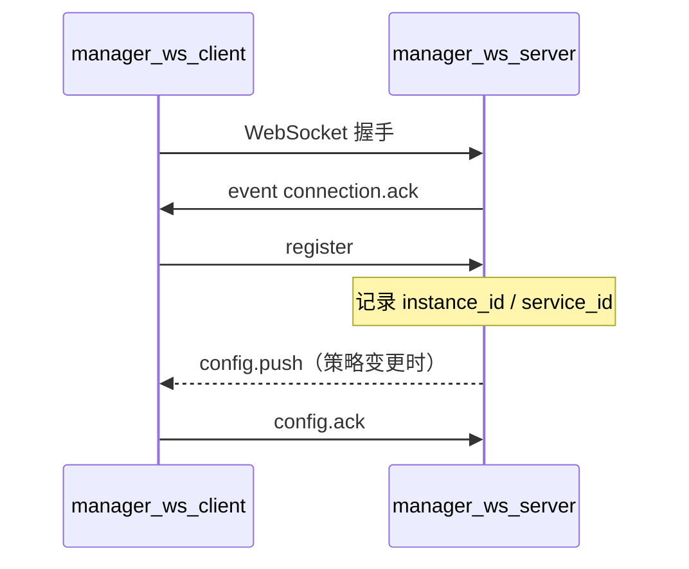

# Claw Manager WebSocket 协议（manager_ws_server / manager_ws_client）

本文档将现有 **REST API**（`jiuwenclaw_manager/routers`）整理为 **WebSocket 线协议**约定，供 Gateway `manager_ws_client` 长连接与后续管理面 RPC 扩展使用。

- **服务端**：`manager_ws_server`（`jiuwenclaw_manager.manager_ws_server`）
- **客户端**：Gateway 扩展 `manager_ws_client`
- **默认地址**：`ws://<host>:8766`（环境变量见下文）
- **载荷格式**：UTF-8 JSON 文本帧（一条消息一个 JSON 对象）

与 REST 的关系：

| 能力 | REST 前缀 | WebSocket |
|------|-----------|-----------|
| 管理面 CRUD、心跳入库等 | `POST/GET/PATCH/DELETE /api/v1/instances/...` | 规划为 `type=request` + `method`（见 §7） |
| 配置下发（Gateway 订阅） | 无独立 REST（由策略变更触发 push） | **已实现** `config.push` / `config.ack` |
| 健康检查 | `GET /api/health` | 仍走 HTTP，不走 WS |

---

## 1. 环境变量

### 1.1 Claw Manager（`manager_ws_server` 监听）

| 变量 | 默认 | 说明 |
|------|------|------|
| `MANAGER_WS_ENABLED` | `true` | 是否启动 WS 服务 |
| `MANAGER_WS_HOST` | `0.0.0.0` | 监听地址 |
| `MANAGER_WS_PORT` | `8766` | 监听端口 |

### 1.2 Gateway（`manager_ws_client` 连接）

| 变量 | 说明 |
|------|------|
| `config.yaml` → `extensions.manager_ws_client.ws_url` | 优先 |
| `MANAGER_WS_URL` | 覆盖完整 WS URL |
| （缺省） | `ws://127.0.0.1:8766` |

注册时 `instance_id` 使用环境变量 `JIUWENCLAW_PROVISIONED_INSTANCE_ID`（与 REST 路径中的 `jiuwenclaw_id` 对齐）。

---

## 2. 帧类型总览

| `type` | 方向 | 状态 | 说明 |
|--------|------|------|------|
| `event` | S→C | **已实现** | 连接事件（如 `connection.ack`） |
| `register` | C→S | **已实现** | Gateway 注册实例与服务身份 |
| `config.push` | S→C | **已实现** | 配置下发 |
| `config.ack` | C→S | **已实现** | 配置应用结果确认 |
| `error` | S→C 或双向 | **已实现** | 协议/解析错误 |
| `request` | C→S | 规划 | 对应 REST 调用 |
| `response` | S→C | 规划 | REST 风格响应体 |

`S` = Claw Manager（`manager_ws_server`），`C` = Gateway（`manager_ws_client`）。

---

## 3. 通用约定

### 3.1 字段命名

- 一律 **snake_case**，与 REST Body / Query 及 Pydantic schema 一致。
- 路径参数并入 `params`，例如 `jiuwenclaw_id`、`template_id`、`policy_id`、`mapping_id`。

### 3.2 与 REST 响应对齐（规划中的 `response`）

与 `ResponseModel` 一致：

```json
{
  "type": "response",
  "id": "<与 request.id 相同>",
  "ok": true,
  "code": 200,
  "message": "success",
  "data": { }
}
```

失败时 `ok: false`，`code` 取 HTTP 语义（400 / 404 / 409 / 500），`message` 为错误说明，`data` 可为 `null` 或细节对象。

### 3.3 规划中的 `request` 信封

```json
{
  "type": "request",
  "id": "req-<uuid>",
  "method": "<见 §7 方法表>",
  "params": { }
}
```

`params` 合并原 REST 的 path、query、body 字段（同名即可）。

---

## 4. 连接生命周期（已实现）



### 4.1 `event` — `connection.ack`（S→C）

连接建立后 **首帧**，由服务端发送。

```json
{
  "type": "event",
  "event": "connection.ack",
  "payload": {
    "status": "ready",
    "manager_id": "default"
  }
}
```

| 字段 | 类型 | 说明 |
|------|------|------|
| `payload.status` | string | 固定 `ready` |
| `payload.manager_id` | string | 管理面 ID（`CLAWMANAGER_MANAGER_ID`） |

### 4.2 `register`（C→S）

客户端在收到 `connection.ack` 后发送。

```json
{
  "type": "register",
  "payload": {
    "instance_id": "<jiuwenclaw_id>",
    "service_type": "gateway",
    "service_id": "gateway-1"
  }
}
```

| 字段 | 类型 | 必填 | 说明 |
|------|------|------|------|
| `instance_id` | string | 是 | 组网实例 ID，对应 REST `/{jiuwenclaw_id}` |
| `service_type` | string | 否 | 默认 `gateway` |
| `service_id` | string | 否 | 默认与 `instance_id` 相同；建议用 `JIUWENCLAW_SERVICE_ID` |

服务端按 `instance_id` 维护连接表，供 `config.push` 定向下发。

### 4.3 `error`（S→C）

```json
{
  "type": "error",
  "payload": {
    "message": "register requires instance_id"
  }
}
```

---

## 5. 配置下发（已实现）

当管理面变更 **配置生效策略 / 模型模板 / 默认模板映射** 等（见 §7.2–7.4）并需要同步到 Gateway 时，服务端向已注册的 `instance_id` 推送。

### 5.1 `config.push`（S→C）

```json
{
  "type": "config.push",
  "payload": {
    "revision": "20260519T120000Z-abc12",
    "config": { }
  }
}
```

| 字段 | 类型 | 说明 |
|------|------|------|
| `revision` | string | 配置版本号，客户端用于幂等与回滚 |
| `config` | object | 生效配置快照（结构见 §5.3） |

### 5.2 `config.ack`（C→S）

```json
{
  "type": "config.ack",
  "payload": {
    "revision": "20260519T120000Z-abc12",
    "ok": true,
    "error": null
  }
}
```

| 字段 | 类型 | 说明 |
|------|------|------|
| `revision` | string | 与 `config.push` 一致 |
| `ok` | boolean | Gateway 是否已成功应用 |
| `error` | string \| null | `ok=false` 时的错误信息 |

### 5.3 `config` 推荐结构（与 routers 数据模型对应）

`config` 为聚合快照，键名与 REST 资源对应，便于 Gateway 写入本地 `config.yaml` 或内存缓存：

```json
{
  "jiuwenclaw_id": "inst-xxx",
  "revision": "20260519T120000Z-abc12",
  "model_templates": [ ],
  "config_default_template_mappings": [ ],
  "config_effective": {
    "global_policies": [ ],
    "service_policies": [ ],
    "agent_policies": [ ]
  },
  "instance": {
    "management_api_base": "http://127.0.0.1:18080",
    "data": { }
  }
}
```

各数组元素字段与对应 **GET 单条/列表** REST 的 `data` 一致（见 `schemas/template_schemas.py`、`schemas/config_effective_policy_schemas.py`、`schemas/instance_schemas.py`）。

---

## 6. REST 路由索引（HTTP 对照）

基础路径：`/api/v1/instances`（`register.py` 中 `INSTANCES_PREFIX`）。

| HTTP | 路径 | 路由模块 |
|------|------|----------|
| `GET` | `/api/health` | 系统 |
| `POST` | `/api/v1/instances/provision-local` | `instance_routers` |
| `POST` | `/api/v1/instances` | `instance_routers` |
| `GET` | `/api/v1/instances` | `instance_routers` |
| `GET` | `/api/v1/instances/{jiuwenclaw_id}` | `instance_routers` |
| `PATCH` | `/api/v1/instances/{jiuwenclaw_id}` | `instance_routers` |
| `DELETE` | `/api/v1/instances/{jiuwenclaw_id}` | `instance_routers` |
| `GET` | `/api/v1/instances/{jiuwenclaw_id}/services/status` | `instance_routers` |
| `POST` | `/api/v1/instances/{jiuwenclaw_id}/events/heartbeat` | `instance_routers` |
| `POST` | `/api/v1/instances/{jiuwenclaw_id}/model-templates` | `template_routers` |
| `GET` | `/api/v1/instances/{jiuwenclaw_id}/model-templates` | `template_routers` |
| `GET` | `/api/v1/instances/{jiuwenclaw_id}/model-templates/{template_id}` | `template_routers` |
| `PUT` | `/api/v1/instances/{jiuwenclaw_id}/model-templates/{template_id}` | `template_routers` |
| `DELETE` | `/api/v1/instances/{jiuwenclaw_id}/model-templates/{template_id}` | `template_routers` |
| `POST` | `.../config-default-template-mappings` | `config_effective_policy_routers` |
| `GET` | `.../config-default-template-mappings` | 同上 |
| `GET` | `.../config-default-template-mappings/{mapping_id}` | 同上 |
| `PUT` | `.../config-default-template-mappings/{mapping_id}` | 同上 |
| `DELETE` | `.../config-default-template-mappings/{mapping_id}` | 同上 |
| `POST` | `.../config-effective/global-policies` | 同上 |
| `GET` | `.../config-effective/global-policies` | 同上 |
| `GET/PUT/DELETE` | `.../global-policies/{policy_id}` | 同上 |
| `POST` | `.../config-effective/service-policies` | 同上 |
| `GET` | `.../config-effective/service-policies` | 同上 |
| `GET/PUT/DELETE` | `.../service-policies/{policy_id}` | 同上 |
| `POST` | `.../config-effective/agent-policies` | 同上 |
| `GET` | `.../config-effective/agent-policies` | 同上 |
| `GET/PUT/DELETE` | `.../agent-policies/{policy_id}` | 同上 |

完整路径中 `...` = `/api/v1/instances/{jiuwenclaw_id}`。

---

## 7. WebSocket `method` 映射表（规划）

以下为 REST → WebSocket `request.method` 命名约定（`type=request`）。实现后由管理工具或内部服务经 WS 调用；**Gateway 长连接默认仅使用 §4–§5**。

### 7.1 实例（`instance_routers`）

| method | 对应 REST | params |
|--------|-----------|--------|
| `instances.provision_local` | `POST .../provision-local` | `jiuwenclaw_name?`, `creator_id?`, `description?` |
| `instances.create` | `POST .../instances` | `CreateInstanceBody` 各字段 |
| `instances.list` | `GET .../instances` | `page?`, `page_size?`, `status?` |
| `instances.get` | `GET .../{jiuwenclaw_id}` | `jiuwenclaw_id` |
| `instances.patch` | `PATCH .../{jiuwenclaw_id}` | `jiuwenclaw_id`, `data`（`PatchInstanceDataBody.data`） |
| `instances.delete` | `DELETE .../{jiuwenclaw_id}` | `jiuwenclaw_id`, `force?` |
| `instances.services.status` | `GET .../services/status` | `jiuwenclaw_id` |
| `instances.events.heartbeat` | `POST .../events/heartbeat` | `jiuwenclaw_id`, `service_id`, `service_type`, `component_role`, `manager_id`, `endpoint?`, `version?`, `capabilities?`, `data?` |

**`instances.create` body 字段**（与 `CreateInstanceBody`）：

- `jiuwenclaw_name`, `description?`, `k8s_master_host`, `k8s_auth_type`, `k8s_auth_config`, `k8s_namespace`
- `resource_quota?`, `creator_id?`, `group_id?`, `space_id?`, `management_api_base?`

**`instances.events.heartbeat`**：生产环境可由 RabbitMQ consumer 写库；REST/WS 入口字段与 `HeartbeatIngestBody` 一致。Gateway 长连接 **不替代** 心跳上报（仍用 DMQ `claw_manager_reporting`），除非显式调用此方法。

### 7.2 模型模板（`template_routers`）

路径参数：`jiuwenclaw_id`；资源 ID：`template_id`（int）。

| method | 对应 REST | params |
|--------|-----------|--------|
| `instances.model_templates.create` | `POST .../model-templates` | `jiuwenclaw_id` + `ModelTemplateCreateBody` |
| `instances.model_templates.list` | `GET .../model-templates` | `jiuwenclaw_id`, `page?`, `page_size?`, `enabled?`, `model_type?` |
| `instances.model_templates.get` | `GET .../model-templates/{id}` | `jiuwenclaw_id`, `template_id` |
| `instances.model_templates.update` | `PUT .../model-templates/{id}` | `jiuwenclaw_id`, `template_id` + `ModelTemplateUpdateBody` |
| `instances.model_templates.delete` | `DELETE .../model-templates/{id}` | `jiuwenclaw_id`, `template_id` |

变更后可触发 `config.push`，`revision` 递增，`config.model_templates` 更新。

### 7.3 默认模板映射（`config_effective_policy_routers` — mapping）

前缀：`/{jiuwenclaw_id}/config-default-template-mappings`

| method | 对应 REST | params |
|--------|-----------|--------|
| `instances.config_default_template_mappings.create` | `POST` | `jiuwenclaw_id` + create body |
| `instances.config_default_template_mappings.list` | `GET` | `jiuwenclaw_id`, `page?`, `page_size?`, `user_id?`, `group_id?`, `template_type?`, `template_id?`, `enabled?` |
| `instances.config_default_template_mappings.get` | `GET /{mapping_id}` | `jiuwenclaw_id`, `mapping_id` |
| `instances.config_default_template_mappings.update` | `PUT /{mapping_id}` | `jiuwenclaw_id`, `mapping_id` + update body |
| `instances.config_default_template_mappings.delete` | `DELETE /{mapping_id}` | `jiuwenclaw_id`, `mapping_id` |

**create body 主要字段**：`user_id?`, `group_id?`, `template_type`, `template_id`, `priority?`, `enabled?`, `data?`

### 7.4 配置生效策略 — Global（`global_router`）

前缀：`/{jiuwenclaw_id}/config-effective/global-policies`

| method | 对应 REST |
|--------|-----------|
| `instances.config_effective.global_policies.create` | `POST` |
| `instances.config_effective.global_policies.list` | `GET`（`page?`, `page_size?`, `enabled?`） |
| `instances.config_effective.global_policies.get` | `GET /{policy_id}` |
| `instances.config_effective.global_policies.update` | `PUT /{policy_id}` |
| `instances.config_effective.global_policies.delete` | `DELETE /{policy_id}` |

**create/update body 主要字段**：`priority`, `match_expr?`, `default_model?`, `video_model?`, `audio_model?`, `vision_model?`, `enabled?`, `data?`

### 7.5 配置生效策略 — Service（`service_router`）

前缀：`/{jiuwenclaw_id}/config-effective/service-policies`

| method | 对应 REST |
|--------|-----------|
| `instances.config_effective.service_policies.create` | `POST` |
| `instances.config_effective.service_policies.list` | `GET` |
| `instances.config_effective.service_policies.get` | `GET /{policy_id}` |
| `instances.config_effective.service_policies.update` | `PUT /{policy_id}` |
| `instances.config_effective.service_policies.delete` | `DELETE /{policy_id}` |

**create body 主要字段**：`service_id`, `priority`, `match_expr?`, 各 `*_model?`, `enabled?`, `data?`

### 7.6 配置生效策略 — Agent（`agent_router`）

前缀：`/{jiuwenclaw_id}/config-effective/agent-policies`

| method | 对应 REST |
|--------|-----------|
| `instances.config_effective.agent_policies.create` | `POST` |
| `instances.config_effective.agent_policies.list` | `GET`（`service_policy_id?`, `enabled?`, 分页） |
| `instances.config_effective.agent_policies.get` | `GET /{policy_id}` |
| `instances.config_effective.agent_policies.update` | `PUT /{policy_id}` |
| `instances.config_effective.agent_policies.delete` | `DELETE /{policy_id}` |

**create body 主要字段**：`agent_id`, `service_policy_id`, `priority?`, `match_expr?`, 各 `*_model?`, `enabled?`, `data?`

---

## 8. 配置变更 → 推送触发（约定）

以下 REST/WS 写操作完成后，管理面应调用 `ManagerWsServer.push_config_to_instance(instance_id, revision=..., config=...)`：

| 触发源 | 说明 |
|--------|------|
| `model_templates.*` 写操作 | 更新 `config.model_templates` |
| `config_default_template_mappings.*` 写操作 | 更新映射表 |
| `config_effective.*.policies` 写操作 | 更新生效策略 |
| `instances.patch` | `instance.data` / `management_api_base` 变更 |

只读操作（`list` / `get` / `services.status`）不推送。

---

## 9. 示例

### 9.1 Gateway 连接与注册（已实现）

```json
// S → C
{"type":"event","event":"connection.ack","payload":{"status":"ready","manager_id":"default"}}

// C → S
{"type":"register","payload":{"instance_id":"inst-001","service_type":"gateway","service_id":"gateway-1"}}
```

### 9.2 配置下发（已实现）

```json
// S → C
{
  "type": "config.push",
  "payload": {
    "revision": "rev-3",
    "config": {
      "jiuwenclaw_id": "inst-001",
      "config_effective": {
        "service_policies": [
          {
            "id": 1,
            "service_id": "gateway-1",
            "priority": 10,
            "default_model": "gpt-4o",
            "enabled": true
          }
        ]
      }
    }
  }
}

// C → S
{"type":"config.ack","payload":{"revision":"rev-3","ok":true}}
```

### 9.3 规划：查询实例列表

```json
// C → S
{
  "type": "request",
  "id": "req-001",
  "method": "instances.list",
  "params": { "page": 1, "page_size": 20, "status": "running" }
}

// S → C
{
  "type": "response",
  "id": "req-001",
  "ok": true,
  "code": 200,
  "message": "success",
  "data": {
    "items": [],
    "total": 0,
    "page": 1,
    "page_size": 20
  }
}
```

---

## 10. 实现状态

| 模块 | 代码位置 | WS 状态 |
|------|----------|---------|
| 连接 / 注册 / 配置推送 | `manager_ws_server/server.py`, `protocol.py` | **已实现** |
| Gateway 客户端 | `gateway/extensions/manager_ws_client/` | **已实现** |
| REST → `request`/`response` 全量 RPC | — | **未实现**（本文 §7 为规范） |
| 策略变更自动 `config.push` | — | **未实现**（§8 为约定） |

协议常量与构造辅助函数见：`jiuwenclaw_manager/manager_ws_server/protocol.py`。

---

## 11. 参考

- REST 路由注册：`routers/register.py`
- 实例 API：`routers/instance_routers.py`
- 模型模板 API：`routers/template_routers.py`
- 配置生效策略 API：`routers/config_effective_policy_routers.py`
- Schema：`schemas/instance_schemas.py`, `schemas/template_schemas.py`, `schemas/config_effective_policy_schemas.py`
