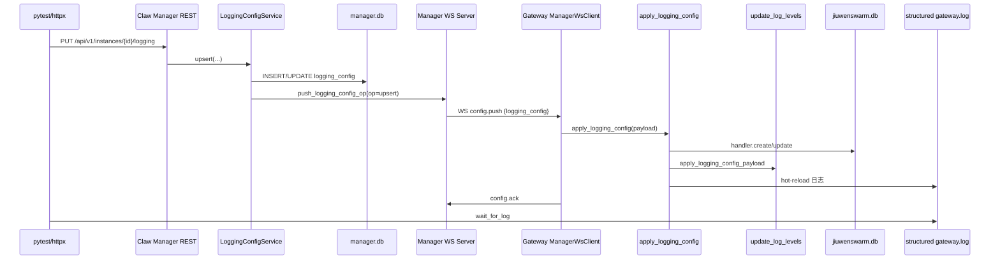
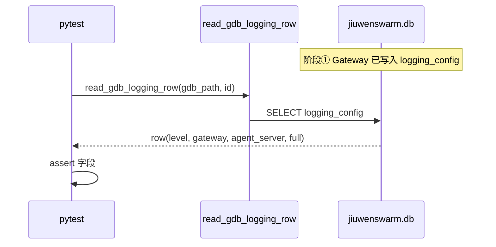
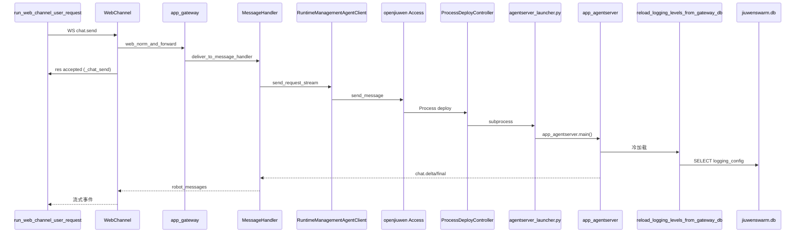
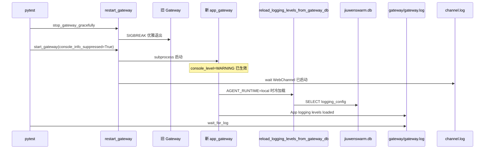
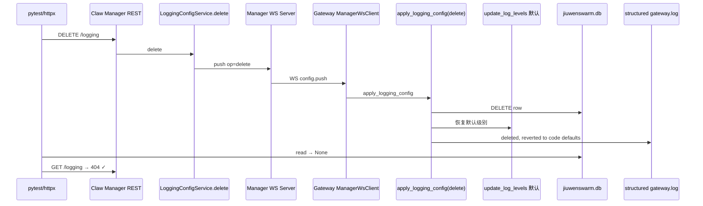

# test_logging_config

用例文件：`test_logging_config_process_e2e.py`  
用例函数：`test_logging_config_process_hot_reload_gdb_and_cold_start`

在真实进程栈（**Mock LLM + Claw Manager + Gateway + Process deploy AgentServer**）上验证 `logging_config` 的完整生命周期：热更新、GDB 持久化、Agent/Gateway 冷启动读库、删除恢复。

## 进程栈

```
Mock LLM ──HTTP──► AgentServer（子进程）
                        ▲
                        │ Runtime Process deploy
Claw Manager ◄──WS──► Gateway ◄──WS──► E2E 测试客户端
     │                    │
     │ REST               │ 共用 SQLite
     ▼                    ▼
 manager.db          jiuwenswarm.db (GDB)
```

**前置**（`LoggingConfigProcessStack.start()`）：

1. Mock LLM：`mock_llm_server.py`
2. Claw Manager：`uvicorn jiuwenclaw_manager.app:app`
3. Gateway：`python -m jiuwenclaw.app_gateway`（`manager_ws_client` 已连接并注册）

## 五阶段总览


| 阶段 | 触发动作 | 主要断言 |
|------|----------|----------|
| ① 热更新 | `PUT /logging` | `structured_gateway.log` → `hot-reload` |
| ② GDB 持久化 | 读 `jiuwenswarm.db` | `level/gateway/agent_server/full` 字段正确 |
| ③ Agent 冷启动 | `chat.send` | Agent 冷加载日志 + `Process deploy` |
| ④ Gateway 冷启动 | `restart_gateway()` | `gateway/gateway.log` → `App logging levels loaded` |
| ⑤ 删除恢复 | `DELETE /logging` | 删行 + 默认级别 + `GET` → 404 |

### PUT 请求体（阶段 ①）

```json
{
  "level": "INFO",
  "gateway": "DEBUG",
  "console_level": "WARNING",
  "agent_server": "DEBUG",
  "full": "ERROR"
}
```

> `channel` 未配置，GDB 中该字段为 `null`；`channel` 日志级别沿用基础 `level`（INFO）。

### 日志标记常量

| 常量 | 含义 | 典型位置 |
|------|------|----------|
| `HOT_RELOAD_MARKER` | `[ManagerWsClient] logging_config hot-reload` | `.jiuwenclaw/agent/.logs/gateway.log` |
| `GATEWAY_COLD_LOAD_MARKER` | `[App] logging levels loaded from Gateway DB` | `gateway/gateway.log`（stdout，`__main__` logger） |
| `AGENT_COLD_LOAD_MARKER` | `[AgentServer] logging levels loaded from Gateway DB` | `C:/home/app/.logs/gateway.log`（Windows） |
| `DELETE_MARKER` | `[ManagerWsClient] logging_config deleted, reverted to code defaults` | `.jiuwenclaw/agent/.logs/gateway.log` |

---

## 阶段 ① 热更新（Hot Reload）

**目标**：Manager REST 写入后，经 WS 推送到 Gateway，**即时生效**（无需重启）。

**测试代码**：`http.put(stack.logging_api(), json=...)` → `wait_for_log(structured_gateway_log, HOT_RELOAD_MARKER)`



**关键文件**

| 环节 | 路径 |
|------|------|
| REST 入口 | `packages/jiuwenclaw-ee/claw_manager/src/jiuwenclaw_manager/routers/application_config_routers.py` → `upsert_logging_config` |
| Manager 写库+推送 | `packages/jiuwenclaw-ee/claw_manager/src/jiuwenclaw_manager/core/application_config/logging_config.py` → `LoggingConfigService.upsert` |
| WS 路由 | `packages/jiuwenclaw-ee/gateway/extensions/manager_ws_client/routers/manager_ws_client_router.py` → `apply_config_push` |
| Gateway 热更新 | `packages/jiuwenclaw-ee/gateway/extensions/manager_ws_client/core/application_config/logging_config.py` → `apply_logging_config` |
| 级别生效 | `jiuwenclaw/utils.py` → `apply_logging_config_payload` / `update_log_levels` |

---

## 阶段 ② GDB 持久化（GDB Persist）

**目标**：阶段 ① 的配置已写入 Gateway 与 AgentServer 共用的 `jiuwenswarm.db`。

**测试代码**：`read_gdb_logging_row(stack.gdb_path, jiuwenclaw_id)` → 断言行字段

> 本阶段无新 HTTP/WS 调用，是对阶段 ① Gateway 侧写库的**读回验证**。



**关键文件**

| 环节 | 路径 |
|------|------|
| 测试读库 | `tests/system_tests/enterprise/e2e_helpers.py` → `read_gdb_logging_row` |
| 写库（阶段①） | `manager_ws_client/.../logging_config.py` → `handler.create/update` |
| DB 路径 | `e2e_helpers.shared_gateway_db_path` → `<run_home>/jiuwenswarm.db` |

---

## 阶段 ③ Agent 冷启动（Agent Cold Start）

**目标**：首次 `chat.send` 触发 **Process deploy** 拉起 AgentServer；子进程启动时从 GDB **冷加载**日志级别。

**测试代码**：`run_web_channel_user_request(ws_url)` → `wait_for_log(AGENT_COLD_LOAD_MARKER)` → 断言 `Process deploy`



**关键文件**

| 环节 | 路径 |
|------|------|
| 测试发请求 | `e2e_helpers.py` → `run_web_channel_user_request` |
| WS 入口 | `jiuwenclaw/channel/web_channel.py` → `_handle_raw_message` |
| 转发 | `jiuwenclaw/app_gateway.py` → `_make_norm_and_forward` |
| 消息队列 | `jiuwenclaw/gateway/message_handler.py` → `handle_message` / `process_stream` |
| Process deploy | `runtime_management_extension/runtime_management_client.py` |
| 子进程入口 | `tests/system_tests/enterprise/agentserver_launcher.py` |
| 冷加载 | `jiuwenclaw/app_agentserver.py` → `reload_logging_levels_from_gateway_db` |

**说明**：`chat.send` 不直接拉起子进程；是 MessageHandler 经 Runtime `Access.send_message` 在**无可用 Agent 实例**时触发 deploy。

---

## 阶段 ④ Gateway 冷启动（Gateway Cold Start）

**目标**：重启 Gateway 后，**不依赖 Manager WS 推送**，直接从 GDB 冷加载日志级别。

**测试代码**：`stack.restart_gateway()` → `wait_for_log(gateway.log, GATEWAY_COLD_LOAD_MARKER)`



**注意事项**

- 冷加载日志在 **`gateway/gateway.log`（stdout）**，不在 structured `.logs/gateway.log`（`__main__` logger 路由）。
- 重启后 `console_level=WARNING`，`WebChannel 已启动`（INFO）只在 **`channel.log`** 中出现。

**关键文件**

| 环节 | 路径 |
|------|------|
| 重启封装 | `test_logging_config_process_e2e.py` → `restart_gateway` / `start_gateway` |
| 优雅停止 | `e2e_helpers.py` → `stop_gateway_gracefully` |
| 冷加载触发 | `jiuwenclaw/app_gateway.py` → `_run()` 内 `reload_logging_levels_from_gateway_db` |

---

## 阶段 ⑤ 删除恢复（Delete & Revert）

**目标**：`DELETE /logging` 后 GDB 行清除，Gateway 恢复代码默认级别，`GET` 返回 404。

**测试代码**：`http.delete` → `wait_for_log(DELETE_MARKER)` → `read_gdb_logging_row` 为 `None` → `http.get` 断言 404



> `GET` 返回 **404 是预期结果**，表示配置已删除，不是测试失败。

**关键文件**

| 环节 | 路径 |
|------|------|
| REST 删除 | `application_config_routers.py` → `delete_logging_config` |
| Manager 删除+推送 | `claw_manager/.../logging_config.py` → `LoggingConfigService.delete` |
| Gateway 删除 | `manager_ws_client/.../logging_config.py` → `op == "delete"` |
| 恢复默认 | `jiuwenclaw/utils.py` → `apply_logging_config_payload({"op":"delete"})` |

---

## 运行前准备

本用例会 subprocess 拉起 **Claw Manager**（`uvicorn jiuwenclaw_manager.app:app`）。根目录 `pyproject.toml` **未**默认安装 `jiuwenclaw-manager`，运行前需在当前 venv 中单独安装：

```bash
# 在 jiuwenswarm/ 仓库根目录执行（推荐可编辑安装，会拉齐 structlog / fastapi / uvicorn 等）
pip install -e packages/jiuwenclaw-ee/claw_manager
```

安装后快速自检：

```bash
python -c "import structlog; import jiuwenclaw_manager"
```

若 Manager 启动失败，查看 `.runs/<ts>/manager.log`。常见错误：

| 日志 | 原因 | 处理 |
|------|------|------|
| `ModuleNotFoundError: No module named 'structlog'` | 未安装 claw_manager 依赖 | 执行上方 `pip install -e packages/jiuwenclaw-ee/claw_manager` |
| `Timed out waiting for HTTP .../api/health` | Manager 进程未监听（多为 import 崩溃） | 先看 `manager.log` 堆栈 |
| `error: unable to create file ... Filename too long` / `git submodule update --init --recursive -q did not run successfully` | Windows 默认路径长度限制 260 字符，`agent-runtime` 子模块 `agent-studio` 中有文件路径超限 | 执行 `git config --global core.longpaths true` 后重新 `pip install -e packages/jiuwenclaw-ee/claw_manager` |

Claw Manager 依赖声明见：`packages/jiuwenclaw-ee/claw_manager/pyproject.toml`（含 `structlog>=24.0`、`fastapi`、`uvicorn` 等）。

## 如何运行

在仓库根目录 `jiuwenswarm/`：

```bash
python -m pytest tests/system_tests/enterprise/test_logging_config_process_e2e.py::test_logging_config_process_hot_reload_gdb_and_cold_start -v -s -o addopts=""
```

其他依赖：本仓库 `jiuwenclaw`、EE 扩展 `packages/jiuwenclaw-ee`、`agent-runtime`（foundation + management）、`pytest-asyncio`、`httpx`、`websockets` 等。

## 调试产物

测试结束后保留 `.runs/<timestamp>/`：

| 产物 | 路径 |
|------|------|
| Gateway stdout | `.runs/<ts>/gateway/gateway.log` |
| Gateway 结构化日志 | `.runs/<ts>/gateway/.jiuwenclaw/agent/.logs/` |
| Runtime SDK 日志 | `.runs/<ts>/gateway/runtime_sdk.log` |
| AgentServer stdout | `.runs/<ts>/server/agentserver.log` |
| Agent 结构化日志 | `C:/home/app/.logs/`（Process deploy 子进程） |
| Manager | `.runs/<ts>/manager.log` |
| Mock LLM | `.runs/<ts>/mock_llm.log` |
| 共享 GDB | `.runs/<ts>/jiuwenswarm.db` |
| E2E 诊断 | `.runs/<ts>/e2e.log`（`[E2E][stage]` 行） |

## 相关代码索引

- 测试用例：`tests/system_tests/enterprise/test_logging_config_process_e2e.py`
- E2E 公共 helper：`tests/system_tests/enterprise/e2e_helpers.py`
- Manager logging：`packages/jiuwenclaw-ee/claw_manager/src/jiuwenclaw_manager/core/application_config/logging_config.py`
- Gateway manager_ws_client：`packages/jiuwenclaw-ee/gateway/extensions/manager_ws_client/`
- Runtime Process deploy：`packages/jiuwenclaw-ee/gateway/extensions/runtime_management_extension/`
- 日志级别工具：`jiuwenclaw/utils.py`
